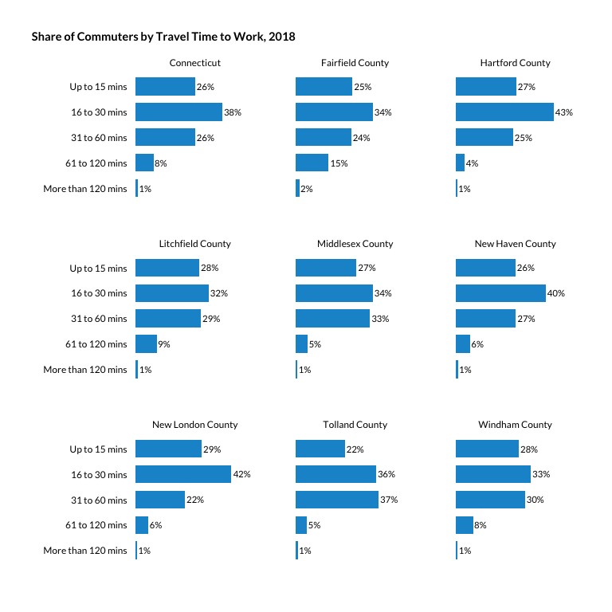

Commute times by tenure
================

``` r
library(tidyverse)
library(ipumsr)
library(srvyr)
```

``` r
theme_set(hrbrthemes::theme_ipsum_rc(base_family = "Lato Regular"))

#urban colors
pal <- c("#1696d2", "#fdbf11", "#d2d2d2", "#ec008b", "#55b748")
```

I’m not sure if this makes the most sense or not, but commute times here
are given as share by time range (mean is influenced by some very high
and low commute times) by county and the state, then by tenure.

LODES data are an alternative but a little dated (coupled with the fact
that most high income workers who often had longer commutes are now
working from home). Maybe discuss this with the team when it comes to
the write up.

These are top-coded (each survey uses a different topcode, but all are
over 120 mins).

The ranges I’m using are:

  - 1 to 15 minutes - short commute
  - 16 to 30 minutes - average range for CT and US
  - 31 to 60 minutes - average range for transit riders
  - 61 to 120 minutes - long commute
  - More than 120 minutes - very long commute

## Setup PUMS file

``` r
names <- tibble(countyfip = seq(from = 1, to = 15, by = 2),
                                name = c("Fairfield County", "Hartford County", "Litchfield County", "Middlesex County", "New Haven County", "New London County", "Tolland County", "Windham County"))

ddi <- read_ipums_ddi("../input_data/usa_00049.xml")

pums <- read_ipums_micro(ddi, verbose = F) %>% 
    mutate_at(vars(YEAR, OWNERSHP), as_factor) %>% 
    mutate_at(vars(HHINCOME, PERWT), as.numeric) %>% 
    janitor::clean_names() %>% 
    left_join(names, by = "countyfip") %>% 
    mutate(tenure = if_else(ownershp == "Rented", "Renter", "Owner")) %>%
    mutate(trantime_f = as.factor(trantime),
                 trantime_n = as.numeric(trantime_f)) %>%
    mutate(commute_time = cut(trantime_n, breaks = c(0, 15, 30, 60, 120, Inf), labels = c("Up to 15 mins", "16 to 30 mins", "31 to 60 mins", "61 to 120 mins", "More than 120 mins"), right = T)) %>%
    select(year, pernum, perwt, name, ownershp, tenure, hhincome, trantime, commute_time)
```

## By county and state, no disaggregation.

``` r
des <- pums %>%
    filter(hhincome != 9999999, ownershp != "N/A", trantime != 0) %>% 
    as_survey_design(., ids = 1, wt = perwt)

total_county <- des %>% 
    select(name, year, perwt) %>% 
    mutate(commute_time = "Total") %>% 
    group_by(name, year, commute_time) %>% 
    summarise(commuters = survey_total(perwt)) %>% 
    select(-commuters_se)

total_state <- total_county %>% 
    mutate(name = "Connecticut") %>% 
    ungroup() %>% 
    group_by(name, year, commute_time) %>% 
    summarise(commuters = sum(commuters))

county_com <- des %>%
    select(name, year, perwt, commute_time) %>% 
    group_by(name, year, commute_time) %>% 
    summarise(commuters = survey_total(perwt)) %>%
    select(-commuters_se)

state_com <- county_com %>% 
    mutate(name = "Connecticut") %>% 
    ungroup() %>% 
    group_by(name, year, commute_time) %>% 
    summarise(commuters = sum(commuters))

commute <- bind_rows(state_com, total_state, county_com, total_county) %>% 
    mutate(year = as.factor(year),
                 commute_time = as.factor(commute_time) %>% 
                    fct_relevel(., "Up to 15 mins") %>% 
                    fct_relevel(., "Total", after = Inf)) %>% 
    arrange(name, year, commute_time) %>% 
    group_by(name, year) %>% 
    camiller::calc_shares(group = commute_time, denom = "Total", value = commuters) %>% 
    ungroup()

write_csv(commute, file = "../output_data/commute_time_2000_2018.csv")
```

``` r
commute %>% 
    filter(!is.na(share),
                 year == "2018") %>% 
    mutate(commute_time = fct_rev(commute_time)) %>% 
    ggplot(aes(share, commute_time)) +
    geom_col(width = .7, position = position_dodge(.8), fill=pal[1]) +
    geom_text(aes(label = scales::percent(share, accuracy = 1)), position = position_dodge(.8), hjust = -.1, family = "Lato Regular", size = 3) +
    scale_x_continuous(expand = expansion(mult = c(.05, .272))) +
    facet_wrap(facets = "name") + 
    labs(title = "Share of Commuters by Travel Time to Work, 2018", x = "", y = "") +
    theme(plot.title.position = "plot",
                plot.title = element_text(family = "Lato Bold", size = 11),
                panel.grid.major = element_blank(), 
                panel.grid.minor = element_blank(),
                legend.position = "none",
                axis.text.x = element_blank(),
                axis.text.y = element_text(colour = "black", family = "Lato Regular", size = 9),
                strip.text.x = element_text(hjust= .5, colour = "black", family = "Lato Regular", size = 9))
```

<!-- -->

``` r
ggsave(filename = "../output_data/corrected_charts/commuters.png", dpi = 300, width = 6.5, height = 6.5)
ggsave(filename = "../output_data/corrected_charts/commuters.svg", dpi = 300, width = 6.5, height = 6.5)
```

I’m only showing 2018 here even though 2010 and 2000 are listed in the
csv (not much change over time…). It’s still a very long table, but more
analysis follows.

``` r
commute %>% 
    filter(year == "2018") %>% 
    kableExtra::kable()
```

<table>

<thead>

<tr>

<th style="text-align:left;">

name

</th>

<th style="text-align:left;">

year

</th>

<th style="text-align:left;">

commute\_time

</th>

<th style="text-align:right;">

commuters

</th>

<th style="text-align:right;">

share

</th>

</tr>

</thead>

<tbody>

<tr>

<td style="text-align:left;">

Connecticut

</td>

<td style="text-align:left;">

2018

</td>

<td style="text-align:left;">

Total

</td>

<td style="text-align:right;">

1667268

</td>

<td style="text-align:right;">

NA

</td>

</tr>

<tr>

<td style="text-align:left;">

Connecticut

</td>

<td style="text-align:left;">

2018

</td>

<td style="text-align:left;">

Up to 15 mins

</td>

<td style="text-align:right;">

438571

</td>

<td style="text-align:right;">

0.263

</td>

</tr>

<tr>

<td style="text-align:left;">

Connecticut

</td>

<td style="text-align:left;">

2018

</td>

<td style="text-align:left;">

16 to 30 mins

</td>

<td style="text-align:right;">

637844

</td>

<td style="text-align:right;">

0.383

</td>

</tr>

<tr>

<td style="text-align:left;">

Connecticut

</td>

<td style="text-align:left;">

2018

</td>

<td style="text-align:left;">

31 to 60 mins

</td>

<td style="text-align:right;">

438814

</td>

<td style="text-align:right;">

0.263

</td>

</tr>

<tr>

<td style="text-align:left;">

Connecticut

</td>

<td style="text-align:left;">

2018

</td>

<td style="text-align:left;">

61 to 120 mins

</td>

<td style="text-align:right;">

133721

</td>

<td style="text-align:right;">

0.080

</td>

</tr>

<tr>

<td style="text-align:left;">

Connecticut

</td>

<td style="text-align:left;">

2018

</td>

<td style="text-align:left;">

More than 120 mins

</td>

<td style="text-align:right;">

18318

</td>

<td style="text-align:right;">

0.011

</td>

</tr>

<tr>

<td style="text-align:left;">

Fairfield County

</td>

<td style="text-align:left;">

2018

</td>

<td style="text-align:left;">

Total

</td>

<td style="text-align:right;">

433176

</td>

<td style="text-align:right;">

NA

</td>

</tr>

<tr>

<td style="text-align:left;">

Fairfield County

</td>

<td style="text-align:left;">

2018

</td>

<td style="text-align:left;">

Up to 15 mins

</td>

<td style="text-align:right;">

108612

</td>

<td style="text-align:right;">

0.251

</td>

</tr>

<tr>

<td style="text-align:left;">

Fairfield County

</td>

<td style="text-align:left;">

2018

</td>

<td style="text-align:left;">

16 to 30 mins

</td>

<td style="text-align:right;">

147450

</td>

<td style="text-align:right;">

0.340

</td>

</tr>

<tr>

<td style="text-align:left;">

Fairfield County

</td>

<td style="text-align:left;">

2018

</td>

<td style="text-align:left;">

31 to 60 mins

</td>

<td style="text-align:right;">

106167

</td>

<td style="text-align:right;">

0.245

</td>

</tr>

<tr>

<td style="text-align:left;">

Fairfield County

</td>

<td style="text-align:left;">

2018

</td>

<td style="text-align:left;">

61 to 120 mins

</td>

<td style="text-align:right;">

63438

</td>

<td style="text-align:right;">

0.146

</td>

</tr>

<tr>

<td style="text-align:left;">

Fairfield County

</td>

<td style="text-align:left;">

2018

</td>

<td style="text-align:left;">

More than 120 mins

</td>

<td style="text-align:right;">

7509

</td>

<td style="text-align:right;">

0.017

</td>

</tr>

<tr>

<td style="text-align:left;">

Hartford County

</td>

<td style="text-align:left;">

2018

</td>

<td style="text-align:left;">

Total

</td>

<td style="text-align:right;">

417870

</td>

<td style="text-align:right;">

NA

</td>

</tr>

<tr>

<td style="text-align:left;">

Hartford County

</td>

<td style="text-align:left;">

2018

</td>

<td style="text-align:left;">

Up to 15 mins

</td>

<td style="text-align:right;">

111683

</td>

<td style="text-align:right;">

0.267

</td>

</tr>

<tr>

<td style="text-align:left;">

Hartford County

</td>

<td style="text-align:left;">

2018

</td>

<td style="text-align:left;">

16 to 30 mins

</td>

<td style="text-align:right;">

180695

</td>

<td style="text-align:right;">

0.432

</td>

</tr>

<tr>

<td style="text-align:left;">

Hartford County

</td>

<td style="text-align:left;">

2018

</td>

<td style="text-align:left;">

31 to 60 mins

</td>

<td style="text-align:right;">

105546

</td>

<td style="text-align:right;">

0.253

</td>

</tr>

<tr>

<td style="text-align:left;">

Hartford County

</td>

<td style="text-align:left;">

2018

</td>

<td style="text-align:left;">

61 to 120 mins

</td>

<td style="text-align:right;">

17111

</td>

<td style="text-align:right;">

0.041

</td>

</tr>

<tr>

<td style="text-align:left;">

Hartford County

</td>

<td style="text-align:left;">

2018

</td>

<td style="text-align:left;">

More than 120 mins

</td>

<td style="text-align:right;">

2835

</td>

<td style="text-align:right;">

0.007

</td>

</tr>

<tr>

<td style="text-align:left;">

Litchfield County

</td>

<td style="text-align:left;">

2018

</td>

<td style="text-align:left;">

Total

</td>

<td style="text-align:right;">

90533

</td>

<td style="text-align:right;">

NA

</td>

</tr>

<tr>

<td style="text-align:left;">

Litchfield County

</td>

<td style="text-align:left;">

2018

</td>

<td style="text-align:left;">

Up to 15 mins

</td>

<td style="text-align:right;">

25561

</td>

<td style="text-align:right;">

0.282

</td>

</tr>

<tr>

<td style="text-align:left;">

Litchfield County

</td>

<td style="text-align:left;">

2018

</td>

<td style="text-align:left;">

16 to 30 mins

</td>

<td style="text-align:right;">

29228

</td>

<td style="text-align:right;">

0.323

</td>

</tr>

<tr>

<td style="text-align:left;">

Litchfield County

</td>

<td style="text-align:left;">

2018

</td>

<td style="text-align:left;">

31 to 60 mins

</td>

<td style="text-align:right;">

26137

</td>

<td style="text-align:right;">

0.289

</td>

</tr>

<tr>

<td style="text-align:left;">

Litchfield County

</td>

<td style="text-align:left;">

2018

</td>

<td style="text-align:left;">

61 to 120 mins

</td>

<td style="text-align:right;">

8506

</td>

<td style="text-align:right;">

0.094

</td>

</tr>

<tr>

<td style="text-align:left;">

Litchfield County

</td>

<td style="text-align:left;">

2018

</td>

<td style="text-align:left;">

More than 120 mins

</td>

<td style="text-align:right;">

1101

</td>

<td style="text-align:right;">

0.012

</td>

</tr>

<tr>

<td style="text-align:left;">

Middlesex County

</td>

<td style="text-align:left;">

2018

</td>

<td style="text-align:left;">

Total

</td>

<td style="text-align:right;">

81691

</td>

<td style="text-align:right;">

NA

</td>

</tr>

<tr>

<td style="text-align:left;">

Middlesex County

</td>

<td style="text-align:left;">

2018

</td>

<td style="text-align:left;">

Up to 15 mins

</td>

<td style="text-align:right;">

21988

</td>

<td style="text-align:right;">

0.269

</td>

</tr>

<tr>

<td style="text-align:left;">

Middlesex County

</td>

<td style="text-align:left;">

2018

</td>

<td style="text-align:left;">

16 to 30 mins

</td>

<td style="text-align:right;">

27792

</td>

<td style="text-align:right;">

0.340

</td>

</tr>

<tr>

<td style="text-align:left;">

Middlesex County

</td>

<td style="text-align:left;">

2018

</td>

<td style="text-align:left;">

31 to 60 mins

</td>

<td style="text-align:right;">

26794

</td>

<td style="text-align:right;">

0.328

</td>

</tr>

<tr>

<td style="text-align:left;">

Middlesex County

</td>

<td style="text-align:left;">

2018

</td>

<td style="text-align:left;">

61 to 120 mins

</td>

<td style="text-align:right;">

4407

</td>

<td style="text-align:right;">

0.054

</td>

</tr>

<tr>

<td style="text-align:left;">

Middlesex County

</td>

<td style="text-align:left;">

2018

</td>

<td style="text-align:left;">

More than 120 mins

</td>

<td style="text-align:right;">

710

</td>

<td style="text-align:right;">

0.009

</td>

</tr>

<tr>

<td style="text-align:left;">

New Haven County

</td>

<td style="text-align:left;">

2018

</td>

<td style="text-align:left;">

Total

</td>

<td style="text-align:right;">

395131

</td>

<td style="text-align:right;">

NA

</td>

</tr>

<tr>

<td style="text-align:left;">

New Haven County

</td>

<td style="text-align:left;">

2018

</td>

<td style="text-align:left;">

Up to 15 mins

</td>

<td style="text-align:right;">

103938

</td>

<td style="text-align:right;">

0.263

</td>

</tr>

<tr>

<td style="text-align:left;">

New Haven County

</td>

<td style="text-align:left;">

2018

</td>

<td style="text-align:left;">

16 to 30 mins

</td>

<td style="text-align:right;">

156816

</td>

<td style="text-align:right;">

0.397

</td>

</tr>

<tr>

<td style="text-align:left;">

New Haven County

</td>

<td style="text-align:left;">

2018

</td>

<td style="text-align:left;">

31 to 60 mins

</td>

<td style="text-align:right;">

105051

</td>

<td style="text-align:right;">

0.266

</td>

</tr>

<tr>

<td style="text-align:left;">

New Haven County

</td>

<td style="text-align:left;">

2018

</td>

<td style="text-align:left;">

61 to 120 mins

</td>

<td style="text-align:right;">

25303

</td>

<td style="text-align:right;">

0.064

</td>

</tr>

<tr>

<td style="text-align:left;">

New Haven County

</td>

<td style="text-align:left;">

2018

</td>

<td style="text-align:left;">

More than 120 mins

</td>

<td style="text-align:right;">

4023

</td>

<td style="text-align:right;">

0.010

</td>

</tr>

<tr>

<td style="text-align:left;">

New London County

</td>

<td style="text-align:left;">

2018

</td>

<td style="text-align:left;">

Total

</td>

<td style="text-align:right;">

127089

</td>

<td style="text-align:right;">

NA

</td>

</tr>

<tr>

<td style="text-align:left;">

New London County

</td>

<td style="text-align:left;">

2018

</td>

<td style="text-align:left;">

Up to 15 mins

</td>

<td style="text-align:right;">

37112

</td>

<td style="text-align:right;">

0.292

</td>

</tr>

<tr>

<td style="text-align:left;">

New London County

</td>

<td style="text-align:left;">

2018

</td>

<td style="text-align:left;">

16 to 30 mins

</td>

<td style="text-align:right;">

53890

</td>

<td style="text-align:right;">

0.424

</td>

</tr>

<tr>

<td style="text-align:left;">

New London County

</td>

<td style="text-align:left;">

2018

</td>

<td style="text-align:left;">

31 to 60 mins

</td>

<td style="text-align:right;">

27734

</td>

<td style="text-align:right;">

0.218

</td>

</tr>

<tr>

<td style="text-align:left;">

New London County

</td>

<td style="text-align:left;">

2018

</td>

<td style="text-align:left;">

61 to 120 mins

</td>

<td style="text-align:right;">

7349

</td>

<td style="text-align:right;">

0.058

</td>

</tr>

<tr>

<td style="text-align:left;">

New London County

</td>

<td style="text-align:left;">

2018

</td>

<td style="text-align:left;">

More than 120 mins

</td>

<td style="text-align:right;">

1004

</td>

<td style="text-align:right;">

0.008

</td>

</tr>

<tr>

<td style="text-align:left;">

Tolland County

</td>

<td style="text-align:left;">

2018

</td>

<td style="text-align:left;">

Total

</td>

<td style="text-align:right;">

69026

</td>

<td style="text-align:right;">

NA

</td>

</tr>

<tr>

<td style="text-align:left;">

Tolland County

</td>

<td style="text-align:left;">

2018

</td>

<td style="text-align:left;">

Up to 15 mins

</td>

<td style="text-align:right;">

15005

</td>

<td style="text-align:right;">

0.217

</td>

</tr>

<tr>

<td style="text-align:left;">

Tolland County

</td>

<td style="text-align:left;">

2018

</td>

<td style="text-align:left;">

16 to 30 mins

</td>

<td style="text-align:right;">

24498

</td>

<td style="text-align:right;">

0.355

</td>

</tr>

<tr>

<td style="text-align:left;">

Tolland County

</td>

<td style="text-align:left;">

2018

</td>

<td style="text-align:left;">

31 to 60 mins

</td>

<td style="text-align:right;">

25296

</td>

<td style="text-align:right;">

0.366

</td>

</tr>

<tr>

<td style="text-align:left;">

Tolland County

</td>

<td style="text-align:left;">

2018

</td>

<td style="text-align:left;">

61 to 120 mins

</td>

<td style="text-align:right;">

3545

</td>

<td style="text-align:right;">

0.051

</td>

</tr>

<tr>

<td style="text-align:left;">

Tolland County

</td>

<td style="text-align:left;">

2018

</td>

<td style="text-align:left;">

More than 120 mins

</td>

<td style="text-align:right;">

682

</td>

<td style="text-align:right;">

0.010

</td>

</tr>

<tr>

<td style="text-align:left;">

Windham County

</td>

<td style="text-align:left;">

2018

</td>

<td style="text-align:left;">

Total

</td>

<td style="text-align:right;">

52752

</td>

<td style="text-align:right;">

NA

</td>

</tr>

<tr>

<td style="text-align:left;">

Windham County

</td>

<td style="text-align:left;">

2018

</td>

<td style="text-align:left;">

Up to 15 mins

</td>

<td style="text-align:right;">

14672

</td>

<td style="text-align:right;">

0.278

</td>

</tr>

<tr>

<td style="text-align:left;">

Windham County

</td>

<td style="text-align:left;">

2018

</td>

<td style="text-align:left;">

16 to 30 mins

</td>

<td style="text-align:right;">

17475

</td>

<td style="text-align:right;">

0.331

</td>

</tr>

<tr>

<td style="text-align:left;">

Windham County

</td>

<td style="text-align:left;">

2018

</td>

<td style="text-align:left;">

31 to 60 mins

</td>

<td style="text-align:right;">

16089

</td>

<td style="text-align:right;">

0.305

</td>

</tr>

<tr>

<td style="text-align:left;">

Windham County

</td>

<td style="text-align:left;">

2018

</td>

<td style="text-align:left;">

61 to 120 mins

</td>

<td style="text-align:right;">

4062

</td>

<td style="text-align:right;">

0.077

</td>

</tr>

<tr>

<td style="text-align:left;">

Windham County

</td>

<td style="text-align:left;">

2018

</td>

<td style="text-align:left;">

More than 120 mins

</td>

<td style="text-align:right;">

454

</td>

<td style="text-align:right;">

0.009

</td>

</tr>

</tbody>

</table>

## By tenure

To do this, I need to make a LUT of owner and renter households

``` r
total_county_tenure <- des %>% 
    select(name, year, tenure, perwt) %>% 
    mutate(commute_time = "Total") %>% 
    group_by(name, year, tenure, commute_time) %>% 
    summarise(commuters = survey_total(perwt)) %>% 
    select(-commuters_se)

total_state_tenure <- total_county_tenure %>% 
    mutate(name = "Connecticut") %>% 
    ungroup() %>% 
    group_by(name, year, tenure, commute_time) %>% 
    summarise(commuters = sum(commuters))

county_com_tenure <- des %>%
    select(name, year, perwt, tenure, commute_time) %>% 
    group_by(name, year, tenure, commute_time) %>% 
    summarise(commuters = survey_total(perwt)) %>%
    select(-commuters_se)

state_com_tenure <- county_com_tenure %>% 
    mutate(name = "Connecticut") %>% 
    ungroup() %>% 
    group_by(name, year, tenure, commute_time) %>% 
    summarise(commuters = sum(commuters))

commute_tenure <- bind_rows(state_com_tenure, total_state_tenure, county_com_tenure, total_county_tenure) %>% 
    mutate(year = as.factor(year),
                 tenuer = as.factor(tenure),
                 commute_time = as.factor(commute_time) %>% 
                    fct_relevel(., "Up to 15 mins") %>% 
                    fct_relevel(., "Total", after = Inf)) %>% 
    arrange(name, year, tenure, commute_time) %>% 
    group_by(name, year, tenure) %>% 
    camiller::calc_shares(group = commute_time, denom = "Total", value = commuters) %>% 
    ungroup()

write_csv(commute_tenure, file = "../output_data/commute_time_by_tenure_2000_2018.csv")
```
