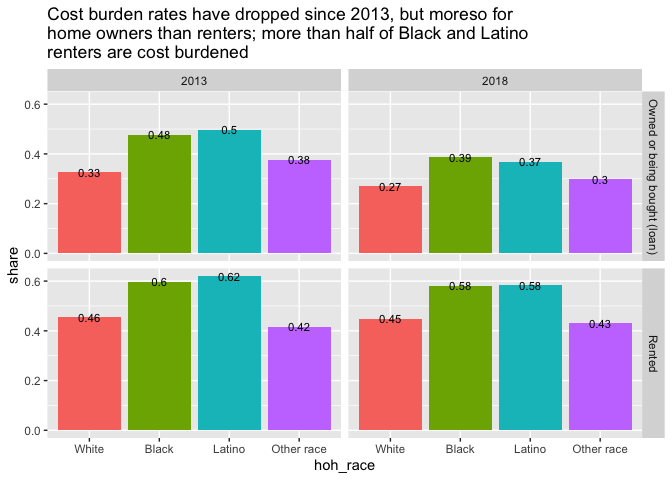
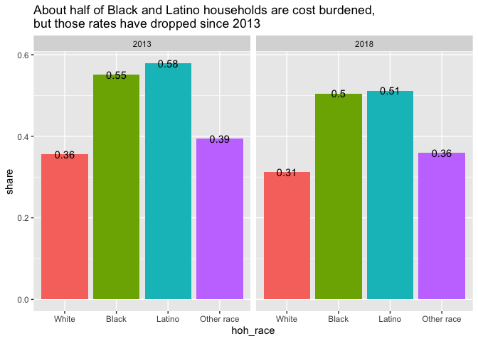
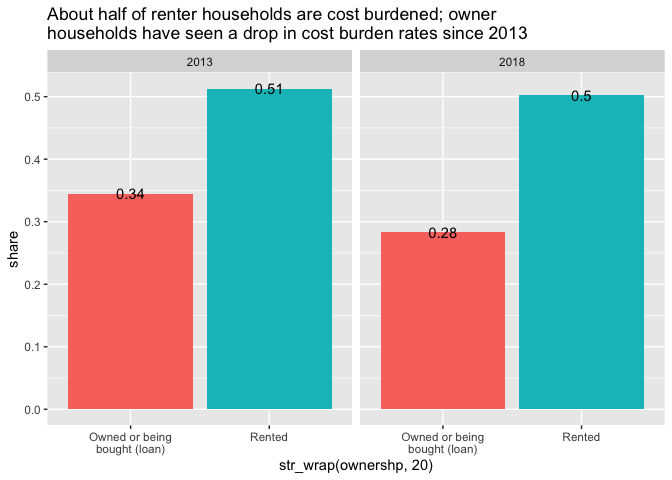
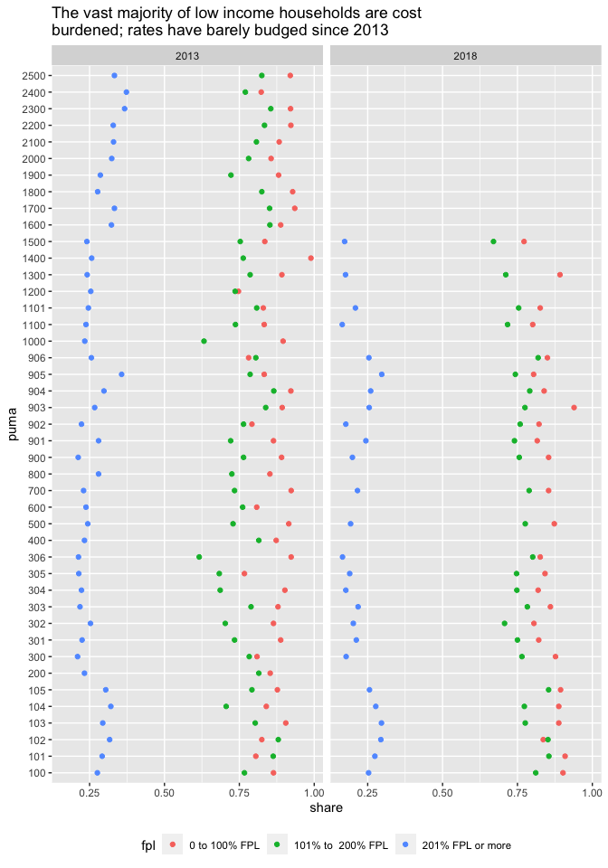

Cost burden
================

``` r
library(ipumsr)
library(tidyverse)
library(srvyr)
```

Looking at cost burden by a few demographic factors and geographic
levels. Separately, looking at cost burden by the presence of a
household member with a disability.

Crappy charts until I get through all the code, then I’ll pretty them
up.

``` r
ddi <- read_ipums_ddi("../input_data/usa_00036.xml")
read_pums <- read_ipums_micro(ddi, verbose = F)

#not currently doing anything with age
#also dropped sex from analysis
ct_pums <- read_pums %>% 
    mutate_at(vars(YEAR, PUMA, OWNERSHP, OWNERSHPD, SEX, RACE, RACED, HISPAN, HISPAND,
                                 DIFFREM, DIFFPHYS, DIFFMOB, DIFFCARE, DIFFEYE, DIFFHEAR), as_factor) %>% 
    mutate_at(vars(PERWT, HHWT), as.numeric) %>% 
    mutate_at(vars(HHINCOME, POVERTY, AGE, OWNCOST, RENTGRS), as.integer) %>% 
    #below flags for 0-1x, 1-2x, 2x+ fpl, but could use other cut points
    mutate(fpl = if_else(POVERTY < 100, "0 to 100% FPL", "201% FPL or more")) %>% 
    mutate(fpl = if_else((POVERTY >= 100 & POVERTY <=200), "101% to  200% FPL", fpl)) %>% 
    # Asian is perhaps the only other race category that might not be too small
    mutate(hoh_race = if_else(HISPAN == "Not Hispanic", as.character(RACE), "Latino")) %>% 
    mutate(hoh_race = as.factor(hoh_race) %>% 
                    fct_recode(Black = "Black/African American/Negro") %>%
                    fct_other(keep = c("White", "Black", "Latino"), other_level = "Other race") %>%
                    fct_relevel("White", "Black", "Latino", "Other race")) %>% 
    janitor::clean_names()

#logical flag for any disability
ct_pums$has_disability <- apply(ct_pums, 1, function(x) any(grep("Has|Yes", x)))
```

## State-level

Cost burden by each and combinations of

  - race/ethnicity
  - tenure
  - percent FPL

<!-- end list -->

``` r
state_out <- list()

hhdes <- ct_pums %>%
    group_by(year) %>% 
    filter(pernum == "1", hhincome != 9999999, ownershp != "N/A") %>% 
    as_survey_design(., ids = 1, wt = hhwt)

count_hhlds <- hhdes %>%
    select(year, hhwt, hoh_race, ownershp, fpl) %>% 
    group_by(year, ownershp, hoh_race, fpl) %>% 
    summarise(total_hhlds = survey_total(hhwt)) %>% 
    mutate(region = "Connecticut") %>% 
    select(region, everything())

state_out$count_hhlds <- count_hhlds

rent_burd <- hhdes %>% 
    filter(ownershp == "Rented") %>% 
    select(year, hoh_race, ownershp, fpl, rentgrs, hhincome, hhwt) %>% 
    mutate(pct_income_to_housing = (rentgrs * 12) / hhincome,
                 is_burdened = if_else(pct_income_to_housing > .3, T, F)) %>% 
    #capture hhlds with negative income as burdened
    mutate(is_burdened = if_else(pct_income_to_housing < 0, T, is_burdened)) %>% 
    #some people have no rent and no income. filtering them out
    filter(!is.na(is_burdened)) %>%  
    group_by(year, hoh_race, is_burdened, ownershp, fpl) %>% 
    summarise(hhlds = survey_total(hhwt)) %>% 
    left_join(count_hhlds, by = c("year", "hoh_race", "ownershp", "fpl")) %>% 
    mutate(share = round(hhlds / total_hhlds, 3)) %>% 
    select(-contains("total")) %>% 
    select(region, everything())

own_burd <- hhdes %>% 
    filter(ownershp == "Owned or being bought (loan)") %>% 
    select(year, hoh_race, ownershp, fpl, owncost, hhincome, hhwt) %>% 
    mutate(pct_income_to_housing = (owncost * 12) / hhincome,
                 is_burdened = if_else(pct_income_to_housing > .3, T, F)) %>% 
    #capture hhlds with negative income as burdened
    mutate(is_burdened = if_else(pct_income_to_housing < 0, T, is_burdened)) %>% 
    #filter no housing costs/no income people
    filter(!is.na(is_burdened)) %>%  
    group_by(year, hoh_race, is_burdened, ownershp, fpl) %>% 
    summarise(hhlds = survey_total(hhwt)) %>% 
    left_join(count_hhlds, by = c("year", "hoh_race", "ownershp", "fpl")) %>% 
    mutate(share = round(hhlds / total_hhlds, 3)) %>% 
    select(-contains("total")) %>% 
    select(region, everything())

burden <- bind_rows(rent_burd, own_burd) %>% 
    select(region, year, hoh_race, ownershp, fpl, is_burdened, hhlds, hhlds_se, share)

state_out$burden_race_tenure_fpl <- burden
```

``` r
#cost burdened by tenure and race
tenure_race_hhlds <- hhdes %>%
    select(year, hhwt, hoh_race, ownershp) %>% 
    group_by(year, hoh_race, ownershp) %>% 
    summarise(total_hhlds = survey_total(hhwt)) %>% 
    mutate(region = "Connecticut") %>% 
    select(region, everything())

burden %>% 
    select(-fpl) %>% 
    group_by(region, year, hoh_race, ownershp, is_burdened) %>% 
    summarise(hhlds = sum(hhlds)) %>% 
    left_join(tenure_race_hhlds, by = c("region", "year", "hoh_race", "ownershp")) %>% 
    mutate(share = round(hhlds / total_hhlds, 3)) %>%
    filter(is_burdened == T) %>% 
    ggplot(aes(hoh_race, share, group = ownershp)) +
    geom_col(aes(fill = hoh_race), position = position_dodge(width = 1)) +
    geom_text(aes(label = round(share, 2)), position = position_dodge(width = 1), size = 3) +
    labs(title = str_wrap("Cost burden rates have dropped since 2013, but moreso for home owners than renters; more than half of Black and Latino renters are cost burdened", 60)) +
    facet_grid(rows = vars(ownershp), cols = vars(year)) +
    theme(legend.position = "none")
```

<!-- -->

``` r
#cost burdened by fpl and race
fpl_race_hhlds <- hhdes %>%
    select(year, hhwt, hoh_race, fpl) %>% 
    group_by(year, hoh_race, fpl) %>% 
    summarise(total_hhlds = survey_total(hhwt)) %>% 
    mutate(region = "Connecticut") %>% 
    select(region, everything())

burden %>% 
    select(-ownershp) %>% 
    group_by(region, year, hoh_race, fpl, is_burdened) %>% 
    summarise(hhlds = sum(hhlds)) %>% 
    left_join(fpl_race_hhlds, by = c("region", "year", "hoh_race", "fpl")) %>% 
    mutate(share = round(hhlds / total_hhlds, 3)) %>%
    filter(is_burdened == T) %>% 
    ggplot(aes(hoh_race, share, group = fpl)) +
    geom_col(aes(fill = hoh_race), position = position_dodge(width = 1)) +
    geom_text(aes(label = round(share, 2)), position = position_dodge(width = 1), size = 3) +
    labs(title = str_wrap("Low income households are much more likely to be cost burdened, but cost burden rates for higher-income Black and Latino households are 10 percentage points higher than white households", 60)) +
    facet_grid(rows = vars(fpl), cols = vars(year)) +
    theme(legend.position = "none")
```

<!-- -->

``` r
#cost burdened households by race alone
race_hhlds <- hhdes %>%
    select(year, hhwt, hoh_race) %>% 
    group_by(year, hoh_race) %>% 
    summarise(total_hhlds = survey_total(hhwt)) %>% 
    mutate(region = "Connecticut") %>% 
    select(region, everything())

burden %>% 
    select(-ownershp, -fpl) %>% 
    group_by(region, year, hoh_race, is_burdened) %>% 
    summarise(hhlds = sum(hhlds)) %>% 
    left_join(race_hhlds, by = c("region", "year", "hoh_race")) %>% 
    mutate(share = round(hhlds / total_hhlds, 3)) %>% 
    filter(is_burdened == T) %>% 
    ggplot(aes(hoh_race, share)) +
    geom_col(aes(fill = hoh_race)) +
    geom_text(aes(label = round(share, 2))) +
    labs(title = str_wrap("About half of Black and Latino households are cost burdened, but those rates have dropped since 2013", 60)) +
    facet_wrap(facets = "year") +
    theme(legend.position = "none")
```

<!-- -->

``` r
#cost burdened households by tenure alone
tenure_hhlds <- hhdes %>%
    select(year, hhwt, ownershp) %>% 
    group_by(year, ownershp) %>% 
    summarise(total_hhlds = survey_total(hhwt)) %>% 
    mutate(region = "Connecticut") %>% 
    select(region, everything())

burden %>% 
    select(-hoh_race, -fpl) %>% 
    group_by(region, year, ownershp, is_burdened) %>% 
    summarise(hhlds = sum(hhlds)) %>% 
    left_join(tenure_hhlds, by = c("region", "year", "ownershp")) %>% 
    mutate(share = round(hhlds / total_hhlds, 3)) %>% 
    filter(is_burdened == T) %>% 
    ggplot(aes(str_wrap(ownershp, 20), share, group = is_burdened)) +
    geom_col(aes(fill = ownershp)) +
    geom_text(aes(label = round(share, 2))) +
    labs(title = str_wrap("About half of renter households are cost burdened; owner households have seen a drop in cost burden rates since 2013", 60)) +
    facet_wrap(facets = "year") +
    theme(legend.position = "none")
```

<!-- -->

``` r
#cost burdened households by fpl alone
fpl_hhlds <- hhdes %>%
    select(year, hhwt, fpl) %>% 
    group_by(year, fpl) %>% 
    summarise(total_hhlds = survey_total(hhwt)) %>% 
    mutate(region = "Connecticut") %>% 
    select(region, everything())

burden %>% 
    select(-hoh_race, -ownershp) %>% 
    group_by(region, year, fpl, is_burdened) %>% 
    summarise(hhlds = sum(hhlds)) %>% 
    left_join(fpl_hhlds, by = c("region", "year", "fpl")) %>% 
    mutate(share = round(hhlds / total_hhlds, 3)) %>% 
  filter(is_burdened == T) %>% 
    ggplot(aes(str_wrap(fpl, 10), share, group = is_burdened)) +
    geom_col(aes(fill = fpl)) +
    geom_text(aes(label = round(share, 2))) +
    labs(title = str_wrap("The vast majority of low income households are cost burdened; rates have barely budged since 2013", 60)) +
    facet_wrap(facets = "year") +
    theme(legend.position = "none")
```

<!-- -->

## PUMA-level

Cost burden by each of

  - race/ethnicity
  - tenure
  - percent FPL

**Ugh, pre-2012 PUMAs had different numbering scheme. Reconcile.**
:weary:

``` r
puma_out <- list()

puma_hhlds <- hhdes %>%
    select(year, puma, hhwt, hoh_race, ownershp, fpl) %>% 
    group_by(year, puma, ownershp, hoh_race, fpl) %>% 
    summarise(total_hhlds = survey_total(hhwt)) %>% 
    select(puma, everything())

puma_out$count_hhlds <- puma_hhlds

rent_burd <- hhdes %>% 
    filter(ownershp == "Rented") %>% 
    select(year, puma, hoh_race, ownershp, fpl, rentgrs, hhincome, hhwt) %>% 
    mutate(pct_income_to_housing = (rentgrs * 12) / hhincome,
                 is_burdened = if_else(pct_income_to_housing > .3, T, F)) %>% 
    #capture hhlds with negative income as burdened
    mutate(is_burdened = if_else(pct_income_to_housing < 0, T, is_burdened)) %>% 
    #some people have no rent and no income. filtering them out
    filter(!is.na(is_burdened)) %>%  
    group_by(year, puma, hoh_race, is_burdened, ownershp, fpl) %>% 
    summarise(hhlds = survey_total(hhwt)) %>% 
    left_join(puma_hhlds, by = c("year", "puma", "hoh_race", "ownershp", "fpl")) %>% 
    mutate(share = round(hhlds / total_hhlds, 3)) %>% 
    select(-contains("total")) %>% 
    select(puma, everything())

own_burd <- hhdes %>% 
    filter(ownershp == "Owned or being bought (loan)") %>% 
    select(year, puma, hoh_race, ownershp, fpl, owncost, hhincome, hhwt) %>% 
    mutate(pct_income_to_housing = (owncost * 12) / hhincome,
                 is_burdened = if_else(pct_income_to_housing > .3, T, F)) %>% 
    #capture hhlds with negative income as burdened
    mutate(is_burdened = if_else(pct_income_to_housing < 0, T, is_burdened)) %>% 
    #filter no housing costs/no income people
    filter(!is.na(is_burdened)) %>%  
    group_by(year, puma, hoh_race, is_burdened, ownershp, fpl) %>% 
    summarise(hhlds = survey_total(hhwt)) %>% 
    left_join(puma_hhlds, by = c("year", "puma", "hoh_race", "ownershp", "fpl")) %>% 
    mutate(share = round(hhlds / total_hhlds, 3)) %>% 
    select(-contains("total")) %>% 
    select(puma, everything())

puma_burden <- bind_rows(rent_burd, own_burd) %>% 
    select(puma, year, hoh_race, ownershp, fpl, is_burdened, hhlds, hhlds_se, share)

puma_out$burden_race_tenure_fpl <- puma_burden
```

``` r
#cost burden by race
```

``` r
#cost burden by tenure
```

``` r
#cost burden by fpl

fpl_hhlds_puma <- hhdes %>%
    select(year, puma, hhwt, fpl) %>% 
    group_by(year, puma, fpl) %>% 
    summarise(total_hhlds = survey_total(hhwt)) %>% 
    select(puma, everything())

puma_burden %>% 
    select(-hoh_race, -ownershp) %>% 
    group_by(puma, year, fpl, is_burdened) %>% 
    summarise(hhlds = sum(hhlds)) %>% 
    left_join(fpl_hhlds_puma, by = c("puma", "year", "fpl")) %>% 
    mutate(share = round(hhlds / total_hhlds, 3)) %>% 
  filter(is_burdened == T) %>% 
    ggplot(aes(share, puma, group = fpl)) +
    geom_point(aes(color = fpl)) +
    #geom_text(aes(label = round(share, 2))) +
    labs(title = str_wrap("The vast majority of low income households are cost burdened; rates have barely budged since 2013", 60)) +
    facet_grid(cols = vars(year)) +
    theme(legend.position = "bottom")
```

<!-- -->

## Town-level

Cost burden by tenure

``` r
#getacs
```

## Disability

Cost burden by tenure for households where at least one household member
has a disability. Not sure of the n yet but if I can do this by PUMA, I
will.
