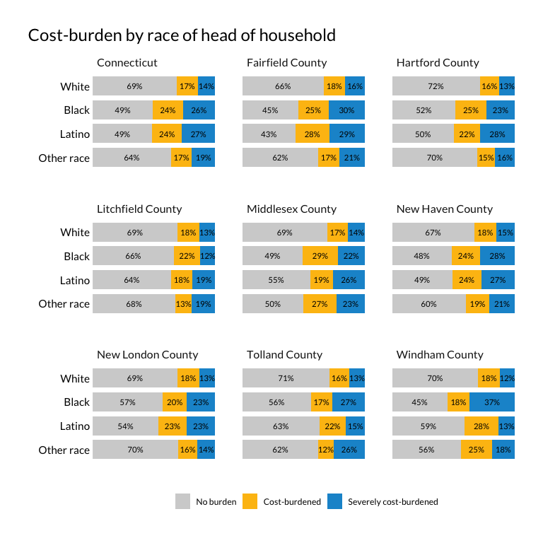

Cost burden
================

A few summary tabulations on cost burden by

  - race/ethnicity
  - presence of person with a disability in the home
  - tenure

<!-- end list -->

``` r
library(ipumsr)
library(tidyverse)
library(srvyr)
library(tidycensus)
library(camiller)
library(scales)
library(kableExtra)
source("../_utils/town2county.R")
```

``` r
theme_set(hrbrthemes::theme_ipsum_rc(base_family = "Lato Regular"))

#urban colors
pal <- c("#1696d2", "#fdbf11", "#d2d2d2", "#ec008b", "#55b748")

scale_fill_custom <- function(palette = pal, rev = F) {
  if (rev) {
    scale_fill_manual(values = rev(pal))
  } else {
    scale_fill_manual(values = pal)
  }
}

scale_color_custom <- function(palette = pal, rev = F) {
  if (rev) {
    scale_color_manual(values = rev(pal))
  } else {
    scale_color_manual(values = pal)
  }
}
```

``` r
minc <- get_acs(
    geography = "county",
      table = "B19013",
    state = 09,
      cache_table = T) %>% 
    arrange(GEOID) %>% 
    mutate(countyfip = seq(from = 1, to = 15, by = 2),
                 name = str_remove(NAME, ", Connecticut")) %>% 
    select(countyfip, name, minc = estimate)

ddi <- read_ipums_ddi("../input_data/usa_00043.xml")

pums <- read_ipums_micro(ddi, verbose = F)  %>% 
    mutate_at(vars(YEAR, PUMA, OWNERSHP, OWNERSHPD, RACE, RACED, HISPAN, HISPAND, DIFFREM, DIFFPHYS, DIFFMOB, DIFFCARE, DIFFEYE, DIFFHEAR), as_factor) %>% 
    mutate_at(vars(PERWT, HHWT), as.numeric) %>% 
    mutate_at(vars(HHINCOME, OWNCOST, RENTGRS, OCC), as.integer) %>% 
    janitor::clean_names() %>% 
    left_join(minc, by = "countyfip") %>% 
    mutate(ratio = hhincome / minc) %>% 
    mutate(
        inc_band = cut(
            ratio,
            breaks = c(-Inf, 0.3, 0.5, .8, 1.2, Inf),
            labels = c("Very low", "Low", "Mid-low", "Mid-high", "High"),
            include.lowest = T, right = T)) %>% 
    mutate(
        inc_band = as.factor(inc_band) %>%
            fct_relevel(., "Very low", "Low", "Mid-low", "Mid-high", "High")) %>% 
    mutate(cb = if_else(ownershp == "Rented", (rentgrs * 12) / hhincome, 99999)) %>% 
    mutate(cb = if_else(ownershp == "Owned or being bought (loan)", (owncost * 12) / hhincome, cb)) %>%
    # if housing cost is 0 and income is 0, no burden
    mutate(cb = if_else((rentgrs == 0 & hhincome == 0), 0, cb)) %>%
    mutate(cb = if_else((owncost == 0 & hhincome == 0), 0, cb)) %>%
    #if income is <=0 and housing cost is >0, burden
    mutate(cb = if_else((rentgrs > 0 & hhincome <= 0), 1, cb)) %>%
    mutate(cb = if_else((owncost > 0 & hhincome <= 0), 1, cb)) %>%
    # some people pay more than 100% income to housing, but I will code these as 1
    mutate(cb = if_else(cb > 1, 1, cb)) %>%
    mutate(
        cost_burden = cut(
            cb,
            breaks = c(-Inf, .3, .5, Inf),
            labels = c("No burden", "Cost-burdened", "Severely cost-burdened"),
            include.lowest = T, right = F)) %>% 
        mutate(race2 = if_else(hispan == "Not Hispanic", as.character(race), "Latino")) %>% 
    mutate(race2 = as.factor(race2) %>% 
                    fct_recode(Black = "Black/African American/Negro") %>%
                    fct_other(keep = c("White", "Black", "Latino"), other_level = "Other race") %>%
                    fct_relevel("White", "Black", "Latino", "Other race")) %>% 
    mutate(ownershp = as.factor(ownershp) %>% 
                    fct_recode(., Renter = "Rented", Owner = "Owned or being bought (loan)"))

#logical flag for any disability
pums$has_disability <- apply(pums, 1, function(x) any(grep("Has|Yes", x)))
```

``` r
des <- pums %>%
    filter(pernum == "1", hhincome != 9999999, ownershp != "N/A") %>% 
    as_survey_design(., ids = 1, wt = hhwt)
```

## Total hhlds

``` r
total_hhlds <- des %>%
    select(hhwt, name) %>% 
    group_by(name) %>% 
    summarise(value = survey_total(hhwt)) %>% 
    bind_rows(des %>%
                            select(hhwt) %>% 
                            mutate(name = "Connecticut") %>% 
                            group_by(name) %>% 
                            summarise(value = survey_total(hhwt))) %>% 
    arrange(name)

hh_by_race <- des %>%
    select(hhwt, name, race2) %>% 
    group_by(name, race2) %>% 
    summarise(value = survey_total(hhwt)) %>% 
    bind_rows(des %>%
                            select(hhwt, race2) %>% 
                            mutate(name = "Connecticut") %>% 
                            group_by(name, race2) %>% 
                            summarise(value = survey_total(hhwt))) %>% 
    arrange(name)

hh_by_tenure <- des %>%
    select(hhwt, name, ownershp) %>% 
    group_by(name, ownershp) %>% 
    summarise(value = survey_total(hhwt)) %>% 
    bind_rows(des %>%
                            select(hhwt, ownershp) %>% 
                            mutate(name = "Connecticut") %>% 
                            group_by(name, ownershp) %>% 
                            summarise(value = survey_total(hhwt))) %>% 
    arrange(name)

disability_list <- pums %>%
    filter(has_disability == T) %>% 
    select(cbserial) %>% #cbserial is the hh code
    unique()

hh_by_disability <- des %>% 
    mutate(disability = if_else(cbserial %in% disability_list$cbserial, T, F)) %>% 
    select(hhwt, name, disability) %>% 
    group_by(name, disability) %>% 
    summarise(value = survey_total(hhwt)) %>% 
    bind_rows(des %>%
                            mutate(disability = if_else(cbserial %in% disability_list$cbserial, T, F)) %>% 
                            select(hhwt, disability) %>% 
                            mutate(name = "Connecticut") %>% 
                            group_by(name, disability) %>% 
                            summarise(value = survey_total(hhwt))) %>% 
    arrange(name)
```

## Race/ethnicity

``` r
cb_race <- des %>% 
    select(name, race2, cost_burden, hhwt) %>% 
    group_by(name, race2, cost_burden) %>% 
    summarise(value = survey_total(hhwt)) %>% 
    bind_rows(des %>%
                            select(race2, cost_burden, hhwt) %>% 
                            mutate(name = "Connecticut") %>% 
                            group_by(name, race2, cost_burden) %>% 
                            summarise(value = survey_total(hhwt))) %>% 
    bind_rows(hh_by_race %>% 
                            mutate(cost_burden = "Total")) %>% 
    ungroup() %>% 
    group_by(name, race2) %>% 
    calc_shares(group = cost_burden, denom = "Total", value = value, moe = value_se)
```

``` r
write_csv(cb_race, file = "../output_data/cost_burden_by_race_2018.csv")
```

These are lazily done to Urban standards. I anticipate changes later
when we work on graphics.

``` r
cb_race %>% 
    filter(cost_burden != "Total") %>% 
    mutate(race2 = fct_rev(race2)) %>% 
    ggplot(aes(share, race2, group = race2)) +
    geom_col(aes(fill = cost_burden), width = .8, position = position_stack(1)) +
    guides(fill = guide_legend(title = "", reverse = T)) +
    geom_text(aes(label = percent(share, accuracy = 1)),
                        position = position_stack(.5), family = "Lato Regular", size = 3) +
    scale_x_continuous(expand = expansion(mult = c(0, 0))) +
    facet_wrap(facets = "name") +
    scale_fill_manual(values = c(pal[3], pal[2], pal[1])) +
    guides(fill = guide_legend(title = "")) +
    labs(x = "", y = "",
             title = "Cost-burden by race of head of household") +
    theme(panel.grid.major  = element_blank(),
                panel.grid.minor = element_blank(),
                axis.text.y = element_text(colour = "black"),
                axis.text.x = element_blank(),
                legend.position = "bottom",
                plot.title.position = "plot")
```

<!-- -->

## Tenure

``` r
cb_tenure <- des %>% 
    select(name, ownershp, cost_burden, hhwt) %>% 
    group_by(name, ownershp, cost_burden) %>% 
    summarise(value = survey_total(hhwt)) %>% 
    bind_rows(des %>%
                            select(ownershp, cost_burden, hhwt) %>% 
                            mutate(name = "Connecticut") %>% 
                            group_by(name, ownershp, cost_burden) %>% 
                            summarise(value = survey_total(hhwt))) %>% 
    bind_rows(hh_by_tenure %>% 
                            mutate(cost_burden = "Total")) %>% 
    ungroup() %>% 
    group_by(name, ownershp) %>% 
    calc_shares(group = cost_burden, denom = "Total", value = value, moe = value_se)
```

``` r
write_csv(cb_tenure, file = "../output_data/cost_burden_by_tenure_2018.csv")
```

``` r
cb_tenure %>% 
    filter(cost_burden != "Total") %>%
    mutate(ownershp = fct_rev(ownershp)) %>% 
    ggplot(aes(share, ownershp, group = ownershp)) +
    geom_col(aes(fill = cost_burden), width = .8, position = position_stack(1)) +
    guides(fill = guide_legend(title = "", reverse = T)) +
    geom_text(aes(label = percent(share, accuracy = 1)),
                        position = position_stack(.5), family = "Lato Regular", size = 3) +
    scale_x_continuous(expand = expansion(mult = c(0, 0))) +
    facet_wrap(facets = "name") +
    scale_fill_manual(values = c(pal[3], pal[2], pal[1])) +
    guides(fill = guide_legend(title = "")) +
    labs(x = "", y = "",
             title = "Cost-burden by tenure") +
    theme(panel.grid.major  = element_blank(),
                panel.grid.minor = element_blank(),
                axis.text.y = element_text(colour = "black"),
                axis.text.x = element_blank(),
                legend.position = "bottom",
                plot.title.position = "plot")
```

<!-- -->

## Disability

``` r
cb_disability <- des %>% 
    mutate(disability = if_else(cbserial %in% disability_list$cbserial, T, F)) %>% 
    select(name, disability, cost_burden, hhwt) %>% 
    group_by(name, disability, cost_burden) %>% 
    summarise(value = survey_total(hhwt)) %>% 
    bind_rows(des %>%
                            mutate(disability = if_else(cbserial %in% disability_list$cbserial, T, F)) %>% 
                            select(disability, cost_burden, hhwt) %>% 
                            mutate(name = "Connecticut") %>% 
                            group_by(name, disability, cost_burden) %>% 
                            summarise(value = survey_total(hhwt))) %>% 
    bind_rows(hh_by_disability %>% 
                            mutate(cost_burden = "Total")) %>% 
    ungroup() %>% 
    group_by(name, disability) %>% 
    calc_shares(group = cost_burden, denom = "Total", value = value, moe = value_se)
```

``` r
write_csv(cb_disability, file = "../output_data/cost_burden_by_disability_2018.csv")
```

``` r
cb_disability %>% 
    filter(cost_burden != "Total") %>%
    ggplot(aes(share, disability, group = disability)) +
    geom_col(aes(fill = cost_burden), width = .8, position = position_stack(1)) +
    guides(fill = guide_legend(title = "", reverse = T)) +
    geom_text(aes(label = percent(share, accuracy = 1)),
                        position = position_stack(.5), family = "Lato Regular", size = 3) +
    scale_x_continuous(expand = expansion(mult = c(0, 0))) +
    facet_wrap(facets = "name") +
    scale_fill_manual(values = c(pal[3], pal[2], pal[1])) +
    guides(fill = guide_legend(title = "")) +
    labs(x = "", y = "",
             title = "Cost-burden by presence of occupant with disability") +
    theme(panel.grid.major  = element_blank(),
                panel.grid.minor = element_blank(),
                axis.text.y = element_text(colour = "black"),
                axis.text.x = element_blank(),
                legend.position = "bottom",
                plot.title.position = "plot")
```

<!-- -->
