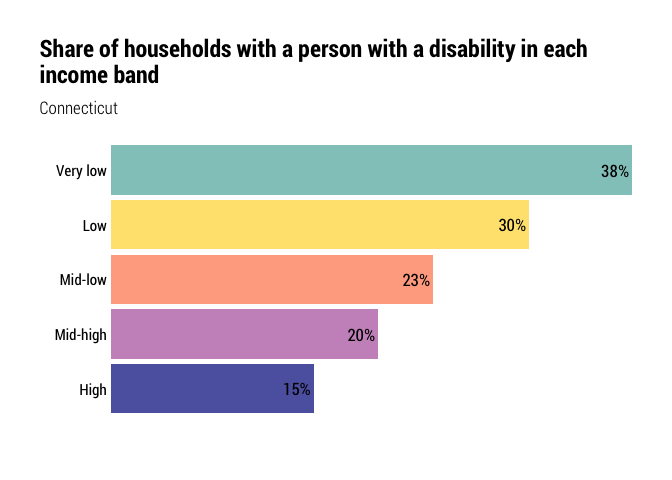

Split out disability analysis from households desiring housing
================

``` r
library(ipumsr)
library(tidyverse)
library(srvyr)
library(tidycensus)
library(hrbrthemes)
library(camiller)
library(scales)
library(kableExtra)
```

``` r
set.seed(13)

theme_set(theme_ipsum_rc())

pal <- c("#92c9c5", "#ffe37e", "#ffac8f", "#cb94c4", "#5e63af")

scale_fill_custom <- function(palette = pal, rev = F) {
  if (rev) {
    scale_fill_manual(values = rev(pal))
  } else {
    scale_fill_manual(values = pal)
  }
}

scale_color_custom <- function(palette = pal, rev = F) {
  if (rev) {
    scale_color_manual(values = rev(pal))
  } else {
    scale_color_manual(values = pal)
  }
}
```

Tl;dr for code below: I’m making some sociodemographic groups here,
including race (white, Black, Latino, Other), some income groups (very
low, low, mid low, mid high, high) based on median household income, and
cost burden (no burden, cost burden, severe cost burden).

``` r
minc <- get_acs(
    geography = "county",
      table = "B19013",
    state = 09,
      cache_table = T) %>% 
    arrange(GEOID) %>% 
    mutate(countyfip = seq(from = 1, to = 15, by = 2),
                 name = str_remove(NAME, ", Connecticut")) %>% 
    select(countyfip, name, minc = estimate)

ddi <- read_ipums_ddi("../input_data/usa_00043.xml")

pums <- read_ipums_micro(ddi, verbose = F)  %>% 
    mutate_at(vars(YEAR, PUMA, OWNERSHP, OWNERSHPD, RACE, RACED, HISPAN, HISPAND, DIFFREM, DIFFPHYS, DIFFMOB, DIFFCARE, DIFFEYE, DIFFHEAR), as_factor) %>% 
    mutate_at(vars(PERWT, HHWT), as.numeric) %>% 
    mutate_at(vars(HHINCOME, OWNCOST, RENTGRS, OCC), as.integer) %>% 
    janitor::clean_names() %>% 
    left_join(minc, by = "countyfip") %>% 
    mutate(ratio = hhincome / minc) %>% 
    mutate(
        inc_band = cut(
            ratio,
            breaks = c(-Inf, 0.3, 0.5, .8, 1.2, Inf),
            labels = c("Very low", "Low", "Mid-low", "Mid-high", "High"),
            include.lowest = T, right = T)) %>% 
    mutate(
        inc_band = as.factor(inc_band) %>%
            fct_relevel(., "Very low", "Low", "Mid-low", "Mid-high", "High")) %>% 
    mutate(cb = if_else(ownershp == "Rented", (rentgrs * 12) / hhincome, 99999)) %>% 
    mutate(cb = if_else(ownershp == "Owned or being bought (loan)", (owncost * 12) / hhincome, cb)) %>%
    # if housing cost is 0 and income is 0, no burden
    mutate(cb = if_else((rentgrs == 0 & hhincome == 0), 0, cb)) %>%
    mutate(cb = if_else((owncost == 0 & hhincome == 0), 0, cb)) %>%
    #if income is <=0 and housing cost is >0, burden
    mutate(cb = if_else((rentgrs > 0 & hhincome <= 0), 1, cb)) %>%
    mutate(cb = if_else((owncost > 0 & hhincome <= 0), 1, cb)) %>%
    # some people pay more than 100% income to housing, but I will code these as 1
    mutate(cb = if_else(cb > 1, 1, cb)) %>%
    mutate(
        cost_burden = cut(
            cb,
            breaks = c(-Inf, .3, .5, Inf),
            labels = c("No burden", "Cost-burdened", "Severely cost-burdened"),
            include.lowest = T, right = F)) %>% 
        mutate(race2 = if_else(hispan == "Not Hispanic", as.character(race), "Latino")) %>% 
    mutate(race2 = as.factor(race2) %>% 
                    fct_recode(Black = "Black/African American/Negro") %>%
                    fct_other(keep = c("White", "Black", "Latino"), other_level = "Other race") %>%
                    fct_relevel("White", "Black", "Latino", "Other race"))
```

**John** this is where the change is probably needed. Right now, I have
a logical flag that searches across the disability columns and creates a
new logical variable that says whether any disability is recorded.

``` r
#logical flag for any disability
pums$has_disability <- apply(pums, 1, function(x) any(grep("Has|Yes", x)))
```

We want 6 categories to group by. These are recorded in the PUMS data as
below:

  - DIFFREM = cognitive disability
  - DIFFPHYS = physical disability
  - DIFFMOB = ambulatory disability
  - DIFFCARE = self care/idependent living difficuly
  - DIFFEYE = vision disability
  - DIFFHEAR = hearing disability

I think the approach I would use is to turn each of those columns into
Y/N or T/F rather than “Has (disability)” whatever text label they use.

``` r
# John
# I am regarding N/A as no disability -- revisit?
# I'm not sure what N/A means, but let's keep it as only yes if answer in the affirmative, like you have it. - kd
pums$diffrem_TF <- ifelse(str_detect(pums$diffrem, "N/A"), NA, 
                          str_detect(pums$diffrem, "Has"))
pums$diffphys_TF <- ifelse(str_detect(pums$diffphys, "N/A"), NA, 
                          str_detect(pums$diffphys, "Has")) 
pums$diffmob_TF <- ifelse(str_detect(pums$diffmob, "N/A"), NA, 
                          str_detect(pums$diffmob, "Has")) 
pums$diffcare_TF <- ifelse(str_detect(pums$diffcare, "N/A"), NA, 
                          str_detect(pums$diffcare, "Yes")) 
pums$diffeye_TF <- ifelse(str_detect(pums$diffeye, "N/A"), NA, 
                          str_detect(pums$diffeye, "Yes")) 
pums$diffhear_TF <- ifelse(str_detect(pums$diffhear, "N/A"), NA, 
                          str_detect(pums$diffhear, "Yes")) 
pums$disability_sum <- pums %>% 
  select(diffrem_TF:diffhear_TF) %>% 
  apply(1, sum, na.rm=TRUE)
```

The chunk below pulls the data together by creating a LUT of households
with any occupant with a disability, so we only count the household
once. You’ll need to set it up so we count each household only once per
disability type. In other words, we can have a household counted more
than once if they have an occupant with more than one disability type,
or if they have multiple occupants with different disabilities.

``` r
des <- pums %>%
    filter(pernum == "1", hhincome != 9999999, ownershp != "N/A") %>%
    as_survey_design(., ids = 1, wt = hhwt)

ct_hhlds <- des %>%
    select(hhwt, statefip, inc_band) %>% 
    group_by(statefip, inc_band) %>% 
    summarise(value = survey_total(hhwt)) %>% 
    mutate(name = "Connecticut", level = "1_state") %>% 
    select(-statefip)

hh_w_disability <- pums %>%
    filter(has_disability == T) %>% 
    select(cbserial) %>% #cbserial is the hh code
    unique()

ct_inc_band_disability <- des %>% 
    mutate(disability = if_else(cbserial %in% hh_w_disability$cbserial, T, F)) %>% 
    select(hhwt, inc_band, disability) %>% 
    mutate(name = "Connecticut") %>% 
    group_by(name, inc_band, disability) %>% 
    summarise(value = survey_total(hhwt)) %>% 
    ungroup() %>% 
    group_by(name, inc_band)

ct_total_disability <- ct_inc_band_disability %>% 
    select(-value_se) %>% 
  ungroup() %>% 
    mutate(inc_band = "Total") %>% 
    group_by(name, inc_band, disability) %>% 
    summarise(value = sum(value))

ct_inc_band_disability <- ct_inc_band_disability %>% 
    bind_rows(ct_total_disability)
```

``` r
# John
des <- pums %>%
    filter(pernum == "1", hhincome != 9999999, ownershp != "N/A") %>%
    as_survey_design(., ids = 1, wt = hhwt)

ct_hhlds_no_total <- des %>%
    select(hhwt, statefip, inc_band) %>% 
    group_by(statefip, inc_band) %>% 
    summarise(value = survey_total(hhwt)) %>% 
    mutate(name = "Connecticut", level = "1_state") %>% 
    select(-statefip)

ct_hhlds_total <- ct_hhlds_no_total %>% 
    select(-value_se) %>% 
    ungroup() %>% 
    mutate(inc_band = "Total") %>%
    group_by(name, inc_band) %>% 
    summarise(value = sum(value))

ct_hhlds <- ct_hhlds_no_total %>% 
  bind_rows(ct_hhlds_total)

get_counts <- function(col) {
  colname <- as.name(col)
  inc_band_disability <- des %>% 
    select(hhwt, inc_band, !!colname) %>% 
    mutate(name = "Connecticut") %>% 
    mutate(disability_type = col %>% str_remove("_TF")) %>% 
    group_by(name, inc_band, disability_type, !!colname) %>% 
    summarise(value = survey_total(hhwt)) %>% 
    ungroup() %>% 
    select(name, disability_type, inc_band, disability=!!colname, value, value_se) %>% 
    group_by(name, inc_band, disability_type)
  total_disability <- inc_band_disability %>% 
    select(-value_se) %>% 
    ungroup() %>% 
    mutate(inc_band = "Total") %>%
    group_by(name, disability_type, inc_band, disability) %>% 
    summarise(value = sum(value))
  ct_inc_band_disability <- inc_band_disability %>% 
    bind_rows(total_disability)
  return(ct_inc_band_disability)
}

tf_vars <- pums %>% 
  select(ends_with("TF")) %>% 
  names()

ct_inc_band_disability_type <- tf_vars %>% 
  map_dfr(get_counts)
```

My original tables and charts are below, with comments in **bold**
regarding new vizzes.

Quick tabulations of households with an occupant with a disability

**We want this table to show households by income band by disability
type**

``` r
kable(ct_inc_band_disability)
```

<table>

<thead>

<tr>

<th style="text-align:left;">

name

</th>

<th style="text-align:left;">

inc\_band

</th>

<th style="text-align:left;">

disability

</th>

<th style="text-align:right;">

value

</th>

<th style="text-align:right;">

value\_se

</th>

</tr>

</thead>

<tbody>

<tr>

<td style="text-align:left;">

Connecticut

</td>

<td style="text-align:left;">

Very low

</td>

<td style="text-align:left;">

FALSE

</td>

<td style="text-align:right;">

124879

</td>

<td style="text-align:right;">

1939.616

</td>

</tr>

<tr>

<td style="text-align:left;">

Connecticut

</td>

<td style="text-align:left;">

Very low

</td>

<td style="text-align:left;">

TRUE

</td>

<td style="text-align:right;">

76498

</td>

<td style="text-align:right;">

1509.591

</td>

</tr>

<tr>

<td style="text-align:left;">

Connecticut

</td>

<td style="text-align:left;">

Low

</td>

<td style="text-align:left;">

FALSE

</td>

<td style="text-align:right;">

105139

</td>

<td style="text-align:right;">

1776.579

</td>

</tr>

<tr>

<td style="text-align:left;">

Connecticut

</td>

<td style="text-align:left;">

Low

</td>

<td style="text-align:left;">

TRUE

</td>

<td style="text-align:right;">

46206

</td>

<td style="text-align:right;">

1125.341

</td>

</tr>

<tr>

<td style="text-align:left;">

Connecticut

</td>

<td style="text-align:left;">

Mid-low

</td>

<td style="text-align:left;">

FALSE

</td>

<td style="text-align:right;">

164046

</td>

<td style="text-align:right;">

2214.536

</td>

</tr>

<tr>

<td style="text-align:left;">

Connecticut

</td>

<td style="text-align:left;">

Mid-low

</td>

<td style="text-align:left;">

TRUE

</td>

<td style="text-align:right;">

50444

</td>

<td style="text-align:right;">

1163.525

</td>

</tr>

<tr>

<td style="text-align:left;">

Connecticut

</td>

<td style="text-align:left;">

Mid-high

</td>

<td style="text-align:left;">

FALSE

</td>

<td style="text-align:right;">

186625

</td>

<td style="text-align:right;">

2232.000

</td>

</tr>

<tr>

<td style="text-align:left;">

Connecticut

</td>

<td style="text-align:left;">

Mid-high

</td>

<td style="text-align:left;">

TRUE

</td>

<td style="text-align:right;">

45211

</td>

<td style="text-align:right;">

1058.285

</td>

</tr>

<tr>

<td style="text-align:left;">

Connecticut

</td>

<td style="text-align:left;">

High

</td>

<td style="text-align:left;">

FALSE

</td>

<td style="text-align:right;">

484239

</td>

<td style="text-align:right;">

3034.160

</td>

</tr>

<tr>

<td style="text-align:left;">

Connecticut

</td>

<td style="text-align:left;">

High

</td>

<td style="text-align:left;">

TRUE

</td>

<td style="text-align:right;">

84087

</td>

<td style="text-align:right;">

1363.296

</td>

</tr>

<tr>

<td style="text-align:left;">

Connecticut

</td>

<td style="text-align:left;">

Total

</td>

<td style="text-align:left;">

FALSE

</td>

<td style="text-align:right;">

1064928

</td>

<td style="text-align:right;">

NA

</td>

</tr>

<tr>

<td style="text-align:left;">

Connecticut

</td>

<td style="text-align:left;">

Total

</td>

<td style="text-align:left;">

TRUE

</td>

<td style="text-align:right;">

302446

</td>

<td style="text-align:right;">

NA

</td>

</tr>

</tbody>

</table>

``` r
# John
# combined into one large table - kd
tf_vars %>% 
    lapply(get_counts) %>% 
    bind_rows() %>% 
    kable()
```

<table>

<thead>

<tr>

<th style="text-align:left;">

name

</th>

<th style="text-align:left;">

disability\_type

</th>

<th style="text-align:left;">

inc\_band

</th>

<th style="text-align:left;">

disability

</th>

<th style="text-align:right;">

value

</th>

<th style="text-align:right;">

value\_se

</th>

</tr>

</thead>

<tbody>

<tr>

<td style="text-align:left;">

Connecticut

</td>

<td style="text-align:left;">

diffrem

</td>

<td style="text-align:left;">

Very low

</td>

<td style="text-align:left;">

FALSE

</td>

<td style="text-align:right;">

175605

</td>

<td style="text-align:right;">

2250.4131

</td>

</tr>

<tr>

<td style="text-align:left;">

Connecticut

</td>

<td style="text-align:left;">

diffrem

</td>

<td style="text-align:left;">

Very low

</td>

<td style="text-align:left;">

TRUE

</td>

<td style="text-align:right;">

25772

</td>

<td style="text-align:right;">

913.3609

</td>

</tr>

<tr>

<td style="text-align:left;">

Connecticut

</td>

<td style="text-align:left;">

diffrem

</td>

<td style="text-align:left;">

Low

</td>

<td style="text-align:left;">

FALSE

</td>

<td style="text-align:right;">

141219

</td>

<td style="text-align:right;">

2007.1293

</td>

</tr>

<tr>

<td style="text-align:left;">

Connecticut

</td>

<td style="text-align:left;">

diffrem

</td>

<td style="text-align:left;">

Low

</td>

<td style="text-align:left;">

TRUE

</td>

<td style="text-align:right;">

10126

</td>

<td style="text-align:right;">

544.9442

</td>

</tr>

<tr>

<td style="text-align:left;">

Connecticut

</td>

<td style="text-align:left;">

diffrem

</td>

<td style="text-align:left;">

Mid-low

</td>

<td style="text-align:left;">

FALSE

</td>

<td style="text-align:right;">

206433

</td>

<td style="text-align:right;">

2413.0305

</td>

</tr>

<tr>

<td style="text-align:left;">

Connecticut

</td>

<td style="text-align:left;">

diffrem

</td>

<td style="text-align:left;">

Mid-low

</td>

<td style="text-align:left;">

TRUE

</td>

<td style="text-align:right;">

8057

</td>

<td style="text-align:right;">

497.9731

</td>

</tr>

<tr>

<td style="text-align:left;">

Connecticut

</td>

<td style="text-align:left;">

diffrem

</td>

<td style="text-align:left;">

Mid-high

</td>

<td style="text-align:left;">

FALSE

</td>

<td style="text-align:right;">

226161

</td>

<td style="text-align:right;">

2397.2103

</td>

</tr>

<tr>

<td style="text-align:left;">

Connecticut

</td>

<td style="text-align:left;">

diffrem

</td>

<td style="text-align:left;">

Mid-high

</td>

<td style="text-align:left;">

TRUE

</td>

<td style="text-align:right;">

5675

</td>

<td style="text-align:right;">

390.5805

</td>

</tr>

<tr>

<td style="text-align:left;">

Connecticut

</td>

<td style="text-align:left;">

diffrem

</td>

<td style="text-align:left;">

High

</td>

<td style="text-align:left;">

FALSE

</td>

<td style="text-align:right;">

561532

</td>

<td style="text-align:right;">

3138.0077

</td>

</tr>

<tr>

<td style="text-align:left;">

Connecticut

</td>

<td style="text-align:left;">

diffrem

</td>

<td style="text-align:left;">

High

</td>

<td style="text-align:left;">

TRUE

</td>

<td style="text-align:right;">

6794

</td>

<td style="text-align:right;">

415.2310

</td>

</tr>

<tr>

<td style="text-align:left;">

Connecticut

</td>

<td style="text-align:left;">

diffrem

</td>

<td style="text-align:left;">

Total

</td>

<td style="text-align:left;">

FALSE

</td>

<td style="text-align:right;">

1310950

</td>

<td style="text-align:right;">

NA

</td>

</tr>

<tr>

<td style="text-align:left;">

Connecticut

</td>

<td style="text-align:left;">

diffrem

</td>

<td style="text-align:left;">

Total

</td>

<td style="text-align:left;">

TRUE

</td>

<td style="text-align:right;">

56424

</td>

<td style="text-align:right;">

NA

</td>

</tr>

<tr>

<td style="text-align:left;">

Connecticut

</td>

<td style="text-align:left;">

diffphys

</td>

<td style="text-align:left;">

Very low

</td>

<td style="text-align:left;">

FALSE

</td>

<td style="text-align:right;">

158485

</td>

<td style="text-align:right;">

2153.8643

</td>

</tr>

<tr>

<td style="text-align:left;">

Connecticut

</td>

<td style="text-align:left;">

diffphys

</td>

<td style="text-align:left;">

Very low

</td>

<td style="text-align:left;">

TRUE

</td>

<td style="text-align:right;">

42892

</td>

<td style="text-align:right;">

1150.5678

</td>

</tr>

<tr>

<td style="text-align:left;">

Connecticut

</td>

<td style="text-align:left;">

diffphys

</td>

<td style="text-align:left;">

Low

</td>

<td style="text-align:left;">

FALSE

</td>

<td style="text-align:right;">

129764

</td>

<td style="text-align:right;">

1939.8007

</td>

</tr>

<tr>

<td style="text-align:left;">

Connecticut

</td>

<td style="text-align:left;">

diffphys

</td>

<td style="text-align:left;">

Low

</td>

<td style="text-align:left;">

TRUE

</td>

<td style="text-align:right;">

21581

</td>

<td style="text-align:right;">

775.5773

</td>

</tr>

<tr>

<td style="text-align:left;">

Connecticut

</td>

<td style="text-align:left;">

diffphys

</td>

<td style="text-align:left;">

Mid-low

</td>

<td style="text-align:left;">

FALSE

</td>

<td style="text-align:right;">

195614

</td>

<td style="text-align:right;">

2361.5543

</td>

</tr>

<tr>

<td style="text-align:left;">

Connecticut

</td>

<td style="text-align:left;">

diffphys

</td>

<td style="text-align:left;">

Mid-low

</td>

<td style="text-align:left;">

TRUE

</td>

<td style="text-align:right;">

18876

</td>

<td style="text-align:right;">

742.4461

</td>

</tr>

<tr>

<td style="text-align:left;">

Connecticut

</td>

<td style="text-align:left;">

diffphys

</td>

<td style="text-align:left;">

Mid-high

</td>

<td style="text-align:left;">

FALSE

</td>

<td style="text-align:right;">

218458

</td>

<td style="text-align:right;">

2368.4482

</td>

</tr>

<tr>

<td style="text-align:left;">

Connecticut

</td>

<td style="text-align:left;">

diffphys

</td>

<td style="text-align:left;">

Mid-high

</td>

<td style="text-align:left;">

TRUE

</td>

<td style="text-align:right;">

13378

</td>

<td style="text-align:right;">

579.6950

</td>

</tr>

<tr>

<td style="text-align:left;">

Connecticut

</td>

<td style="text-align:left;">

diffphys

</td>

<td style="text-align:left;">

High

</td>

<td style="text-align:left;">

FALSE

</td>

<td style="text-align:right;">

551827

</td>

<td style="text-align:right;">

3121.8361

</td>

</tr>

<tr>

<td style="text-align:left;">

Connecticut

</td>

<td style="text-align:left;">

diffphys

</td>

<td style="text-align:left;">

High

</td>

<td style="text-align:left;">

TRUE

</td>

<td style="text-align:right;">

16499

</td>

<td style="text-align:right;">

650.7397

</td>

</tr>

<tr>

<td style="text-align:left;">

Connecticut

</td>

<td style="text-align:left;">

diffphys

</td>

<td style="text-align:left;">

Total

</td>

<td style="text-align:left;">

FALSE

</td>

<td style="text-align:right;">

1254148

</td>

<td style="text-align:right;">

NA

</td>

</tr>

<tr>

<td style="text-align:left;">

Connecticut

</td>

<td style="text-align:left;">

diffphys

</td>

<td style="text-align:left;">

Total

</td>

<td style="text-align:left;">

TRUE

</td>

<td style="text-align:right;">

113226

</td>

<td style="text-align:right;">

NA

</td>

</tr>

<tr>

<td style="text-align:left;">

Connecticut

</td>

<td style="text-align:left;">

diffmob

</td>

<td style="text-align:left;">

Very low

</td>

<td style="text-align:left;">

FALSE

</td>

<td style="text-align:right;">

171973

</td>

<td style="text-align:right;">

2238.6285

</td>

</tr>

<tr>

<td style="text-align:left;">

Connecticut

</td>

<td style="text-align:left;">

diffmob

</td>

<td style="text-align:left;">

Very low

</td>

<td style="text-align:left;">

TRUE

</td>

<td style="text-align:right;">

29404

</td>

<td style="text-align:right;">

949.8259

</td>

</tr>

<tr>

<td style="text-align:left;">

Connecticut

</td>

<td style="text-align:left;">

diffmob

</td>

<td style="text-align:left;">

Low

</td>

<td style="text-align:left;">

FALSE

</td>

<td style="text-align:right;">

138386

</td>

<td style="text-align:right;">

1992.0059

</td>

</tr>

<tr>

<td style="text-align:left;">

Connecticut

</td>

<td style="text-align:left;">

diffmob

</td>

<td style="text-align:left;">

Low

</td>

<td style="text-align:left;">

TRUE

</td>

<td style="text-align:right;">

12959

</td>

<td style="text-align:right;">

606.4124

</td>

</tr>

<tr>

<td style="text-align:left;">

Connecticut

</td>

<td style="text-align:left;">

diffmob

</td>

<td style="text-align:left;">

Mid-low

</td>

<td style="text-align:left;">

FALSE

</td>

<td style="text-align:right;">

203645

</td>

<td style="text-align:right;">

2407.5174

</td>

</tr>

<tr>

<td style="text-align:left;">

Connecticut

</td>

<td style="text-align:left;">

diffmob

</td>

<td style="text-align:left;">

Mid-low

</td>

<td style="text-align:left;">

TRUE

</td>

<td style="text-align:right;">

10845

</td>

<td style="text-align:right;">

538.5142

</td>

</tr>

<tr>

<td style="text-align:left;">

Connecticut

</td>

<td style="text-align:left;">

diffmob

</td>

<td style="text-align:left;">

Mid-high

</td>

<td style="text-align:left;">

FALSE

</td>

<td style="text-align:right;">

223730

</td>

<td style="text-align:right;">

2389.0955

</td>

</tr>

<tr>

<td style="text-align:left;">

Connecticut

</td>

<td style="text-align:left;">

diffmob

</td>

<td style="text-align:left;">

Mid-high

</td>

<td style="text-align:left;">

TRUE

</td>

<td style="text-align:right;">

8106

</td>

<td style="text-align:right;">

454.3198

</td>

</tr>

<tr>

<td style="text-align:left;">

Connecticut

</td>

<td style="text-align:left;">

diffmob

</td>

<td style="text-align:left;">

High

</td>

<td style="text-align:left;">

FALSE

</td>

<td style="text-align:right;">

560390

</td>

<td style="text-align:right;">

3136.6660

</td>

</tr>

<tr>

<td style="text-align:left;">

Connecticut

</td>

<td style="text-align:left;">

diffmob

</td>

<td style="text-align:left;">

High

</td>

<td style="text-align:left;">

TRUE

</td>

<td style="text-align:right;">

7936

</td>

<td style="text-align:right;">

445.8037

</td>

</tr>

<tr>

<td style="text-align:left;">

Connecticut

</td>

<td style="text-align:left;">

diffmob

</td>

<td style="text-align:left;">

Total

</td>

<td style="text-align:left;">

FALSE

</td>

<td style="text-align:right;">

1298124

</td>

<td style="text-align:right;">

NA

</td>

</tr>

<tr>

<td style="text-align:left;">

Connecticut

</td>

<td style="text-align:left;">

diffmob

</td>

<td style="text-align:left;">

Total

</td>

<td style="text-align:left;">

TRUE

</td>

<td style="text-align:right;">

69250

</td>

<td style="text-align:right;">

NA

</td>

</tr>

<tr>

<td style="text-align:left;">

Connecticut

</td>

<td style="text-align:left;">

diffcare

</td>

<td style="text-align:left;">

Very low

</td>

<td style="text-align:left;">

FALSE

</td>

<td style="text-align:right;">

186895

</td>

<td style="text-align:right;">

2325.1882

</td>

</tr>

<tr>

<td style="text-align:left;">

Connecticut

</td>

<td style="text-align:left;">

diffcare

</td>

<td style="text-align:left;">

Very low

</td>

<td style="text-align:left;">

TRUE

</td>

<td style="text-align:right;">

14482

</td>

<td style="text-align:right;">

663.7517

</td>

</tr>

<tr>

<td style="text-align:left;">

Connecticut

</td>

<td style="text-align:left;">

diffcare

</td>

<td style="text-align:left;">

Low

</td>

<td style="text-align:left;">

FALSE

</td>

<td style="text-align:right;">

145177

</td>

<td style="text-align:right;">

2033.4471

</td>

</tr>

<tr>

<td style="text-align:left;">

Connecticut

</td>

<td style="text-align:left;">

diffcare

</td>

<td style="text-align:left;">

Low

</td>

<td style="text-align:left;">

TRUE

</td>

<td style="text-align:right;">

6168

</td>

<td style="text-align:right;">

418.9102

</td>

</tr>

<tr>

<td style="text-align:left;">

Connecticut

</td>

<td style="text-align:left;">

diffcare

</td>

<td style="text-align:left;">

Mid-low

</td>

<td style="text-align:left;">

FALSE

</td>

<td style="text-align:right;">

208564

</td>

<td style="text-align:right;">

2428.9147

</td>

</tr>

<tr>

<td style="text-align:left;">

Connecticut

</td>

<td style="text-align:left;">

diffcare

</td>

<td style="text-align:left;">

Mid-low

</td>

<td style="text-align:left;">

TRUE

</td>

<td style="text-align:right;">

5926

</td>

<td style="text-align:right;">

398.7041

</td>

</tr>

<tr>

<td style="text-align:left;">

Connecticut

</td>

<td style="text-align:left;">

diffcare

</td>

<td style="text-align:left;">

Mid-high

</td>

<td style="text-align:left;">

FALSE

</td>

<td style="text-align:right;">

227887

</td>

<td style="text-align:right;">

2406.7160

</td>

</tr>

<tr>

<td style="text-align:left;">

Connecticut

</td>

<td style="text-align:left;">

diffcare

</td>

<td style="text-align:left;">

Mid-high

</td>

<td style="text-align:left;">

TRUE

</td>

<td style="text-align:right;">

3949

</td>

<td style="text-align:right;">

309.8799

</td>

</tr>

<tr>

<td style="text-align:left;">

Connecticut

</td>

<td style="text-align:left;">

diffcare

</td>

<td style="text-align:left;">

High

</td>

<td style="text-align:left;">

FALSE

</td>

<td style="text-align:right;">

564054

</td>

<td style="text-align:right;">

3145.2652

</td>

</tr>

<tr>

<td style="text-align:left;">

Connecticut

</td>

<td style="text-align:left;">

diffcare

</td>

<td style="text-align:left;">

High

</td>

<td style="text-align:left;">

TRUE

</td>

<td style="text-align:right;">

4272

</td>

<td style="text-align:right;">

294.9759

</td>

</tr>

<tr>

<td style="text-align:left;">

Connecticut

</td>

<td style="text-align:left;">

diffcare

</td>

<td style="text-align:left;">

Total

</td>

<td style="text-align:left;">

FALSE

</td>

<td style="text-align:right;">

1332577

</td>

<td style="text-align:right;">

NA

</td>

</tr>

<tr>

<td style="text-align:left;">

Connecticut

</td>

<td style="text-align:left;">

diffcare

</td>

<td style="text-align:left;">

Total

</td>

<td style="text-align:left;">

TRUE

</td>

<td style="text-align:right;">

34797

</td>

<td style="text-align:right;">

NA

</td>

</tr>

<tr>

<td style="text-align:left;">

Connecticut

</td>

<td style="text-align:left;">

diffeye

</td>

<td style="text-align:left;">

Very low

</td>

<td style="text-align:left;">

FALSE

</td>

<td style="text-align:right;">

189329

</td>

<td style="text-align:right;">

2339.7110

</td>

</tr>

<tr>

<td style="text-align:left;">

Connecticut

</td>

<td style="text-align:left;">

diffeye

</td>

<td style="text-align:left;">

Very low

</td>

<td style="text-align:left;">

TRUE

</td>

<td style="text-align:right;">

12048

</td>

<td style="text-align:right;">

600.6376

</td>

</tr>

<tr>

<td style="text-align:left;">

Connecticut

</td>

<td style="text-align:left;">

diffeye

</td>

<td style="text-align:left;">

Low

</td>

<td style="text-align:left;">

FALSE

</td>

<td style="text-align:right;">

145652

</td>

<td style="text-align:right;">

2035.7883

</td>

</tr>

<tr>

<td style="text-align:left;">

Connecticut

</td>

<td style="text-align:left;">

diffeye

</td>

<td style="text-align:left;">

Low

</td>

<td style="text-align:left;">

TRUE

</td>

<td style="text-align:right;">

5693

</td>

<td style="text-align:right;">

405.0708

</td>

</tr>

<tr>

<td style="text-align:left;">

Connecticut

</td>

<td style="text-align:left;">

diffeye

</td>

<td style="text-align:left;">

Mid-low

</td>

<td style="text-align:left;">

FALSE

</td>

<td style="text-align:right;">

209079

</td>

<td style="text-align:right;">

2428.5061

</td>

</tr>

<tr>

<td style="text-align:left;">

Connecticut

</td>

<td style="text-align:left;">

diffeye

</td>

<td style="text-align:left;">

Mid-low

</td>

<td style="text-align:left;">

TRUE

</td>

<td style="text-align:right;">

5411

</td>

<td style="text-align:right;">

397.4753

</td>

</tr>

<tr>

<td style="text-align:left;">

Connecticut

</td>

<td style="text-align:left;">

diffeye

</td>

<td style="text-align:left;">

Mid-high

</td>

<td style="text-align:left;">

FALSE

</td>

<td style="text-align:right;">

228078

</td>

<td style="text-align:right;">

2409.1874

</td>

</tr>

<tr>

<td style="text-align:left;">

Connecticut

</td>

<td style="text-align:left;">

diffeye

</td>

<td style="text-align:left;">

Mid-high

</td>

<td style="text-align:left;">

TRUE

</td>

<td style="text-align:right;">

3758

</td>

<td style="text-align:right;">

287.9430

</td>

</tr>

<tr>

<td style="text-align:left;">

Connecticut

</td>

<td style="text-align:left;">

diffeye

</td>

<td style="text-align:left;">

High

</td>

<td style="text-align:left;">

FALSE

</td>

<td style="text-align:right;">

562716

</td>

<td style="text-align:right;">

3143.1393

</td>

</tr>

<tr>

<td style="text-align:left;">

Connecticut

</td>

<td style="text-align:left;">

diffeye

</td>

<td style="text-align:left;">

High

</td>

<td style="text-align:left;">

TRUE

</td>

<td style="text-align:right;">

5610

</td>

<td style="text-align:right;">

348.6288

</td>

</tr>

<tr>

<td style="text-align:left;">

Connecticut

</td>

<td style="text-align:left;">

diffeye

</td>

<td style="text-align:left;">

Total

</td>

<td style="text-align:left;">

FALSE

</td>

<td style="text-align:right;">

1334854

</td>

<td style="text-align:right;">

NA

</td>

</tr>

<tr>

<td style="text-align:left;">

Connecticut

</td>

<td style="text-align:left;">

diffeye

</td>

<td style="text-align:left;">

Total

</td>

<td style="text-align:left;">

TRUE

</td>

<td style="text-align:right;">

32520

</td>

<td style="text-align:right;">

NA

</td>

</tr>

<tr>

<td style="text-align:left;">

Connecticut

</td>

<td style="text-align:left;">

diffhear

</td>

<td style="text-align:left;">

Very low

</td>

<td style="text-align:left;">

FALSE

</td>

<td style="text-align:right;">

186227

</td>

<td style="text-align:right;">

2328.5622

</td>

</tr>

<tr>

<td style="text-align:left;">

Connecticut

</td>

<td style="text-align:left;">

diffhear

</td>

<td style="text-align:left;">

Very low

</td>

<td style="text-align:left;">

TRUE

</td>

<td style="text-align:right;">

15150

</td>

<td style="text-align:right;">

654.3040

</td>

</tr>

<tr>

<td style="text-align:left;">

Connecticut

</td>

<td style="text-align:left;">

diffhear

</td>

<td style="text-align:left;">

Low

</td>

<td style="text-align:left;">

FALSE

</td>

<td style="text-align:right;">

140210

</td>

<td style="text-align:right;">

2016.0493

</td>

</tr>

<tr>

<td style="text-align:left;">

Connecticut

</td>

<td style="text-align:left;">

diffhear

</td>

<td style="text-align:left;">

Low

</td>

<td style="text-align:left;">

TRUE

</td>

<td style="text-align:right;">

11135

</td>

<td style="text-align:right;">

514.5823

</td>

</tr>

<tr>

<td style="text-align:left;">

Connecticut

</td>

<td style="text-align:left;">

diffhear

</td>

<td style="text-align:left;">

Mid-low

</td>

<td style="text-align:left;">

FALSE

</td>

<td style="text-align:right;">

203025

</td>

<td style="text-align:right;">

2409.1199

</td>

</tr>

<tr>

<td style="text-align:left;">

Connecticut

</td>

<td style="text-align:left;">

diffhear

</td>

<td style="text-align:left;">

Mid-low

</td>

<td style="text-align:left;">

TRUE

</td>

<td style="text-align:right;">

11465

</td>

<td style="text-align:right;">

534.4657

</td>

</tr>

<tr>

<td style="text-align:left;">

Connecticut

</td>

<td style="text-align:left;">

diffhear

</td>

<td style="text-align:left;">

Mid-high

</td>

<td style="text-align:left;">

FALSE

</td>

<td style="text-align:right;">

222591

</td>

<td style="text-align:right;">

2387.4110

</td>

</tr>

<tr>

<td style="text-align:left;">

Connecticut

</td>

<td style="text-align:left;">

diffhear

</td>

<td style="text-align:left;">

Mid-high

</td>

<td style="text-align:left;">

TRUE

</td>

<td style="text-align:right;">

9245

</td>

<td style="text-align:right;">

470.5016

</td>

</tr>

<tr>

<td style="text-align:left;">

Connecticut

</td>

<td style="text-align:left;">

diffhear

</td>

<td style="text-align:left;">

High

</td>

<td style="text-align:left;">

FALSE

</td>

<td style="text-align:right;">

553255

</td>

<td style="text-align:right;">

3133.1206

</td>

</tr>

<tr>

<td style="text-align:left;">

Connecticut

</td>

<td style="text-align:left;">

diffhear

</td>

<td style="text-align:left;">

High

</td>

<td style="text-align:left;">

TRUE

</td>

<td style="text-align:right;">

15071

</td>

<td style="text-align:right;">

575.4730

</td>

</tr>

<tr>

<td style="text-align:left;">

Connecticut

</td>

<td style="text-align:left;">

diffhear

</td>

<td style="text-align:left;">

Total

</td>

<td style="text-align:left;">

FALSE

</td>

<td style="text-align:right;">

1305308

</td>

<td style="text-align:right;">

NA

</td>

</tr>

<tr>

<td style="text-align:left;">

Connecticut

</td>

<td style="text-align:left;">

diffhear

</td>

<td style="text-align:left;">

Total

</td>

<td style="text-align:left;">

TRUE

</td>

<td style="text-align:right;">

62066

</td>

<td style="text-align:right;">

NA

</td>

</tr>

</tbody>

</table>

Taking a slightly different look than the table above, the plot below
shows the share of households in each income band that have an occupant
with a disability (so the numerator is households with an occupant with
a disability in a given income band, and the denominator is all
households in that income band).

While the High band has the most (by count) households with an occupant
with a disability, it has the smallest share.

**I think we might want a plot faceted by disability type.**

``` r
ct_inc_band_disability %>%
    bind_rows(ct_hhlds) %>% 
    ungroup() %>% 
    select(-level) %>% 
    filter(inc_band != "Total") %>% 
    mutate(inc_band = as.factor(inc_band) %>% 
                    fct_relevel(., "Very low", "Low", "Mid-low", "Mid-high", "High") %>% 
                    fct_rev()) %>%
    mutate(disability = as.character(disability)) %>% 
    mutate(disability = if_else(is.na(disability), "Total", disability)) %>% 
    group_by(name, inc_band) %>% 
    calc_shares(group = disability, denom = "Total", value = value, moe = value_se) %>% 
    filter(disability == "TRUE", inc_band != "Total") %>% 
    ggplot(aes(share, inc_band, group = inc_band)) +
    geom_col(aes(fill = inc_band), position = position_dodge(1)) +
    geom_text(aes(label = percent(share, accuracy = 1)), position = position_dodge(1), family = "Roboto Condensed", size = 4.5, hjust = 1.1, vjust = .5) +
    scale_x_continuous(expand = expansion(mult = c(0, 0))) +
    scale_fill_custom(rev = T) + 
    theme(plot.title.position = "plot",
                axis.text.x = element_blank(), 
                axis.text.y = element_text(colour = "black"),
                panel.grid.major = element_blank(),
                panel.grid.minor = element_blank(),
                legend.position = "none") +
    labs(title = str_wrap("Share of households with a person with a disability in each income band", 60),
             subtitle = "Connecticut",
             x = "", y = "")
```

<!-- -->

``` r
# John
# wee tweaks - kd
ct_inc_band_disability_type %>%
    bind_rows(ct_hhlds %>% mutate(disability_type = "diffrem")) %>% # messy...
  bind_rows(ct_hhlds %>% mutate(disability_type = "diffphys")) %>% 
  bind_rows(ct_hhlds %>% mutate(disability_type = "diffmob")) %>% 
  bind_rows(ct_hhlds %>% mutate(disability_type = "diffcare")) %>% 
  bind_rows(ct_hhlds %>% mutate(disability_type = "diffeye")) %>% 
  bind_rows(ct_hhlds %>% mutate(disability_type = "diffhear")) %>% 
    ungroup() %>%
    select(-level) %>% 
    mutate(inc_band = as.factor(inc_band) %>% 
                    fct_relevel("Very low", "Low", "Mid-low", "Mid-high", "High", "Total") %>% 
                    fct_rev()) %>% 
  mutate(disability_type = as.factor(disability_type) %>% 
           fct_relevel("diffrem", "diffphys", "diffmob", "diffcare", "diffeye", "diffhear") %>% 
           plyr::revalue(c("diffrem" = "Cognitive disability", 
                                 "diffphys" = "Physical disability", 
                                 "diffmob" = "Ambulatory disability", 
                                 "diffcare" = "Independent living difficulty", 
                                 "diffeye" = "Vision disability", 
                                 "diffhear" = "Hearing disability"))) %>%
# diffcare diffeye diffhear diffmob diffphys diffrem
    mutate(disability = as.character(disability)) %>% 
    mutate(disability = if_else(is.na(disability), "Total", disability)) %>% 
    group_by(name, disability_type, inc_band) %>% 
    calc_shares(group = disability, denom = "Total", value = value, moe = value_se) %>% 
    filter(disability == "TRUE", inc_band != "Total") %>% 
    ggplot(aes(share, inc_band, group = disability_type)) +
    geom_col(aes(fill = inc_band), position = position_dodge(1)) +
  facet_wrap(~ disability_type) + 
    geom_text(aes(label = percent(share, accuracy = 1)), position = position_dodge(1), size = 3, hjust = "inward", vjust = .5) +
    scale_x_continuous(expand = expansion(mult = c(0, 0))) +
    scale_fill_custom(rev = T) + 
    theme(plot.title.position = "plot",
                axis.text.x = element_blank(), 
                axis.text.y = element_text(colour = "black"),
                panel.grid.major = element_blank(),
                panel.grid.minor = element_blank(),
                legend.position = "none") +
    labs(title = str_wrap("Share of households with a person with a disability in each income band", 60),
             subtitle = "Connecticut",
             x = "", y = "")
```

<!-- -->

Finally, what are the average cost burden rates for households with an
occupant with a disability?

``` r
ct_cost_ratio_inc_band_disability <- pums %>% 
    mutate(disability = if_else(cbserial %in% hh_w_disability$cbserial, T, F)) %>% 
    filter(pernum == "1", hhincome != 9999999, ownershp != "N/A") %>% 
    select(hhwt, inc_band, disability, cb) %>% 
    mutate(mult = cb * hhwt) %>% 
    group_by(inc_band, disability) %>% 
    summarise(avg_cost_ratio = sum(mult) / sum(hhwt)) %>% 
    ungroup() %>% 
    mutate(name = "Connecticut")
```

Read this chart as: “Households with an occupant with a disability in
the Very Low cost band spend, on average, 66% of household income on
housing costs.”

So the average cost ratio for households with an occupant with a
disability is slightly lower than households without a disabled
occupant, but the general trends in cost ratio across the cost bands
still hold.

**I think this chart is fine as it is, and I just included it so this
notebook has all the disability tabuations in it.**

``` r
ct_cost_ratio_inc_band_disability %>% 
    ggplot(aes(inc_band, avg_cost_ratio, group = disability)) +
    geom_col(aes(fill = disability), width = .8, position = position_dodge(.85)) +
    geom_text(aes(label = round(avg_cost_ratio, 2)), position = position_dodge(.85), family = "Roboto Condensed", hjust = .5, vjust = 1.2) +
    scale_fill_manual(values = c(pal[1], pal [4])) +
    guides(fill = guide_legend(title = "Household has occupant with disability")) +
    labs(title = "Average cost ratio for households in each income band",
             subtitle = "Connecticut",
             x = "", y = "",
             caption = "Cost ratio is the amount of household income spent on housing costs.") +
    theme(plot.title.position = "plot", 
                legend.position = "bottom",
                panel.grid.minor = element_blank(),
                panel.grid.major = element_blank(),
                axis.text.y = element_blank(),
                axis.text.x = element_text(colour = "black"))
```

<!-- -->
