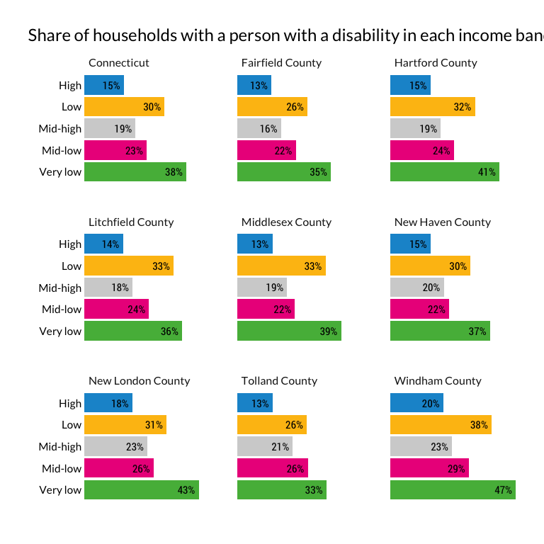

Split out disability analysis from households desiring housing
================

Tl;dr for code below: I’m making some sociodemographic groups here,
including race (white, Black, Latino, Other), some income groups (very
low, low, mid low, mid high, high) based on median household income, and
cost burden (no burden, cost burden, severe cost burden).

``` r
minc <- get_acs(
    geography = "county",
      table = "B19013",
    state = 09,
      cache_table = T) %>% 
    arrange(GEOID) %>% 
    mutate(countyfip = seq(from = 1, to = 15, by = 2),
                 name = str_remove(NAME, ", Connecticut")) %>% 
    select(countyfip, name, minc = estimate)

ddi <- read_ipums_ddi("../input_data/usa_00043.xml")

pums <- read_ipums_micro(ddi, verbose = F)  %>% 
    mutate_at(vars(YEAR, OWNERSHP, OWNERSHPD, RACE, RACED, HISPAN, HISPAND, DIFFREM, DIFFPHYS, DIFFMOB, DIFFCARE, DIFFEYE, DIFFHEAR), as_factor) %>% 
    mutate_at(vars(PERWT, HHWT), as.numeric) %>% 
    mutate_at(vars(HHINCOME, OWNCOST, RENTGRS, OCC), as.integer) %>% 
    mutate(PUMA = str_pad(PUMA, 5, side = c("left"), pad = "0")) %>% 
    janitor::clean_names() %>% 
    left_join(minc, by = "countyfip") %>% 
    mutate(ratio = hhincome / minc) %>% 
    mutate(
        inc_band = cut(
            ratio,
            breaks = c(-Inf, 0.3, 0.5, .8, 1.2, Inf),
            labels = c("Very low", "Low", "Mid-low", "Mid-high", "High"),
            include.lowest = T, right = T)) %>% 
    mutate(
        inc_band = as.factor(inc_band) %>%
            fct_relevel(., "Very low", "Low", "Mid-low", "Mid-high", "High")) %>% 
    mutate(cb = if_else(ownershp == "Rented", (rentgrs * 12) / hhincome, 99999)) %>% 
    mutate(cb = if_else(ownershp == "Owned or being bought (loan)", (owncost * 12) / hhincome, cb)) %>%
    # if housing cost is 0 and income is 0, no burden
    mutate(cb = if_else((rentgrs == 0 & hhincome == 0), 0, cb)) %>%
    mutate(cb = if_else((owncost == 0 & hhincome == 0), 0, cb)) %>%
    #if income is <=0 and housing cost is >0, burden
    mutate(cb = if_else((rentgrs > 0 & hhincome <= 0), 1, cb)) %>%
    mutate(cb = if_else((owncost > 0 & hhincome <= 0), 1, cb)) %>%
    # some people pay more than 100% income to housing, but I will code these as 1
    mutate(cb = if_else(cb > 1, 1, cb)) %>%
    mutate(
        cost_burden = cut(
            cb,
            breaks = c(-Inf, .3, .5, Inf),
            labels = c("No burden", "Cost-burdened", "Severely cost-burdened"),
            include.lowest = T, right = F)) %>% 
        mutate(race2 = if_else(hispan == "Not Hispanic", as.character(race), "Latino")) %>% 
    mutate(race2 = as.factor(race2) %>% 
                    fct_recode(Black = "Black/African American/Negro") %>%
                    fct_other(keep = c("White", "Black", "Latino"), other_level = "Other race") %>%
                    fct_relevel("White", "Black", "Latino", "Other race"))
```

``` r
#logical flag for any disability
pums$has_disability <- apply(pums, 1, function(x) any(grep("Has|Yes", x)))
```

We want 6 categories to group by. These are recorded in the PUMS data as
below:

  - DIFFREM = cognitive disability
  - DIFFPHYS = physical disability
  - DIFFMOB = ambulatory disability
  - DIFFCARE = self care/idependent living difficuly
  - DIFFEYE = vision disability
  - DIFFHEAR = hearing disability

I think the approach I would use is to turn each of those columns into
Y/N or T/F rather than “Has (disability)” whatever text label they use.

``` r
# John
# I am regarding N/A as no disability -- revisit?
# I'm not sure what N/A means, but let's keep it as only yes if answer in the affirmative, like you have it. - kd
# actually, changing this to make NA's FALSE. I don't think it'll change the counts as we have them but this aligns with how I did it - kd
pums$diffrem_TF <- ifelse(str_detect(pums$diffrem, "N/A"), F, 
                          str_detect(pums$diffrem, "Has"))
pums$diffphys_TF <- ifelse(str_detect(pums$diffphys, "N/A"), F, 
                          str_detect(pums$diffphys, "Has")) 
pums$diffmob_TF <- ifelse(str_detect(pums$diffmob, "N/A"), F, 
                          str_detect(pums$diffmob, "Has")) 
pums$diffcare_TF <- ifelse(str_detect(pums$diffcare, "N/A"), F, 
                          str_detect(pums$diffcare, "Yes")) 
pums$diffeye_TF <- ifelse(str_detect(pums$diffeye, "N/A"), F, 
                          str_detect(pums$diffeye, "Yes")) 
pums$diffhear_TF <- ifelse(str_detect(pums$diffhear, "N/A"), F, 
                          str_detect(pums$diffhear, "Yes")) 
pums$disability_sum <- pums %>% 
  select(diffrem_TF:diffhear_TF) %>% 
  apply(1, sum, na.rm=TRUE)
```

The chunk below pulls the data together by creating a LUT of households
with any occupant with a disability, so we only count the household
once. You’ll need to set it up so we count each household only once per
disability type. In other words, we can have a household counted more
than once if they have an occupant with more than one disability type,
or if they have multiple occupants with different disabilities.

``` r
des <- pums %>%
    filter(pernum == "1", hhincome != 9999999, ownershp != "N/A") %>%
    as_survey_design(., ids = 1, wt = hhwt)

county_hhlds <- des %>%
    select(hhwt, name, inc_band) %>% 
    group_by(name, inc_band) %>% 
    summarise(value = survey_total(hhwt))

ct_hhlds <- des %>%
    select(hhwt, statefip, inc_band) %>% 
    group_by(statefip, inc_band) %>% 
    summarise(value = survey_total(hhwt)) %>% 
    ungroup() %>% 
    mutate(name = "Connecticut") %>% 
    select(-statefip)

hh_w_disability <- pums %>%
    filter(has_disability == T) %>% 
    select(cbserial) %>% #cbserial is the hh code
    unique()

ct_inc_band_disability <- des %>% 
    mutate(disability = if_else(cbserial %in% hh_w_disability$cbserial, T, F)) %>% 
    select(hhwt, inc_band, disability) %>% 
    mutate(name = "Connecticut") %>% 
    group_by(name, inc_band, disability) %>% 
    summarise(value = survey_total(hhwt)) %>% 
    ungroup() %>% 
    group_by(name, inc_band)

county_inc_band_disability <- des %>% 
    mutate(disability = if_else(cbserial %in% hh_w_disability$cbserial, T, F)) %>% 
    select(hhwt, name, inc_band, disability) %>% 
    group_by(name, inc_band, disability) %>% 
    summarise(value = survey_total(hhwt)) %>% 
    ungroup() %>% 
    group_by(name, inc_band)

ct_total_disability <- ct_inc_band_disability %>% 
    select(-value_se) %>% 
  ungroup() %>% 
    mutate(inc_band = "Total") %>% 
    group_by(name, inc_band, disability) %>% 
    summarise(value = sum(value))

county_total_disability <- county_inc_band_disability %>% 
    select(-value_se) %>% 
  ungroup() %>% 
    mutate(inc_band = "Total") %>% 
    group_by(name, inc_band, disability) %>% 
    summarise(value = sum(value))

ct_inc_band_disability <- ct_inc_band_disability %>% 
    bind_rows(ct_total_disability)

hh_disability_county_inc_band <- bind_rows(ct_hhlds, ct_inc_band_disability, county_hhlds, county_inc_band_disability) %>% 
    mutate(disability = as.character(disability),
                 disability = if_else(is.na(disability), "TOTAL", disability)) %>% 
    ungroup() %>% 
    group_by(name, inc_band) %>% 
    calc_shares(group = disability, denom = "TOTAL", value = value, moe = value_se)

write_csv(hh_disability_county_inc_band, file = "../output_data/hh_w_disability_by_county_and_inc_band.csv")
```

Filters in des limit to just HOH, when we really need to be looking at
all occupants before filtering, so here’s a different approach. Keeping
everything split out for now because I have a hunch we’ll want to
combine some of these types

``` r
#fake design, subset dataset
x <- pums %>% 
    filter(hhincome != 9999999, ownershp != "N/A") %>%
    select(cbserial, hhwt, inc_band, ends_with("TF"))

#numerators come from these
diffrem <- x %>% 
    filter(diffrem_TF == T) %>% 
    select(cbserial, hhwt, inc_band) %>% 
    mutate(disability_type = "diffrem") %>% 
    unique() %>% 
    select(-cbserial) %>% 
    group_by(inc_band, disability_type) %>% 
    summarise(households = sum(hhwt)) %>% 
    ungroup()

diffphys <- x %>% 
    filter(diffphys_TF == T) %>% 
    select(cbserial, hhwt, inc_band) %>% 
    mutate(disability_type = "diffphys") %>% 
    unique() %>% 
    select(-cbserial) %>% 
    group_by(inc_band, disability_type) %>% 
    summarise(households = sum(hhwt)) %>% 
    ungroup()

diffmob <- x %>% 
    filter(diffmob_TF == T) %>% 
    select(cbserial, hhwt, inc_band) %>% 
    mutate(disability_type = "diffmob") %>% 
    unique() %>% 
    select(-cbserial) %>% 
    group_by(inc_band, disability_type) %>% 
    summarise(households = sum(hhwt)) %>% 
    ungroup()

diffcare <- x %>% 
    filter(diffcare_TF == T) %>% 
    select(cbserial, hhwt, inc_band) %>% 
    mutate(disability_type = "diffcare") %>% 
    unique() %>% 
    select(-cbserial) %>% 
    group_by(inc_band, disability_type) %>% 
    summarise(households = sum(hhwt)) %>% 
    ungroup()

diffeye <- x %>% 
    filter(diffeye_TF == T) %>% 
    select(cbserial, hhwt, inc_band) %>% 
    mutate(disability_type = "diffeye") %>% 
    unique() %>% 
    select(-cbserial) %>% 
    group_by(inc_band, disability_type) %>% 
    summarise(households = sum(hhwt)) %>% 
    ungroup()

diffhear <- x %>% 
    filter(diffhear_TF == T) %>% 
    select(cbserial, hhwt, inc_band) %>% 
    mutate(disability_type = "diffhear") %>% 
    unique() %>% 
    select(-cbserial) %>% 
    group_by(inc_band, disability_type) %>% 
    summarise(households = sum(hhwt)) %>% 
    ungroup()

hh_disabilities_by_type <- bind_rows(diffcare, diffeye, diffhear, diffmob, diffphys, diffrem)

write_csv(hh_disabilities_by_type, file = "../output_data/hh_disabilities_type.csv")
```

``` r
kable(hh_disabilities_by_type)
```

<table>

<thead>

<tr>

<th style="text-align:left;">

inc\_band

</th>

<th style="text-align:left;">

disability\_type

</th>

<th style="text-align:right;">

households

</th>

</tr>

</thead>

<tbody>

<tr>

<td style="text-align:left;">

Very low

</td>

<td style="text-align:left;">

diffcare

</td>

<td style="text-align:right;">

17754

</td>

</tr>

<tr>

<td style="text-align:left;">

Low

</td>

<td style="text-align:left;">

diffcare

</td>

<td style="text-align:right;">

9960

</td>

</tr>

<tr>

<td style="text-align:left;">

Mid-low

</td>

<td style="text-align:left;">

diffcare

</td>

<td style="text-align:right;">

11711

</td>

</tr>

<tr>

<td style="text-align:left;">

Mid-high

</td>

<td style="text-align:left;">

diffcare

</td>

<td style="text-align:right;">

9614

</td>

</tr>

<tr>

<td style="text-align:left;">

High

</td>

<td style="text-align:left;">

diffcare

</td>

<td style="text-align:right;">

15413

</td>

</tr>

<tr>

<td style="text-align:left;">

Very low

</td>

<td style="text-align:left;">

diffeye

</td>

<td style="text-align:right;">

14957

</td>

</tr>

<tr>

<td style="text-align:left;">

Low

</td>

<td style="text-align:left;">

diffeye

</td>

<td style="text-align:right;">

8445

</td>

</tr>

<tr>

<td style="text-align:left;">

Mid-low

</td>

<td style="text-align:left;">

diffeye

</td>

<td style="text-align:right;">

8894

</td>

</tr>

<tr>

<td style="text-align:left;">

Mid-high

</td>

<td style="text-align:left;">

diffeye

</td>

<td style="text-align:right;">

7405

</td>

</tr>

<tr>

<td style="text-align:left;">

High

</td>

<td style="text-align:left;">

diffeye

</td>

<td style="text-align:right;">

14087

</td>

</tr>

<tr>

<td style="text-align:left;">

Very low

</td>

<td style="text-align:left;">

diffhear

</td>

<td style="text-align:right;">

18103

</td>

</tr>

<tr>

<td style="text-align:left;">

Low

</td>

<td style="text-align:left;">

diffhear

</td>

<td style="text-align:right;">

14583

</td>

</tr>

<tr>

<td style="text-align:left;">

Mid-low

</td>

<td style="text-align:left;">

diffhear

</td>

<td style="text-align:right;">

17509

</td>

</tr>

<tr>

<td style="text-align:left;">

Mid-high

</td>

<td style="text-align:left;">

diffhear

</td>

<td style="text-align:right;">

15120

</td>

</tr>

<tr>

<td style="text-align:left;">

High

</td>

<td style="text-align:left;">

diffhear

</td>

<td style="text-align:right;">

31272

</td>

</tr>

<tr>

<td style="text-align:left;">

Very low

</td>

<td style="text-align:left;">

diffmob

</td>

<td style="text-align:right;">

33706

</td>

</tr>

<tr>

<td style="text-align:left;">

Low

</td>

<td style="text-align:left;">

diffmob

</td>

<td style="text-align:right;">

19097

</td>

</tr>

<tr>

<td style="text-align:left;">

Mid-low

</td>

<td style="text-align:left;">

diffmob

</td>

<td style="text-align:right;">

19998

</td>

</tr>

<tr>

<td style="text-align:left;">

Mid-high

</td>

<td style="text-align:left;">

diffmob

</td>

<td style="text-align:right;">

18087

</td>

</tr>

<tr>

<td style="text-align:left;">

High

</td>

<td style="text-align:left;">

diffmob

</td>

<td style="text-align:right;">

27996

</td>

</tr>

<tr>

<td style="text-align:left;">

Very low

</td>

<td style="text-align:left;">

diffphys

</td>

<td style="text-align:right;">

47037

</td>

</tr>

<tr>

<td style="text-align:left;">

Low

</td>

<td style="text-align:left;">

diffphys

</td>

<td style="text-align:right;">

27160

</td>

</tr>

<tr>

<td style="text-align:left;">

Mid-low

</td>

<td style="text-align:left;">

diffphys

</td>

<td style="text-align:right;">

28619

</td>

</tr>

<tr>

<td style="text-align:left;">

Mid-high

</td>

<td style="text-align:left;">

diffphys

</td>

<td style="text-align:right;">

24147

</td>

</tr>

<tr>

<td style="text-align:left;">

High

</td>

<td style="text-align:left;">

diffphys

</td>

<td style="text-align:right;">

37749

</td>

</tr>

<tr>

<td style="text-align:left;">

Very low

</td>

<td style="text-align:left;">

diffrem

</td>

<td style="text-align:right;">

32791

</td>

</tr>

<tr>

<td style="text-align:left;">

Low

</td>

<td style="text-align:left;">

diffrem

</td>

<td style="text-align:right;">

17900

</td>

</tr>

<tr>

<td style="text-align:left;">

Mid-low

</td>

<td style="text-align:left;">

diffrem

</td>

<td style="text-align:right;">

18843

</td>

</tr>

<tr>

<td style="text-align:left;">

Mid-high

</td>

<td style="text-align:left;">

diffrem

</td>

<td style="text-align:right;">

15465

</td>

</tr>

<tr>

<td style="text-align:left;">

High

</td>

<td style="text-align:left;">

diffrem

</td>

<td style="text-align:right;">

29978

</td>

</tr>

</tbody>

</table>

``` r
kable(ct_inc_band_disability)
```

<table>

<thead>

<tr>

<th style="text-align:left;">

name

</th>

<th style="text-align:left;">

inc\_band

</th>

<th style="text-align:left;">

disability

</th>

<th style="text-align:right;">

value

</th>

<th style="text-align:right;">

value\_se

</th>

</tr>

</thead>

<tbody>

<tr>

<td style="text-align:left;">

Connecticut

</td>

<td style="text-align:left;">

Very low

</td>

<td style="text-align:left;">

FALSE

</td>

<td style="text-align:right;">

124879

</td>

<td style="text-align:right;">

1939.616

</td>

</tr>

<tr>

<td style="text-align:left;">

Connecticut

</td>

<td style="text-align:left;">

Very low

</td>

<td style="text-align:left;">

TRUE

</td>

<td style="text-align:right;">

76498

</td>

<td style="text-align:right;">

1509.591

</td>

</tr>

<tr>

<td style="text-align:left;">

Connecticut

</td>

<td style="text-align:left;">

Low

</td>

<td style="text-align:left;">

FALSE

</td>

<td style="text-align:right;">

105139

</td>

<td style="text-align:right;">

1776.579

</td>

</tr>

<tr>

<td style="text-align:left;">

Connecticut

</td>

<td style="text-align:left;">

Low

</td>

<td style="text-align:left;">

TRUE

</td>

<td style="text-align:right;">

46206

</td>

<td style="text-align:right;">

1125.341

</td>

</tr>

<tr>

<td style="text-align:left;">

Connecticut

</td>

<td style="text-align:left;">

Mid-low

</td>

<td style="text-align:left;">

FALSE

</td>

<td style="text-align:right;">

164046

</td>

<td style="text-align:right;">

2214.536

</td>

</tr>

<tr>

<td style="text-align:left;">

Connecticut

</td>

<td style="text-align:left;">

Mid-low

</td>

<td style="text-align:left;">

TRUE

</td>

<td style="text-align:right;">

50444

</td>

<td style="text-align:right;">

1163.525

</td>

</tr>

<tr>

<td style="text-align:left;">

Connecticut

</td>

<td style="text-align:left;">

Mid-high

</td>

<td style="text-align:left;">

FALSE

</td>

<td style="text-align:right;">

186625

</td>

<td style="text-align:right;">

2232.000

</td>

</tr>

<tr>

<td style="text-align:left;">

Connecticut

</td>

<td style="text-align:left;">

Mid-high

</td>

<td style="text-align:left;">

TRUE

</td>

<td style="text-align:right;">

45211

</td>

<td style="text-align:right;">

1058.285

</td>

</tr>

<tr>

<td style="text-align:left;">

Connecticut

</td>

<td style="text-align:left;">

High

</td>

<td style="text-align:left;">

FALSE

</td>

<td style="text-align:right;">

484239

</td>

<td style="text-align:right;">

3034.160

</td>

</tr>

<tr>

<td style="text-align:left;">

Connecticut

</td>

<td style="text-align:left;">

High

</td>

<td style="text-align:left;">

TRUE

</td>

<td style="text-align:right;">

84087

</td>

<td style="text-align:right;">

1363.296

</td>

</tr>

<tr>

<td style="text-align:left;">

Connecticut

</td>

<td style="text-align:left;">

Total

</td>

<td style="text-align:left;">

FALSE

</td>

<td style="text-align:right;">

1064928

</td>

<td style="text-align:right;">

NA

</td>

</tr>

<tr>

<td style="text-align:left;">

Connecticut

</td>

<td style="text-align:left;">

Total

</td>

<td style="text-align:left;">

TRUE

</td>

<td style="text-align:right;">

302446

</td>

<td style="text-align:right;">

NA

</td>

</tr>

</tbody>

</table>

``` r
hh_disabilities_count_share <- ct_hhlds %>% 
    ungroup() %>% 
    mutate(disability_type = "total") %>% 
    select(inc_band, disability_type, households = value) %>% 
    bind_rows(hh_disabilities_by_type) %>% 
    group_by(inc_band) %>% 
    calc_shares(group = disability_type, denom = "total", value = households)

write_csv(hh_disabilities_count_share, file = "../output_data/hh_disabilities_type_count_share.csv")
```

Taking a slightly different look than the table above, the plot below
shows the share of households in each income band that have an occupant
with a disability (so the numerator is households with an occupant with
a disability in a given income band, and the denominator is all
households in that income band).

While the High band has the most (by count) households with an occupant
with a disability, it has the smallest share.

**I think we might want a plot faceted by disability type.**

<!-- -->

<!-- -->

Finally, what are the average cost burden rates for households with an
occupant with a disability?

``` r
ct_cost_ratio_inc_band_disability <- pums %>% 
    mutate(disability = if_else(cbserial %in% hh_w_disability$cbserial, T, F)) %>% 
    filter(pernum == "1", hhincome != 9999999, ownershp != "N/A") %>% 
    select(hhwt, inc_band, disability, cb) %>% 
    mutate(mult = cb * hhwt) %>% 
    group_by(inc_band, disability) %>% 
    summarise(avg_cost_ratio = sum(mult) / sum(hhwt)) %>% 
    ungroup() %>% 
    mutate(name = "Connecticut")
```

Read this chart as: “Households with an occupant with a disability in
the Very Low cost band spend, on average, 66% of household income on
housing costs.”

So the average cost ratio for households with an occupant with a
disability is slightly lower than households without a disabled
occupant, but the general trends in cost ratio across the cost bands
still hold.

**I think this chart is fine as it is, and I just included it so this
notebook has all the disability tabulations in it.**

<!-- -->

## Add table and plot of households with any member with a disability by income band and county.

<!-- -->

``` r
hh_disability_county_inc_band %>% 
    filter(disability != "TOTAL") %>% 
    mutate(value_se = round(value_se, 0)) %>% 
    select(name, income_band = inc_band, occupant_w_disability = disability, households = value, households_se = value_se, share) %>% 
    kable()
```

<table>

<thead>

<tr>

<th style="text-align:left;">

name

</th>

<th style="text-align:left;">

income\_band

</th>

<th style="text-align:left;">

occupant\_w\_disability

</th>

<th style="text-align:right;">

households

</th>

<th style="text-align:right;">

households\_se

</th>

<th style="text-align:right;">

share

</th>

</tr>

</thead>

<tbody>

<tr>

<td style="text-align:left;">

Connecticut

</td>

<td style="text-align:left;">

High

</td>

<td style="text-align:left;">

FALSE

</td>

<td style="text-align:right;">

484239

</td>

<td style="text-align:right;">

3034

</td>

<td style="text-align:right;">

0.852

</td>

</tr>

<tr>

<td style="text-align:left;">

Connecticut

</td>

<td style="text-align:left;">

High

</td>

<td style="text-align:left;">

TRUE

</td>

<td style="text-align:right;">

84087

</td>

<td style="text-align:right;">

1363

</td>

<td style="text-align:right;">

0.148

</td>

</tr>

<tr>

<td style="text-align:left;">

Connecticut

</td>

<td style="text-align:left;">

Low

</td>

<td style="text-align:left;">

FALSE

</td>

<td style="text-align:right;">

105139

</td>

<td style="text-align:right;">

1777

</td>

<td style="text-align:right;">

0.695

</td>

</tr>

<tr>

<td style="text-align:left;">

Connecticut

</td>

<td style="text-align:left;">

Low

</td>

<td style="text-align:left;">

TRUE

</td>

<td style="text-align:right;">

46206

</td>

<td style="text-align:right;">

1125

</td>

<td style="text-align:right;">

0.305

</td>

</tr>

<tr>

<td style="text-align:left;">

Connecticut

</td>

<td style="text-align:left;">

Mid-high

</td>

<td style="text-align:left;">

FALSE

</td>

<td style="text-align:right;">

186625

</td>

<td style="text-align:right;">

2232

</td>

<td style="text-align:right;">

0.805

</td>

</tr>

<tr>

<td style="text-align:left;">

Connecticut

</td>

<td style="text-align:left;">

Mid-high

</td>

<td style="text-align:left;">

TRUE

</td>

<td style="text-align:right;">

45211

</td>

<td style="text-align:right;">

1058

</td>

<td style="text-align:right;">

0.195

</td>

</tr>

<tr>

<td style="text-align:left;">

Connecticut

</td>

<td style="text-align:left;">

Mid-low

</td>

<td style="text-align:left;">

FALSE

</td>

<td style="text-align:right;">

164046

</td>

<td style="text-align:right;">

2215

</td>

<td style="text-align:right;">

0.765

</td>

</tr>

<tr>

<td style="text-align:left;">

Connecticut

</td>

<td style="text-align:left;">

Mid-low

</td>

<td style="text-align:left;">

TRUE

</td>

<td style="text-align:right;">

50444

</td>

<td style="text-align:right;">

1164

</td>

<td style="text-align:right;">

0.235

</td>

</tr>

<tr>

<td style="text-align:left;">

Connecticut

</td>

<td style="text-align:left;">

Very low

</td>

<td style="text-align:left;">

FALSE

</td>

<td style="text-align:right;">

124879

</td>

<td style="text-align:right;">

1940

</td>

<td style="text-align:right;">

0.620

</td>

</tr>

<tr>

<td style="text-align:left;">

Connecticut

</td>

<td style="text-align:left;">

Very low

</td>

<td style="text-align:left;">

TRUE

</td>

<td style="text-align:right;">

76498

</td>

<td style="text-align:right;">

1510

</td>

<td style="text-align:right;">

0.380

</td>

</tr>

<tr>

<td style="text-align:left;">

Fairfield County

</td>

<td style="text-align:left;">

High

</td>

<td style="text-align:left;">

FALSE

</td>

<td style="text-align:right;">

124129

</td>

<td style="text-align:right;">

1641

</td>

<td style="text-align:right;">

0.873

</td>

</tr>

<tr>

<td style="text-align:left;">

Fairfield County

</td>

<td style="text-align:left;">

High

</td>

<td style="text-align:left;">

TRUE

</td>

<td style="text-align:right;">

18072

</td>

<td style="text-align:right;">

626

</td>

<td style="text-align:right;">

0.127

</td>

</tr>

<tr>

<td style="text-align:left;">

Fairfield County

</td>

<td style="text-align:left;">

Low

</td>

<td style="text-align:left;">

FALSE

</td>

<td style="text-align:right;">

27993

</td>

<td style="text-align:right;">

936

</td>

<td style="text-align:right;">

0.732

</td>

</tr>

<tr>

<td style="text-align:left;">

Fairfield County

</td>

<td style="text-align:left;">

Low

</td>

<td style="text-align:left;">

TRUE

</td>

<td style="text-align:right;">

10227

</td>

<td style="text-align:right;">

532

</td>

<td style="text-align:right;">

0.268

</td>

</tr>

<tr>

<td style="text-align:left;">

Fairfield County

</td>

<td style="text-align:left;">

Mid-high

</td>

<td style="text-align:left;">

FALSE

</td>

<td style="text-align:right;">

44416

</td>

<td style="text-align:right;">

1115

</td>

<td style="text-align:right;">

0.830

</td>

</tr>

<tr>

<td style="text-align:left;">

Fairfield County

</td>

<td style="text-align:left;">

Mid-high

</td>

<td style="text-align:left;">

TRUE

</td>

<td style="text-align:right;">

9117

</td>

<td style="text-align:right;">

460

</td>

<td style="text-align:right;">

0.170

</td>

</tr>

<tr>

<td style="text-align:left;">

Fairfield County

</td>

<td style="text-align:left;">

Mid-low

</td>

<td style="text-align:left;">

FALSE

</td>

<td style="text-align:right;">

40256

</td>

<td style="text-align:right;">

1094

</td>

<td style="text-align:right;">

0.785

</td>

</tr>

<tr>

<td style="text-align:left;">

Fairfield County

</td>

<td style="text-align:left;">

Mid-low

</td>

<td style="text-align:left;">

TRUE

</td>

<td style="text-align:right;">

11031

</td>

<td style="text-align:right;">

523

</td>

<td style="text-align:right;">

0.215

</td>

</tr>

<tr>

<td style="text-align:left;">

Fairfield County

</td>

<td style="text-align:left;">

Very low

</td>

<td style="text-align:left;">

FALSE

</td>

<td style="text-align:right;">

35859

</td>

<td style="text-align:right;">

1074

</td>

<td style="text-align:right;">

0.649

</td>

</tr>

<tr>

<td style="text-align:left;">

Fairfield County

</td>

<td style="text-align:left;">

Very low

</td>

<td style="text-align:left;">

TRUE

</td>

<td style="text-align:right;">

19392

</td>

<td style="text-align:right;">

769

</td>

<td style="text-align:right;">

0.351

</td>

</tr>

<tr>

<td style="text-align:left;">

Hartford County

</td>

<td style="text-align:left;">

High

</td>

<td style="text-align:left;">

FALSE

</td>

<td style="text-align:right;">

123517

</td>

<td style="text-align:right;">

1705

</td>

<td style="text-align:right;">

0.848

</td>

</tr>

<tr>

<td style="text-align:left;">

Hartford County

</td>

<td style="text-align:left;">

High

</td>

<td style="text-align:left;">

TRUE

</td>

<td style="text-align:right;">

22105

</td>

<td style="text-align:right;">

715

</td>

<td style="text-align:right;">

0.152

</td>

</tr>

<tr>

<td style="text-align:left;">

Hartford County

</td>

<td style="text-align:left;">

Low

</td>

<td style="text-align:left;">

FALSE

</td>

<td style="text-align:right;">

25494

</td>

<td style="text-align:right;">

856

</td>

<td style="text-align:right;">

0.682

</td>

</tr>

<tr>

<td style="text-align:left;">

Hartford County

</td>

<td style="text-align:left;">

Low

</td>

<td style="text-align:left;">

TRUE

</td>

<td style="text-align:right;">

11881

</td>

<td style="text-align:right;">

557

</td>

<td style="text-align:right;">

0.318

</td>

</tr>

<tr>

<td style="text-align:left;">

Hartford County

</td>

<td style="text-align:left;">

Mid-high

</td>

<td style="text-align:left;">

FALSE

</td>

<td style="text-align:right;">

46385

</td>

<td style="text-align:right;">

1127

</td>

<td style="text-align:right;">

0.805

</td>

</tr>

<tr>

<td style="text-align:left;">

Hartford County

</td>

<td style="text-align:left;">

Mid-high

</td>

<td style="text-align:left;">

TRUE

</td>

<td style="text-align:right;">

11229

</td>

<td style="text-align:right;">

537

</td>

<td style="text-align:right;">

0.195

</td>

</tr>

<tr>

<td style="text-align:left;">

Hartford County

</td>

<td style="text-align:left;">

Mid-low

</td>

<td style="text-align:left;">

FALSE

</td>

<td style="text-align:right;">

41952

</td>

<td style="text-align:right;">

1138

</td>

<td style="text-align:right;">

0.755

</td>

</tr>

<tr>

<td style="text-align:left;">

Hartford County

</td>

<td style="text-align:left;">

Mid-low

</td>

<td style="text-align:left;">

TRUE

</td>

<td style="text-align:right;">

13600

</td>

<td style="text-align:right;">

601

</td>

<td style="text-align:right;">

0.245

</td>

</tr>

<tr>

<td style="text-align:left;">

Hartford County

</td>

<td style="text-align:left;">

Very low

</td>

<td style="text-align:left;">

FALSE

</td>

<td style="text-align:right;">

31224

</td>

<td style="text-align:right;">

952

</td>

<td style="text-align:right;">

0.590

</td>

</tr>

<tr>

<td style="text-align:left;">

Hartford County

</td>

<td style="text-align:left;">

Very low

</td>

<td style="text-align:left;">

TRUE

</td>

<td style="text-align:right;">

21676

</td>

<td style="text-align:right;">

810

</td>

<td style="text-align:right;">

0.410

</td>

</tr>

<tr>

<td style="text-align:left;">

Litchfield County

</td>

<td style="text-align:left;">

High

</td>

<td style="text-align:left;">

FALSE

</td>

<td style="text-align:right;">

25675

</td>

<td style="text-align:right;">

782

</td>

<td style="text-align:right;">

0.853

</td>

</tr>

<tr>

<td style="text-align:left;">

Litchfield County

</td>

<td style="text-align:left;">

High

</td>

<td style="text-align:left;">

TRUE

</td>

<td style="text-align:right;">

4415

</td>

<td style="text-align:right;">

306

</td>

<td style="text-align:right;">

0.147

</td>

</tr>

<tr>

<td style="text-align:left;">

Litchfield County

</td>

<td style="text-align:left;">

Low

</td>

<td style="text-align:left;">

FALSE

</td>

<td style="text-align:right;">

5725

</td>

<td style="text-align:right;">

389

</td>

<td style="text-align:right;">

0.661

</td>

</tr>

<tr>

<td style="text-align:left;">

Litchfield County

</td>

<td style="text-align:left;">

Low

</td>

<td style="text-align:left;">

TRUE

</td>

<td style="text-align:right;">

2930

</td>

<td style="text-align:right;">

284

</td>

<td style="text-align:right;">

0.339

</td>

</tr>

<tr>

<td style="text-align:left;">

Litchfield County

</td>

<td style="text-align:left;">

Mid-high

</td>

<td style="text-align:left;">

FALSE

</td>

<td style="text-align:right;">

12115

</td>

<td style="text-align:right;">

555

</td>

<td style="text-align:right;">

0.827

</td>

</tr>

<tr>

<td style="text-align:left;">

Litchfield County

</td>

<td style="text-align:left;">

Mid-high

</td>

<td style="text-align:left;">

TRUE

</td>

<td style="text-align:right;">

2530

</td>

<td style="text-align:right;">

216

</td>

<td style="text-align:right;">

0.173

</td>

</tr>

<tr>

<td style="text-align:left;">

Litchfield County

</td>

<td style="text-align:left;">

Mid-low

</td>

<td style="text-align:left;">

FALSE

</td>

<td style="text-align:right;">

8916

</td>

<td style="text-align:right;">

483

</td>

<td style="text-align:right;">

0.749

</td>

</tr>

<tr>

<td style="text-align:left;">

Litchfield County

</td>

<td style="text-align:left;">

Mid-low

</td>

<td style="text-align:left;">

TRUE

</td>

<td style="text-align:right;">

2983

</td>

<td style="text-align:right;">

265

</td>

<td style="text-align:right;">

0.251

</td>

</tr>

<tr>

<td style="text-align:left;">

Litchfield County

</td>

<td style="text-align:left;">

Very low

</td>

<td style="text-align:left;">

FALSE

</td>

<td style="text-align:right;">

5551

</td>

<td style="text-align:right;">

372

</td>

<td style="text-align:right;">

0.638

</td>

</tr>

<tr>

<td style="text-align:left;">

Litchfield County

</td>

<td style="text-align:left;">

Very low

</td>

<td style="text-align:left;">

TRUE

</td>

<td style="text-align:right;">

3147

</td>

<td style="text-align:right;">

285

</td>

<td style="text-align:right;">

0.362

</td>

</tr>

<tr>

<td style="text-align:left;">

Middlesex County

</td>

<td style="text-align:left;">

High

</td>

<td style="text-align:left;">

FALSE

</td>

<td style="text-align:right;">

23533

</td>

<td style="text-align:right;">

794

</td>

<td style="text-align:right;">

0.868

</td>

</tr>

<tr>

<td style="text-align:left;">

Middlesex County

</td>

<td style="text-align:left;">

High

</td>

<td style="text-align:left;">

TRUE

</td>

<td style="text-align:right;">

3572

</td>

<td style="text-align:right;">

291

</td>

<td style="text-align:right;">

0.132

</td>

</tr>

<tr>

<td style="text-align:left;">

Middlesex County

</td>

<td style="text-align:left;">

Low

</td>

<td style="text-align:left;">

FALSE

</td>

<td style="text-align:right;">

5053

</td>

<td style="text-align:right;">

411

</td>

<td style="text-align:right;">

0.668

</td>

</tr>

<tr>

<td style="text-align:left;">

Middlesex County

</td>

<td style="text-align:left;">

Low

</td>

<td style="text-align:left;">

TRUE

</td>

<td style="text-align:right;">

2514

</td>

<td style="text-align:right;">

257

</td>

<td style="text-align:right;">

0.332

</td>

</tr>

<tr>

<td style="text-align:left;">

Middlesex County

</td>

<td style="text-align:left;">

Mid-high

</td>

<td style="text-align:left;">

FALSE

</td>

<td style="text-align:right;">

9730

</td>

<td style="text-align:right;">

500

</td>

<td style="text-align:right;">

0.806

</td>

</tr>

<tr>

<td style="text-align:left;">

Middlesex County

</td>

<td style="text-align:left;">

Mid-high

</td>

<td style="text-align:left;">

TRUE

</td>

<td style="text-align:right;">

2345

</td>

<td style="text-align:right;">

260

</td>

<td style="text-align:right;">

0.194

</td>

</tr>

<tr>

<td style="text-align:left;">

Middlesex County

</td>

<td style="text-align:left;">

Mid-low

</td>

<td style="text-align:left;">

FALSE

</td>

<td style="text-align:right;">

8474

</td>

<td style="text-align:right;">

533

</td>

<td style="text-align:right;">

0.793

</td>

</tr>

<tr>

<td style="text-align:left;">

Middlesex County

</td>

<td style="text-align:left;">

Mid-low

</td>

<td style="text-align:left;">

TRUE

</td>

<td style="text-align:right;">

2206

</td>

<td style="text-align:right;">

244

</td>

<td style="text-align:right;">

0.207

</td>

</tr>

<tr>

<td style="text-align:left;">

Middlesex County

</td>

<td style="text-align:left;">

Very low

</td>

<td style="text-align:left;">

FALSE

</td>

<td style="text-align:right;">

5796

</td>

<td style="text-align:right;">

438

</td>

<td style="text-align:right;">

0.612

</td>

</tr>

<tr>

<td style="text-align:left;">

Middlesex County

</td>

<td style="text-align:left;">

Very low

</td>

<td style="text-align:left;">

TRUE

</td>

<td style="text-align:right;">

3670

</td>

<td style="text-align:right;">

315

</td>

<td style="text-align:right;">

0.388

</td>

</tr>

<tr>

<td style="text-align:left;">

New Haven County

</td>

<td style="text-align:left;">

High

</td>

<td style="text-align:left;">

FALSE

</td>

<td style="text-align:right;">

117929

</td>

<td style="text-align:right;">

1795

</td>

<td style="text-align:right;">

0.846

</td>

</tr>

<tr>

<td style="text-align:left;">

New Haven County

</td>

<td style="text-align:left;">

High

</td>

<td style="text-align:left;">

TRUE

</td>

<td style="text-align:right;">

21438

</td>

<td style="text-align:right;">

713

</td>

<td style="text-align:right;">

0.154

</td>

</tr>

<tr>

<td style="text-align:left;">

New Haven County

</td>

<td style="text-align:left;">

Low

</td>

<td style="text-align:left;">

FALSE

</td>

<td style="text-align:right;">

25916

</td>

<td style="text-align:right;">

931

</td>

<td style="text-align:right;">

0.691

</td>

</tr>

<tr>

<td style="text-align:left;">

New Haven County

</td>

<td style="text-align:left;">

Low

</td>

<td style="text-align:left;">

TRUE

</td>

<td style="text-align:right;">

11596

</td>

<td style="text-align:right;">

567

</td>

<td style="text-align:right;">

0.309

</td>

</tr>

<tr>

<td style="text-align:left;">

New Haven County

</td>

<td style="text-align:left;">

Mid-high

</td>

<td style="text-align:left;">

FALSE

</td>

<td style="text-align:right;">

42872

</td>

<td style="text-align:right;">

1177

</td>

<td style="text-align:right;">

0.803

</td>

</tr>

<tr>

<td style="text-align:left;">

New Haven County

</td>

<td style="text-align:left;">

Mid-high

</td>

<td style="text-align:left;">

TRUE

</td>

<td style="text-align:right;">

10538

</td>

<td style="text-align:right;">

519

</td>

<td style="text-align:right;">

0.197

</td>

</tr>

<tr>

<td style="text-align:left;">

New Haven County

</td>

<td style="text-align:left;">

Mid-low

</td>

<td style="text-align:left;">

FALSE

</td>

<td style="text-align:right;">

40363

</td>

<td style="text-align:right;">

1197

</td>

<td style="text-align:right;">

0.770

</td>

</tr>

<tr>

<td style="text-align:left;">

New Haven County

</td>

<td style="text-align:left;">

Mid-low

</td>

<td style="text-align:left;">

TRUE

</td>

<td style="text-align:right;">

12044

</td>

<td style="text-align:right;">

593

</td>

<td style="text-align:right;">

0.230

</td>

</tr>

<tr>

<td style="text-align:left;">

New Haven County

</td>

<td style="text-align:left;">

Very low

</td>

<td style="text-align:left;">

FALSE

</td>

<td style="text-align:right;">

29823

</td>

<td style="text-align:right;">

989

</td>

<td style="text-align:right;">

0.632

</td>

</tr>

<tr>

<td style="text-align:left;">

New Haven County

</td>

<td style="text-align:left;">

Very low

</td>

<td style="text-align:left;">

TRUE

</td>

<td style="text-align:right;">

17337

</td>

<td style="text-align:right;">

729

</td>

<td style="text-align:right;">

0.368

</td>

</tr>

<tr>

<td style="text-align:left;">

New London County

</td>

<td style="text-align:left;">

High

</td>

<td style="text-align:left;">

FALSE

</td>

<td style="text-align:right;">

35709

</td>

<td style="text-align:right;">

916

</td>

<td style="text-align:right;">

0.818

</td>

</tr>

<tr>

<td style="text-align:left;">

New London County

</td>

<td style="text-align:left;">

High

</td>

<td style="text-align:left;">

TRUE

</td>

<td style="text-align:right;">

7957

</td>

<td style="text-align:right;">

443

</td>

<td style="text-align:right;">

0.182

</td>

</tr>

<tr>

<td style="text-align:left;">

New London County

</td>

<td style="text-align:left;">

Low

</td>

<td style="text-align:left;">

FALSE

</td>

<td style="text-align:right;">

7315

</td>

<td style="text-align:right;">

469

</td>

<td style="text-align:right;">

0.681

</td>

</tr>

<tr>

<td style="text-align:left;">

New London County

</td>

<td style="text-align:left;">

Low

</td>

<td style="text-align:left;">

TRUE

</td>

<td style="text-align:right;">

3430

</td>

<td style="text-align:right;">

331

</td>

<td style="text-align:right;">

0.319

</td>

</tr>

<tr>

<td style="text-align:left;">

New London County

</td>

<td style="text-align:left;">

Mid-high

</td>

<td style="text-align:left;">

FALSE

</td>

<td style="text-align:right;">

16000

</td>

<td style="text-align:right;">

681

</td>

<td style="text-align:right;">

0.763

</td>

</tr>

<tr>

<td style="text-align:left;">

New London County

</td>

<td style="text-align:left;">

Mid-high

</td>

<td style="text-align:left;">

TRUE

</td>

<td style="text-align:right;">

4979

</td>

<td style="text-align:right;">

376

</td>

<td style="text-align:right;">

0.237

</td>

</tr>

<tr>

<td style="text-align:left;">

New London County

</td>

<td style="text-align:left;">

Mid-low

</td>

<td style="text-align:left;">

FALSE

</td>

<td style="text-align:right;">

13188

</td>

<td style="text-align:right;">

648

</td>

<td style="text-align:right;">

0.746

</td>

</tr>

<tr>

<td style="text-align:left;">

New London County

</td>

<td style="text-align:left;">

Mid-low

</td>

<td style="text-align:left;">

TRUE

</td>

<td style="text-align:right;">

4480

</td>

<td style="text-align:right;">

350

</td>

<td style="text-align:right;">

0.254

</td>

</tr>

<tr>

<td style="text-align:left;">

New London County

</td>

<td style="text-align:left;">

Very low

</td>

<td style="text-align:left;">

FALSE

</td>

<td style="text-align:right;">

8267

</td>

<td style="text-align:right;">

519

</td>

<td style="text-align:right;">

0.576

</td>

</tr>

<tr>

<td style="text-align:left;">

New London County

</td>

<td style="text-align:left;">

Very low

</td>

<td style="text-align:left;">

TRUE

</td>

<td style="text-align:right;">

6077

</td>

<td style="text-align:right;">

470

</td>

<td style="text-align:right;">

0.424

</td>

</tr>

<tr>

<td style="text-align:left;">

Tolland County

</td>

<td style="text-align:left;">

High

</td>

<td style="text-align:left;">

FALSE

</td>

<td style="text-align:right;">

19237

</td>

<td style="text-align:right;">

752

</td>

<td style="text-align:right;">

0.867

</td>

</tr>

<tr>

<td style="text-align:left;">

Tolland County

</td>

<td style="text-align:left;">

High

</td>

<td style="text-align:left;">

TRUE

</td>

<td style="text-align:right;">

2959

</td>

<td style="text-align:right;">

251

</td>

<td style="text-align:right;">

0.133

</td>

</tr>

<tr>

<td style="text-align:left;">

Tolland County

</td>

<td style="text-align:left;">

Low

</td>

<td style="text-align:left;">

FALSE

</td>

<td style="text-align:right;">

4919

</td>

<td style="text-align:right;">

421

</td>

<td style="text-align:right;">

0.736

</td>

</tr>

<tr>

<td style="text-align:left;">

Tolland County

</td>

<td style="text-align:left;">

Low

</td>

<td style="text-align:left;">

TRUE

</td>

<td style="text-align:right;">

1762

</td>

<td style="text-align:right;">

240

</td>

<td style="text-align:right;">

0.264

</td>

</tr>

<tr>

<td style="text-align:left;">

Tolland County

</td>

<td style="text-align:left;">

Mid-high

</td>

<td style="text-align:left;">

FALSE

</td>

<td style="text-align:right;">

8299

</td>

<td style="text-align:right;">

514

</td>

<td style="text-align:right;">

0.784

</td>

</tr>

<tr>

<td style="text-align:left;">

Tolland County

</td>

<td style="text-align:left;">

Mid-high

</td>

<td style="text-align:left;">

TRUE

</td>

<td style="text-align:right;">

2281

</td>

<td style="text-align:right;">

242

</td>

<td style="text-align:right;">

0.216

</td>

</tr>

<tr>

<td style="text-align:left;">

Tolland County

</td>

<td style="text-align:left;">

Mid-low

</td>

<td style="text-align:left;">

FALSE

</td>

<td style="text-align:right;">

5935

</td>

<td style="text-align:right;">

432

</td>

<td style="text-align:right;">

0.738

</td>

</tr>

<tr>

<td style="text-align:left;">

Tolland County

</td>

<td style="text-align:left;">

Mid-low

</td>

<td style="text-align:left;">

TRUE

</td>

<td style="text-align:right;">

2104

</td>

<td style="text-align:right;">

286

</td>

<td style="text-align:right;">

0.262

</td>

</tr>

<tr>

<td style="text-align:left;">

Tolland County

</td>

<td style="text-align:left;">

Very low

</td>

<td style="text-align:left;">

FALSE

</td>

<td style="text-align:right;">

5189

</td>

<td style="text-align:right;">

444

</td>

<td style="text-align:right;">

0.672

</td>

</tr>

<tr>

<td style="text-align:left;">

Tolland County

</td>

<td style="text-align:left;">

Very low

</td>

<td style="text-align:left;">

TRUE

</td>

<td style="text-align:right;">

2533

</td>

<td style="text-align:right;">

307

</td>

<td style="text-align:right;">

0.328

</td>

</tr>

<tr>

<td style="text-align:left;">

Windham County

</td>

<td style="text-align:left;">

High

</td>

<td style="text-align:left;">

FALSE

</td>

<td style="text-align:right;">

14510

</td>

<td style="text-align:right;">

620

</td>

<td style="text-align:right;">

0.803

</td>

</tr>

<tr>

<td style="text-align:left;">

Windham County

</td>

<td style="text-align:left;">

High

</td>

<td style="text-align:left;">

TRUE

</td>

<td style="text-align:right;">

3569

</td>

<td style="text-align:right;">

303

</td>

<td style="text-align:right;">

0.197

</td>

</tr>

<tr>

<td style="text-align:left;">

Windham County

</td>

<td style="text-align:left;">

Low

</td>

<td style="text-align:left;">

FALSE

</td>

<td style="text-align:right;">

2724

</td>

<td style="text-align:right;">

297

</td>

<td style="text-align:right;">

0.593

</td>

</tr>

<tr>

<td style="text-align:left;">

Windham County

</td>

<td style="text-align:left;">

Low

</td>

<td style="text-align:left;">

TRUE

</td>

<td style="text-align:right;">

1866

</td>

<td style="text-align:right;">

248

</td>

<td style="text-align:right;">

0.407

</td>

</tr>

<tr>

<td style="text-align:left;">

Windham County

</td>

<td style="text-align:left;">

Mid-high

</td>

<td style="text-align:left;">

FALSE

</td>

<td style="text-align:right;">

6808

</td>

<td style="text-align:right;">

446

</td>

<td style="text-align:right;">

0.756

</td>

</tr>

<tr>

<td style="text-align:left;">

Windham County

</td>

<td style="text-align:left;">

Mid-high

</td>

<td style="text-align:left;">

TRUE

</td>

<td style="text-align:right;">

2192

</td>

<td style="text-align:right;">

246

</td>

<td style="text-align:right;">

0.244

</td>

</tr>

<tr>

<td style="text-align:left;">

Windham County

</td>

<td style="text-align:left;">

Mid-low

</td>

<td style="text-align:left;">

FALSE

</td>

<td style="text-align:right;">

4962

</td>

<td style="text-align:right;">

402

</td>

<td style="text-align:right;">

0.713

</td>

</tr>

<tr>

<td style="text-align:left;">

Windham County

</td>

<td style="text-align:left;">

Mid-low

</td>

<td style="text-align:left;">

TRUE

</td>

<td style="text-align:right;">

1996

</td>

<td style="text-align:right;">

250

</td>

<td style="text-align:right;">

0.287

</td>

</tr>

<tr>

<td style="text-align:left;">

Windham County

</td>

<td style="text-align:left;">

Very low

</td>

<td style="text-align:left;">

FALSE

</td>

<td style="text-align:right;">

3170

</td>

<td style="text-align:right;">

320

</td>

<td style="text-align:right;">

0.543

</td>

</tr>

<tr>

<td style="text-align:left;">

Windham County

</td>

<td style="text-align:left;">

Very low

</td>

<td style="text-align:left;">

TRUE

</td>

<td style="text-align:right;">

2666

</td>

<td style="text-align:right;">

264

</td>

<td style="text-align:right;">

0.457

</td>

</tr>

</tbody>

</table>

## PUMA map of share very-low income hh with disability

Need to re-run analysis by PUMA.

``` r
puma_hhlds <- des %>%
    select(hhwt, puma, inc_band) %>% 
    group_by(puma, inc_band) %>% 
    summarise(value = survey_total(hhwt))

puma_inc_band_disability <- des %>% 
    mutate(disability = if_else(cbserial %in% hh_w_disability$cbserial, T, F)) %>% 
    select(hhwt, puma, inc_band, disability) %>% 
    group_by(puma, inc_band, disability) %>% 
    summarise(value = survey_total(hhwt)) %>% 
    ungroup() %>% 
    group_by(puma, inc_band)

puma_total_inc_band <- puma_inc_band_disability %>% 
    select(-value_se) %>% 
  ungroup() %>% 
    mutate(disability = "Total") %>% 
    group_by(puma, inc_band, disability) %>% 
    summarise(value = sum(value))

puma_inc_band_disability <- puma_inc_band_disability %>% 
    mutate(disability = str_to_sentence(disability)) %>% 
    bind_rows(puma_total_inc_band) %>% 
    mutate(disability = as.factor(disability) %>%
                    fct_relevel(., "True", "False", "Total")) %>% 
    ungroup() %>% 
    group_by(puma, inc_band) %>% 
    calc_shares(group = disability, denom = "Total", value = value, moe = value_se)
```

Map

``` r
puma_shp <- tigris::pumas(state = 9, cb = T) %>% 
    left_join(puma_inc_band_disability, by = c("PUMACE10" = "puma"))
```

    ##   |                                                                              |                                                                      |   0%  |                                                                              |=====================                                                 |  30%  |                                                                              |=================================                                     |  47%  |                                                                              |=======================================================               |  78%  |                                                                              |==================================================================    |  94%  |                                                                              |======================================================================| 100%

``` r
county_shp <- tigris::counties(state = "09", cb = T)
```

    ##   |                                                                              |                                                                      |   0%  |                                                                              |                                                                      |   1%  |                                                                              |=                                                                     |   1%  |                                                                              |=                                                                     |   2%  |                                                                              |==                                                                    |   2%  |                                                                              |==                                                                    |   3%  |                                                                              |==                                                                    |   4%  |                                                                              |===                                                                   |   4%  |                                                                              |===                                                                   |   5%  |                                                                              |====                                                                  |   5%  |                                                                              |====                                                                  |   6%  |                                                                              |=====                                                                 |   7%  |                                                                              |=====                                                                 |   8%  |                                                                              |======                                                                |   8%  |                                                                              |======                                                                |   9%  |                                                                              |=======                                                               |   9%  |                                                                              |=======                                                               |  10%  |                                                                              |=======                                                               |  11%  |                                                                              |========                                                              |  11%  |                                                                              |========                                                              |  12%  |                                                                              |=========                                                             |  12%  |                                                                              |=========                                                             |  13%  |                                                                              |=========                                                             |  14%  |                                                                              |==========                                                            |  14%  |                                                                              |==========                                                            |  15%  |                                                                              |===========                                                           |  15%  |                                                                              |===========                                                           |  16%  |                                                                              |============                                                          |  16%  |                                                                              |============                                                          |  17%  |                                                                              |============                                                          |  18%  |                                                                              |=============                                                         |  18%  |                                                                              |=============                                                         |  19%  |                                                                              |==============                                                        |  19%  |                                                                              |==============                                                        |  20%  |                                                                              |==============                                                        |  21%  |                                                                              |===============                                                       |  21%  |                                                                              |===============                                                       |  22%  |                                                                              |================                                                      |  22%  |                                                                              |================                                                      |  23%  |                                                                              |=================                                                     |  24%  |                                                                              |=================                                                     |  25%  |                                                                              |==================                                                    |  25%  |                                                                              |==================                                                    |  26%  |                                                                              |===================                                                   |  26%  |                                                                              |===================                                                   |  27%  |                                                                              |===================                                                   |  28%  |                                                                              |====================                                                  |  28%  |                                                                              |====================                                                  |  29%  |                                                                              |=====================                                                 |  29%  |                                                                              |=====================                                                 |  30%  |                                                                              |=====================                                                 |  31%  |                                                                              |======================                                                |  31%  |                                                                              |======================                                                |  32%  |                                                                              |=======================                                               |  32%  |                                                                              |=======================                                               |  33%  |                                                                              |=======================                                               |  34%  |                                                                              |========================                                              |  34%  |                                                                              |========================                                              |  35%  |                                                                              |=========================                                             |  35%  |                                                                              |=========================                                             |  36%  |                                                                              |==========================                                            |  37%  |                                                                              |==========================                                            |  38%  |                                                                              |===========================                                           |  38%  |                                                                              |===========================                                           |  39%  |                                                                              |============================                                          |  39%  |                                                                              |============================                                          |  40%  |                                                                              |============================                                          |  41%  |                                                                              |=============================                                         |  41%  |                                                                              |=============================                                         |  42%  |                                                                              |==============================                                        |  42%  |                                                                              |==============================                                        |  43%  |                                                                              |==============================                                        |  44%  |                                                                              |===============================                                       |  44%  |                                                                              |===============================                                       |  45%  |                                                                              |================================                                      |  45%  |                                                                              |================================                                      |  46%  |                                                                              |=================================                                     |  47%  |                                                                              |=================================                                     |  48%  |                                                                              |==================================                                    |  48%  |                                                                              |==================================                                    |  49%  |                                                                              |===================================                                   |  49%  |                                                                              |===================================                                   |  50%  |                                                                              |===================================                                   |  51%  |                                                                              |====================================                                  |  51%  |                                                                              |====================================                                  |  52%  |                                                                              |=====================================                                 |  52%  |                                                                              |=====================================                                 |  53%  |                                                                              |======================================                                |  54%  |                                                                              |======================================                                |  55%  |                                                                              |=======================================                               |  55%  |                                                                              |=======================================                               |  56%  |                                                                              |========================================                              |  56%  |                                                                              |========================================                              |  57%  |                                                                              |========================================                              |  58%  |                                                                              |=========================================                             |  58%  |                                                                              |=========================================                             |  59%  |                                                                              |==========================================                            |  59%  |                                                                              |==========================================                            |  60%  |                                                                              |==========================================                            |  61%  |                                                                              |===========================================                           |  61%  |                                                                              |===========================================                           |  62%  |                                                                              |============================================                          |  62%  |                                                                              |============================================                          |  63%  |                                                                              |=============================================                         |  64%  |                                                                              |=============================================                         |  65%  |                                                                              |==============================================                        |  65%  |                                                                              |==============================================                        |  66%  |                                                                              |===============================================                       |  66%  |                                                                              |===============================================                       |  67%  |                                                                              |===============================================                       |  68%  |                                                                              |================================================                      |  68%  |                                                                              |================================================                      |  69%  |                                                                              |=================================================                     |  69%  |                                                                              |=================================================                     |  70%  |                                                                              |=================================================                     |  71%  |                                                                              |==================================================                    |  71%  |                                                                              |==================================================                    |  72%  |                                                                              |===================================================                   |  72%  |                                                                              |===================================================                   |  73%  |                                                                              |====================================================                  |  74%  |                                                                              |====================================================                  |  75%  |                                                                              |=====================================================                 |  75%  |                                                                              |=====================================================                 |  76%  |                                                                              |======================================================                |  76%  |                                                                              |======================================================                |  77%  |                                                                              |======================================================                |  78%  |                                                                              |=======================================================               |  78%  |                                                                              |=======================================================               |  79%  |                                                                              |========================================================              |  79%  |                                                                              |========================================================              |  80%  |                                                                              |========================================================              |  81%  |                                                                              |=========================================================             |  81%  |                                                                              |=========================================================             |  82%  |                                                                              |==========================================================            |  82%  |                                                                              |==========================================================            |  83%  |                                                                              |==========================================================            |  84%  |                                                                              |===========================================================           |  84%  |                                                                              |===========================================================           |  85%  |                                                                              |============================================================          |  85%  |                                                                              |============================================================          |  86%  |                                                                              |=============================================================         |  86%  |                                                                              |=============================================================         |  87%  |                                                                              |=============================================================         |  88%  |                                                                              |==============================================================        |  88%  |                                                                              |==============================================================        |  89%  |                                                                              |===============================================================       |  89%  |                                                                              |===============================================================       |  90%  |                                                                              |===============================================================       |  91%  |                                                                              |================================================================      |  91%  |                                                                              |================================================================      |  92%  |                                                                              |=================================================================     |  92%  |                                                                              |=================================================================     |  93%  |                                                                              |=================================================================     |  94%  |                                                                              |==================================================================    |  94%  |                                                                              |==================================================================    |  95%  |                                                                              |===================================================================   |  95%  |                                                                              |===================================================================   |  96%  |                                                                              |====================================================================  |  96%  |                                                                              |====================================================================  |  97%  |                                                                              |====================================================================  |  98%  |                                                                              |===================================================================== |  98%  |                                                                              |===================================================================== |  99%  |                                                                              |======================================================================|  99%  |                                                                              |======================================================================| 100%

``` r
puma_shp %>% 
    filter(inc_band == "Very low" & disability == "True") %>% 
    ggplot() +
    geom_sf(aes(fill = share), color = "#696969", show.legend = "line") +
    geom_sf(data = county_shp, fill = "transparent", color = "black") +
    geom_sf_label(aes(label = scales::percent(share, accuracy = 1)), size = 2) +
    coord_sf(ndiscr = 0) +
    scale_fill_gradient(low = "#cfe8f3", high = "#0a4c6a") +
    theme(plot.title.position = "plot",
                legend.position = "none") +
    labs(title = str_wrap("Connecticut PUMAs by share of very low income households
                                                with an occupant with a disability", 60),
             x = "", y = "")
```

<!-- -->

Write file

``` r
puma_shp %>% 
    select(PUMACE10, NAME10, inc_band, disability, value, value_se, share) %>%
    write_csv(file = "../output_data/hh_w_disability_by_puma_and_inc_band.csv")
```
