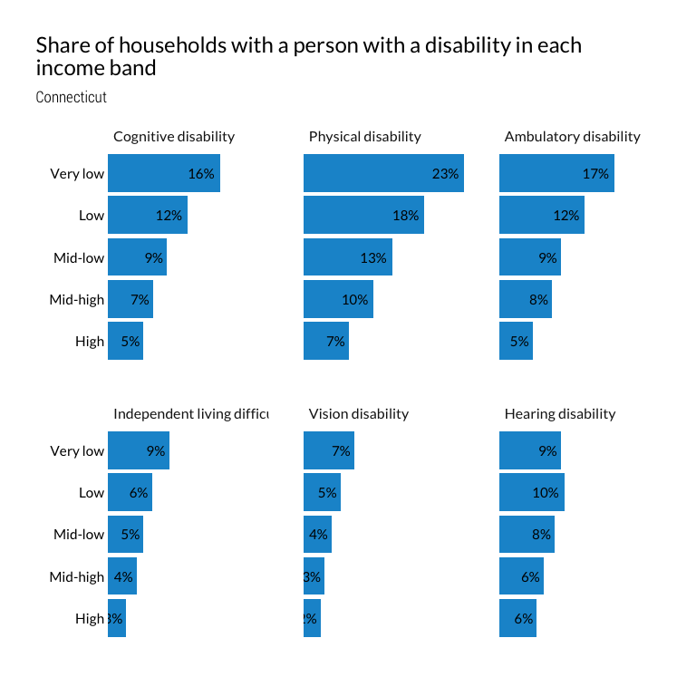

Split out disability analysis from households desiring housing
================

Tl;dr for code below: I’m making some sociodemographic groups here,
including race (white, Black, Latino, Other), some income groups (very
low, low, mid low, mid high, high) based on median household income, and
cost burden (no burden, cost burden, severe cost burden).

``` r
minc <- get_acs(
    geography = "county",
      table = "B19013",
    state = 09,
      cache_table = T) %>% 
    arrange(GEOID) %>% 
    mutate(countyfip = seq(from = 1, to = 15, by = 2),
                 name = str_remove(NAME, ", Connecticut")) %>% 
    select(countyfip, name, minc = estimate)

ddi <- read_ipums_ddi("../input_data/usa_00043.xml")

pums <- read_ipums_micro(ddi, verbose = F)  %>% 
    mutate_at(vars(YEAR, OWNERSHP, OWNERSHPD, RACE, RACED, HISPAN, HISPAND, DIFFREM, DIFFPHYS, DIFFMOB, DIFFCARE, DIFFEYE, DIFFHEAR), as_factor) %>% 
    mutate_at(vars(PERWT, HHWT), as.numeric) %>% 
    mutate_at(vars(HHINCOME, OWNCOST, RENTGRS, OCC), as.integer) %>% 
    mutate(PUMA = str_pad(PUMA, 5, side = c("left"), pad = "0")) %>% 
    janitor::clean_names() %>% 
    left_join(minc, by = "countyfip") %>% 
    mutate(ratio = hhincome / minc) %>% 
    mutate(
        inc_band = cut(
            ratio,
            breaks = c(-Inf, 0.3, 0.5, .8, 1.2, Inf),
            labels = c("Very low", "Low", "Mid-low", "Mid-high", "High"),
            include.lowest = T, right = T)) %>% 
    mutate(
        inc_band = as.factor(inc_band) %>%
            fct_relevel(., "Very low", "Low", "Mid-low", "Mid-high", "High")) %>% 
    mutate(cb = if_else(ownershp == "Rented", (rentgrs * 12) / hhincome, 99999)) %>% 
    mutate(cb = if_else(ownershp == "Owned or being bought (loan)", (owncost * 12) / hhincome, cb)) %>%
    # if housing cost is 0 and income is 0, no burden
    mutate(cb = if_else((rentgrs == 0 & hhincome == 0), 0, cb)) %>%
    mutate(cb = if_else((owncost == 0 & hhincome == 0), 0, cb)) %>%
    #if income is <=0 and housing cost is >0, burden
    mutate(cb = if_else((rentgrs > 0 & hhincome <= 0), 1, cb)) %>%
    mutate(cb = if_else((owncost > 0 & hhincome <= 0), 1, cb)) %>%
    # some people pay more than 100% income to housing, but I will code these as 1
    mutate(cb = if_else(cb > 1, 1, cb)) %>%
    mutate(
        cost_burden = cut(
            cb,
            breaks = c(-Inf, .3, .5, Inf),
            labels = c("No burden", "Cost-burdened", "Severely cost-burdened"),
            include.lowest = T, right = F)) %>% 
        mutate(race2 = if_else(hispan == "Not Hispanic", as.character(race), "Latino")) %>% 
    mutate(race2 = as.factor(race2) %>% 
                    fct_recode(Black = "Black/African American/Negro") %>%
                    fct_other(keep = c("White", "Black", "Latino"), other_level = "Other race") %>%
                    fct_relevel("White", "Black", "Latino", "Other race"))
```

``` r
#logical flag for any disability
pums$has_disability <- apply(pums, 1, function(x) any(grep("Has|Yes", x)))
```

We want 6 categories to group by. These are recorded in the PUMS data as
below:

  - DIFFREM = cognitive disability
  - DIFFPHYS = physical disability
  - DIFFMOB = ambulatory disability
  - DIFFCARE = self care/idependent living difficuly
  - DIFFEYE = vision disability
  - DIFFHEAR = hearing disability

I think the approach I would use is to turn each of those columns into
Y/N or T/F rather than “Has (disability)” whatever text label they use.

``` r
# John
# I am regarding N/A as no disability -- revisit?
# I'm not sure what N/A means, but let's keep it as only yes if answer in the affirmative, like you have it. - kd
# actually, changing this to make NA's FALSE. I don't think it'll change the counts as we have them but this aligns with how I did it - kd
pums$diffrem_TF <- ifelse(str_detect(pums$diffrem, "N/A"), F, 
                          str_detect(pums$diffrem, "Has"))
pums$diffphys_TF <- ifelse(str_detect(pums$diffphys, "N/A"), F, 
                          str_detect(pums$diffphys, "Has")) 
pums$diffmob_TF <- ifelse(str_detect(pums$diffmob, "N/A"), F, 
                          str_detect(pums$diffmob, "Has")) 
pums$diffcare_TF <- ifelse(str_detect(pums$diffcare, "N/A"), F, 
                          str_detect(pums$diffcare, "Yes")) 
pums$diffeye_TF <- ifelse(str_detect(pums$diffeye, "N/A"), F, 
                          str_detect(pums$diffeye, "Yes")) 
pums$diffhear_TF <- ifelse(str_detect(pums$diffhear, "N/A"), F, 
                          str_detect(pums$diffhear, "Yes")) 
pums$disability_sum <- pums %>% 
  select(diffrem_TF:diffhear_TF) %>% 
  apply(1, sum, na.rm=TRUE)
```

The chunk below pulls the data together by creating a LUT of households
with any occupant with a disability, so we only count the household
once. You’ll need to set it up so we count each household only once per
disability type. In other words, we can have a household counted more
than once if they have an occupant with more than one disability type,
or if they have multiple occupants with different disabilities.

``` r
des <- pums %>%
    filter(pernum == "1", hhincome != 9999999, ownershp != "N/A") %>%
    as_survey_design(., ids = 1, wt = hhwt)

county_hhlds <- des %>%
    select(hhwt, name, inc_band) %>% 
    group_by(name, inc_band) %>% 
    summarise(value = survey_total(hhwt))

ct_hhlds <- des %>%
    select(hhwt, statefip, inc_band) %>% 
    group_by(statefip, inc_band) %>% 
    summarise(value = survey_total(hhwt)) %>% 
    ungroup() %>% 
    mutate(name = "Connecticut") %>% 
    select(-statefip)

hh_w_disability <- pums %>%
    filter(has_disability == T) %>% 
    select(cbserial) %>% #cbserial is the hh code
    unique()

ct_inc_band_disability <- des %>% 
    mutate(disability = if_else(cbserial %in% hh_w_disability$cbserial, T, F)) %>% 
    select(hhwt, inc_band, disability) %>% 
    mutate(name = "Connecticut") %>% 
    group_by(name, inc_band, disability) %>% 
    summarise(value = survey_total(hhwt)) %>% 
    ungroup() %>% 
    group_by(name, inc_band)

county_inc_band_disability <- des %>% 
    mutate(disability = if_else(cbserial %in% hh_w_disability$cbserial, T, F)) %>% 
    select(hhwt, name, inc_band, disability) %>% 
    group_by(name, inc_band, disability) %>% 
    summarise(value = survey_total(hhwt)) %>% 
    ungroup() %>% 
    group_by(name, inc_band)

ct_total_disability <- ct_inc_band_disability %>% 
    select(-value_se) %>% 
  ungroup() %>% 
    mutate(inc_band = "Total") %>% 
    group_by(name, inc_band, disability) %>% 
    summarise(value = sum(value))

county_total_disability <- county_inc_band_disability %>% 
    select(-value_se) %>% 
  ungroup() %>% 
    mutate(inc_band = "Total") %>% 
    group_by(name, inc_band, disability) %>% 
    summarise(value = sum(value))

ct_inc_band_disability <- ct_inc_band_disability %>% 
    bind_rows(ct_total_disability)

hh_disability_county_inc_band <- bind_rows(ct_hhlds, ct_inc_band_disability, county_hhlds, county_inc_band_disability) %>% 
    mutate(disability = as.character(disability),
                 disability = if_else(is.na(disability), "TOTAL", disability)) %>% 
    ungroup() %>% 
    group_by(name, inc_band) %>% 
    calc_shares(group = disability, denom = "TOTAL", value = value, moe = value_se)

write_csv(hh_disability_county_inc_band, "../output_data/hh_w_disability_by_county_and_inc_band.csv")
```

Filters in des limit to just HOH, when we really need to be looking at
all occupants before filtering, so here’s a different approach. Keeping
everything split out for now because I have a hunch we’ll want to
combine some of these types

``` r
#fake design, subset dataset
x <- pums %>% 
    filter(hhincome != 9999999, ownershp != "N/A") %>%
    select(cbserial, hhwt, inc_band, ends_with("TF"))

#numerators come from these
diffrem <- x %>% 
    filter(diffrem_TF == T) %>% 
    select(cbserial, hhwt, inc_band) %>% 
    mutate(disability_type = "diffrem") %>% 
    unique() %>% 
    select(-cbserial) %>% 
    group_by(inc_band, disability_type) %>% 
    summarise(households = sum(hhwt)) %>% 
    ungroup()

diffphys <- x %>% 
    filter(diffphys_TF == T) %>% 
    select(cbserial, hhwt, inc_band) %>% 
    mutate(disability_type = "diffphys") %>% 
    unique() %>% 
    select(-cbserial) %>% 
    group_by(inc_band, disability_type) %>% 
    summarise(households = sum(hhwt)) %>% 
    ungroup()

diffmob <- x %>% 
    filter(diffmob_TF == T) %>% 
    select(cbserial, hhwt, inc_band) %>% 
    mutate(disability_type = "diffmob") %>% 
    unique() %>% 
    select(-cbserial) %>% 
    group_by(inc_band, disability_type) %>% 
    summarise(households = sum(hhwt)) %>% 
    ungroup()

diffcare <- x %>% 
    filter(diffcare_TF == T) %>% 
    select(cbserial, hhwt, inc_band) %>% 
    mutate(disability_type = "diffcare") %>% 
    unique() %>% 
    select(-cbserial) %>% 
    group_by(inc_band, disability_type) %>% 
    summarise(households = sum(hhwt)) %>% 
    ungroup()

diffeye <- x %>% 
    filter(diffeye_TF == T) %>% 
    select(cbserial, hhwt, inc_band) %>% 
    mutate(disability_type = "diffeye") %>% 
    unique() %>% 
    select(-cbserial) %>% 
    group_by(inc_band, disability_type) %>% 
    summarise(households = sum(hhwt)) %>% 
    ungroup()

diffhear <- x %>% 
    filter(diffhear_TF == T) %>% 
    select(cbserial, hhwt, inc_band) %>% 
    mutate(disability_type = "diffhear") %>% 
    unique() %>% 
    select(-cbserial) %>% 
    group_by(inc_band, disability_type) %>% 
    summarise(households = sum(hhwt)) %>% 
    ungroup()

hh_disabilities_by_type <- bind_rows(diffcare, diffeye, diffhear, diffmob, diffphys, diffrem)

write_csv(hh_disabilities_by_type, "../output_data/hh_disabilities_type.csv")
```

``` r
kable(hh_disabilities_by_type)
```

<table>

<thead>

<tr>

<th style="text-align:left;">

inc\_band

</th>

<th style="text-align:left;">

disability\_type

</th>

<th style="text-align:right;">

households

</th>

</tr>

</thead>

<tbody>

<tr>

<td style="text-align:left;">

Very low

</td>

<td style="text-align:left;">

diffcare

</td>

<td style="text-align:right;">

18511

</td>

</tr>

<tr>

<td style="text-align:left;">

Low

</td>

<td style="text-align:left;">

diffcare

</td>

<td style="text-align:right;">

10089

</td>

</tr>

<tr>

<td style="text-align:left;">

Mid-low

</td>

<td style="text-align:left;">

diffcare

</td>

<td style="text-align:right;">

11294

</td>

</tr>

<tr>

<td style="text-align:left;">

Mid-high

</td>

<td style="text-align:left;">

diffcare

</td>

<td style="text-align:right;">

9865

</td>

</tr>

<tr>

<td style="text-align:left;">

High

</td>

<td style="text-align:left;">

diffcare

</td>

<td style="text-align:right;">

14693

</td>

</tr>

<tr>

<td style="text-align:left;">

Very low

</td>

<td style="text-align:left;">

diffeye

</td>

<td style="text-align:right;">

15523

</td>

</tr>

<tr>

<td style="text-align:left;">

Low

</td>

<td style="text-align:left;">

diffeye

</td>

<td style="text-align:right;">

8524

</td>

</tr>

<tr>

<td style="text-align:left;">

Mid-low

</td>

<td style="text-align:left;">

diffeye

</td>

<td style="text-align:right;">

8899

</td>

</tr>

<tr>

<td style="text-align:left;">

Mid-high

</td>

<td style="text-align:left;">

diffeye

</td>

<td style="text-align:right;">

7409

</td>

</tr>

<tr>

<td style="text-align:left;">

High

</td>

<td style="text-align:left;">

diffeye

</td>

<td style="text-align:right;">

13433

</td>

</tr>

<tr>

<td style="text-align:left;">

Very low

</td>

<td style="text-align:left;">

diffhear

</td>

<td style="text-align:right;">

18802

</td>

</tr>

<tr>

<td style="text-align:left;">

Low

</td>

<td style="text-align:left;">

diffhear

</td>

<td style="text-align:right;">

14928

</td>

</tr>

<tr>

<td style="text-align:left;">

Mid-low

</td>

<td style="text-align:left;">

diffhear

</td>

<td style="text-align:right;">

17640

</td>

</tr>

<tr>

<td style="text-align:left;">

Mid-high

</td>

<td style="text-align:left;">

diffhear

</td>

<td style="text-align:right;">

15366

</td>

</tr>

<tr>

<td style="text-align:left;">

High

</td>

<td style="text-align:left;">

diffhear

</td>

<td style="text-align:right;">

29851

</td>

</tr>

<tr>

<td style="text-align:left;">

Very low

</td>

<td style="text-align:left;">

diffmob

</td>

<td style="text-align:right;">

34983

</td>

</tr>

<tr>

<td style="text-align:left;">

Low

</td>

<td style="text-align:left;">

diffmob

</td>

<td style="text-align:right;">

19555

</td>

</tr>

<tr>

<td style="text-align:left;">

Mid-low

</td>

<td style="text-align:left;">

diffmob

</td>

<td style="text-align:right;">

19630

</td>

</tr>

<tr>

<td style="text-align:left;">

Mid-high

</td>

<td style="text-align:left;">

diffmob

</td>

<td style="text-align:right;">

18177

</td>

</tr>

<tr>

<td style="text-align:left;">

High

</td>

<td style="text-align:left;">

diffmob

</td>

<td style="text-align:right;">

26539

</td>

</tr>

<tr>

<td style="text-align:left;">

Very low

</td>

<td style="text-align:left;">

diffphys

</td>

<td style="text-align:right;">

48761

</td>

</tr>

<tr>

<td style="text-align:left;">

Low

</td>

<td style="text-align:left;">

diffphys

</td>

<td style="text-align:right;">

27631

</td>

</tr>

<tr>

<td style="text-align:left;">

Mid-low

</td>

<td style="text-align:left;">

diffphys

</td>

<td style="text-align:right;">

28115

</td>

</tr>

<tr>

<td style="text-align:left;">

Mid-high

</td>

<td style="text-align:left;">

diffphys

</td>

<td style="text-align:right;">

24274

</td>

</tr>

<tr>

<td style="text-align:left;">

High

</td>

<td style="text-align:left;">

diffphys

</td>

<td style="text-align:right;">

35931

</td>

</tr>

<tr>

<td style="text-align:left;">

Very low

</td>

<td style="text-align:left;">

diffrem

</td>

<td style="text-align:right;">

33941

</td>

</tr>

<tr>

<td style="text-align:left;">

Low

</td>

<td style="text-align:left;">

diffrem

</td>

<td style="text-align:right;">

18142

</td>

</tr>

<tr>

<td style="text-align:left;">

Mid-low

</td>

<td style="text-align:left;">

diffrem

</td>

<td style="text-align:right;">

18660

</td>

</tr>

<tr>

<td style="text-align:left;">

Mid-high

</td>

<td style="text-align:left;">

diffrem

</td>

<td style="text-align:right;">

15642

</td>

</tr>

<tr>

<td style="text-align:left;">

High

</td>

<td style="text-align:left;">

diffrem

</td>

<td style="text-align:right;">

28592

</td>

</tr>

</tbody>

</table>

``` r
kable(ct_inc_band_disability)
```

<table>

<thead>

<tr>

<th style="text-align:left;">

name

</th>

<th style="text-align:left;">

inc\_band

</th>

<th style="text-align:left;">

disability

</th>

<th style="text-align:right;">

value

</th>

<th style="text-align:right;">

value\_se

</th>

</tr>

</thead>

<tbody>

<tr>

<td style="text-align:left;">

Connecticut

</td>

<td style="text-align:left;">

Very low

</td>

<td style="text-align:left;">

FALSE

</td>

<td style="text-align:right;">

129374

</td>

<td style="text-align:right;">

1967.685

</td>

</tr>

<tr>

<td style="text-align:left;">

Connecticut

</td>

<td style="text-align:left;">

Very low

</td>

<td style="text-align:left;">

TRUE

</td>

<td style="text-align:right;">

79356

</td>

<td style="text-align:right;">

1535.240

</td>

</tr>

<tr>

<td style="text-align:left;">

Connecticut

</td>

<td style="text-align:left;">

Low

</td>

<td style="text-align:left;">

FALSE

</td>

<td style="text-align:right;">

109978

</td>

<td style="text-align:right;">

1819.218

</td>

</tr>

<tr>

<td style="text-align:left;">

Connecticut

</td>

<td style="text-align:left;">

Low

</td>

<td style="text-align:left;">

TRUE

</td>

<td style="text-align:right;">

46827

</td>

<td style="text-align:right;">

1129.625

</td>

</tr>

<tr>

<td style="text-align:left;">

Connecticut

</td>

<td style="text-align:left;">

Mid-low

</td>

<td style="text-align:left;">

FALSE

</td>

<td style="text-align:right;">

167020

</td>

<td style="text-align:right;">

2224.340

</td>

</tr>

<tr>

<td style="text-align:left;">

Connecticut

</td>

<td style="text-align:left;">

Mid-low

</td>

<td style="text-align:left;">

TRUE

</td>

<td style="text-align:right;">

50579

</td>

<td style="text-align:right;">

1160.504

</td>

</tr>

<tr>

<td style="text-align:left;">

Connecticut

</td>

<td style="text-align:left;">

Mid-high

</td>

<td style="text-align:left;">

FALSE

</td>

<td style="text-align:right;">

192055

</td>

<td style="text-align:right;">

2263.915

</td>

</tr>

<tr>

<td style="text-align:left;">

Connecticut

</td>

<td style="text-align:left;">

Mid-high

</td>

<td style="text-align:left;">

TRUE

</td>

<td style="text-align:right;">

45452

</td>

<td style="text-align:right;">

1063.275

</td>

</tr>

<tr>

<td style="text-align:left;">

Connecticut

</td>

<td style="text-align:left;">

High

</td>

<td style="text-align:left;">

FALSE

</td>

<td style="text-align:right;">

466501

</td>

<td style="text-align:right;">

2986.797

</td>

</tr>

<tr>

<td style="text-align:left;">

Connecticut

</td>

<td style="text-align:left;">

High

</td>

<td style="text-align:left;">

TRUE

</td>

<td style="text-align:right;">

80232

</td>

<td style="text-align:right;">

1329.886

</td>

</tr>

<tr>

<td style="text-align:left;">

Connecticut

</td>

<td style="text-align:left;">

Total

</td>

<td style="text-align:left;">

FALSE

</td>

<td style="text-align:right;">

1064928

</td>

<td style="text-align:right;">

NA

</td>

</tr>

<tr>

<td style="text-align:left;">

Connecticut

</td>

<td style="text-align:left;">

Total

</td>

<td style="text-align:left;">

TRUE

</td>

<td style="text-align:right;">

302446

</td>

<td style="text-align:right;">

NA

</td>

</tr>

</tbody>

</table>

``` r
hh_disabilities_count_share <- ct_hhlds %>% 
    ungroup() %>% 
    mutate(disability_type = "total") %>% 
    select(inc_band, disability_type, households = value) %>% 
    bind_rows(hh_disabilities_by_type) %>% 
    group_by(inc_band) %>% 
    calc_shares(group = disability_type, denom = "total", value = households)

write_csv(hh_disabilities_count_share, "../output_data/hh_disabilities_type_count_share.csv")
```

Taking a slightly different look than the table above, the plot below
shows the share of households in each income band that have an occupant
with a disability (so the numerator is households with an occupant with
a disability in a given income band, and the denominator is all
households in that income band).

While the High band has the most (by count) households with an occupant
with a disability, it has the smallest share.

**I think we might want a plot faceted by disability type.**

<!-- -->

<!-- -->

Finally, what are the average cost burden rates for households with an
occupant with a disability?

``` r
ct_cost_ratio_inc_band_disability <- pums %>% 
    mutate(disability = if_else(cbserial %in% hh_w_disability$cbserial, T, F)) %>% 
    filter(pernum == "1", hhincome != 9999999, ownershp != "N/A") %>% 
    select(hhwt, inc_band, disability, cb) %>% 
    mutate(mult = cb * hhwt) %>% 
    group_by(inc_band, disability) %>% 
    summarise(avg_cost_ratio = sum(mult) / sum(hhwt)) %>% 
    ungroup() %>% 
    mutate(name = "Connecticut")
```

Read this chart as: “Households with an occupant with a disability in
the Very Low cost band spend, on average, 66% of household income on
housing costs.”

So the average cost ratio for households with an occupant with a
disability is slightly lower than households without a disabled
occupant, but the general trends in cost ratio across the cost bands
still hold.

**I think this chart is fine as it is, and I just included it so this
notebook has all the disability tabulations in it.**

<!-- -->

## Add table and plot of households with any member with a disability by income band and county.

<!-- -->

``` r
hh_disability_county_inc_band %>% 
    filter(disability != "TOTAL") %>% 
    mutate(value_se = round(value_se, 0)) %>% 
    select(name, income_band = inc_band, occupant_w_disability = disability, households = value, households_se = value_se, share) %>% 
    kable()
```

<table>

<thead>

<tr>

<th style="text-align:left;">

name

</th>

<th style="text-align:left;">

income\_band

</th>

<th style="text-align:left;">

occupant\_w\_disability

</th>

<th style="text-align:right;">

households

</th>

<th style="text-align:right;">

households\_se

</th>

<th style="text-align:right;">

share

</th>

</tr>

</thead>

<tbody>

<tr>

<td style="text-align:left;">

Connecticut

</td>

<td style="text-align:left;">

High

</td>

<td style="text-align:left;">

FALSE

</td>

<td style="text-align:right;">

466501

</td>

<td style="text-align:right;">

2987

</td>

<td style="text-align:right;">

0.853

</td>

</tr>

<tr>

<td style="text-align:left;">

Connecticut

</td>

<td style="text-align:left;">

High

</td>

<td style="text-align:left;">

TRUE

</td>

<td style="text-align:right;">

80232

</td>

<td style="text-align:right;">

1330

</td>

<td style="text-align:right;">

0.147

</td>

</tr>

<tr>

<td style="text-align:left;">

Connecticut

</td>

<td style="text-align:left;">

Low

</td>

<td style="text-align:left;">

FALSE

</td>

<td style="text-align:right;">

109978

</td>

<td style="text-align:right;">

1819

</td>

<td style="text-align:right;">

0.701

</td>

</tr>

<tr>

<td style="text-align:left;">

Connecticut

</td>

<td style="text-align:left;">

Low

</td>

<td style="text-align:left;">

TRUE

</td>

<td style="text-align:right;">

46827

</td>

<td style="text-align:right;">

1130

</td>

<td style="text-align:right;">

0.299

</td>

</tr>

<tr>

<td style="text-align:left;">

Connecticut

</td>

<td style="text-align:left;">

Mid-high

</td>

<td style="text-align:left;">

FALSE

</td>

<td style="text-align:right;">

192055

</td>

<td style="text-align:right;">

2264

</td>

<td style="text-align:right;">

0.809

</td>

</tr>

<tr>

<td style="text-align:left;">

Connecticut

</td>

<td style="text-align:left;">

Mid-high

</td>

<td style="text-align:left;">

TRUE

</td>

<td style="text-align:right;">

45452

</td>

<td style="text-align:right;">

1063

</td>

<td style="text-align:right;">

0.191

</td>

</tr>

<tr>

<td style="text-align:left;">

Connecticut

</td>

<td style="text-align:left;">

Mid-low

</td>

<td style="text-align:left;">

FALSE

</td>

<td style="text-align:right;">

167020

</td>

<td style="text-align:right;">

2224

</td>

<td style="text-align:right;">

0.768

</td>

</tr>

<tr>

<td style="text-align:left;">

Connecticut

</td>

<td style="text-align:left;">

Mid-low

</td>

<td style="text-align:left;">

TRUE

</td>

<td style="text-align:right;">

50579

</td>

<td style="text-align:right;">

1161

</td>

<td style="text-align:right;">

0.232

</td>

</tr>

<tr>

<td style="text-align:left;">

Connecticut

</td>

<td style="text-align:left;">

Very low

</td>

<td style="text-align:left;">

FALSE

</td>

<td style="text-align:right;">

129374

</td>

<td style="text-align:right;">

1968

</td>

<td style="text-align:right;">

0.620

</td>

</tr>

<tr>

<td style="text-align:left;">

Connecticut

</td>

<td style="text-align:left;">

Very low

</td>

<td style="text-align:left;">

TRUE

</td>

<td style="text-align:right;">

79356

</td>

<td style="text-align:right;">

1535

</td>

<td style="text-align:right;">

0.380

</td>

</tr>

<tr>

<td style="text-align:left;">

Fairfield County

</td>

<td style="text-align:left;">

High

</td>

<td style="text-align:left;">

FALSE

</td>

<td style="text-align:right;">

121401

</td>

<td style="text-align:right;">

1621

</td>

<td style="text-align:right;">

0.873

</td>

</tr>

<tr>

<td style="text-align:left;">

Fairfield County

</td>

<td style="text-align:left;">

High

</td>

<td style="text-align:left;">

TRUE

</td>

<td style="text-align:right;">

17730

</td>

<td style="text-align:right;">

621

</td>

<td style="text-align:right;">

0.127

</td>

</tr>

<tr>

<td style="text-align:left;">

Fairfield County

</td>

<td style="text-align:left;">

Low

</td>

<td style="text-align:left;">

FALSE

</td>

<td style="text-align:right;">

29597

</td>

<td style="text-align:right;">

966

</td>

<td style="text-align:right;">

0.738

</td>

</tr>

<tr>

<td style="text-align:left;">

Fairfield County

</td>

<td style="text-align:left;">

Low

</td>

<td style="text-align:left;">

TRUE

</td>

<td style="text-align:right;">

10491

</td>

<td style="text-align:right;">

536

</td>

<td style="text-align:right;">

0.262

</td>

</tr>

<tr>

<td style="text-align:left;">

Fairfield County

</td>

<td style="text-align:left;">

Mid-high

</td>

<td style="text-align:left;">

FALSE

</td>

<td style="text-align:right;">

45138

</td>

<td style="text-align:right;">

1125

</td>

<td style="text-align:right;">

0.837

</td>

</tr>

<tr>

<td style="text-align:left;">

Fairfield County

</td>

<td style="text-align:left;">

Mid-high

</td>

<td style="text-align:left;">

TRUE

</td>

<td style="text-align:right;">

8800

</td>

<td style="text-align:right;">

453

</td>

<td style="text-align:right;">

0.163

</td>

</tr>

<tr>

<td style="text-align:left;">

Fairfield County

</td>

<td style="text-align:left;">

Mid-low

</td>

<td style="text-align:left;">

FALSE

</td>

<td style="text-align:right;">

39394

</td>

<td style="text-align:right;">

1073

</td>

<td style="text-align:right;">

0.782

</td>

</tr>

<tr>

<td style="text-align:left;">

Fairfield County

</td>

<td style="text-align:left;">

Mid-low

</td>

<td style="text-align:left;">

TRUE

</td>

<td style="text-align:right;">

10957

</td>

<td style="text-align:right;">

518

</td>

<td style="text-align:right;">

0.218

</td>

</tr>

<tr>

<td style="text-align:left;">

Fairfield County

</td>

<td style="text-align:left;">

Very low

</td>

<td style="text-align:left;">

FALSE

</td>

<td style="text-align:right;">

37123

</td>

<td style="text-align:right;">

1091

</td>

<td style="text-align:right;">

0.651

</td>

</tr>

<tr>

<td style="text-align:left;">

Fairfield County

</td>

<td style="text-align:left;">

Very low

</td>

<td style="text-align:left;">

TRUE

</td>

<td style="text-align:right;">

19861

</td>

<td style="text-align:right;">

778

</td>

<td style="text-align:right;">

0.349

</td>

</tr>

<tr>

<td style="text-align:left;">

Hartford County

</td>

<td style="text-align:left;">

High

</td>

<td style="text-align:left;">

FALSE

</td>

<td style="text-align:right;">

117073

</td>

<td style="text-align:right;">

1657

</td>

<td style="text-align:right;">

0.849

</td>

</tr>

<tr>

<td style="text-align:left;">

Hartford County

</td>

<td style="text-align:left;">

High

</td>

<td style="text-align:left;">

TRUE

</td>

<td style="text-align:right;">

20833

</td>

<td style="text-align:right;">

694

</td>

<td style="text-align:right;">

0.151

</td>

</tr>

<tr>

<td style="text-align:left;">

Hartford County

</td>

<td style="text-align:left;">

Low

</td>

<td style="text-align:left;">

FALSE

</td>

<td style="text-align:right;">

26717

</td>

<td style="text-align:right;">

876

</td>

<td style="text-align:right;">

0.684

</td>

</tr>

<tr>

<td style="text-align:left;">

Hartford County

</td>

<td style="text-align:left;">

Low

</td>

<td style="text-align:left;">

TRUE

</td>

<td style="text-align:right;">

12354

</td>

<td style="text-align:right;">

572

</td>

<td style="text-align:right;">

0.316

</td>

</tr>

<tr>

<td style="text-align:left;">

Hartford County

</td>

<td style="text-align:left;">

Mid-high

</td>

<td style="text-align:left;">

FALSE

</td>

<td style="text-align:right;">

49461

</td>

<td style="text-align:right;">

1171

</td>

<td style="text-align:right;">

0.811

</td>

</tr>

<tr>

<td style="text-align:left;">

Hartford County

</td>

<td style="text-align:left;">

Mid-high

</td>

<td style="text-align:left;">

TRUE

</td>

<td style="text-align:right;">

11553

</td>

<td style="text-align:right;">

542

</td>

<td style="text-align:right;">

0.189

</td>

</tr>

<tr>

<td style="text-align:left;">

Hartford County

</td>

<td style="text-align:left;">

Mid-low

</td>

<td style="text-align:left;">

FALSE

</td>

<td style="text-align:right;">

42690

</td>

<td style="text-align:right;">

1143

</td>

<td style="text-align:right;">

0.762

</td>

</tr>

<tr>

<td style="text-align:left;">

Hartford County

</td>

<td style="text-align:left;">

Mid-low

</td>

<td style="text-align:left;">

TRUE

</td>

<td style="text-align:right;">

13331

</td>

<td style="text-align:right;">

592

</td>

<td style="text-align:right;">

0.238

</td>

</tr>

<tr>

<td style="text-align:left;">

Hartford County

</td>

<td style="text-align:left;">

Very low

</td>

<td style="text-align:left;">

FALSE

</td>

<td style="text-align:right;">

32631

</td>

<td style="text-align:right;">

969

</td>

<td style="text-align:right;">

0.593

</td>

</tr>

<tr>

<td style="text-align:left;">

Hartford County

</td>

<td style="text-align:left;">

Very low

</td>

<td style="text-align:left;">

TRUE

</td>

<td style="text-align:right;">

22420

</td>

<td style="text-align:right;">

822

</td>

<td style="text-align:right;">

0.407

</td>

</tr>

<tr>

<td style="text-align:left;">

Litchfield County

</td>

<td style="text-align:left;">

High

</td>

<td style="text-align:left;">

FALSE

</td>

<td style="text-align:right;">

24929

</td>

<td style="text-align:right;">

772

</td>

<td style="text-align:right;">

0.856

</td>

</tr>

<tr>

<td style="text-align:left;">

Litchfield County

</td>

<td style="text-align:left;">

High

</td>

<td style="text-align:left;">

TRUE

</td>

<td style="text-align:right;">

4201

</td>

<td style="text-align:right;">

299

</td>

<td style="text-align:right;">

0.144

</td>

</tr>

<tr>

<td style="text-align:left;">

Litchfield County

</td>

<td style="text-align:left;">

Low

</td>

<td style="text-align:left;">

FALSE

</td>

<td style="text-align:right;">

5825

</td>

<td style="text-align:right;">

393

</td>

<td style="text-align:right;">

0.667

</td>

</tr>

<tr>

<td style="text-align:left;">

Litchfield County

</td>

<td style="text-align:left;">

Low

</td>

<td style="text-align:left;">

TRUE

</td>

<td style="text-align:right;">

2908

</td>

<td style="text-align:right;">

283

</td>

<td style="text-align:right;">

0.333

</td>

</tr>

<tr>

<td style="text-align:left;">

Litchfield County

</td>

<td style="text-align:left;">

Mid-high

</td>

<td style="text-align:left;">

FALSE

</td>

<td style="text-align:right;">

12016

</td>

<td style="text-align:right;">

547

</td>

<td style="text-align:right;">

0.820

</td>

</tr>

<tr>

<td style="text-align:left;">

Litchfield County

</td>

<td style="text-align:left;">

Mid-high

</td>

<td style="text-align:left;">

TRUE

</td>

<td style="text-align:right;">

2635

</td>

<td style="text-align:right;">

222

</td>

<td style="text-align:right;">

0.180

</td>

</tr>

<tr>

<td style="text-align:left;">

Litchfield County

</td>

<td style="text-align:left;">

Mid-low

</td>

<td style="text-align:left;">

FALSE

</td>

<td style="text-align:right;">

9582

</td>

<td style="text-align:right;">

503

</td>

<td style="text-align:right;">

0.759

</td>

</tr>

<tr>

<td style="text-align:left;">

Litchfield County

</td>

<td style="text-align:left;">

Mid-low

</td>

<td style="text-align:left;">

TRUE

</td>

<td style="text-align:right;">

3044

</td>

<td style="text-align:right;">

267

</td>

<td style="text-align:right;">

0.241

</td>

</tr>

<tr>

<td style="text-align:left;">

Litchfield County

</td>

<td style="text-align:left;">

Very low

</td>

<td style="text-align:left;">

FALSE

</td>

<td style="text-align:right;">

5630

</td>

<td style="text-align:right;">

374

</td>

<td style="text-align:right;">

0.636

</td>

</tr>

<tr>

<td style="text-align:left;">

Litchfield County

</td>

<td style="text-align:left;">

Very low

</td>

<td style="text-align:left;">

TRUE

</td>

<td style="text-align:right;">

3217

</td>

<td style="text-align:right;">

287

</td>

<td style="text-align:right;">

0.364

</td>

</tr>

<tr>

<td style="text-align:left;">

Middlesex County

</td>

<td style="text-align:left;">

High

</td>

<td style="text-align:left;">

FALSE

</td>

<td style="text-align:right;">

23205

</td>

<td style="text-align:right;">

791

</td>

<td style="text-align:right;">

0.869

</td>

</tr>

<tr>

<td style="text-align:left;">

Middlesex County

</td>

<td style="text-align:left;">

High

</td>

<td style="text-align:left;">

TRUE

</td>

<td style="text-align:right;">

3511

</td>

<td style="text-align:right;">

289

</td>

<td style="text-align:right;">

0.131

</td>

</tr>

<tr>

<td style="text-align:left;">

Middlesex County

</td>

<td style="text-align:left;">

Low

</td>

<td style="text-align:left;">

FALSE

</td>

<td style="text-align:right;">

5082

</td>

<td style="text-align:right;">

412

</td>

<td style="text-align:right;">

0.671

</td>

</tr>

<tr>

<td style="text-align:left;">

Middlesex County

</td>

<td style="text-align:left;">

Low

</td>

<td style="text-align:left;">

TRUE

</td>

<td style="text-align:right;">

2493

</td>

<td style="text-align:right;">

256

</td>

<td style="text-align:right;">

0.329

</td>

</tr>

<tr>

<td style="text-align:left;">

Middlesex County

</td>

<td style="text-align:left;">

Mid-high

</td>

<td style="text-align:left;">

FALSE

</td>

<td style="text-align:right;">

9932

</td>

<td style="text-align:right;">

504

</td>

<td style="text-align:right;">

0.814

</td>

</tr>

<tr>

<td style="text-align:left;">

Middlesex County

</td>

<td style="text-align:left;">

Mid-high

</td>

<td style="text-align:left;">

TRUE

</td>

<td style="text-align:right;">

2273

</td>

<td style="text-align:right;">

256

</td>

<td style="text-align:right;">

0.186

</td>

</tr>

<tr>

<td style="text-align:left;">

Middlesex County

</td>

<td style="text-align:left;">

Mid-low

</td>

<td style="text-align:left;">

FALSE

</td>

<td style="text-align:right;">

8518

</td>

<td style="text-align:right;">

533

</td>

<td style="text-align:right;">

0.785

</td>

</tr>

<tr>

<td style="text-align:left;">

Middlesex County

</td>

<td style="text-align:left;">

Mid-low

</td>

<td style="text-align:left;">

TRUE

</td>

<td style="text-align:right;">

2330

</td>

<td style="text-align:right;">

250

</td>

<td style="text-align:right;">

0.215

</td>

</tr>

<tr>

<td style="text-align:left;">

Middlesex County

</td>

<td style="text-align:left;">

Very low

</td>

<td style="text-align:left;">

FALSE

</td>

<td style="text-align:right;">

5849

</td>

<td style="text-align:right;">

440

</td>

<td style="text-align:right;">

0.613

</td>

</tr>

<tr>

<td style="text-align:left;">

Middlesex County

</td>

<td style="text-align:left;">

Very low

</td>

<td style="text-align:left;">

TRUE

</td>

<td style="text-align:right;">

3700

</td>

<td style="text-align:right;">

316

</td>

<td style="text-align:right;">

0.387

</td>

</tr>

<tr>

<td style="text-align:left;">

New Haven County

</td>

<td style="text-align:left;">

High

</td>

<td style="text-align:left;">

FALSE

</td>

<td style="text-align:right;">

112673

</td>

<td style="text-align:right;">

1754

</td>

<td style="text-align:right;">

0.849

</td>

</tr>

<tr>

<td style="text-align:left;">

New Haven County

</td>

<td style="text-align:left;">

High

</td>

<td style="text-align:left;">

TRUE

</td>

<td style="text-align:right;">

20111

</td>

<td style="text-align:right;">

686

</td>

<td style="text-align:right;">

0.151

</td>

</tr>

<tr>

<td style="text-align:left;">

New Haven County

</td>

<td style="text-align:left;">

Low

</td>

<td style="text-align:left;">

FALSE

</td>

<td style="text-align:right;">

26927

</td>

<td style="text-align:right;">

949

</td>

<td style="text-align:right;">

0.700

</td>

</tr>

<tr>

<td style="text-align:left;">

New Haven County

</td>

<td style="text-align:left;">

Low

</td>

<td style="text-align:left;">

TRUE

</td>

<td style="text-align:right;">

11565

</td>

<td style="text-align:right;">

562

</td>

<td style="text-align:right;">

0.300

</td>

</tr>

<tr>

<td style="text-align:left;">

New Haven County

</td>

<td style="text-align:left;">

Mid-high

</td>

<td style="text-align:left;">

FALSE

</td>

<td style="text-align:right;">

44479

</td>

<td style="text-align:right;">

1197

</td>

<td style="text-align:right;">

0.800

</td>

</tr>

<tr>

<td style="text-align:left;">

New Haven County

</td>

<td style="text-align:left;">

Mid-high

</td>

<td style="text-align:left;">

TRUE

</td>

<td style="text-align:right;">

11114

</td>

<td style="text-align:right;">

539

</td>

<td style="text-align:right;">

0.200

</td>

</tr>

<tr>

<td style="text-align:left;">

New Haven County

</td>

<td style="text-align:left;">

Mid-low

</td>

<td style="text-align:left;">

FALSE

</td>

<td style="text-align:right;">

41664

</td>

<td style="text-align:right;">

1212

</td>

<td style="text-align:right;">

0.780

</td>

</tr>

<tr>

<td style="text-align:left;">

New Haven County

</td>

<td style="text-align:left;">

Mid-low

</td>

<td style="text-align:left;">

TRUE

</td>

<td style="text-align:right;">

11734

</td>

<td style="text-align:right;">

583

</td>

<td style="text-align:right;">

0.220

</td>

</tr>

<tr>

<td style="text-align:left;">

New Haven County

</td>

<td style="text-align:left;">

Very low

</td>

<td style="text-align:left;">

FALSE

</td>

<td style="text-align:right;">

31160

</td>

<td style="text-align:right;">

1008

</td>

<td style="text-align:right;">

0.628

</td>

</tr>

<tr>

<td style="text-align:left;">

New Haven County

</td>

<td style="text-align:left;">

Very low

</td>

<td style="text-align:left;">

TRUE

</td>

<td style="text-align:right;">

18429

</td>

<td style="text-align:right;">

752

</td>

<td style="text-align:right;">

0.372

</td>

</tr>

<tr>

<td style="text-align:left;">

New London County

</td>

<td style="text-align:left;">

High

</td>

<td style="text-align:left;">

FALSE

</td>

<td style="text-align:right;">

34703

</td>

<td style="text-align:right;">

898

</td>

<td style="text-align:right;">

0.821

</td>

</tr>

<tr>

<td style="text-align:left;">

New London County

</td>

<td style="text-align:left;">

High

</td>

<td style="text-align:left;">

TRUE

</td>

<td style="text-align:right;">

7589

</td>

<td style="text-align:right;">

428

</td>

<td style="text-align:right;">

0.179

</td>

</tr>

<tr>

<td style="text-align:left;">

New London County

</td>

<td style="text-align:left;">

Low

</td>

<td style="text-align:left;">

FALSE

</td>

<td style="text-align:right;">

8024

</td>

<td style="text-align:right;">

501

</td>

<td style="text-align:right;">

0.694

</td>

</tr>

<tr>

<td style="text-align:left;">

New London County

</td>

<td style="text-align:left;">

Low

</td>

<td style="text-align:left;">

TRUE

</td>

<td style="text-align:right;">

3540

</td>

<td style="text-align:right;">

335

</td>

<td style="text-align:right;">

0.306

</td>

</tr>

<tr>

<td style="text-align:left;">

New London County

</td>

<td style="text-align:left;">

Mid-high

</td>

<td style="text-align:left;">

FALSE

</td>

<td style="text-align:right;">

15721

</td>

<td style="text-align:right;">

670

</td>

<td style="text-align:right;">

0.765

</td>

</tr>

<tr>

<td style="text-align:left;">

New London County

</td>

<td style="text-align:left;">

Mid-high

</td>

<td style="text-align:left;">

TRUE

</td>

<td style="text-align:right;">

4817

</td>

<td style="text-align:right;">

372

</td>

<td style="text-align:right;">

0.235

</td>

</tr>

<tr>

<td style="text-align:left;">

New London County

</td>

<td style="text-align:left;">

Mid-low

</td>

<td style="text-align:left;">

FALSE

</td>

<td style="text-align:right;">

13640

</td>

<td style="text-align:right;">

659

</td>

<td style="text-align:right;">

0.742

</td>

</tr>

<tr>

<td style="text-align:left;">

New London County

</td>

<td style="text-align:left;">

Mid-low

</td>

<td style="text-align:left;">

TRUE

</td>

<td style="text-align:right;">

4744

</td>

<td style="text-align:right;">

362

</td>

<td style="text-align:right;">

0.258

</td>

</tr>

<tr>

<td style="text-align:left;">

New London County

</td>

<td style="text-align:left;">

Very low

</td>

<td style="text-align:left;">

FALSE

</td>

<td style="text-align:right;">

8391

</td>

<td style="text-align:right;">

523

</td>

<td style="text-align:right;">

0.574

</td>

</tr>

<tr>

<td style="text-align:left;">

New London County

</td>

<td style="text-align:left;">

Very low

</td>

<td style="text-align:left;">

TRUE

</td>

<td style="text-align:right;">

6233

</td>

<td style="text-align:right;">

476

</td>

<td style="text-align:right;">

0.426

</td>

</tr>

<tr>

<td style="text-align:left;">

Tolland County

</td>

<td style="text-align:left;">

High

</td>

<td style="text-align:left;">

FALSE

</td>

<td style="text-align:right;">

18505

</td>

<td style="text-align:right;">

730

</td>

<td style="text-align:right;">

0.868

</td>

</tr>

<tr>

<td style="text-align:left;">

Tolland County

</td>

<td style="text-align:left;">

High

</td>

<td style="text-align:left;">

TRUE

</td>

<td style="text-align:right;">

2803

</td>

<td style="text-align:right;">

243

</td>

<td style="text-align:right;">

0.132

</td>

</tr>

<tr>

<td style="text-align:left;">

Tolland County

</td>

<td style="text-align:left;">

Low

</td>

<td style="text-align:left;">

FALSE

</td>

<td style="text-align:right;">

4929

</td>

<td style="text-align:right;">

420

</td>

<td style="text-align:right;">

0.741

</td>

</tr>

<tr>

<td style="text-align:left;">

Tolland County

</td>

<td style="text-align:left;">

Low

</td>

<td style="text-align:left;">

TRUE

</td>

<td style="text-align:right;">

1727

</td>

<td style="text-align:right;">

242

</td>

<td style="text-align:right;">

0.259

</td>

</tr>

<tr>

<td style="text-align:left;">

Tolland County

</td>

<td style="text-align:left;">

Mid-high

</td>

<td style="text-align:left;">

FALSE

</td>

<td style="text-align:right;">

8684

</td>

<td style="text-align:right;">

536

</td>

<td style="text-align:right;">

0.793

</td>

</tr>

<tr>

<td style="text-align:left;">

Tolland County

</td>

<td style="text-align:left;">

Mid-high

</td>

<td style="text-align:left;">

TRUE

</td>

<td style="text-align:right;">

2265

</td>

<td style="text-align:right;">

245

</td>

<td style="text-align:right;">

0.207

</td>

</tr>

<tr>

<td style="text-align:left;">

Tolland County

</td>

<td style="text-align:left;">

Mid-low

</td>

<td style="text-align:left;">

FALSE

</td>

<td style="text-align:right;">

6088

</td>

<td style="text-align:right;">

437

</td>

<td style="text-align:right;">

0.737

</td>

</tr>

<tr>

<td style="text-align:left;">

Tolland County

</td>

<td style="text-align:left;">

Mid-low

</td>

<td style="text-align:left;">

TRUE

</td>

<td style="text-align:right;">

2178

</td>

<td style="text-align:right;">

283

</td>

<td style="text-align:right;">

0.263

</td>

</tr>

<tr>

<td style="text-align:left;">

Tolland County

</td>

<td style="text-align:left;">

Very low

</td>

<td style="text-align:left;">

FALSE

</td>

<td style="text-align:right;">

5373

</td>

<td style="text-align:right;">

450

</td>

<td style="text-align:right;">

0.668

</td>

</tr>

<tr>

<td style="text-align:left;">

Tolland County

</td>

<td style="text-align:left;">

Very low

</td>

<td style="text-align:left;">

TRUE

</td>

<td style="text-align:right;">

2666

</td>

<td style="text-align:right;">

312

</td>

<td style="text-align:right;">

0.332

</td>

</tr>

<tr>

<td style="text-align:left;">

Windham County

</td>

<td style="text-align:left;">

High

</td>

<td style="text-align:left;">

FALSE

</td>

<td style="text-align:right;">

14012

</td>

<td style="text-align:right;">

609

</td>

<td style="text-align:right;">

0.802

</td>

</tr>

<tr>

<td style="text-align:left;">

Windham County

</td>

<td style="text-align:left;">

High

</td>

<td style="text-align:left;">

TRUE

</td>

<td style="text-align:right;">

3454

</td>

<td style="text-align:right;">

299

</td>

<td style="text-align:right;">

0.198

</td>

</tr>

<tr>

<td style="text-align:left;">

Windham County

</td>

<td style="text-align:left;">

Low

</td>

<td style="text-align:left;">

FALSE

</td>

<td style="text-align:right;">

2877

</td>

<td style="text-align:right;">

309

</td>

<td style="text-align:right;">

0.622

</td>

</tr>

<tr>

<td style="text-align:left;">

Windham County

</td>

<td style="text-align:left;">

Low

</td>

<td style="text-align:left;">

TRUE

</td>

<td style="text-align:right;">

1749

</td>

<td style="text-align:right;">

235

</td>

<td style="text-align:right;">

0.378

</td>

</tr>

<tr>

<td style="text-align:left;">

Windham County

</td>

<td style="text-align:left;">

Mid-high

</td>

<td style="text-align:left;">

FALSE

</td>

<td style="text-align:right;">

6624

</td>

<td style="text-align:right;">

434

</td>

<td style="text-align:right;">

0.769

</td>

</tr>

<tr>

<td style="text-align:left;">

Windham County

</td>

<td style="text-align:left;">

Mid-high

</td>

<td style="text-align:left;">

TRUE

</td>

<td style="text-align:right;">

1995

</td>

<td style="text-align:right;">

228

</td>

<td style="text-align:right;">

0.231

</td>

</tr>

<tr>

<td style="text-align:left;">

Windham County

</td>

<td style="text-align:left;">

Mid-low

</td>

<td style="text-align:left;">

FALSE

</td>

<td style="text-align:right;">

5444

</td>

<td style="text-align:right;">

421

</td>

<td style="text-align:right;">

0.707

</td>

</tr>

<tr>

<td style="text-align:left;">

Windham County

</td>

<td style="text-align:left;">

Mid-low

</td>

<td style="text-align:left;">

TRUE

</td>

<td style="text-align:right;">

2261

</td>

<td style="text-align:right;">

269

</td>

<td style="text-align:right;">

0.293

</td>

</tr>

<tr>

<td style="text-align:left;">

Windham County

</td>

<td style="text-align:left;">

Very low

</td>

<td style="text-align:left;">

FALSE

</td>

<td style="text-align:right;">

3217

</td>

<td style="text-align:right;">

322

</td>

<td style="text-align:right;">

0.532

</td>

</tr>

<tr>

<td style="text-align:left;">

Windham County

</td>

<td style="text-align:left;">

Very low

</td>

<td style="text-align:left;">

TRUE

</td>

<td style="text-align:right;">

2830

</td>

<td style="text-align:right;">

277

</td>

<td style="text-align:right;">

0.468

</td>

</tr>

</tbody>

</table>

## PUMA map of share very-low income hh with disability

Need to re-run analysis by PUMA.

``` r
puma_hhlds <- des %>%
    select(hhwt, puma, inc_band) %>% 
    group_by(puma, inc_band) %>% 
    summarise(value = survey_total(hhwt))

puma_inc_band_disability <- des %>% 
    mutate(disability = if_else(cbserial %in% hh_w_disability$cbserial, T, F)) %>% 
    select(hhwt, puma, inc_band, disability) %>% 
    group_by(puma, inc_band, disability) %>% 
    summarise(value = survey_total(hhwt)) %>% 
    ungroup() %>% 
    group_by(puma, inc_band)

puma_total_inc_band <- puma_inc_band_disability %>% 
    select(-value_se) %>% 
  ungroup() %>% 
    mutate(disability = "Total") %>% 
    group_by(puma, inc_band, disability) %>% 
    summarise(value = sum(value))

puma_inc_band_disability <- puma_inc_band_disability %>% 
    mutate(disability = str_to_sentence(disability)) %>% 
    bind_rows(puma_total_inc_band) %>% 
    mutate(disability = as.factor(disability) %>%
                    fct_relevel(., "True", "False", "Total")) %>% 
    ungroup() %>% 
    group_by(puma, inc_band) %>% 
    calc_shares(group = disability, denom = "Total", value = value, moe = value_se)
```

Map

``` r
puma_shp <- tigris::pumas(state = 9, cb = T) %>% 
    left_join(puma_inc_band_disability, by = c("PUMACE10" = "puma"))
```

    ##   |                                                                              |                                                                      |   0%  |                                                                              |==                                                                    |   3%  |                                                                              |========================                                              |  34%  |                                                                              |===================================                                   |  50%  |                                                                              |=========================================================             |  81%  |                                                                              |====================================================================  |  97%  |                                                                              |======================================================================| 100%

``` r
county_shp <- tigris::counties(state = "09", cb = T)
```

    ##   |                                                                              |                                                                      |   0%  |                                                                              |                                                                      |   1%  |                                                                              |=                                                                     |   1%  |                                                                              |=                                                                     |   2%  |                                                                              |==                                                                    |   2%  |                                                                              |==                                                                    |   3%  |                                                                              |==                                                                    |   4%  |                                                                              |===                                                                   |   4%  |                                                                              |===                                                                   |   5%  |                                                                              |====                                                                  |   5%  |                                                                              |====                                                                  |   6%  |                                                                              |=====                                                                 |   7%  |                                                                              |=====                                                                 |   8%  |                                                                              |======                                                                |   8%  |                                                                              |======                                                                |   9%  |                                                                              |=======                                                               |   9%  |                                                                              |=======                                                               |  10%  |                                                                              |=======                                                               |  11%  |                                                                              |========                                                              |  11%  |                                                                              |========                                                              |  12%  |                                                                              |=========                                                             |  12%  |                                                                              |=========                                                             |  13%  |                                                                              |=========                                                             |  14%  |                                                                              |==========                                                            |  14%  |                                                                              |==========                                                            |  15%  |                                                                              |===========                                                           |  15%  |                                                                              |===========                                                           |  16%  |                                                                              |============                                                          |  16%  |                                                                              |============                                                          |  17%  |                                                                              |============                                                          |  18%  |                                                                              |=============                                                         |  18%  |                                                                              |=============                                                         |  19%  |                                                                              |==============                                                        |  19%  |                                                                              |==============                                                        |  20%  |                                                                              |==============                                                        |  21%  |                                                                              |===============                                                       |  21%  |                                                                              |===============                                                       |  22%  |                                                                              |================                                                      |  22%  |                                                                              |================                                                      |  23%  |                                                                              |=================                                                     |  24%  |                                                                              |=================                                                     |  25%  |                                                                              |==================                                                    |  25%  |                                                                              |==================                                                    |  26%  |                                                                              |===================                                                   |  26%  |                                                                              |===================                                                   |  27%  |                                                                              |===================                                                   |  28%  |                                                                              |====================                                                  |  28%  |                                                                              |====================                                                  |  29%  |                                                                              |=====================                                                 |  29%  |                                                                              |=====================                                                 |  30%  |                                                                              |=====================                                                 |  31%  |                                                                              |======================                                                |  31%  |                                                                              |======================                                                |  32%  |                                                                              |=======================                                               |  32%  |                                                                              |=======================                                               |  33%  |                                                                              |=======================                                               |  34%  |                                                                              |========================                                              |  34%  |                                                                              |========================                                              |  35%  |                                                                              |=========================                                             |  35%  |                                                                              |=========================                                             |  36%  |                                                                              |==========================                                            |  37%  |                                                                              |==========================                                            |  38%  |                                                                              |===========================                                           |  38%  |                                                                              |===========================                                           |  39%  |                                                                              |============================                                          |  39%  |                                                                              |============================                                          |  40%  |                                                                              |============================                                          |  41%  |                                                                              |=============================                                         |  41%  |                                                                              |=============================                                         |  42%  |                                                                              |==============================                                        |  42%  |                                                                              |==============================                                        |  43%  |                                                                              |==============================                                        |  44%  |                                                                              |===============================                                       |  44%  |                                                                              |===============================                                       |  45%  |                                                                              |================================                                      |  45%  |                                                                              |================================                                      |  46%  |                                                                              |=================================                                     |  47%  |                                                                              |=================================                                     |  48%  |                                                                              |==================================                                    |  48%  |                                                                              |==================================                                    |  49%  |                                                                              |===================================                                   |  49%  |                                                                              |===================================                                   |  50%  |                                                                              |===================================                                   |  51%  |                                                                              |====================================                                  |  51%  |                                                                              |====================================                                  |  52%  |                                                                              |=====================================                                 |  52%  |                                                                              |=====================================                                 |  53%  |                                                                              |======================================                                |  54%  |                                                                              |======================================                                |  55%  |                                                                              |=======================================                               |  55%  |                                                                              |=======================================                               |  56%  |                                                                              |========================================                              |  56%  |                                                                              |========================================                              |  57%  |                                                                              |========================================                              |  58%  |                                                                              |=========================================                             |  58%  |                                                                              |=========================================                             |  59%  |                                                                              |==========================================                            |  59%  |                                                                              |==========================================                            |  60%  |                                                                              |==========================================                            |  61%  |                                                                              |===========================================                           |  61%  |                                                                              |===========================================                           |  62%  |                                                                              |============================================                          |  62%  |                                                                              |============================================                          |  63%  |                                                                              |=============================================                         |  64%  |                                                                              |=============================================                         |  65%  |                                                                              |==============================================                        |  65%  |                                                                              |==============================================                        |  66%  |                                                                              |===============================================                       |  66%  |                                                                              |===============================================                       |  67%  |                                                                              |===============================================                       |  68%  |                                                                              |================================================                      |  68%  |                                                                              |================================================                      |  69%  |                                                                              |=================================================                     |  69%  |                                                                              |=================================================                     |  70%  |                                                                              |=================================================                     |  71%  |                                                                              |==================================================                    |  71%  |                                                                              |==================================================                    |  72%  |                                                                              |===================================================                   |  72%  |                                                                              |===================================================                   |  73%  |                                                                              |====================================================                  |  74%  |                                                                              |====================================================                  |  75%  |                                                                              |=====================================================                 |  75%  |                                                                              |=====================================================                 |  76%  |                                                                              |======================================================                |  76%  |                                                                              |======================================================                |  77%  |                                                                              |======================================================                |  78%  |                                                                              |=======================================================               |  78%  |                                                                              |=======================================================               |  79%  |                                                                              |========================================================              |  79%  |                                                                              |========================================================              |  80%  |                                                                              |========================================================              |  81%  |                                                                              |=========================================================             |  81%  |                                                                              |=========================================================             |  82%  |                                                                              |==========================================================            |  82%  |                                                                              |==========================================================            |  83%  |                                                                              |==========================================================            |  84%  |                                                                              |===========================================================           |  84%  |                                                                              |===========================================================           |  85%  |                                                                              |============================================================          |  85%  |                                                                              |============================================================          |  86%  |                                                                              |=============================================================         |  86%  |                                                                              |=============================================================         |  87%  |                                                                              |=============================================================         |  88%  |                                                                              |==============================================================        |  88%  |                                                                              |==============================================================        |  89%  |                                                                              |===============================================================       |  89%  |                                                                              |===============================================================       |  90%  |                                                                              |===============================================================       |  91%  |                                                                              |================================================================      |  91%  |                                                                              |================================================================      |  92%  |                                                                              |=================================================================     |  92%  |                                                                              |=================================================================     |  93%  |                                                                              |=================================================================     |  94%  |                                                                              |==================================================================    |  94%  |                                                                              |==================================================================    |  95%  |                                                                              |===================================================================   |  95%  |                                                                              |===================================================================   |  96%  |                                                                              |====================================================================  |  96%  |                                                                              |====================================================================  |  97%  |                                                                              |====================================================================  |  98%  |                                                                              |===================================================================== |  98%  |                                                                              |===================================================================== |  99%  |                                                                              |======================================================================|  99%  |                                                                              |======================================================================| 100%

``` r
puma_shp %>% 
    filter(inc_band == "Very low" & disability == "True") %>% 
    ggplot() +
    geom_sf(aes(fill = share), color = "#696969", show.legend = "line") +
    geom_sf(data = county_shp, fill = "transparent", color = "black") +
    geom_sf_label(aes(label = scales::percent(share, accuracy = 1)), size = 2) +
    coord_sf(ndiscr = 0) +
    scale_fill_gradient(low = "#cfe8f3", high = "#0a4c6a") +
    theme(plot.title.position = "plot",
                legend.position = "none") +
    labs(title = str_wrap("Connecticut PUMAs by share of very low income households
                                                with an occupant with a disability", 60),
             x = "", y = "")
```

<!-- -->

Write file

``` r
puma_shp %>% 
    select(PUMACE10, NAME10, inc_band, disability, value, value_se, share) %>%
    write_csv("../output_data/hh_w_disability_by_puma_and_inc_band.csv")
```

## Cb by disability and tenure

Share cost burdened with occupant with a disability by tenure, as a
percent of all hh by by tenure with occupant with disability

Denom: total hh by tenure with occ with disability Num: cb hh

``` r
ct_cb_disability_tenure <- des %>% 
    mutate(disability = if_else(cbserial %in% hh_w_disability$cbserial, T, F)) %>% 
    select(hhwt, ownershp, disability, cost_burden) %>% 
    mutate(name = "Connecticut") %>% 
    group_by(name, ownershp, disability, cost_burden) %>% 
    summarise(value = survey_total(hhwt)) %>% 
    ungroup()

county_cb_disability_tenure <- des %>% 
    mutate(disability = if_else(cbserial %in% hh_w_disability$cbserial, T, F)) %>% 
    select(hhwt, name, ownershp, disability, cost_burden) %>% 
    group_by(name, ownershp, disability, cost_burden) %>% 
    summarise(value = survey_total(hhwt)) %>% 
    ungroup()

total_tenure_cb <- ct_cb_disability_tenure %>% 
    bind_rows(county_cb_disability_tenure) %>% 
    select(-cost_burden, -value_se) %>% 
    mutate(cost_burden = "Total") %>% 
    group_by(name, ownershp, disability, cost_burden) %>% 
    summarise(value = sum(value)) %>% 
    ungroup()
    
    
cb_tenure_disability <- ct_cb_disability_tenure %>% 
    bind_rows(county_cb_disability_tenure, total_tenure_cb) %>% 
    arrange(name, ownershp, cost_burden) %>% 
    group_by(name, ownershp, disability) %>% 
    calc_shares(group = cost_burden, denom = "Total", value = value, moe = value_se)

write_csv(cb_tenure_disability, "../output_data/cb_tenure_disability.csv")
```
