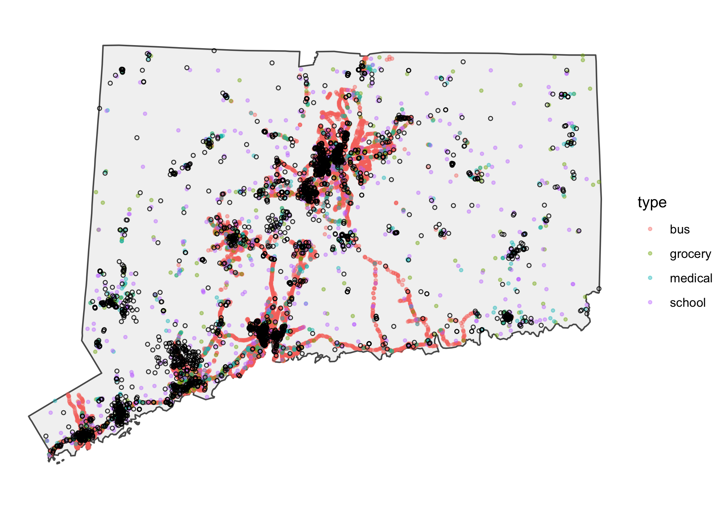
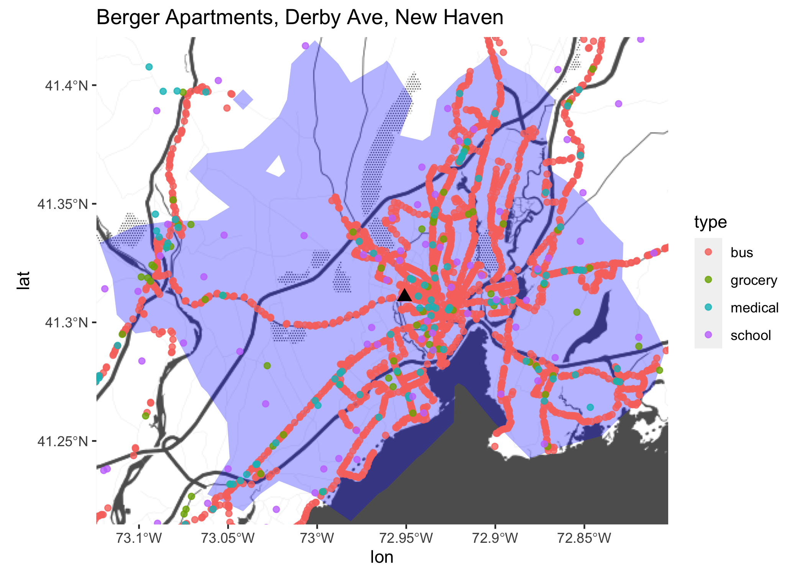

gis stuff
================

``` r
library(tidyverse)
library(sf)
# library(osmdata)
library(ggmap)
library(tidytransit)
library(osrm)
```

For each housing project –\> county, get:

  - Number of grocery stores, grade schools, bus stops, hospitals within
    1/2 mile
  - Number of grocery stores, grade schools, bus stops, hospitals within
    15 minute drive
  - Avg distance to grocery stores, grade schools, bus stops, hospitals

For properties with more than one location, e.g. multiple buildings, but
same ID, take centroid of points.

``` r
town_sf <- st_transform(cwi::town_sf, 2234) %>%
  select(town = name)
ct_sf <- st_union(town_sf)
bbox <- ct_sf %>%
  st_bbox() %>%
  as.numeric()

xwalk <- cwi::xwalk %>%
  distinct(town, town_fips) %>%
  mutate(county_code = substr(town_fips, 3, 5)) %>%
  inner_join(tidycensus::fips_codes %>% 
               filter(state == "CT") %>% 
               select(county_code, county),
             by = "county_code") %>%
  select(town, county)

housing_sf <- read_csv(here::here("input_data/MergedDatasetsOneSourceTable_0.8.csv")) %>%
  janitor::clean_names() %>%
  select(id = project_id2, clean_proj, longitude, latitude) %>%
  arrange(id) %>%
  distinct(id, longitude, latitude, .keep_all = TRUE) %>%
  mutate(geometry = map2(longitude, latitude, ~st_point(c(.x, .y)))) %>%
  st_as_sf(crs = 4369) %>%
  st_transform(st_crs(ct_sf)) %>%
  # group_by(id, clean_proj) %>%
  # summarise(geometry = st_centroid(st_union(geometry))) %>%
  # ungroup() %>%
  mutate(uid = str_pad(row_number(), width = 4, side = "left", pad = "0")) %>%
  select(uid, everything()) %>%
  st_join(town_sf)
```

Is this right to filter for grade schools, i.e. schools that include
grades 1 to 8?

``` r
schools <- httr::GET("https://data.ct.gov/resource/9k2y-kqxn.csv") %>%
  httr::content() %>%
  filter(organization_type %in% c("Public Schools", "Regional Schools")) %>%
  select(district = district_name, school = name, address, town, zipcode, location = geocoded_column, prekindergarten:grade_12) %>%
  mutate(district = str_remove(district, " School District")) %>%
  pivot_longer(prekindergarten:grade_12, names_to = "grade") %>%
  mutate(grade = str_extract(grade, "\\d+") %>%
           replace_na(0) %>%
           as.numeric() %>%
           cut(breaks = c(0, 1, 9, Inf), labels = c("prek_k", "elementary", "high_school"), include.lowest = TRUE, right = FALSE)) %>%
  group_by(across(-value)) %>%
  summarise(value = sum(value) > 0) %>%
  ungroup() %>%
  pivot_wider(names_from = grade) %>%
  filter(elementary)

school_sf <- bind_rows(
  schools %>%
    filter(is.na(location)) %>%
    mutate(addr = paste(address, town, "Connecticut", zipcode, sep = ", ")) %>%
    ggmap::mutate_geocode(addr),
  schools %>%
    filter(!is.na(location)) %>%
    extract(location, into = c("lat", "lon"), "(?<=\\()([\\-\\d.]+), ([\\-\\d.]+)(?=\\))") %>%
    mutate(across(lat:lon, parse_number))
) %>%
  mutate(geometry = map2(lon, lat, ~st_point(c(.x, .y)))) %>%
  select(-address, -zipcode, -location:-lat) %>%
  st_as_sf(crs = 4369) %>%
  mutate(id = as.character(row_number())) %>%
  select(id, name = school)

# rm(schools)
```

``` r
# one store in Bozrah isn't coming up right, route 608 & haughton rd
grocery <- read_sf(URLencode("https://data.ct.gov/resource/fv3p-tf5m.geojson")) %>%
  mutate(city = str_to_title(city),
         zip = str_replace(zip, "(?<=\\d{5})(\\B)", "-")) %>%
  select(id = credentialid, name = dba, address, city, zip)

grocery_sf <- bind_rows(
  grocery %>% 
    filter(st_is_empty(geometry)) %>%
    st_drop_geometry() %>%
    mutate(addr = paste(address, city, "Connecticut", zip, sep = ", ")) %>%
    ggmap::mutate_geocode(addr) %>%
    mutate(geometry = map2(lon, lat, ~st_point(c(.x, .y)))) %>%
    st_as_sf(crs = 4369),
  grocery %>%
    filter(!st_is_empty(geometry))
) %>%
  # filter(lengths(st_intersects(., ct_sf)) > 0) %>%
  select(id, name)

# rm(grocery)
```

``` r
medical_sf <- read_sf(URLencode("https://data.ct.gov/resource/2rnd-twzt.geojson")) %>%
  mutate(city = str_to_title(city),
         zip = zip %>%
           str_replace("^6", "06") %>%
           str_replace("(?<=\\d{5})(\\B)", "-")) %>%
  select(id = credentialid, name)
```

``` r
# all major CT transit cities are in 1 file
gtfs <- tidytransit::feedlist %>% 
  filter(str_detect(loc_t, "CT, USA"), str_detect(url_d, "(ct|connecticut)[\\.\\-\\w]+\\.zip$")) %>%
  pull(url_d) %>%
  map(read_gtfs)

# need to deduplicate--take centroid of sets of points within 100? feet of each other
bus_fetch <- gtfs %>%
  map_dfr(pluck, "stops", .id = "agency") %>%
  # distinct(agency, stop_name, .keep_all = TRUE) %>%
  stops_as_sf() %>%
  select(id = stop_id, name = stop_name) %>%
  st_transform(2234)

bus_clust <- bus_fetch %>%
  mutate(coords = st_coordinates(geometry)) %>%
  st_drop_geometry() %>%
  mutate(x = coords[,1], y = coords[,2]) %>%
  select(id, x, y) %>%
  as.data.frame() %>%
  column_to_rownames("id") %>%
  dist() %>%
  hclust()

bus_sf <- bus_fetch %>%
  mutate(cluster = cutree(bus_clust, h = 100)) %>%
  group_by(cluster) %>%
  summarise(geometry = st_centroid(st_union(geometry)),
            name = paste(name, collapse = " / "),
            id = min(id)) %>% 
  select(id, name)
```

``` r
assets_sf <- lst(bus_sf, grocery_sf, medical_sf, school_sf) %>%
  set_names(str_extract, "^[a-z]+") %>%
  imap(~mutate(.x, type = .y)) %>%
  map(st_transform, st_crs(ct_sf)) %>%
  map(~filter(., lengths(st_intersects(geometry, ct_sf)) > 0)) %>%
  reduce(rbind) %>%
  mutate(tid = paste0(substr(type, 1, 1), str_pad(id, width = 9, side = "left", pad = "0")),
         type = as.factor(type))

assets_sf %>%
  ggplot() +
  geom_sf(data = ct_sf, fill = "gray95") +
  geom_sf(aes(color = type), alpha = 0.4, size = 0.8) +
  geom_sf(data = housing_sf, shape = 21, size = 1, alpha = 0.8) +
  theme_void()
```

<!-- -->

# within 1/2 mile

``` r
buffer_x_assets <- housing_sf %>%
  # filter(uid %in% c("0013", "0014", "0005")) %>%
  st_buffer(dist = units::set_units(0.5, mi)) %>%
  st_join(assets_sf, left = FALSE) %>%
  st_drop_geometry() %>%
  distinct(uid, type, tid)

dist_per_housing <- housing_sf %>%
  as_tibble() %>%
  select(uid, housing_geo = geometry) %>%
  left_join(buffer_x_assets, by = "uid") %>%
  inner_join(assets_sf %>% select(tid, asset_geo = geometry) %>% as_tibble(), by = "tid") %>%
  mutate(dist_mi = st_distance(x = .$housing_geo, y = .$asset_geo, by_element = TRUE) %>%
           units::set_units(mi) %>%
           as.numeric()) %>%
  group_by(uid, type) %>%
  summarise(n_assets = n(),
            mean_dist_hlf_mi = mean(dist_mi),
            min_dist_mi = min(dist_mi)) %>%
  ungroup() %>%
  complete(uid, type, fill = list(n_assets = 0))
```

``` r
county_avgs <- housing_sf %>%
  st_drop_geometry() %>%
  select(uid, town) %>%
  left_join(xwalk, by = "town") %>%
  group_by(county) %>% 
  mutate(n_sites = n()) %>% # gotta do this way to deal with NAs from sites without assets
  inner_join(dist_per_housing, by = "uid") %>%
  mutate(has_assets = n_assets > 0) %>%
  group_by(county, type, n_sites) %>%
  summarise(n_sites_w_assets = sum(has_assets),
            median_assets_per_site = round(median(n_assets), 2),
            avg_min_dist = round(weighted.mean(min_dist_mi, n_assets, na.rm = TRUE), 3))


knitr::kable(county_avgs)
```

| county            | type    | n\_sites | n\_sites\_w\_assets | median\_assets\_per\_site | avg\_min\_dist |
| :---------------- | :------ | -------: | ------------------: | ------------------------: | -------------: |
| Fairfield County  | bus     |      948 |                 530 |                       9.0 |          0.081 |
| Fairfield County  | grocery |      948 |                 603 |                       2.0 |          0.133 |
| Fairfield County  | medical |      948 |                 536 |                       1.0 |          0.233 |
| Fairfield County  | school  |      948 |                 425 |                       1.0 |          0.276 |
| Hartford County   | bus     |     1023 |                 909 |                      23.0 |          0.094 |
| Hartford County   | grocery |     1023 |                 481 |                       1.0 |          0.159 |
| Hartford County   | medical |     1023 |                 423 |                       0.0 |          0.249 |
| Hartford County   | school  |     1023 |                 526 |                       1.0 |          0.299 |
| Litchfield County | bus     |      105 |                  30 |                       0.0 |          0.143 |
| Litchfield County | grocery |      105 |                  45 |                       1.0 |          0.225 |
| Litchfield County | medical |      105 |                  46 |                       1.0 |          0.246 |
| Litchfield County | school  |      105 |                  39 |                       1.0 |          0.328 |
| Middlesex County  | bus     |       82 |                  33 |                       0.0 |          0.114 |
| Middlesex County  | grocery |       82 |                  31 |                       0.0 |          0.231 |
| Middlesex County  | medical |       82 |                  28 |                       0.0 |          0.229 |
| Middlesex County  | school  |       82 |                  31 |                       0.0 |          0.288 |
| New Haven County  | bus     |      737 |                 671 |                      39.0 |          0.078 |
| New Haven County  | grocery |      737 |                 496 |                       1.0 |          0.192 |
| New Haven County  | medical |      737 |                 520 |                       2.0 |          0.212 |
| New Haven County  | school  |      737 |                 463 |                       1.0 |          0.270 |
| New London County | bus     |      186 |                  51 |                       0.0 |          0.260 |
| New London County | grocery |      186 |                  88 |                       2.0 |          0.137 |
| New London County | medical |      186 |                 105 |                       1.0 |          0.231 |
| New London County | school  |      186 |                  96 |                       1.0 |          0.311 |
| Tolland County    | bus     |       68 |                  26 |                       9.0 |          0.112 |
| Tolland County    | grocery |       68 |                   5 |                       0.0 |          0.296 |
| Tolland County    | medical |       68 |                  18 |                       1.0 |          0.276 |
| Tolland County    | school  |       68 |                  20 |                       1.0 |          0.368 |
| Windham County    | bus     |       51 |                  11 |                       0.0 |          0.354 |
| Windham County    | grocery |       51 |                  24 |                       1.0 |          0.293 |
| Windham County    | medical |       51 |                  17 |                       0.5 |          0.340 |
| Windham County    | school  |       51 |                  15 |                       0.0 |          0.286 |

# isochrones–resources within 15 minutes driving

requires running OSRM server locally in a docker container:
<https://hub.docker.com/r/osrm/osrm-backend/>

save housing sf, run separate slow isochrone script

``` r
iso_sf <- readRDS(here::here("output_data/housing_isochrones_15min.rds"))

iso_x_assets <- iso_sf %>%
  st_join(assets_sf, left = FALSE) %>%
  st_drop_geometry() %>%
  distinct(uid, type, tid) %>%
  group_by(uid, type) %>%
  summarise(n_assets = n()) %>%
  ungroup() %>%
  complete(uid, type, fill = list(n_assets = 0))

county_iso <- housing_sf %>%
  st_drop_geometry() %>%
  select(uid, town) %>%
  inner_join(iso_x_assets, by = "uid") %>%
  left_join(xwalk, by = "town") %>%
  mutate(has_assets = n_assets > 0) %>%
  group_by(county, type) %>%
  summarise(n_sites = n(),
            n_sites_w_assets = sum(has_assets),
            median_assets_per_site = round(median(n_assets), 2))


knitr::kable(county_iso)
```

| county            | type    | n\_sites | n\_sites\_w\_assets | median\_assets\_per\_site |
| :---------------- | :------ | -------: | ------------------: | ------------------------: |
| Fairfield County  | bus     |      947 |                 763 |                     522.0 |
| Fairfield County  | grocery |      947 |                 944 |                      89.0 |
| Fairfield County  | medical |      947 |                 946 |                      39.0 |
| Fairfield County  | school  |      947 |                 947 |                      31.0 |
| Hartford County   | bus     |     1023 |                1021 |                    1854.0 |
| Hartford County   | grocery |     1023 |                1022 |                     117.0 |
| Hartford County   | medical |     1023 |                1023 |                      61.0 |
| Hartford County   | school  |     1023 |                1023 |                      57.0 |
| Litchfield County | bus     |      105 |                  58 |                      10.0 |
| Litchfield County | grocery |      105 |                 102 |                       8.0 |
| Litchfield County | medical |      105 |                 101 |                      14.0 |
| Litchfield County | school  |      105 |                 104 |                       7.0 |
| Middlesex County  | bus     |       82 |                  81 |                     178.0 |
| Middlesex County  | grocery |       82 |                  82 |                      12.0 |
| Middlesex County  | medical |       82 |                  82 |                      15.0 |
| Middlesex County  | school  |       82 |                  82 |                      15.0 |
| New Haven County  | bus     |      737 |                 733 |                    1778.0 |
| New Haven County  | grocery |      737 |                 737 |                      47.0 |
| New Haven County  | medical |      737 |                 737 |                      67.0 |
| New Haven County  | school  |      737 |                 737 |                      49.0 |
| New London County | bus     |      186 |                 138 |                      11.0 |
| New London County | grocery |      186 |                 185 |                      19.0 |
| New London County | medical |      186 |                 184 |                      15.0 |
| New London County | school  |      186 |                 186 |                      15.0 |
| Tolland County    | bus     |       68 |                  64 |                      17.0 |
| Tolland County    | grocery |       68 |                  68 |                       7.0 |
| Tolland County    | medical |       68 |                  68 |                      10.5 |
| Tolland County    | school  |       68 |                  68 |                      10.5 |
| Windham County    | bus     |       51 |                  16 |                       0.0 |
| Windham County    | grocery |       51 |                  51 |                       7.0 |
| Windham County    | medical |       51 |                  51 |                       9.0 |
| Windham County    | school  |       51 |                  51 |                       9.0 |

# example output

``` r
ex_id <- housing_sf %>%
  filter(town == "New Haven", clean_proj == "berger") %>%
  pull(uid)
ex_iso <- iso_sf %>% filter(uid == ex_id)
ex_bbox <- ex_iso %>%
  st_buffer(500) %>%
  st_transform(4369) %>%
  st_bbox() %>%
  as.numeric()
basemap <- get_stamenmap(ex_bbox, maptype = "toner-background", zoom = 11)
ggmap(basemap, darken = c(0.3, "white")) +
  geom_sf(data = ex_iso %>% st_transform(4369), inherit.aes = FALSE, fill = "blue", color = NA, alpha = 0.3) +
  geom_sf(aes(color = type), data = assets_sf %>% st_transform(4369), inherit.aes = FALSE, alpha = 0.8) +
  geom_sf(data = housing_sf %>% filter(uid == ex_id) %>% st_transform(4369), inherit.aes = FALSE, shape = 17, size = 3) +
  labs(title = "Berger Apartments, Derby Ave, New Haven")
```

<!-- -->

``` r
inner_join(
  county_avgs %>%
    rename_at(vars(n_sites_w_assets, median_assets_per_site), ~paste(., "hlf_mi", sep = "_")),
  county_iso %>%
    select(-n_sites) %>%
    rename_at(vars(n_sites_w_assets, median_assets_per_site), ~paste(., "15min", sep = "_")),
  by = c("county", "type")
) %>%
  write_csv(here::here("output_data/distance_to_resources_by_county.csv"))
```
