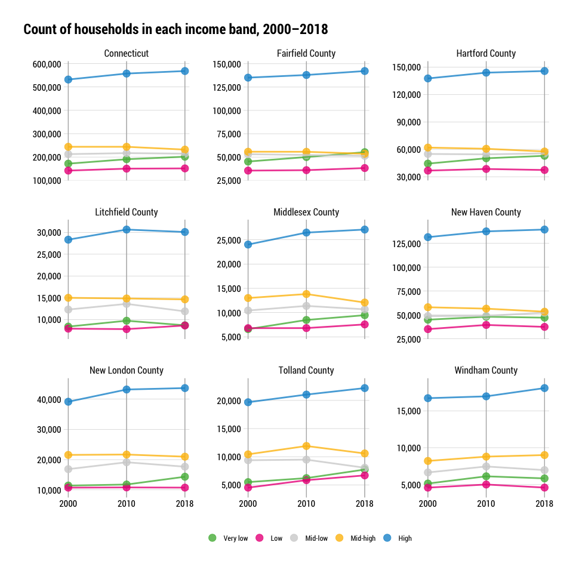
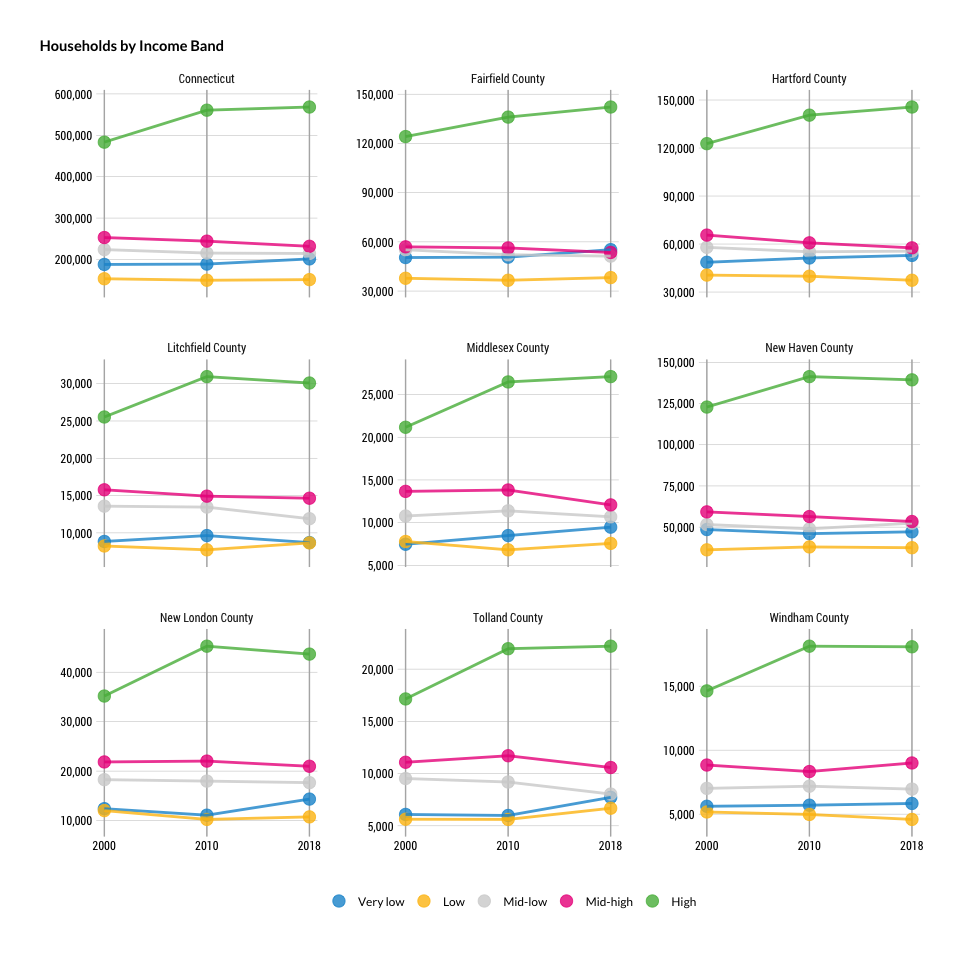

Households by income range
================

``` r
library(tidyverse)
library(tidycensus)
library(janitor)
library(cwi)
library(camiller)
library(ipumsr)
library(srvyr)
library(blscrapeR)
```

``` r
theme_set(hrbrthemes::theme_ipsum_rc(base_family = "Lato Regular"))

#urban colors
pal <- c("#1696d2", "#fdbf11", "#d2d2d2", "#ec008b", "#55b748")

scale_color_custom <- function(palette = pal, rev = F) {
  if (rev) {
    scale_color_manual(values = rev(pal))
  } else {
    scale_color_manual(values = pal)
  }
}
```

Using the income ranges from hh desiring housing, look at change in
total households by those 2018 income thresholds.

Actually (or maybe in addition), maybe what I want to do is sum up the
number of households who would have been in the income bands over time.
So how many Very Low income households (i.e., \<= 30% county median
income) in each year regardless of what that income value would be.

# HH in *bands* over time

``` r
yrs <- c("2010" = 2010, "2018" = 2018)
fetch <- yrs %>% map(~get_acs(geography = "county",table = "B19013", state = 09, cache_table = T, year = .) %>% 
    arrange(GEOID) %>% 
    mutate(countyfip = seq(from = 1, to = 15, by = 2),
                 name = str_remove(NAME, ", Connecticut")) %>% 
    select(countyfip, name, minc = estimate))

fetch2 <- get_decennial(geography = "county", variables = "HCT012001", state = 09, year = 2000, sumfile = "sf3") %>% 
    rename(name = NAME) %>% 
    mutate(year = "2000",
                 countyfip = seq(from = 1, to = 15, by = 2),
                 name = str_remove(name, ", Connecticut")) %>% 
    select(year, countyfip, name, minc = value)

minc <- (bind_rows(fetch, .id = "year")) %>% 
    bind_rows(fetch2) %>% 
    arrange(year, name) %>% 
    mutate(year = as.factor(year))
```

``` r
ddi <- read_ipums_ddi("../input_data/usa_00047.xml")

pums <- read_ipums_micro(ddi, verbose = F) %>% 
    filter(RECTYPE == "H") %>% 
    select(YEAR, HHWT, COUNTYFIP, HHINCOME, GQ) %>% 
    mutate_at(vars(YEAR, GQ), as_factor) %>% 
    mutate_at(vars(HHWT, COUNTYFIP), as.numeric) %>% 
    mutate_at(vars(HHINCOME), as.integer) %>% 
    clean_names() %>% 
    left_join(minc, by = c("countyfip", "year")) %>% 
    mutate(ratio = hhincome/minc) %>% 
    mutate(
        inc_band = cut(
            ratio,
            breaks = c(-Inf, 0.3, 0.5, .8, 1.2, Inf),
            labels = c("Very low", "Low", "Mid-low", "Mid-high", "High"),
            include.lowest = T, right = T))

des <- pums %>%
    filter(hhincome != 9999999) %>% 
    as_survey_design(., ids = 1, wt = hhwt)
```

``` r
county_hh_by_inc_band <- des %>%
    select(hhwt, year, name, inc_band) %>% 
    group_by(year, name, inc_band) %>% 
    summarise(value = survey_total(hhwt)) %>% 
    ungroup()

state_hh_by_inc_band <- county_hh_by_inc_band %>% 
    select(-name, -value_se) %>% 
    group_by(year, inc_band) %>% 
    summarise(value = sum(value)) %>% 
    mutate(name = "Connecticut") %>% 
    ungroup()

hh_by_inc_band_2000_2018 <- bind_rows(county_hh_by_inc_band, state_hh_by_inc_band) %>% 
    arrange(year, name) %>% 
    mutate(name = as.factor(name))

write_csv(hh_by_inc_band_2000_2018, path = "../output_data/hh_by_income_band_2000_2018.csv")
```

Hmm. Other than high income households rising across the board, trends
are pretty variable.

``` r
hh_by_inc_band_2000_2018 %>% 
    ggplot(aes(year, value, group = inc_band)) +
    geom_vline(aes(xintercept = year), size = .5, color = "grey70") +
    geom_point(aes(color = inc_band), size = 4, alpha = .8) +
    geom_line(aes(color = inc_band), size = 1, alpha = .8) +
    scale_y_continuous(labels = scales::comma_format(),
                                         expand = expansion(mult = c(.1, .1))) +
    scale_x_discrete(expand = expansion(mult = c(.04, .04))) +
    facet_wrap(facets = "name", scales = "free_y") +
    hrbrthemes::theme_ipsum_rc() +
  scale_color_custom(palette = c(pal[1:5]), rev=T) +
    guides(color = guide_legend(title = "", override.aes = list(linetype = 0))) +
    labs(title = "Count of households in each income band, 2000–2018",
             x = "", y = "") +
    theme(plot.title.position = "plot",
                axis.text.y = element_text(colour = "black"),
                strip.text.x = element_text(hjust = .5),
                panel.grid.minor = element_blank(),
                axis.text.x = element_text(colour = "black"),
                legend.position = "bottom")
```

<!-- -->

## HH in income *ranges* over time

cwi’s inflation adjust call is being weird so I’m just gonna use
blscrapeR…

``` r
infl_values <- inflation_adjust(base_year = 2018) %>% 
    filter(year %in% c(2000, 2010, 2018)) %>% 
    arrange(desc(year)) %>% 
    mutate(factor = 1 + (abs(pct_increase) / 100)) %>% 
    select(year, factor)

minc18 <- pums %>% 
    filter(year == 2018) %>% 
    select(name, minc18 = minc) %>% 
    unique()

pums2 <- pums %>% 
    select(-minc, -ratio, -inc_band) %>% 
    left_join(infl_values, by = "year") %>% 
    mutate(adj_hhincome = round(hhincome * factor, 0)) %>% 
    left_join(minc18, by = "name") %>% 
    mutate(ratio = adj_hhincome / minc18) %>% 
    mutate(
        inc_band = cut(
            ratio,
            breaks = c(-Inf, 0.3, 0.5, .8, 1.2, Inf),
            labels = c("Very low", "Low", "Mid-low", "Mid-high", "High"),
            include.lowest = T, right = T))

des2 <- pums2 %>%
    filter(hhincome != 9999999) %>% 
    as_survey_design(., ids = 1, wt = hhwt)
```

``` r
county_hh_by_2018_inc_band <- des2 %>%
    select(year, hhwt, name, inc_band) %>% 
    group_by(year, name, inc_band) %>% 
    summarise(value = survey_total(hhwt)) %>% 
    ungroup()

state_hh_by_2018_inc_band <- county_hh_by_2018_inc_band %>% 
    select(-name, -value_se) %>% 
    group_by(year, inc_band) %>% 
    summarise(value = sum(value)) %>% 
    mutate(name = "Connecticut") %>% 
    ungroup()

hh_by_2018_inc_band <- bind_rows(county_hh_by_2018_inc_band, state_hh_by_2018_inc_band) %>%
    arrange(year, name) %>% 
    mutate(name = as.factor(name))
```

So the trends aren’t very different than above. I suppose we can just
pick one for the final report. In a way, I prefer the method above. I
think it’s easier to discuss households by percent of county median than
the 2018 breaks as below.

``` r
hh_by_2018_inc_band %>% 
    ggplot(aes(year, value, group = inc_band)) +
    geom_vline(aes(xintercept = year), size = .5, color = "grey70") +
    geom_point(aes(color = inc_band), size = 4, alpha = .8) +
    geom_line(aes(color = inc_band), size = 1, alpha = .8) +
    scale_y_continuous(labels = scales::comma_format(),
                                         expand = expansion(mult = c(.1, .1))) +
    scale_x_discrete(expand = expansion(mult = c(.04, .04))) +
    facet_wrap(facets = "name", scales = "free_y") +
    hrbrthemes::theme_ipsum_rc() +
  scale_color_custom(palette = c(pal[1:5])) +
    guides(color = guide_legend(title = "", override.aes = list(linetype = 0))) +
    labs(title = "Households by Income Band",
             x = "", y = "") +
    theme(plot.title.position = "plot",
                plot.title = element_text(family = "Lato Bold", size = 11),
                legend.text = element_text(family = "Lato Regular", size = 9),
                axis.text.y = element_text(colour = "black", size = 9),
                strip.text.x = element_text(hjust = .5, size = 9),
                panel.grid.minor = element_blank(),
                axis.text.x = element_text(colour = "black", size = 9),
                legend.position = "bottom")
```

<!-- -->

``` r
ggsave(filename = "../output_data/corrected_charts/hh_by_inc_band.png", dpi = 300, width = 8, height = 10)
ggsave(filename = "../output_data/corrected_charts/hh_by_inc_band.svg", dpi = 300, width = 8, height = 10)
```
