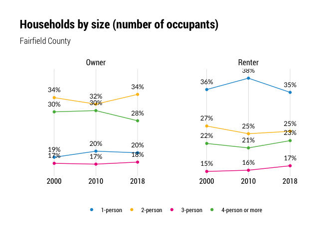
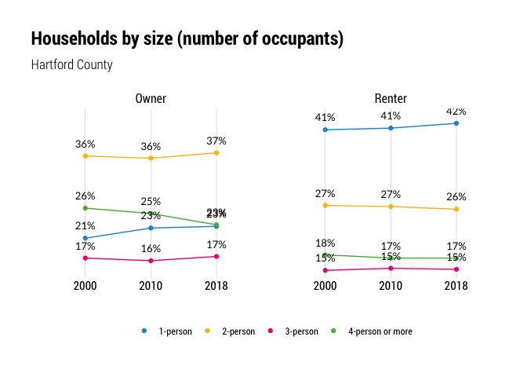
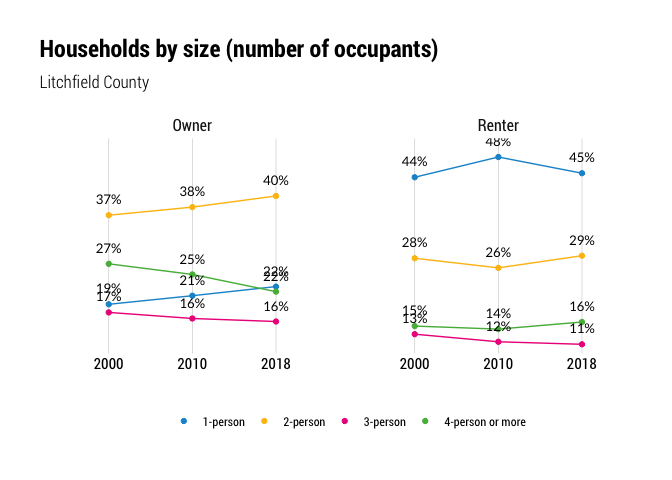
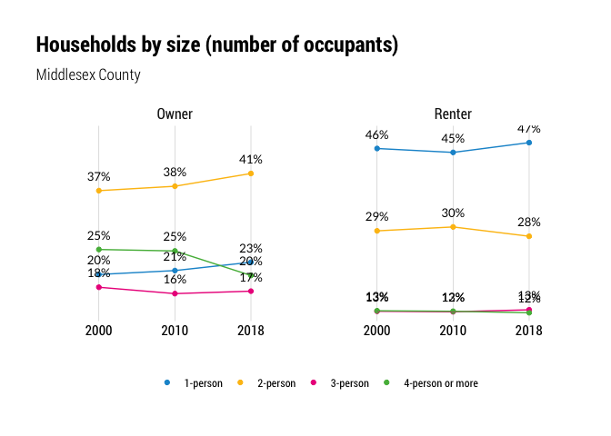
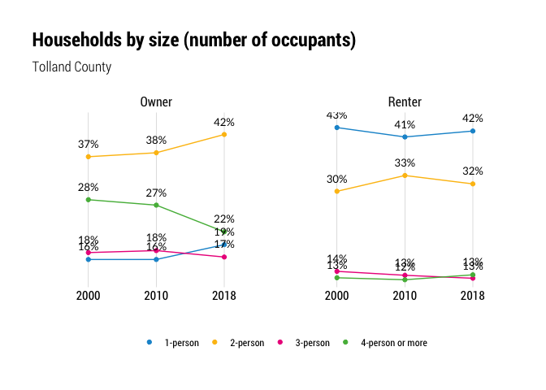
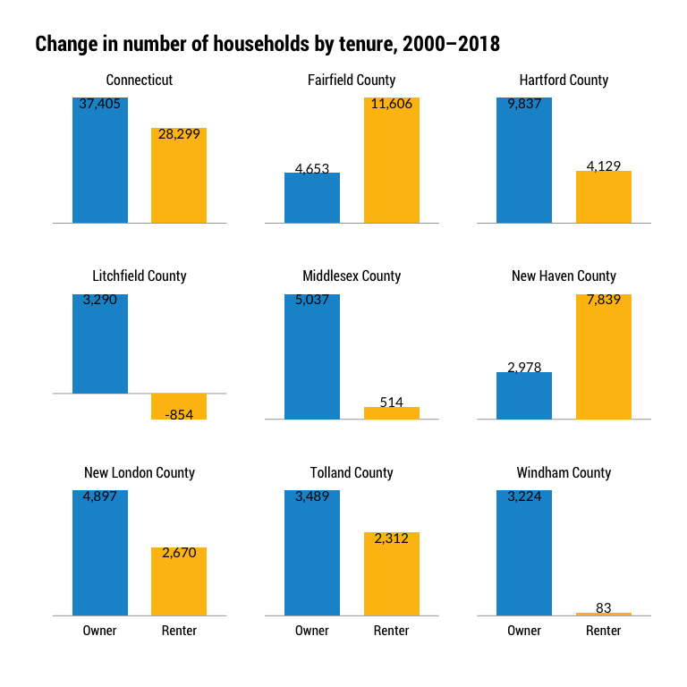

Households by size
================

``` r
library(tidyverse)
library(tidycensus)
library(janitor)
library(cwi)
library(camiller)
library(scales)
library(hrbrthemes)
```

Same deal as with households by type… this number moves only very
slightly, so I’ll just pull three points: 2000, 2010, and 2018

HH size by tenure… B08201 (2010, 2018) 2000: H015 sf1

Groupings go from 1 to 7+ but I’ll regroup to 1 to 4+

# Fetch

``` r
years <- list("2010" = 2010, "2018" = 2018)
fetch1018 <- years %>% map(~multi_geo_acs(table = "B25009", year = ., new_england = F)) %>%
    bind_rows() %>% 
    label_acs() %>% 
    clean_names() %>% 
    select(-moe) %>% 
    rename(value = estimate)

fetch00 <- multi_geo_decennial(table = "H015", year = 2000) %>% 
    label_decennial(year = 2000) %>% 
    clean_names()
```

# Clean

``` r
size1018 <- fetch1018 %>% 
    select(-geoid, -state, -variable) %>% 
    group_by(level, name, year) %>% 
    add_grps(list(total = 1,
                                owner_total = 2,
                                owner_p1 = 3, 
                                owner_p2 = 4,
                                owner_p3 = 5,
                                owner_p4_or_more = c(6:9),
                                renter_total = 10,
                                renter_p1 = 11, 
                                renter_p2 = 12,
                                renter_p3 = 13,
                                renter_p4_or_more = c(14:17)),
                     value = value, group = label)

size <- fetch00 %>% 
    select(-geoid, -state, -variable) %>%
    group_by(level, name, year) %>%
    add_grps(list(total = 1,
                                owner_total = 2,
                                owner_p1 = 3, 
                                owner_p2 = 4,
                                owner_p3 = 5,
                                owner_p4_or_more = c(6:9),
                                renter_total = 10,
                                renter_p1 = 11, 
                                renter_p2 = 12,
                                renter_p3 = 13,
                                renter_p4_or_more = c(14:17)),
                     value = value, group = label) %>% 
    bind_rows(size1018) %>% 
    rename(hhlds = label) %>% 
    mutate(tenure = if_else(grepl("renter", hhlds), "renter", "owner"),
                 tenure = if_else(hhlds == "total", "total", tenure)) %>% 
    mutate(hhlds = str_remove(hhlds, "owner_"),
                 hhlds = str_remove(hhlds, "renter_")) %>% 
    select(level, name, year, tenure, hhlds, value) %>% 
    mutate(hhlds = as.factor(hhlds) %>% 
                    fct_recode(., `1-person` = "p1", `2-person` = "p2", `3-person` = "p3", `4-person or more` = "p4_or_more"))

write_csv(size, "../output_data/household_size_by_tenure_2000_2018.csv")

renter <- size %>% 
    filter(tenure == "renter") %>% 
    ungroup() %>% 
    group_by(level, name, year, tenure) %>% 
    calc_shares(group = hhlds, denom = "total", value = value)

write_csv(renter, "../output_data/household_size_renter_2000_2018.csv")

owner <- size %>% 
    filter(tenure == "owner") %>% 
    ungroup() %>% 
    group_by(level, name, year, tenure) %>%  
    calc_shares(group = hhlds, denom = "total", value = value)

write_csv(owner, "../output_data/household_size_owner_2000_2018.csv")

bind <- bind_rows(owner, renter)
write_csv(bind, file = "../output_data/hh_size_chg_tenure_2000_2018.csv")
```

# Calculate change

``` r
household_size_change <- size %>%
    group_by(level, hhlds, tenure) %>%
    arrange(name, year, hhlds) %>%
    mutate(diff = value - lag(value, default = first(value))) %>%
    arrange(level, year, hhlds, tenure) %>%
    rename(change_from_prev_data_year = diff)

household_size_change %>% 
    write_csv("../output_data/household_size_change_2000_2018.csv")
```

## Plots

<!-- --><!-- --><!-- --><!-- --><!-- --><!-- --><!-- --><!-- --><!-- -->

``` r
total_tenure_change <- household_size_change %>% 
    ungroup() %>% 
    filter(hhlds == "total", level != "3_towns", year != 2010, tenure != "total") %>% 
    select(-level, -hhlds, -change_from_prev_data_year) %>% 
    group_by(name, tenure) %>% 
    mutate(diff = value - lag(value)) %>% 
    ungroup() %>% 
    filter(!is.na(diff)) %>% 
    select(-year, -value)

write_csv(total_tenure_change, file = "../output_data/total_tenure_change_2000_2018.csv")
```

``` r
total_tenure_change %>% 
    mutate(tenure = str_to_title(tenure)) %>% 
    ggplot(aes(tenure, diff)) +
    geom_hline(yintercept = 0, color = "grey50", size = .25) +
    geom_col(aes(fill = tenure), width = .7, position = position_dodge(.55)) +
    geom_text(aes(label = scales::comma(diff, accuracy = 1)), position = position_dodge(.75), family = "Roboto Condensed", size = 4, vjust = "inward") +
    facet_wrap(facets = "name", scales = "free_y") +
    hrbrthemes::theme_ipsum_rc() +
    labs(title = "Change in number of households by tenure, 2000–2018",
             x = "", y = "") +
    theme(plot.title.position = "plot",
                legend.position = "none", 
                panel.grid.major = element_blank(),
                panel.grid.minor = element_blank(),
                axis.text.x = element_text(colour = "black"),
                axis.text.y = element_blank(),
                strip.text.x = element_text(colour = "black", hjust = .5))
```

<!-- -->
