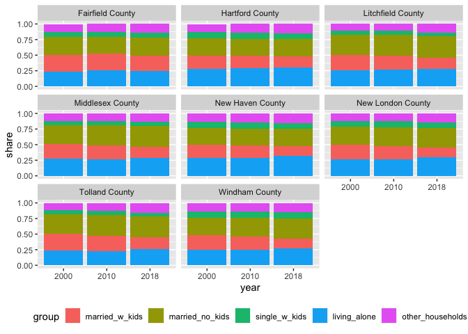

Households by type
================

``` r
library(tidyverse)
library(tidycensus)
library(janitor)
library(cwi)
library(camiller)
```

These don’t change much year over year, so I think 2000, 2010, and 2018
should be sufficient to make our point.

# Fetch

``` r
tbls <- ext_table_nums[c("family", "children")]

fetch18 <- tbls %>% map(~multi_geo_acs(table = ., year = 2018, new_england = F) %>% 
                                                label_acs() %>%
                                                select(-GEOID) %>% 
                                                rename(name = NAME) %>% 
                                                group_by(level, name))

fetch10 <- tbls %>% map(~multi_geo_acs(table = ., year = 2010, new_england = F) %>% 
                                                label_acs() %>%
                                                select(-GEOID) %>% 
                                                rename(name = NAME) %>% 
                                                group_by(level, name))

fetch00 <- multi_geo_decennial(table = "P018", year = 2000)
```

# Clean

``` r
family <- bind_rows(fetch18$family, fetch10$family) %>%
  mutate(label = as.factor(label) %>% fct_inorder()) %>%
  group_by(level, name, year) %>%
  add_grps(list(total_households = 1, living_alone = 8, other_nonfamily = 9), group = label, moe = moe)

children <- bind_rows(fetch18$children, fetch10$children) %>%
  mutate(label = as.factor(label) %>% fct_inorder()) %>%
  group_by(level, name, year) %>%
  add_grps(list(married_w_kids = 3, married_no_kids = 7, single_w_kids = c(10, 16), other_family = c(14, 20)), group = label, moe = moe)

hh00 <- fetch00 %>%
  label_decennial(year = 2000) %>% 
  group_by(level, name = NAME) %>% 
  add_grps(list(total_households = 1, living_alone = 2, married_w_kids = 8, married_no_kids = 9, single_w_kids = c(12, 15), other_households = c(13, 16, 17)), group = label, estimate = value) %>%
  mutate(year = 2000)

household_type <- bind_rows(family, children) %>%
  add_grps(list(other_households = c(3, 7)), group = label) %>%
  bind_rows(family %>% filter(label != "other_nonfamily")) %>%
  bind_rows(children %>% filter(label != "other_family")) %>%
  mutate(label = as.factor(label) %>% fct_relevel("total_households", "married_w_kids", "married_no_kids", "single_w_kids", "living_alone", "other_households")) %>% 
    select(-moe, value = estimate) %>%
    bind_rows(hh00) %>% 
    rename(group = label) %>% 
  ungroup() %>%
  group_by(level, name, year) %>%
  calc_shares(group = group, denom = "total_households", estimate = value) %>%
  mutate(year = as.factor(year),
             group = as.factor(group) %>%
           fct_relevel("married_w_kids", "married_no_kids", "single_w_kids", "living_alone", "other_households")) %>%
  ungroup()

write_csv(household_type, "../output_data/household_type_2000_2018.csv")
```

``` r
household_type %>% 
    filter(level == "2_counties", !is.na(share)) %>% 
    ggplot(aes(year, share, group = name)) +
    geom_col(aes(fill = group)) +
    facet_wrap(facets = "name") +
    theme(legend.position = "bottom")
```

<!-- -->

# Calculate change

``` r
household_type_change <- household_type %>%
    select(-share) %>%
    group_by(level, group) %>%
    arrange(name, year, group) %>%
    mutate(diff = value - lag(value, default = first(value))) %>%
    arrange(level, year, group) %>%
    rename(change_from_prev_data_year = diff)
    
household_type_change %>% 
    write_csv("../output_data/household_type_change_2000_2018.csv")
```
