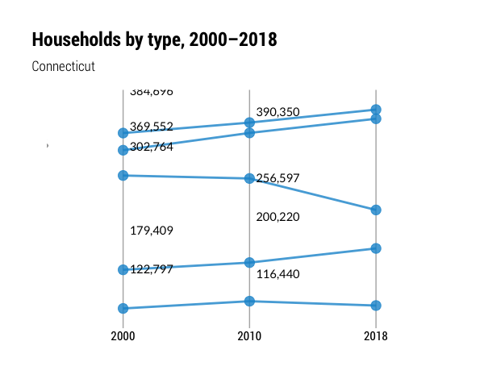
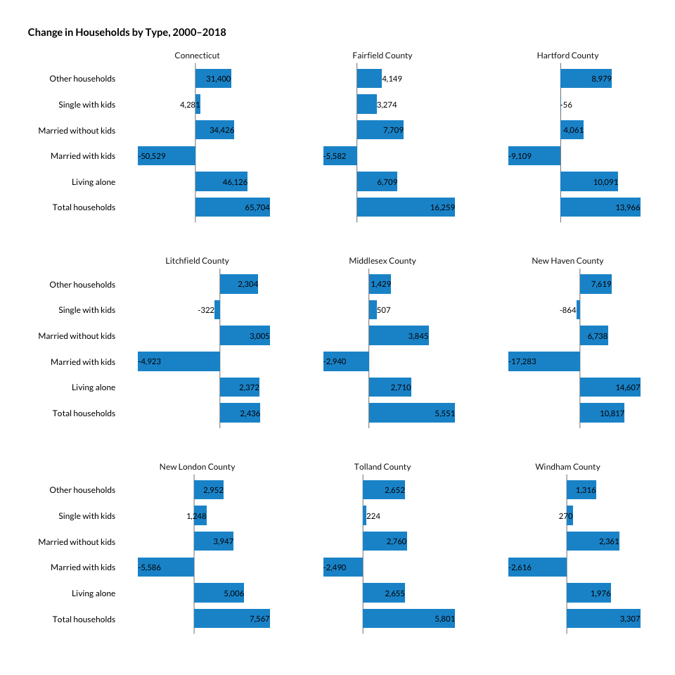

Households by type
================

``` r
library(tidyverse)
library(tidycensus)
library(janitor)
library(cwi)
library(camiller)
```

These don’t change much year over year, so I think 2000, 2010, and 2018
should be sufficient to make our point.

# Fetch

``` r
tbls <- ext_table_nums[c("family", "children")]

fetch18 <- tbls %>% map(~multi_geo_acs(table = ., year = 2018, new_england = F) %>% 
                                                label_acs() %>%
                                                select(-GEOID) %>% 
                                                rename(name = NAME) %>% 
                                                group_by(level, name))

fetch10 <- tbls %>% map(~multi_geo_acs(table = ., year = 2010, new_england = F) %>% 
                                                label_acs() %>%
                                                select(-GEOID) %>% 
                                                rename(name = NAME) %>% 
                                                group_by(level, name))

fetch00 <- multi_geo_decennial(table = "P018", year = 2000)
```

# Clean

``` r
family <- bind_rows(fetch18$family, fetch10$family) %>%
  mutate(label = as.factor(label) %>% fct_inorder()) %>%
  group_by(level, name, year) %>%
  add_grps(list(total_households = 1, living_alone = 8, other_nonfamily = 9), group = label, moe = moe)

children <- bind_rows(fetch18$children, fetch10$children) %>%
  mutate(label = as.factor(label) %>% fct_inorder()) %>%
  group_by(level, name, year) %>%
  add_grps(list(married_w_kids = 3, married_no_kids = 7, single_w_kids = c(10, 16), other_family = c(14, 20)), group = label, moe = moe)

hh00 <- fetch00 %>%
  label_decennial(year = 2000) %>% 
  group_by(level, name = NAME) %>% 
  add_grps(list(total_households = 1, living_alone = 2, married_w_kids = 8, married_no_kids = 9, single_w_kids = c(12, 15), other_households = c(13, 16, 17)), group = label, estimate = value) %>%
  mutate(year = 2000)

household_type <- bind_rows(family, children) %>%
  add_grps(list(other_households = c(3, 7)), group = label) %>%
  bind_rows(family %>% filter(label != "other_nonfamily")) %>%
  bind_rows(children %>% filter(label != "other_family")) %>%
  mutate(label = as.factor(label) %>% fct_relevel("total_households", "married_w_kids", "married_no_kids", "single_w_kids", "living_alone", "other_households")) %>% 
    select(-moe, value = estimate) %>%
    bind_rows(hh00) %>% 
    rename(group = label) %>% 
  ungroup() %>%
  group_by(level, name, year) %>%
  calc_shares(group = group, denom = "total_households", estimate = value) %>%
  mutate(year = as.factor(year),
             group = as.factor(group) %>%
           fct_relevel("married_w_kids", "married_no_kids", "single_w_kids", "living_alone", "other_households")) %>%
  ungroup()

write_csv(household_type, "../output_data/household_type_2000_2018.csv")
```

# Calculate change

``` r
household_type_change <- household_type %>%
    select(-share) %>%
    group_by(level, group) %>%
    arrange(name, year, group) %>%
    mutate(diff = value - lag(value, default = first(value))) %>%
    arrange(level, year, group) %>%
    rename(change_from_prev_data_year = diff)
    
household_type_change %>% 
    write_csv("../output_data/household_type_change_2000_2018.csv")
```

``` r
set.seed(13)

household_type_change %>% 
    ungroup() %>% 
    mutate(group = as.character(group),
                 group = str_replace_all(group, "_", " "),
                 group = str_replace(group, "w", "with"),
                 group = str_replace(group, "no", "without"),
                 group = str_to_sentence(group)) %>% 
    mutate(group = as.factor(group) %>% 
                    fct_relevel(.,  "Total households", "Living alone", "Married with kids", "Married without kids", "Single with kids", "Other households")) %>% 
    filter(level != "3_towns", group != "Total households") %>% 
    select(-level, -change_from_prev_data_year) %>% 
    mutate(year = as.factor(year)) %>% 
    filter(name == "Connecticut") %>% 
    ggplot(aes(year, value, group = group)) +
    geom_vline(aes(xintercept = year), size = .5, color = "grey70") +
    geom_point(aes(color = group), size = 4, alpha = .8) +
    geom_line(aes(color = group), size = 1, alpha = .8) +
    ggrepel::geom_text_repel(aes(label = scales::comma(value, accuracy = 1)), segment.colour = NA, vjust = -1.4, family = "Roboto Condensed") +
    scale_y_continuous(expand = expansion(mult = c(.1, .1))) +
    hrbrthemes::theme_ipsum_rc() +
    guides(color = guide_legend(title = "", override.aes = list(linetype = 0))) +
    labs(title = "Households by type, 2000–2018",
             subtitle = "Connecticut",
             x = "", y = "") +
    theme(plot.title.position = "plot",
                axis.text.y = element_blank(),
                panel.grid.major = element_blank(),
                panel.grid.minor = element_blank(),
                axis.text.x = element_text(colour = "black"),
                legend.position = "bottom")
```

<!-- -->

``` r
household_type_change %>% 
    ungroup() %>% 
    filter(level != "3_towns") %>% 
    mutate(group = as.character(group),
                 group = str_replace_all(group, "_", " "),
                 group = str_replace(group, "w", "with"),
                 group = str_replace(group, "no", "without"),
                 group = str_to_sentence(group)) %>% 
    mutate(group = as.factor(group) %>% 
                    fct_relevel(.,  "Total households", "Living alone", "Married with kids", "Married without kids", "Single with kids", "Other households")) %>% 
    select(-level, -change_from_prev_data_year) %>% 
    pivot_wider(id_cols = c("name", "group"), names_from = year, values_from = value) %>% 
    group_by(name, group) %>% 
    mutate(diff = (`2018` - `2000`) / `2000`,
                 pct = scales::percent(diff, accuracy = 1),
                 x2000 = scales::comma(`2000`, accuracy = 1),
                 x2018 = scales::comma(`2018`, accuracy = 1)) %>% 
    select(Name = name, `Household type` = group, `Estimate, 2000` = x2000, `Estimate, 2018` = x2018, `Percent change` = pct) %>% 
    arrange(Name, `Household type`) %>% 
    kableExtra::kable()
```

<table>

<thead>

<tr>

<th style="text-align:left;">

Name

</th>

<th style="text-align:left;">

Household type

</th>

<th style="text-align:left;">

Estimate, 2000

</th>

<th style="text-align:left;">

Estimate, 2018

</th>

<th style="text-align:left;">

Percent change

</th>

</tr>

</thead>

<tbody>

<tr>

<td style="text-align:left;">

Connecticut

</td>

<td style="text-align:left;">

Total households

</td>

<td style="text-align:left;">

1,301,670

</td>

<td style="text-align:left;">

1,367,374

</td>

<td style="text-align:left;">

5%

</td>

</tr>

<tr>

<td style="text-align:left;">

Connecticut

</td>

<td style="text-align:left;">

Living alone

</td>

<td style="text-align:left;">

344,224

</td>

<td style="text-align:left;">

390,350

</td>

<td style="text-align:left;">

13%

</td>

</tr>

<tr>

<td style="text-align:left;">

Connecticut

</td>

<td style="text-align:left;">

Married with kids

</td>

<td style="text-align:left;">

307,126

</td>

<td style="text-align:left;">

256,597

</td>

<td style="text-align:left;">

\-16%

</td>

</tr>

<tr>

<td style="text-align:left;">

Connecticut

</td>

<td style="text-align:left;">

Married without kids

</td>

<td style="text-align:left;">

369,341

</td>

<td style="text-align:left;">

403,767

</td>

<td style="text-align:left;">

9%

</td>

</tr>

<tr>

<td style="text-align:left;">

Connecticut

</td>

<td style="text-align:left;">

Single with kids

</td>

<td style="text-align:left;">

112,159

</td>

<td style="text-align:left;">

116,440

</td>

<td style="text-align:left;">

4%

</td>

</tr>

<tr>

<td style="text-align:left;">

Connecticut

</td>

<td style="text-align:left;">

Other households

</td>

<td style="text-align:left;">

168,820

</td>

<td style="text-align:left;">

200,220

</td>

<td style="text-align:left;">

19%

</td>

</tr>

<tr>

<td style="text-align:left;">

Fairfield County

</td>

<td style="text-align:left;">

Total households

</td>

<td style="text-align:left;">

324,232

</td>

<td style="text-align:left;">

340,491

</td>

<td style="text-align:left;">

5%

</td>

</tr>

<tr>

<td style="text-align:left;">

Fairfield County

</td>

<td style="text-align:left;">

Living alone

</td>

<td style="text-align:left;">

77,918

</td>

<td style="text-align:left;">

84,627

</td>

<td style="text-align:left;">

9%

</td>

</tr>

<tr>

<td style="text-align:left;">

Fairfield County

</td>

<td style="text-align:left;">

Married with kids

</td>

<td style="text-align:left;">

86,972

</td>

<td style="text-align:left;">

81,390

</td>

<td style="text-align:left;">

\-6%

</td>

</tr>

<tr>

<td style="text-align:left;">

Fairfield County

</td>

<td style="text-align:left;">

Married without kids

</td>

<td style="text-align:left;">

92,828

</td>

<td style="text-align:left;">

100,537

</td>

<td style="text-align:left;">

8%

</td>

</tr>

<tr>

<td style="text-align:left;">

Fairfield County

</td>

<td style="text-align:left;">

Single with kids

</td>

<td style="text-align:left;">

23,976

</td>

<td style="text-align:left;">

27,250

</td>

<td style="text-align:left;">

14%

</td>

</tr>

<tr>

<td style="text-align:left;">

Fairfield County

</td>

<td style="text-align:left;">

Other households

</td>

<td style="text-align:left;">

42,538

</td>

<td style="text-align:left;">

46,687

</td>

<td style="text-align:left;">

10%

</td>

</tr>

<tr>

<td style="text-align:left;">

Hartford County

</td>

<td style="text-align:left;">

Total households

</td>

<td style="text-align:left;">

335,098

</td>

<td style="text-align:left;">

349,064

</td>

<td style="text-align:left;">

4%

</td>

</tr>

<tr>

<td style="text-align:left;">

Hartford County

</td>

<td style="text-align:left;">

Living alone

</td>

<td style="text-align:left;">

93,515

</td>

<td style="text-align:left;">

103,606

</td>

<td style="text-align:left;">

11%

</td>

</tr>

<tr>

<td style="text-align:left;">

Hartford County

</td>

<td style="text-align:left;">

Married with kids

</td>

<td style="text-align:left;">

72,168

</td>

<td style="text-align:left;">

63,059

</td>

<td style="text-align:left;">

\-13%

</td>

</tr>

<tr>

<td style="text-align:left;">

Hartford County

</td>

<td style="text-align:left;">

Married without kids

</td>

<td style="text-align:left;">

92,628

</td>

<td style="text-align:left;">

96,689

</td>

<td style="text-align:left;">

4%

</td>

</tr>

<tr>

<td style="text-align:left;">

Hartford County

</td>

<td style="text-align:left;">

Single with kids

</td>

<td style="text-align:left;">

32,640

</td>

<td style="text-align:left;">

32,584

</td>

<td style="text-align:left;">

0%

</td>

</tr>

<tr>

<td style="text-align:left;">

Hartford County

</td>

<td style="text-align:left;">

Other households

</td>

<td style="text-align:left;">

44,147

</td>

<td style="text-align:left;">

53,126

</td>

<td style="text-align:left;">

20%

</td>

</tr>

<tr>

<td style="text-align:left;">

Litchfield County

</td>

<td style="text-align:left;">

Total households

</td>

<td style="text-align:left;">

71,551

</td>

<td style="text-align:left;">

73,987

</td>

<td style="text-align:left;">

3%

</td>

</tr>

<tr>

<td style="text-align:left;">

Litchfield County

</td>

<td style="text-align:left;">

Living alone

</td>

<td style="text-align:left;">

18,079

</td>

<td style="text-align:left;">

20,451

</td>

<td style="text-align:left;">

13%

</td>

</tr>

<tr>

<td style="text-align:left;">

Litchfield County

</td>

<td style="text-align:left;">

Married with kids

</td>

<td style="text-align:left;">

18,280

</td>

<td style="text-align:left;">

13,357

</td>

<td style="text-align:left;">

\-27%

</td>

</tr>

<tr>

<td style="text-align:left;">

Litchfield County

</td>

<td style="text-align:left;">

Married without kids

</td>

<td style="text-align:left;">

22,645

</td>

<td style="text-align:left;">

25,650

</td>

<td style="text-align:left;">

13%

</td>

</tr>

<tr>

<td style="text-align:left;">

Litchfield County

</td>

<td style="text-align:left;">

Single with kids

</td>

<td style="text-align:left;">

4,687

</td>

<td style="text-align:left;">

4,365

</td>

<td style="text-align:left;">

\-7%

</td>

</tr>

<tr>

<td style="text-align:left;">

Litchfield County

</td>

<td style="text-align:left;">

Other households

</td>

<td style="text-align:left;">

7,860

</td>

<td style="text-align:left;">

10,164

</td>

<td style="text-align:left;">

29%

</td>

</tr>

<tr>

<td style="text-align:left;">

Middlesex County

</td>

<td style="text-align:left;">

Total households

</td>

<td style="text-align:left;">

61,341

</td>

<td style="text-align:left;">

66,892

</td>

<td style="text-align:left;">

9%

</td>

</tr>

<tr>

<td style="text-align:left;">

Middlesex County

</td>

<td style="text-align:left;">

Living alone

</td>

<td style="text-align:left;">

16,715

</td>

<td style="text-align:left;">

19,425

</td>

<td style="text-align:left;">

16%

</td>

</tr>

<tr>

<td style="text-align:left;">

Middlesex County

</td>

<td style="text-align:left;">

Married with kids

</td>

<td style="text-align:left;">

14,698

</td>

<td style="text-align:left;">

11,758

</td>

<td style="text-align:left;">

\-20%

</td>

</tr>

<tr>

<td style="text-align:left;">

Middlesex County

</td>

<td style="text-align:left;">

Married without kids

</td>

<td style="text-align:left;">

18,648

</td>

<td style="text-align:left;">

22,493

</td>

<td style="text-align:left;">

21%

</td>

</tr>

<tr>

<td style="text-align:left;">

Middlesex County

</td>

<td style="text-align:left;">

Single with kids

</td>

<td style="text-align:left;">

3,887

</td>

<td style="text-align:left;">

4,394

</td>

<td style="text-align:left;">

13%

</td>

</tr>

<tr>

<td style="text-align:left;">

Middlesex County

</td>

<td style="text-align:left;">

Other households

</td>

<td style="text-align:left;">

7,393

</td>

<td style="text-align:left;">

8,822

</td>

<td style="text-align:left;">

19%

</td>

</tr>

<tr>

<td style="text-align:left;">

New Haven County

</td>

<td style="text-align:left;">

Total households

</td>

<td style="text-align:left;">

319,040

</td>

<td style="text-align:left;">

329,857

</td>

<td style="text-align:left;">

3%

</td>

</tr>

<tr>

<td style="text-align:left;">

New Haven County

</td>

<td style="text-align:left;">

Living alone

</td>

<td style="text-align:left;">

90,086

</td>

<td style="text-align:left;">

104,693

</td>

<td style="text-align:left;">

16%

</td>

</tr>

<tr>

<td style="text-align:left;">

New Haven County

</td>

<td style="text-align:left;">

Married with kids

</td>

<td style="text-align:left;">

68,845

</td>

<td style="text-align:left;">

51,562

</td>

<td style="text-align:left;">

\-25%

</td>

</tr>

<tr>

<td style="text-align:left;">

New Haven County

</td>

<td style="text-align:left;">

Married without kids

</td>

<td style="text-align:left;">

86,160

</td>

<td style="text-align:left;">

92,898

</td>

<td style="text-align:left;">

8%

</td>

</tr>

<tr>

<td style="text-align:left;">

New Haven County

</td>

<td style="text-align:left;">

Single with kids

</td>

<td style="text-align:left;">

30,581

</td>

<td style="text-align:left;">

29,717

</td>

<td style="text-align:left;">

\-3%

</td>

</tr>

<tr>

<td style="text-align:left;">

New Haven County

</td>

<td style="text-align:left;">

Other households

</td>

<td style="text-align:left;">

43,368

</td>

<td style="text-align:left;">

50,987

</td>

<td style="text-align:left;">

18%

</td>

</tr>

<tr>

<td style="text-align:left;">

New London County

</td>

<td style="text-align:left;">

Total households

</td>

<td style="text-align:left;">

99,835

</td>

<td style="text-align:left;">

107,402

</td>

<td style="text-align:left;">

8%

</td>

</tr>

<tr>

<td style="text-align:left;">

New London County

</td>

<td style="text-align:left;">

Living alone

</td>

<td style="text-align:left;">

26,310

</td>

<td style="text-align:left;">

31,316

</td>

<td style="text-align:left;">

19%

</td>

</tr>

<tr>

<td style="text-align:left;">

New London County

</td>

<td style="text-align:left;">

Married with kids

</td>

<td style="text-align:left;">

23,365

</td>

<td style="text-align:left;">

17,779

</td>

<td style="text-align:left;">

\-24%

</td>

</tr>

<tr>

<td style="text-align:left;">

New London County

</td>

<td style="text-align:left;">

Married without kids

</td>

<td style="text-align:left;">

29,062

</td>

<td style="text-align:left;">

33,009

</td>

<td style="text-align:left;">

14%

</td>

</tr>

<tr>

<td style="text-align:left;">

New London County

</td>

<td style="text-align:left;">

Single with kids

</td>

<td style="text-align:left;">

8,940

</td>

<td style="text-align:left;">

10,188

</td>

<td style="text-align:left;">

14%

</td>

</tr>

<tr>

<td style="text-align:left;">

New London County

</td>

<td style="text-align:left;">

Other households

</td>

<td style="text-align:left;">

12,158

</td>

<td style="text-align:left;">

15,110

</td>

<td style="text-align:left;">

24%

</td>

</tr>

<tr>

<td style="text-align:left;">

Tolland County

</td>

<td style="text-align:left;">

Total households

</td>

<td style="text-align:left;">

49,431

</td>

<td style="text-align:left;">

55,232

</td>

<td style="text-align:left;">

12%

</td>

</tr>

<tr>

<td style="text-align:left;">

Tolland County

</td>

<td style="text-align:left;">

Living alone

</td>

<td style="text-align:left;">

11,604

</td>

<td style="text-align:left;">

14,259

</td>

<td style="text-align:left;">

23%

</td>

</tr>

<tr>

<td style="text-align:left;">

Tolland County

</td>

<td style="text-align:left;">

Married with kids

</td>

<td style="text-align:left;">

13,167

</td>

<td style="text-align:left;">

10,677

</td>

<td style="text-align:left;">

\-19%

</td>

</tr>

<tr>

<td style="text-align:left;">

Tolland County

</td>

<td style="text-align:left;">

Married without kids

</td>

<td style="text-align:left;">

15,492

</td>

<td style="text-align:left;">

18,252

</td>

<td style="text-align:left;">

18%

</td>

</tr>

<tr>

<td style="text-align:left;">

Tolland County

</td>

<td style="text-align:left;">

Single with kids

</td>

<td style="text-align:left;">

3,276

</td>

<td style="text-align:left;">

3,500

</td>

<td style="text-align:left;">

7%

</td>

</tr>

<tr>

<td style="text-align:left;">

Tolland County

</td>

<td style="text-align:left;">

Other households

</td>

<td style="text-align:left;">

5,892

</td>

<td style="text-align:left;">

8,544

</td>

<td style="text-align:left;">

45%

</td>

</tr>

<tr>

<td style="text-align:left;">

Windham County

</td>

<td style="text-align:left;">

Total households

</td>

<td style="text-align:left;">

41,142

</td>

<td style="text-align:left;">

44,449

</td>

<td style="text-align:left;">

8%

</td>

</tr>

<tr>

<td style="text-align:left;">

Windham County

</td>

<td style="text-align:left;">

Living alone

</td>

<td style="text-align:left;">

9,997

</td>

<td style="text-align:left;">

11,973

</td>

<td style="text-align:left;">

20%

</td>

</tr>

<tr>

<td style="text-align:left;">

Windham County

</td>

<td style="text-align:left;">

Married with kids

</td>

<td style="text-align:left;">

9,631

</td>

<td style="text-align:left;">

7,015

</td>

<td style="text-align:left;">

\-27%

</td>

</tr>

<tr>

<td style="text-align:left;">

Windham County

</td>

<td style="text-align:left;">

Married without kids

</td>

<td style="text-align:left;">

11,878

</td>

<td style="text-align:left;">

14,239

</td>

<td style="text-align:left;">

20%

</td>

</tr>

<tr>

<td style="text-align:left;">

Windham County

</td>

<td style="text-align:left;">

Single with kids

</td>

<td style="text-align:left;">

4,172

</td>

<td style="text-align:left;">

4,442

</td>

<td style="text-align:left;">

6%

</td>

</tr>

<tr>

<td style="text-align:left;">

Windham County

</td>

<td style="text-align:left;">

Other households

</td>

<td style="text-align:left;">

5,464

</td>

<td style="text-align:left;">

6,780

</td>

<td style="text-align:left;">

24%

</td>

</tr>

</tbody>

</table>

``` r
household_type_change %>% 
    ungroup() %>% 
    filter(level != "3_towns") %>% 
    mutate(group = as.character(group),
                 group = str_replace_all(group, "_", " "),
                 group = str_replace(group, "w", "with"),
                 group = str_replace(group, "no", "without"),
                 group = str_to_sentence(group)) %>% 
    mutate(group = as.factor(group) %>% 
                    fct_relevel(.,  "Total households", "Living alone", "Married with kids", "Married without kids", "Single with kids", "Other households")) %>% 
    select(-level, -change_from_prev_data_year) %>% 
    pivot_wider(id_cols = c("name", "group"), names_from = year, values_from = value) %>% 
    group_by(name, group) %>% 
    mutate(diff = (`2018` - `2000`)) %>%
    #mutate(diff = (`2018` - `2000`) / `2000`) %>% 
    select(name, group, diff) %>% 
    ggplot(aes(diff, group)) +
    geom_vline(xintercept = 0, size = .25, alpha = .8) +
    geom_col(aes(fill = group), width = .75, position = "identity") +
    geom_text(aes(label = scales::comma(diff, accuracy = 1)), hjust = "inward", position = "identity", family = "Roboto Condensed", size = 4) +
    scale_x_continuous(expand = expansion(mult = c(.15,.05))) +
    facet_wrap(facets = "name", scales = "free_x") +
    hrbrthemes::theme_ipsum_rc() +
    guides(fill = guide_legend(title = "")) +
    labs(title = "Change in households by type, 2000–2018",
             subtitle = "Connecticut",
             x = "", y = "") +
    theme(plot.title.position = "plot",
                axis.text.y = element_text(colour = "black"),
                strip.text.x = element_text(hjust = .5),
                panel.grid.minor = element_blank(),
                panel.grid.major = element_blank(),
                axis.text.x = element_blank(),
                legend.position = "none")
```

<!-- -->
