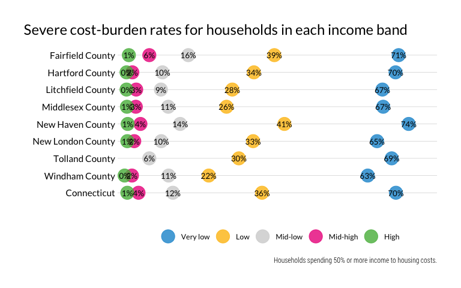

Households desiring housing
================

This analysis needs a better name. “Households desiring housing” to me
suggests a household wants to move or is unhoused. Maybe just
“households by income and affordable housing units” or something? Kind
of a mouthful…

There’s a lot going on in this notebook:

  - Count and share of households by income band, and further:
      - households by income band by race
      - households by income band by presence of inhabitant with
        disability
  - The kinds of occupations/jobs those household members work in
  - Count and share of households in each band that are cost-burdened
  - Average housing-cost-to-income ratio for each income band
  - Average actual housing cost by cost band
  - Approximate monthly housing cost range for an affordable unit (30%)
    for each income band (henceforth cost bands)
  - Number of households in each income band versus what cost band they
    pay into
  - Count and share of units by cost bands
  - Vacant units in each cost band
  - Number of housing units needed in each cost band so each household
    would have an affordable housing cost, vs. the actual count of units
    in those cost bands. In other words, total households by income band
    versus total units in each cost band.

## Establish groups

After discussion with team on 7/15 we will use median household income
by county and the groupings below. I’m not committed to these names but
needed a convenient shorthand for the analysis.

  - Very low income: \<= 0.3 CMI
  - Low income: (0.3–0.5\] CMI
  - Mid-low income: (0.5–.8\] CMI
  - Mid-high income: (.8–1.2\] CMI
  - High income: \> 1.2 CMI

Cost-burden in predictable breaks:

  - No burden: \<30% income to housing
  - Cost-burdened: \[30%-50%) income to housing
  - Severely cost-burdened: \>=50% income to housing

And race/ethnicity into a few major categories so we can look at it by
county:

  - White (NH)
  - Black (NH)
  - Latino (any race)
  - All others (grouped)

**Add flag for any inhabitant with a disability (should this be further
pared down by type, e.g., ambulatory vs. sensory vs. other vs. none?)**

## Define income bands

Would it be better to use pretty breaks or the same breaks for all
counties? I’m leaving it as-is, assuming we will put just CT in the main
report text but include counties in the appendix.

<table>

<caption>

Income ranges by income band and area

</caption>

<thead>

<tr>

<th style="text-align:left;">

Name

</th>

<th style="text-align:left;">

Very low

</th>

<th style="text-align:left;">

Low

</th>

<th style="text-align:left;">

Mid-low

</th>

<th style="text-align:left;">

Mid-high

</th>

<th style="text-align:left;">

High

</th>

</tr>

</thead>

<tbody>

<tr>

<td style="text-align:left;">

Fairfield County

</td>

<td style="text-align:left;">

Less than $28,694

</td>

<td style="text-align:left;">

Between $28,694 and $47,822

</td>

<td style="text-align:left;">

Between $47,822 and $76,516

</td>

<td style="text-align:left;">

Between $76,516 and $114,774

</td>

<td style="text-align:left;">

More than $114,774

</td>

</tr>

<tr>

<td style="text-align:left;">

Hartford County

</td>

<td style="text-align:left;">

Less than $22,544

</td>

<td style="text-align:left;">

Between $22,544 and $37,574

</td>

<td style="text-align:left;">

Between $37,574 and $60,118

</td>

<td style="text-align:left;">

Between $60,118 and $90,178

</td>

<td style="text-align:left;">

More than $90,178

</td>

</tr>

<tr>

<td style="text-align:left;">

Litchfield County

</td>

<td style="text-align:left;">

Less than $23,972

</td>

<td style="text-align:left;">

Between $23,972 and $39,953

</td>

<td style="text-align:left;">

Between $39,953 and $63,925

</td>

<td style="text-align:left;">

Between $63,925 and $95,887

</td>

<td style="text-align:left;">

More than $95,887

</td>

</tr>

<tr>

<td style="text-align:left;">

Middlesex County

</td>

<td style="text-align:left;">

Less than $25,769

</td>

<td style="text-align:left;">

Between $25,769 and $42,949

</td>

<td style="text-align:left;">

Between $42,949 and $68,718

</td>

<td style="text-align:left;">

Between $68,718 and $103,078

</td>

<td style="text-align:left;">

More than $103,078

</td>

</tr>

<tr>

<td style="text-align:left;">

New Haven County

</td>

<td style="text-align:left;">

Less than $20,972

</td>

<td style="text-align:left;">

Between $20,972 and $34,952

</td>

<td style="text-align:left;">

Between $34,952 and $55,924

</td>

<td style="text-align:left;">

Between $55,924 and $83,886

</td>

<td style="text-align:left;">

More than $83,886

</td>

</tr>

<tr>

<td style="text-align:left;">

New London County

</td>

<td style="text-align:left;">

Less than $22,047

</td>

<td style="text-align:left;">

Between $22,047 and $36,745

</td>

<td style="text-align:left;">

Between $36,745 and $58,792

</td>

<td style="text-align:left;">

Between $58,792 and $88,188

</td>

<td style="text-align:left;">

More than $88,188

</td>

</tr>

<tr>

<td style="text-align:left;">

Tolland County

</td>

<td style="text-align:left;">

Less than $26,121

</td>

<td style="text-align:left;">

Between $26,121 and $43,534

</td>

<td style="text-align:left;">

Between $43,534 and $69,655

</td>

<td style="text-align:left;">

Between $69,655 and $104,483

</td>

<td style="text-align:left;">

More than $104,483

</td>

</tr>

<tr>

<td style="text-align:left;">

Windham County

</td>

<td style="text-align:left;">

Less than $19,965

</td>

<td style="text-align:left;">

Between $19,965 and $33,275

</td>

<td style="text-align:left;">

Between $33,275 and $53,240

</td>

<td style="text-align:left;">

Between $53,240 and $79,860

</td>

<td style="text-align:left;">

More than $79,860

</td>

</tr>

<tr>

<td style="text-align:left;">

Connecticut

</td>

<td style="text-align:left;">

Less than $23,533

</td>

<td style="text-align:left;">

Between $23,533 and $39,222

</td>

<td style="text-align:left;">

Between $39,222 and $62,755

</td>

<td style="text-align:left;">

Between $62,755 and $94,133

</td>

<td style="text-align:left;">

More than $94,133

</td>

</tr>

</tbody>

</table>

## Count/share of households by income band

Because the groupings are granular only at the lower income extreme,
High income households *vastly* outnumber lower income households.

FYI, I did look at this by county, and each was very consistent in it
distribution. High income was more than 40% with the rest somewhere
between 10% and 20%. See table below.

<!-- -->

<table>

<caption>

Number of households by income band

</caption>

<thead>

<tr>

<th style="text-align:left;">

Name

</th>

<th style="text-align:left;">

Very low

</th>

<th style="text-align:left;">

Low

</th>

<th style="text-align:left;">

Mid-low

</th>

<th style="text-align:left;">

Mid-high

</th>

<th style="text-align:left;">

High

</th>

<th style="text-align:left;">

Total

</th>

</tr>

</thead>

<tbody>

<tr>

<td style="text-align:left;">

Fairfield County

</td>

<td style="text-align:left;">

56,984

</td>

<td style="text-align:left;">

40,088

</td>

<td style="text-align:left;">

50,351

</td>

<td style="text-align:left;">

53,938

</td>

<td style="text-align:left;">

139,131

</td>

<td style="text-align:left;">

340,492

</td>

</tr>

<tr>

<td style="text-align:left;">

Hartford County

</td>

<td style="text-align:left;">

55,051

</td>

<td style="text-align:left;">

39,071

</td>

<td style="text-align:left;">

56,021

</td>

<td style="text-align:left;">

61,014

</td>

<td style="text-align:left;">

137,906

</td>

<td style="text-align:left;">

349,063

</td>

</tr>

<tr>

<td style="text-align:left;">

Litchfield County

</td>

<td style="text-align:left;">

8,847

</td>

<td style="text-align:left;">

8,733

</td>

<td style="text-align:left;">

12,626

</td>

<td style="text-align:left;">

14,651

</td>

<td style="text-align:left;">

29,130

</td>

<td style="text-align:left;">

73,987

</td>

</tr>

<tr>

<td style="text-align:left;">

Middlesex County

</td>

<td style="text-align:left;">

9,549

</td>

<td style="text-align:left;">

7,575

</td>

<td style="text-align:left;">

10,848

</td>

<td style="text-align:left;">

12,205

</td>

<td style="text-align:left;">

26,716

</td>

<td style="text-align:left;">

66,893

</td>

</tr>

<tr>

<td style="text-align:left;">

New Haven County

</td>

<td style="text-align:left;">

49,589

</td>

<td style="text-align:left;">

38,492

</td>

<td style="text-align:left;">

53,398

</td>

<td style="text-align:left;">

55,593

</td>

<td style="text-align:left;">

132,784

</td>

<td style="text-align:left;">

329,856

</td>

</tr>

<tr>

<td style="text-align:left;">

New London County

</td>

<td style="text-align:left;">

14,624

</td>

<td style="text-align:left;">

11,564

</td>

<td style="text-align:left;">

18,384

</td>

<td style="text-align:left;">

20,538

</td>

<td style="text-align:left;">

42,292

</td>

<td style="text-align:left;">

107,402

</td>

</tr>

<tr>

<td style="text-align:left;">

Tolland County

</td>

<td style="text-align:left;">

8,039

</td>

<td style="text-align:left;">

6,656

</td>

<td style="text-align:left;">

8,266

</td>

<td style="text-align:left;">

10,949

</td>

<td style="text-align:left;">

21,308

</td>

<td style="text-align:left;">

55,218

</td>

</tr>

<tr>

<td style="text-align:left;">

Windham County

</td>

<td style="text-align:left;">

6,047

</td>

<td style="text-align:left;">

4,626

</td>

<td style="text-align:left;">

7,705

</td>

<td style="text-align:left;">

8,619

</td>

<td style="text-align:left;">

17,466

</td>

<td style="text-align:left;">

44,463

</td>

</tr>

<tr>

<td style="text-align:left;">

Connecticut

</td>

<td style="text-align:left;">

208,730

</td>

<td style="text-align:left;">

156,805

</td>

<td style="text-align:left;">

217,599

</td>

<td style="text-align:left;">

237,507

</td>

<td style="text-align:left;">

546,733

</td>

<td style="text-align:left;">

1,367,374

</td>

</tr>

</tbody>

</table>

## Household characteristics by income bands

### Race breakdowns

In the charts below, I’m considering race/ethnicity of head of
household. Statewide, a quarter of all households headed by a Black or
Latino person are very low income, earning less than 30% of the county
household median income, compared to just over a tenth of households
headed by a white person. Some variation exists by county. In the three
largest counties, half of white households are high income.

**Other thoughts for later: Should pivot the data… share of race by
income band rather than share of income band by race. We have lots of
cost burden by race data elsewhere, could pull something in from HER. I
hesitate to divide it up too much more than this, so more of an equity
implication than an analysis crosstab.**

<!-- -->

Here’s that chart pivoted so the numerator is the population by race of
HOH of a given income band and the denominator is the total population
of that income band. This is less helpful for less populous counties.
<!-- -->

### Disability

**For breakouts by disability type, see disability.Rmd in notebooks
folder on repo**

### Jobs held by household occupants

Retrieved a list of 2018 occ codes from the Census Bureau at
<https://www.census.gov/topics/employment/industry-occupation/guidance/code-lists.html>.

This table lists the top five occupations, in order from the most
numerous, for household inhabitants—so not just heads of household, but
all household members, including inhabitants with no work experience in
the past 5 years or who have never worked—by household income band by
county.

To be honest, this is a little surprising in places. I expected more
service industry workers in FC and NHC, and I’m surprised at how many
elementary and middle school teachers are workers in higher income
households. Either I have the exact wrong impression of how much
teachers are paid or it’s a common occupation for people whose
partners/spouses pull in big money. And yet, \#thestruggle: adjuncts and
GAs in Tolland County (UConn) getting those minimum wage grad school
stipends while profs in Middlesex Counties make six figures teaching
half the load.

**Mark brought up a good point about common occupations (like teachers,
cashiers) present in each income band. If this is used in the report, it
might be best to just look at the output table and cherry pick some
representative occupations.**

**An alternative approach, similar to I think what was used in the DC
report, is to look at like QWI data to determine which occupations’
average salaries in each county most closely align with the income band.
However, that’s an individual’s salary versus a household’s income.**

<table>

<caption>

Common occupations for workers by household income band

</caption>

<thead>

<tr>

<th style="text-align:left;">

Name

</th>

<th style="text-align:left;">

Very low

</th>

<th style="text-align:left;">

Low

</th>

<th style="text-align:left;">

Mid-low

</th>

<th style="text-align:left;">

Mid-high

</th>

<th style="text-align:left;">

High

</th>

</tr>

</thead>

<tbody>

<tr>

<td style="text-align:left;">

Fairfield County

</td>

<td style="text-align:left;">

Cashiers; Unemployed, with no work experience in the last 5 years or
earlier or never worked; Maids and housekeeping cleaners; Childcare
workers; Landscaping and groundskeeping workers

</td>

<td style="text-align:left;">

Maids and housekeeping cleaners; Landscaping and groundskeeping workers;
Janitors and building cleaners; Cashiers; Nursing assistants

</td>

<td style="text-align:left;">

Cashiers; Maids and housekeeping cleaners; Janitors and building
cleaners; Secretaries and administrative assistants, except legal,
medical, and executive; Retail salespersons

</td>

<td style="text-align:left;">

Elementary and middle school teachers; Cashiers; Retail salespersons;
Managers, all other; Secretaries and administrative assistants, except
legal, medical, and executive

</td>

<td style="text-align:left;">

Managers, all other; Elementary and middle school teachers; Accountants
and auditors; Financial managers; Chief executives

</td>

</tr>

<tr>

<td style="text-align:left;">

Hartford County

</td>

<td style="text-align:left;">

Cashiers; Unemployed, with no work experience in the last 5 years or
earlier or never worked; Janitors and building cleaners; Personal care
aides; Nursing assistants

</td>

<td style="text-align:left;">

Cashiers; Janitors and building cleaners; Nursing assistants;
Unemployed, with no work experience in the last 5 years or earlier or
never worked; Retail salespersons

</td>

<td style="text-align:left;">

Cashiers; Retail salespersons; Unemployed, with no work experience in
the last 5 years or earlier or never worked; Nursing assistants;
Secretaries and administrative assistants, except legal, medical, and
executive

</td>

<td style="text-align:left;">

Cashiers; Janitors and building cleaners; Secretaries and administrative
assistants, except legal, medical, and executive; First-Line supervisors
of retail sales workers; Customer service representatives

</td>

<td style="text-align:left;">

Managers, all other; Elementary and middle school teachers; Registered
nurses; Accountants and auditors; Secretaries and administrative
assistants, except legal, medical, and executive

</td>

</tr>

<tr>

<td style="text-align:left;">

Litchfield County

</td>

<td style="text-align:left;">

Retail salespersons; Laborers and freight, stock, and material movers,
hand; Personal care aides; Cashiers; Janitors and building cleaners

</td>

<td style="text-align:left;">

Janitors and building cleaners; First-Line supervisors of retail sales
workers; Personal care aides; Waiters and waitresses; Customer service
representatives

</td>

<td style="text-align:left;">

Janitors and building cleaners; Secretaries and administrative
assistants, except legal, medical, and executive; Cashiers; Driver/sales
workers and truck drivers; Waiters and waitresses

</td>

<td style="text-align:left;">

First-Line supervisors of retail sales workers; Elementary and middle
school teachers; Landscaping and groundskeeping workers; Retail
salespersons; Customer service representatives

</td>

<td style="text-align:left;">

Elementary and middle school teachers; Managers, all other; Registered
nurses; Chief executives; First-Line supervisors of retail sales workers

</td>

</tr>

<tr>

<td style="text-align:left;">

Middlesex County

</td>

<td style="text-align:left;">

Customer service representatives; Cashiers; Driver/sales workers and
truck drivers; First-Line supervisors of retail sales workers; Nursing
assistants

</td>

<td style="text-align:left;">

Cashiers; Waiters and waitresses; Office clerks, general; Maids and
housekeeping cleaners; Inspectors, testers, sorters, samplers, and
weighers

</td>

<td style="text-align:left;">

Cashiers; Secretaries and administrative assistants, except legal,
medical, and executive; First-Line supervisors of retail sales workers;
Customer service representatives; Nursing assistants

</td>

<td style="text-align:left;">

Managers, all other; Elementary and middle school teachers; Registered
nurses; Secretaries and administrative assistants, except legal,
medical, and executive; Retail salespersons

</td>

<td style="text-align:left;">

Elementary and middle school teachers; Managers, all other; Registered
nurses; Chief executives; Postsecondary teachers

</td>

</tr>

<tr>

<td style="text-align:left;">

New Haven County

</td>

<td style="text-align:left;">

Unemployed, with no work experience in the last 5 years or earlier or
never worked; Cashiers; Customer service representatives; Janitors and
building cleaners; Personal care aides

</td>

<td style="text-align:left;">

Cashiers; Unemployed, with no work experience in the last 5 years or
earlier or never worked; Personal care aides; Nursing assistants; Retail
salespersons

</td>

<td style="text-align:left;">

Cashiers; Nursing assistants; Retail salespersons; First-Line
supervisors of retail sales workers; Janitors and building cleaners

</td>

<td style="text-align:left;">

Cashiers; Retail salespersons; Janitors and building cleaners;
First-Line supervisors of retail sales workers; Secretaries and
administrative assistants, except legal, medical, and executive

</td>

<td style="text-align:left;">

Elementary and middle school teachers; Managers, all other; Registered
nurses; Secretaries and administrative assistants, except legal,
medical, and executive; First-Line supervisors of retail sales workers

</td>

</tr>

<tr>

<td style="text-align:left;">

New London County

</td>

<td style="text-align:left;">

Maids and housekeeping cleaners; Janitors and building cleaners; Waiters
and waitresses; Cashiers; Unemployed, with no work experience in the
last 5 years or earlier or never worked

</td>

<td style="text-align:left;">

Cashiers; Retail salespersons; Gambling services workers; Janitors and
building cleaners; Cooks

</td>

<td style="text-align:left;">

Janitors and building cleaners; Landscaping and groundskeeping workers;
Cashiers; Driver/sales workers and truck drivers; Cooks

</td>

<td style="text-align:left;">

Secretaries and administrative assistants, except legal, medical, and
executive; Cashiers; Gambling services workers; Elementary and middle
school teachers; Driver/sales workers and truck drivers

</td>

<td style="text-align:left;">

Managers, all other; Elementary and middle school teachers; Military
enlisted tactical operations and air/weapons specialists and crew
members; Registered nurses; Cashiers

</td>

</tr>

<tr>

<td style="text-align:left;">

Tolland County

</td>

<td style="text-align:left;">

Waiters and waitresses; Postsecondary teachers; Customer service
representatives; Cashiers; Nursing assistants

</td>

<td style="text-align:left;">

Waiters and waitresses; Driver/sales workers and truck drivers;
Receptionists and information clerks; Laborers and freight, stock, and
material movers, hand; Retail salespersons

</td>

<td style="text-align:left;">

Retail salespersons; Driver/sales workers and truck drivers; Teaching
assistants; Nursing assistants; Cashiers

</td>

<td style="text-align:left;">

Accountants and auditors; Elementary and middle school teachers;
Cashiers; Secretaries and administrative assistants, except legal,
medical, and executive; First-Line supervisors of retail sales workers

</td>

<td style="text-align:left;">

Managers, all other; Elementary and middle school teachers; Secretaries
and administrative assistants, except legal, medical, and executive;
Registered nurses; Cashiers

</td>

</tr>

<tr>

<td style="text-align:left;">

Windham County

</td>

<td style="text-align:left;">

Unemployed, with no work experience in the last 5 years or earlier or
never worked; Janitors and building cleaners; Maids and housekeeping
cleaners; Waiters and waitresses; Retail salespersons

</td>

<td style="text-align:left;">

Retail salespersons; Laborers and freight, stock, and material movers,
hand; Personal care aides; Nursing assistants; Driver/sales workers and
truck drivers

</td>

<td style="text-align:left;">

Food preparation workers; Janitors and building cleaners; Driver/sales
workers and truck drivers; Cooks; Other production workers

</td>

<td style="text-align:left;">

Customer service representatives; Nursing assistants; Driver/sales
workers and truck drivers; Secretaries and administrative assistants,
except legal, medical, and executive; Waiters and waitresses

</td>

<td style="text-align:left;">

Registered nurses; Elementary and middle school teachers; Cashiers;
Driver/sales workers and truck drivers; Secretaries and administrative
assistants, except legal, medical, and executive

</td>

</tr>

</tbody>

</table>

## Cost burden by income band

Real quick top level summary of cost burden before we get into the
details.

<!-- -->

This dot plot shows the share of cost burdened households in each income
band. Statewide, almost 90% of Very Low income households pay 30%+
income to housing costs.

<!-- -->

Above, we established 86% of Very Low income households were cost
burdened, so this second dot plot breaks things down by regular and
severe cost burden *(although I don’t think we should do this in the
report\!)*.

**Note, these would add up to 100% if households with no burden were
included, so the chart is read as “16% of very low income households in
Connecticut are cost burdened and another 70% are severely cost
burdened.”**

<!-- -->

By request, just SCB households…

<!-- -->

Quick diversion: is the SCB rate among very low income households
partially explained by some of these households having housing costs and
no/negative negative income?

By definition, the household is in the “Very Low income” income band if
household income is $0 or less because that’s less than 30% CMI. There
are about 15K Very Low income households with no or negative income and
some nonzero housing cost, making them “severely cost burdened” by
definition. These \~15K units make up about 7% of all very low income
households, which is not insignificant, but it’s not the sole motivator
for high SCB rates in this income band.

    ## # A tibble: 2 x 4
    ## # Groups:   income [2]
    ##   income          cost_burden            households households_se
    ##   <chr>           <fct>                       <dbl>         <dbl>
    ## 1 negative_income Severely cost-burdened        366          79.2
    ## 2 no_income       Severely cost-burdened      14470         681.

## Average housing-cost-to-income ratio for each band

Urban’s DC study found that High income households paid about 12% income
to housing, and used that to determine a sliding scale for
affordability. In Connecticut, High income households pay about 16%
income to housing costs. For a household with $200K in income, that’s
about $2667/month, which I just don’t think is that much. For a
household at the lower end of CT’s High income band, earning about
$114K, 16% of income to housing cost would be about $1520/month, which
is just plain offensive to me as a NHV renter.

I don’t think we should assume that because High income households don’t
pay a full 30% that the 16% threshold is what is “affordable” for them.
They *can* pay more, they just *don’t*. Someone earning $114K paying 16%
is the same as someone earning $60K paying 30%. For the sake of fairness
and communication of “affordability,” I think we should do 30% for
everyone.

**7/15:** Talked with the team and I think we’re going to use 30% for
all income bands rather than the sliding scale.

<!-- -->

And finally… what’s the average *actual* housing cost for each band? How
much are households really paying?

The major takeaway is that Very Low and Low income households are paying
too much. Everyone else is right on target. **See table below for
affordable cost ranges.**

<!-- -->

This unlabeled dot plot is a little more esoteric. I looked only at
households whose housing costs exceed 30% of income, and took the
weighted average of the gap between what they actually pay for housing
versus what they should pay at a max affordable (30%) threshold. In
other words, how many dollars per month over 30% are they paying?

Very Low (light green) and High income (dark blue) households spend the
most over the affordable threshold. The average gap for households in
all income bands in FC is over $800/month while in most other counties
the gap falls between $400 and $800/month. Over the course of a year,
that’s an extraordinary amount of money these households are not
spending on other necessities, saving, or investing in other expensive
things like higher ed.

<!-- -->

## Ranges of affordability for each band

Some future iteration of this analysis should find a way to combine this
table with the actual housing costs chart above, but the topline is that
the average actual costs in Low and Very Low income households exceed
the affordable threshold (except low income households in Windham
County). The middle-to-high income households’ average actual housing
cost is within the affordable range.

<table>

<caption>

Affordable monthly housing cost ranges by income band and area

</caption>

<thead>

<tr>

<th style="text-align:left;">

Name

</th>

<th style="text-align:left;">

Very low

</th>

<th style="text-align:left;">

Low

</th>

<th style="text-align:left;">

Mid-low

</th>

<th style="text-align:left;">

Mid-high

</th>

<th style="text-align:left;">

High

</th>

</tr>

</thead>

<tbody>

<tr>

<td style="text-align:left;">

Fairfield County

</td>

<td style="text-align:left;">

Less than $717

</td>

<td style="text-align:left;">

Between $717 and $1,196

</td>

<td style="text-align:left;">

Between $1,196 and $1,913

</td>

<td style="text-align:left;">

Between $1,913 and $2,869

</td>

<td style="text-align:left;">

More than $2,869

</td>

</tr>

<tr>

<td style="text-align:left;">

Hartford County

</td>

<td style="text-align:left;">

Less than $564

</td>

<td style="text-align:left;">

Between $564 and $939

</td>

<td style="text-align:left;">

Between $939 and $1,503

</td>

<td style="text-align:left;">

Between $1,503 and $2,254

</td>

<td style="text-align:left;">

More than $2,254

</td>

</tr>

<tr>

<td style="text-align:left;">

Litchfield County

</td>

<td style="text-align:left;">

Less than $599

</td>

<td style="text-align:left;">

Between $599 and $999

</td>

<td style="text-align:left;">

Between $999 and $1,598

</td>

<td style="text-align:left;">

Between $1,598 and $2,397

</td>

<td style="text-align:left;">

More than $2,397

</td>

</tr>

<tr>

<td style="text-align:left;">

Middlesex County

</td>

<td style="text-align:left;">

Less than $644

</td>

<td style="text-align:left;">

Between $644 and $1,074

</td>

<td style="text-align:left;">

Between $1,074 and $1,718

</td>

<td style="text-align:left;">

Between $1,718 and $2,577

</td>

<td style="text-align:left;">

More than $2,577

</td>

</tr>

<tr>

<td style="text-align:left;">

New Haven County

</td>

<td style="text-align:left;">

Less than $524

</td>

<td style="text-align:left;">

Between $524 and $874

</td>

<td style="text-align:left;">

Between $874 and $1,398

</td>

<td style="text-align:left;">

Between $1,398 and $2,097

</td>

<td style="text-align:left;">

More than $2,097

</td>

</tr>

<tr>

<td style="text-align:left;">

New London County

</td>

<td style="text-align:left;">

Less than $551

</td>

<td style="text-align:left;">

Between $551 and $919

</td>

<td style="text-align:left;">

Between $919 and $1,470

</td>

<td style="text-align:left;">

Between $1,470 and $2,205

</td>

<td style="text-align:left;">

More than $2,205

</td>

</tr>

<tr>

<td style="text-align:left;">

Tolland County

</td>

<td style="text-align:left;">

Less than $653

</td>

<td style="text-align:left;">

Between $653 and $1,088

</td>

<td style="text-align:left;">

Between $1,088 and $1,741

</td>

<td style="text-align:left;">

Between $1,741 and $2,612

</td>

<td style="text-align:left;">

More than $2,612

</td>

</tr>

<tr>

<td style="text-align:left;">

Windham County

</td>

<td style="text-align:left;">

Less than $499

</td>

<td style="text-align:left;">

Between $499 and $832

</td>

<td style="text-align:left;">

Between $832 and $1,331

</td>

<td style="text-align:left;">

Between $1,331 and $1,996

</td>

<td style="text-align:left;">

More than $1,996

</td>

</tr>

<tr>

<td style="text-align:left;">

Connecticut

</td>

<td style="text-align:left;">

Less than $588

</td>

<td style="text-align:left;">

Between $588 and $981

</td>

<td style="text-align:left;">

Between $981 and $1,569

</td>

<td style="text-align:left;">

Between $1,569 and $2,353

</td>

<td style="text-align:left;">

More than $2,353

</td>

</tr>

</tbody>

</table>

## What income band do households live in, what cost band do they pay in?

There are many more higher income households than units in that cost
band, so high income households have to occupy housing affordable to
lower-income households. Likewise, the same holds at the other extreme:
there are many more very low income households than very low income
units and they have to occupy more expensive housing than they can
afford.

Knowing that households paying into a cost band are a subset of
households across many income bands, here’s a heat map of households by
income band and the cost band they pay into. Add each row and you’ll get
the total number of households in each income band. Add each column and
you’ll get the total of all households in each cost band.

There are a couple caveats… people who own their homes outright and just
have some utility costs are usually in the Very Low cost band but may be
in any income band. There are also a fair amount of people who are high
income but have $0 cash rents (I guess their company owns their
apartments and they live rent free?) who would be in the Very Low cost
band.

<!-- -->

## How many housing units are in each cost bands

Further establishing that there’s a need for housing in lower cost
bands, how many units exist in each band? This adds vacants to the
occupied units above.

Vacant apartments and homes for sale have imputed costs based on
contract rent plus imputed utilities (see below), and homes for sale had
owner-costs imputed based on county average mortgage rates (2019 HMDA
data for approved first lien mortgages for homes intended for owner
occupancy), the median mill rate for each county, and imputed utility
costs.

I used a ratio of RENTGRS to RENT to determine how much utilities run on
top of contract rent (by county). I can’t think of a similar way to do
that for homes for sale so I used the same ratio for owner units, too.

In addition to the occupied units we’ve already looked at, this chart
adds two categories of vacant units: “Vacant-On market” units are listed
as “For rent or sale” or “For sale only,” and “Vacant-Off market” are
vacant units that have been sold or rented but are not yet occupied.

**8/13** Removed off market units from chart.

<!-- -->

<!-- -->

There are two other major vacancy categories, “Other vacant” and “For
seasonal, recreational, or other occasional use,” but there’s no cost
information associated with those units, so they can’t be sorted into
the appropriate cost bands. Another minor category are housing units
reserved for migrant farm workers. Collectively, these comprise about
83,000 units, which is a ton by CT standards. The cities of Bridgeport,
New Haven, and Hartford all have about 50,000 units each.

    ## # A tibble: 3 x 2
    ##   vacancy                                             hhwt
    ##   <fct>                                              <dbl>
    ## 1 For seasonal, recreational or other occasional use 29578
    ## 2 For migrant farm workers                             129
    ## 3 Other vacant                                       53438

## Households who need housing in each cost band

This bar chart is the major summary of this analysis. It shows occupied
units in each income band versus units available in their cost band. In
essence, the households in each income band need a unit in their cost
band.

The data show significant gaps in the extremes… Very Low and High income
households do not have enough units in their affordability range (though
with High income households I think we care less about whether they have
enough high cost units and more that they aren’t squeezing the middle
out of a place to live).

While there are a lot of middle income units, competition for those
units is coming from above and below. More housing units in the Very Low
range are absolutely needed. Since High income households tend to want
to pay less than 30% for housing, more (well-located and not just single
family) mid-high units could help alleviate some strain on the middle
income households.

<!-- -->

    ## $hh_by_inc_band
    ## # A tibble: 54 x 9
    ## # Groups:   level, name [9]
    ##    level  name    inc_band  value value_se statefip.x statefip.y  share sharemoe
    ##    <fct>  <chr>   <fct>     <dbl>    <dbl>  <int+lbl>  <int+lbl>  <dbl>    <dbl>
    ##  1 1_sta… Connec… Total    1.37e6    3502.         NA NA         NA       NA    
    ##  2 1_sta… Connec… Very low 2.09e5    2437.         NA  9 [Conne…  0.153    0.002
    ##  3 1_sta… Connec… Low      1.57e5    2107.         NA  9 [Conne…  0.115    0.002
    ##  4 1_sta… Connec… Mid-low  2.18e5    2461.         NA  9 [Conne…  0.159    0.002
    ##  5 1_sta… Connec… Mid-high 2.38e5    2451.         NA  9 [Conne…  0.174    0.002
    ##  6 1_sta… Connec… High     5.47e5    3103.         NA  9 [Conne…  0.4      0.002
    ##  7 2_cou… Fairfi… Total    3.40e5    2753.         NA NA         NA       NA    
    ##  8 2_cou… Fairfi… Very low 5.70e4    1332.         NA NA          0.167    0.004
    ##  9 2_cou… Fairfi… Low      4.01e4    1100.         NA NA          0.118    0.003
    ## 10 2_cou… Fairfi… Mid-low  5.04e4    1186.         NA NA          0.148    0.003
    ## # … with 44 more rows
    ## 
    ## $income_ranges
    ## # A tibble: 9 x 6
    ##   Name      `Very low`    Low           `Mid-low`      `Mid-high`      High     
    ##   <chr>     <chr>         <chr>         <chr>          <chr>           <chr>    
    ## 1 Fairfiel… Less than $2… Between $28,… Between $47,8… Between $76,51… More tha…
    ## 2 Hartford… Less than $2… Between $22,… Between $37,5… Between $60,11… More tha…
    ## 3 Litchfie… Less than $2… Between $23,… Between $39,9… Between $63,92… More tha…
    ## 4 Middlese… Less than $2… Between $25,… Between $42,9… Between $68,71… More tha…
    ## 5 New Have… Less than $2… Between $20,… Between $34,9… Between $55,92… More tha…
    ## 6 New Lond… Less than $2… Between $22,… Between $36,7… Between $58,79… More tha…
    ## 7 Tolland … Less than $2… Between $26,… Between $43,5… Between $69,65… More tha…
    ## 8 Windham … Less than $1… Between $19,… Between $33,2… Between $53,24… More tha…
    ## 9 Connecti… Less than $2… Between $23,… Between $39,2… Between $62,75… More tha…
    ## 
    ## $hh_by_race_inc_band
    ## # A tibble: 216 x 10
    ## # Groups:   level, name, race2 [36]
    ##    level name  race2 inc_band  value value_se statefip.x statefip.y  share
    ##    <fct> <chr> <fct> <fct>     <dbl>    <dbl>  <int+lbl>  <int+lbl>  <dbl>
    ##  1 1_st… Conn… White Total    996437    3346. NA         NA         NA    
    ##  2 1_st… Conn… White Very low 117488    1748.  9 [Conne…  9 [Conne…  0.118
    ##  3 1_st… Conn… White Low      100645    1584.  9 [Conne…  9 [Conne…  0.101
    ##  4 1_st… Conn… White Mid-low  147671    1923.  9 [Conne…  9 [Conne…  0.148
    ##  5 1_st… Conn… White Mid-high 176546    2017.  9 [Conne…  9 [Conne…  0.177
    ##  6 1_st… Conn… White High     454087    2814.  9 [Conne…  9 [Conne…  0.456
    ##  7 1_st… Conn… Black Total    125094    2102. NA         NA         NA    
    ##  8 1_st… Conn… Black Very low  33474    1100.  9 [Conne…  9 [Conne…  0.268
    ##  9 1_st… Conn… Black Low       20070     886.  9 [Conne…  9 [Conne…  0.16 
    ## 10 1_st… Conn… Black Mid-low   24128     946.  9 [Conne…  9 [Conne…  0.193
    ## # … with 206 more rows, and 1 more variable: sharemoe <dbl>
    ## 
    ## $pivot_race_inc_band
    ## # A tibble: 270 x 4
    ##    name        race2 inc_band  value
    ##    <chr>       <chr> <fct>     <dbl>
    ##  1 Connecticut White Total    996437
    ##  2 Connecticut White Very low 117488
    ##  3 Connecticut White Low      100645
    ##  4 Connecticut White Mid-low  147671
    ##  5 Connecticut White Mid-high 176546
    ##  6 Connecticut White High     454087
    ##  7 Connecticut Black Total    125094
    ##  8 Connecticut Black Very low  33474
    ##  9 Connecticut Black Low       20070
    ## 10 Connecticut Black Mid-low   24128
    ## # … with 260 more rows
    ## 
    ## $common_jobs_by_inc_band
    ## # A tibble: 401 x 6
    ## # Groups:   name, inc_band [40]
    ##    level   name       inc_band workers   occ occ_label                          
    ##    <chr>   <chr>      <fct>      <dbl> <int> <chr>                              
    ##  1 2_coun… Fairfield… Very low    2850  4720 Cashiers                           
    ##  2 2_coun… Fairfield… Very low    2121  9920 Unemployed, with no work experienc…
    ##  3 2_coun… Fairfield… Very low    2039  4230 Maids and housekeeping cleaners    
    ##  4 2_coun… Fairfield… Very low    1366  4600 Childcare workers                  
    ##  5 2_coun… Fairfield… Very low    1306  4251 Landscaping and groundskeeping wor…
    ##  6 2_coun… Fairfield… Very low    1282  4760 Retail salespersons                
    ##  7 2_coun… Fairfield… Very low    1280  4220 Janitors and building cleaners     
    ##  8 2_coun… Fairfield… Very low    1250  3602 Personal care aides                
    ##  9 2_coun… Fairfield… Very low    1221  3603 Nursing assistants                 
    ## 10 2_coun… Fairfield… Very low     866  4020 Cooks                              
    ## # … with 391 more rows
    ## 
    ## $cb_by_inc_band
    ## # A tibble: 178 x 10
    ## # Groups:   level, name, inc_band [45]
    ##    level name  inc_band cost_burden  value value_se statefip.x statefip.y  share
    ##    <fct> <chr> <fct>    <fct>        <dbl>    <dbl>  <int+lbl>  <int+lbl>  <dbl>
    ##  1 1_st… Conn… Very low Total       208730    2437. NA         NA         NA    
    ##  2 1_st… Conn… Very low No burden    29601     962.  9 [Conne…  9 [Conne…  0.142
    ##  3 1_st… Conn… Very low Cost-burde…  33506     996.  9 [Conne…  9 [Conne…  0.161
    ##  4 1_st… Conn… Very low Severely c… 145623    2076.  9 [Conne…  9 [Conne…  0.698
    ##  5 1_st… Conn… Low      Total       156805    2107. NA         NA         NA    
    ##  6 1_st… Conn… Low      No burden    39386    1014.  9 [Conne…  9 [Conne…  0.251
    ##  7 1_st… Conn… Low      Cost-burde…  64752    1411.  9 [Conne…  9 [Conne…  0.413
    ##  8 1_st… Conn… Low      Severely c…  52667    1284.  9 [Conne…  9 [Conne…  0.336
    ##  9 1_st… Conn… Mid-low  Total       217599    2461. NA         NA         NA    
    ## 10 1_st… Conn… Mid-low  No burden   112667    1779.  9 [Conne…  9 [Conne…  0.518
    ## # … with 168 more rows, and 1 more variable: sharemoe <dbl>
    ## 
    ## $cb_shares
    ## # A tibble: 27 x 5
    ##    level      name              cost_burden             value share
    ##    <fct>      <chr>             <fct>                   <dbl> <dbl>
    ##  1 1_state    Connecticut       No burden              876299 0.641
    ##  2 1_state    Connecticut       Cost-burdened          256442 0.188
    ##  3 1_state    Connecticut       Severely cost-burdened 234633 0.172
    ##  4 2_counties Fairfield County  No burden              205374 0.603
    ##  5 2_counties Fairfield County  Cost-burdened           67587 0.198
    ##  6 2_counties Fairfield County  Severely cost-burdened  67531 0.198
    ##  7 2_counties Hartford County   No burden              230189 0.659
    ##  8 2_counties Hartford County   Cost-burdened           61851 0.177
    ##  9 2_counties Hartford County   Severely cost-burdened  57023 0.163
    ## 10 2_counties Litchfield County No burden               50980 0.689
    ## # … with 17 more rows
    ## 
    ## $cb_rates_inc_band
    ## # A tibble: 135 x 6
    ## # Groups:   level, name, inc_band [45]
    ##    level   name        inc_band cost_burden  value  share
    ##    <fct>   <chr>       <fct>    <fct>        <dbl>  <dbl>
    ##  1 1_state Connecticut Very low Total       208730 NA    
    ##  2 1_state Connecticut Very low No burden    29601  0.142
    ##  3 1_state Connecticut Very low Burden      179129  0.858
    ##  4 1_state Connecticut Low      Total       156805 NA    
    ##  5 1_state Connecticut Low      No burden    39386  0.251
    ##  6 1_state Connecticut Low      Burden      117419  0.749
    ##  7 1_state Connecticut Mid-low  Total       217599 NA    
    ##  8 1_state Connecticut Mid-low  No burden   112667  0.518
    ##  9 1_state Connecticut Mid-low  Burden      104932  0.482
    ## 10 1_state Connecticut Mid-high Total       237507 NA    
    ## # … with 125 more rows
    ## 
    ## $avg_cost_ratio_inc_band
    ## # A tibble: 45 x 4
    ## # Groups:   name [9]
    ##    name             inc_band wm_cb level     
    ##    <chr>            <fct>    <dbl> <chr>     
    ##  1 Fairfield County Very low 0.710 2_counties
    ##  2 Fairfield County Low      0.466 2_counties
    ##  3 Fairfield County Mid-low  0.346 2_counties
    ##  4 Fairfield County Mid-high 0.265 2_counties
    ##  5 Fairfield County High     0.167 2_counties
    ##  6 Hartford County  Very low 0.698 2_counties
    ##  7 Hartford County  Low      0.433 2_counties
    ##  8 Hartford County  Mid-low  0.310 2_counties
    ##  9 Hartford County  Mid-high 0.226 2_counties
    ## 10 Hartford County  High     0.154 2_counties
    ## # … with 35 more rows
    ## 
    ## $avg_cost_inc_band
    ## # A tibble: 45 x 4
    ## # Groups:   name [9]
    ##    name             inc_band wm_cost level     
    ##    <chr>            <fct>      <dbl> <chr>     
    ##  1 Connecticut      Very low   1003. 1_state   
    ##  2 Connecticut      Low        1214. 1_state   
    ##  3 Connecticut      Mid-low    1368. 1_state   
    ##  4 Connecticut      Mid-high   1580. 1_state   
    ##  5 Connecticut      High       2311. 1_state   
    ##  6 Fairfield County Very low   1235. 2_counties
    ##  7 Fairfield County Low        1554. 2_counties
    ##  8 Fairfield County Mid-low    1767. 2_counties
    ##  9 Fairfield County Mid-high   2071. 2_counties
    ## 10 Fairfield County High       3226. 2_counties
    ## # … with 35 more rows
    ## 
    ## $affordable_cost_table
    ## # A tibble: 9 x 6
    ##   Name       `Very low`   Low          `Mid-low`       `Mid-high`      High     
    ##   <chr>      <chr>        <chr>        <chr>           <chr>           <chr>    
    ## 1 Fairfield… Less than $… Between $71… Between $1,196… Between $1,913… More tha…
    ## 2 Hartford … Less than $… Between $56… Between $939 a… Between $1,503… More tha…
    ## 3 Litchfiel… Less than $… Between $59… Between $999 a… Between $1,598… More tha…
    ## 4 Middlesex… Less than $… Between $64… Between $1,074… Between $1,718… More tha…
    ## 5 New Haven… Less than $… Between $52… Between $874 a… Between $1,398… More tha…
    ## 6 New Londo… Less than $… Between $55… Between $919 a… Between $1,470… More tha…
    ## 7 Tolland C… Less than $… Between $65… Between $1,088… Between $1,741… More tha…
    ## 8 Windham C… Less than $… Between $49… Between $832 a… Between $1,331… More tha…
    ## 9 Connectic… Less than $… Between $58… Between $981 a… Between $1,569… More tha…
    ## 
    ## $all_units_inc_and_cost_bands
    ## # A tibble: 70,616 x 6
    ## # Groups:   name [8]
    ##     hhwt name               minc inc_band hcost cost_band
    ##    <dbl> <chr>             <dbl> <fct>    <int> <chr>    
    ##  1    16 Fairfield County  95645 Mid-high  4208 High     
    ##  2    11 New London County 73490 Mid-high  2169 Mid-high 
    ##  3    21 New London County 73490 Mid-high   551 Very low 
    ##  4    19 New Haven County  69905 High      6607 High     
    ##  5    24 New Haven County  69905 High      1176 Mid-low  
    ##  6    15 Fairfield County  95645 High      4908 High     
    ##  7     7 New London County 73490 High      4140 High     
    ##  8    16 Hartford County   75148 High      1853 Mid-high 
    ##  9     6 New London County 73490 Low       6546 High     
    ## 10    12 Hartford County   75148 Mid-low    767 Low      
    ## # … with 70,606 more rows
    ## 
    ## $units_by_cost_and_income
    ## # A tibble: 90 x 5
    ## # Groups:   name [9]
    ##    name             inc_band group       value level     
    ##    <chr>            <chr>    <chr>       <dbl> <chr>     
    ##  1 Fairfield County High     households 139131 2_counties
    ##  2 Fairfield County High     units       85776 2_counties
    ##  3 Fairfield County Low      households  40088 2_counties
    ##  4 Fairfield County Low      units       54655 2_counties
    ##  5 Fairfield County Mid-high households  53938 2_counties
    ##  6 Fairfield County Mid-high units       81076 2_counties
    ##  7 Fairfield County Mid-low  households  50351 2_counties
    ##  8 Fairfield County Mid-low  units       88441 2_counties
    ##  9 Fairfield County Very low households  56984 2_counties
    ## 10 Fairfield County Very low units       30544 2_counties
    ## # … with 80 more rows
    ## 
    ## $hh_cost_band_vs_units_cost_band
    ## # A tibble: 25 x 3
    ## # Groups:   inc_band [5]
    ##    inc_band cost_band units
    ##    <fct>    <fct>     <dbl>
    ##  1 Very low High       8328
    ##  2 Very low Low       57631
    ##  3 Very low Mid-high  20463
    ##  4 Very low Mid-low   61347
    ##  5 Very low Very low  60961
    ##  6 Low      High       7402
    ##  7 Low      Low       47355
    ##  8 Low      Mid-high  23758
    ##  9 Low      Mid-low   59829
    ## 10 Low      Very low  18461
    ## # … with 15 more rows
    ## 
    ## $units_by_tenure_occupancy_cost_band
    ## # A tibble: 252 x 5
    ## # Groups:   name, tenure, occupancy [54]
    ##    name             tenure occupancy cost_band units
    ##    <chr>            <chr>  <fct>     <fct>     <dbl>
    ##  1 Fairfield County owner  occupied  high      76980
    ##  2 Fairfield County owner  occupied  mid_high  59518
    ##  3 Fairfield County owner  occupied  mid_low   44969
    ##  4 Fairfield County owner  occupied  low       32580
    ##  5 Fairfield County owner  occupied  very_low  12069
    ##  6 Hartford County  owner  occupied  high      52582
    ##  7 Hartford County  owner  occupied  mid_high  68044
    ##  8 Hartford County  owner  occupied  mid_low   54348
    ##  9 Hartford County  owner  occupied  low       40030
    ## 10 Hartford County  owner  occupied  very_low   8358
    ## # … with 242 more rows
    ## 
    ## $units_and_households
    ## # A tibble: 90 x 4
    ##    name        band     group       value
    ##    <chr>       <fct>    <chr>       <dbl>
    ##  1 Connecticut Very low households 208730
    ##  2 Connecticut Very low units      122020
    ##  3 Connecticut Low      households 156805
    ##  4 Connecticut Low      units      251752
    ##  5 Connecticut Mid-low  households 217599
    ##  6 Connecticut Mid-low  units      428638
    ##  7 Connecticut Mid-high households 237507
    ##  8 Connecticut Mid-high units      353086
    ##  9 Connecticut High     households 546733
    ## 10 Connecticut High     units      273649
    ## # … with 80 more rows

## Add homeless households?

Mark suggests <https://cceh.org> for subcounty estimates, but I’m not
sure how best to align CANs to counties, so instead I think this should
be separate and included in the statewide count.

Looks like in 2018 there were 2,253 adults-only households, 370
adults-and-children households, and 7 children-only households for a
total of 2,630 households (3,383 people). We should add these households
to very low income units needed.

Source: <https://cceh.org/data/interactive/2018pitdashboard/>
