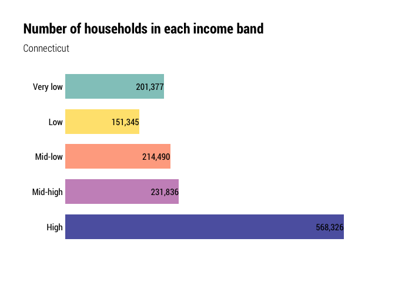
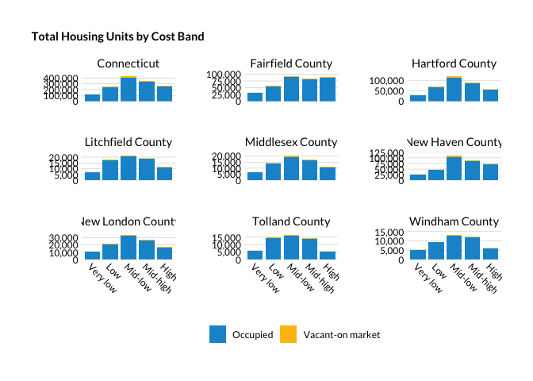
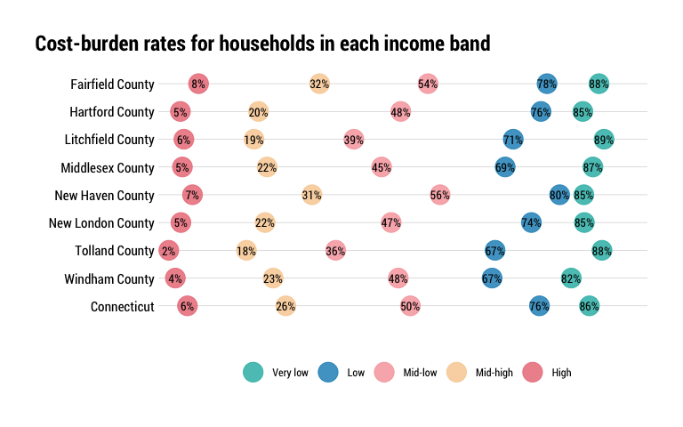

Households desiring housing
================

This notebook needs a better name. “Households desiring housing” to me
suggests a household wants to move, not that they’re unable to afford
housing. Maybe just “gaps in housing units available to households by
income band” or something? Kind of a mouthful…

There’s a lot going on in this notebook:

  - Count and share of households by income band by area
      - **Divisions of county median income make the most sense because
        HUD regions (HMFAs) cross PUMA and county lines, but consult
        with Urban here.**
      - Rounded to pretty numbers for legibility?
  - The kinds of occupations/jobs those residents work in
      - Not super germane to the conversation unless we’re talking about
        wage reform, but brings the context back down to earth…
  - Count and share of households in each band that are cost-burdened
    (T2 in DC report)
  - The approximate monthly housing cost for an affordable unit for each
    income band.
      - Rounded to pretty numbers for legibility?
  - Count and share of units by those cost bands in the area (T3 in DC
    report).
  - Number of housing units needed for each cost band so each household
    would have an affordable housing cost, vs. the actual count of units
    in those cost bands (F19 in DC report)
  - For each income band, the number of households that can/cannot
    afford to pay more, and a count of vacant units in that cost band
    (F20 in DC report).

## Set survey design

Starting by using county median incomes (CMI), then income bands like we
did in the Community Index reports…

  - poor: \< 0.5 CMI
  - low-income: \[0.5–0.75) CMI
  - middle-income: \[0.75–1.25) CMI
  - high-income: \[1.25–1.50) CMI
  - affluent: \>= 1.5 CMI

Cost-burden in predictable breaks:

  - No burden: Less than 30% income to housing
  - Cost-burdened: 30%-50% income to housing
  - Severely cost-burdened: More than 50% income to housing

And race/ethnicty into a few major categories so we can look at it by
county:

  - White (NH)
  - Black (NH)
  - Latino (any race)
  - All others (grouped)

## Household counts/shares by income bands

### Define income bands

Would it be preferable to set these as prettier breaks, or use the CT
numbers for all counties?

<table>

<caption>

Income ranges by income band and area

</caption>

<thead>

<tr>

<th style="text-align:left;">

Name

</th>

<th style="text-align:left;">

Poor

</th>

<th style="text-align:left;">

Low

</th>

<th style="text-align:left;">

Middle

</th>

<th style="text-align:left;">

High

</th>

<th style="text-align:left;">

Affluent

</th>

</tr>

</thead>

<tbody>

<tr>

<td style="text-align:left;">

Fairfield County

</td>

<td style="text-align:left;">

Less than $46,484

</td>

<td style="text-align:left;">

Between $46,484 and $69,727

</td>

<td style="text-align:left;">

Between $69,727 and $116,211

</td>

<td style="text-align:left;">

Between $116,211 and $139,454

</td>

<td style="text-align:left;">

More than $139,454

</td>

</tr>

<tr>

<td style="text-align:left;">

Hartford County

</td>

<td style="text-align:left;">

Less than $36,160

</td>

<td style="text-align:left;">

Between $36,160 and $54,241

</td>

<td style="text-align:left;">

Between $54,241 and $90,401

</td>

<td style="text-align:left;">

Between $90,401 and $108,482

</td>

<td style="text-align:left;">

More than $108,482

</td>

</tr>

<tr>

<td style="text-align:left;">

Litchfield County

</td>

<td style="text-align:left;">

Less than $39,157

</td>

<td style="text-align:left;">

Between $39,157 and $58,736

</td>

<td style="text-align:left;">

Between $58,736 and $97,892

</td>

<td style="text-align:left;">

Between $97,892 and $117,471

</td>

<td style="text-align:left;">

More than $117,471

</td>

</tr>

<tr>

<td style="text-align:left;">

Middlesex County

</td>

<td style="text-align:left;">

Less than $42,380

</td>

<td style="text-align:left;">

Between $42,380 and $63,571

</td>

<td style="text-align:left;">

Between $63,571 and $105,951

</td>

<td style="text-align:left;">

Between $105,951 and $127,142

</td>

<td style="text-align:left;">

More than $127,142

</td>

</tr>

<tr>

<td style="text-align:left;">

New Haven County

</td>

<td style="text-align:left;">

Less than $33,564

</td>

<td style="text-align:left;">

Between $33,564 and $50,346

</td>

<td style="text-align:left;">

Between $50,346 and $83,910

</td>

<td style="text-align:left;">

Between $83,910 and $100,692

</td>

<td style="text-align:left;">

More than $100,692

</td>

</tr>

<tr>

<td style="text-align:left;">

New London County

</td>

<td style="text-align:left;">

Less than $35,684

</td>

<td style="text-align:left;">

Between $35,684 and $53,526

</td>

<td style="text-align:left;">

Between $53,526 and $89,210

</td>

<td style="text-align:left;">

Between $89,210 and $107,052

</td>

<td style="text-align:left;">

More than $107,052

</td>

</tr>

<tr>

<td style="text-align:left;">

Tolland County

</td>

<td style="text-align:left;">

Less than $42,458

</td>

<td style="text-align:left;">

Between $42,458 and $63,687

</td>

<td style="text-align:left;">

Between $63,687 and $106,145

</td>

<td style="text-align:left;">

Between $106,145 and $127,374

</td>

<td style="text-align:left;">

More than $127,374

</td>

</tr>

<tr>

<td style="text-align:left;">

Windham County

</td>

<td style="text-align:left;">

Less than $32,387

</td>

<td style="text-align:left;">

Between $32,387 and $48,580

</td>

<td style="text-align:left;">

Between $48,580 and $80,968

</td>

<td style="text-align:left;">

Between $80,968 and $97,161

</td>

<td style="text-align:left;">

More than $97,161

</td>

</tr>

<tr>

<td style="text-align:left;">

Connecticut

</td>

<td style="text-align:left;">

Less than $38,053

</td>

<td style="text-align:left;">

Between $38,053 and $57,080

</td>

<td style="text-align:left;">

Between $57,080 and $95,132

</td>

<td style="text-align:left;">

Between $95,132 and $114,159

</td>

<td style="text-align:left;">

More than $114,159

</td>

</tr>

</tbody>

</table>

### Race breakdowns

Considering race/ethnicity of head of household. More than half of all
households headed by a Black or Latino person are poor or low income,
compared to about a third of households headed by a white person. Only
showing CT here, but there’s some variation by county, with more
equitable distributions in Litchfield and Windham, less in Fairfield,
New Haven, and Hartford.

<!-- -->

### Count/share of households by income band

More than half a million households in CT (40% of all households) are
poor or low-income, earning less than three-quarters of their county’s
median income. A similar share are affluent or high income, earning 125%
or more of their county’s median income. Just one in five households
statewide are considered middle income by this definition.

<!-- -->

<table>

<thead>

<tr>

<th style="text-align:left;">

Name

</th>

<th style="text-align:left;">

Poor

</th>

<th style="text-align:left;">

Low

</th>

<th style="text-align:left;">

Middle

</th>

<th style="text-align:left;">

High

</th>

<th style="text-align:left;">

Affluent

</th>

<th style="text-align:left;">

Total

</th>

</tr>

</thead>

<tbody>

<tr>

<td style="text-align:left;">

Fairfield County

</td>

<td style="text-align:left;">

93,471

</td>

<td style="text-align:left;">

43,416

</td>

<td style="text-align:left;">

66,244

</td>

<td style="text-align:left;">

24,325

</td>

<td style="text-align:left;">

113,036

</td>

<td style="text-align:left;">

340,492

</td>

</tr>

<tr>

<td style="text-align:left;">

Hartford County

</td>

<td style="text-align:left;">

90,275

</td>

<td style="text-align:left;">

47,543

</td>

<td style="text-align:left;">

73,551

</td>

<td style="text-align:left;">

29,171

</td>

<td style="text-align:left;">

108,523

</td>

<td style="text-align:left;">

349,063

</td>

</tr>

<tr>

<td style="text-align:left;">

Litchfield County

</td>

<td style="text-align:left;">

17,353

</td>

<td style="text-align:left;">

10,125

</td>

<td style="text-align:left;">

18,243

</td>

<td style="text-align:left;">

6,411

</td>

<td style="text-align:left;">

21,855

</td>

<td style="text-align:left;">

73,987

</td>

</tr>

<tr>

<td style="text-align:left;">

Middlesex County

</td>

<td style="text-align:left;">

17,033

</td>

<td style="text-align:left;">

9,033

</td>

<td style="text-align:left;">

15,449

</td>

<td style="text-align:left;">

5,858

</td>

<td style="text-align:left;">

19,520

</td>

<td style="text-align:left;">

66,893

</td>

</tr>

<tr>

<td style="text-align:left;">

New Haven County

</td>

<td style="text-align:left;">

84,672

</td>

<td style="text-align:left;">

42,987

</td>

<td style="text-align:left;">

69,453

</td>

<td style="text-align:left;">

26,036

</td>

<td style="text-align:left;">

106,708

</td>

<td style="text-align:left;">

329,856

</td>

</tr>

<tr>

<td style="text-align:left;">

New London County

</td>

<td style="text-align:left;">

25,089

</td>

<td style="text-align:left;">

14,553

</td>

<td style="text-align:left;">

26,028

</td>

<td style="text-align:left;">

9,263

</td>

<td style="text-align:left;">

32,469

</td>

<td style="text-align:left;">

107,402

</td>

</tr>

<tr>

<td style="text-align:left;">

Tolland County

</td>

<td style="text-align:left;">

14,403

</td>

<td style="text-align:left;">

7,080

</td>

<td style="text-align:left;">

13,145

</td>

<td style="text-align:left;">

4,792

</td>

<td style="text-align:left;">

15,798

</td>

<td style="text-align:left;">

55,218

</td>

</tr>

<tr>

<td style="text-align:left;">

Windham County

</td>

<td style="text-align:left;">

10,426

</td>

<td style="text-align:left;">

5,650

</td>

<td style="text-align:left;">

11,377

</td>

<td style="text-align:left;">

4,065

</td>

<td style="text-align:left;">

12,945

</td>

<td style="text-align:left;">

44,463

</td>

</tr>

<tr>

<td style="text-align:left;">

Connecticut

</td>

<td style="text-align:left;">

352,722

</td>

<td style="text-align:left;">

180,387

</td>

<td style="text-align:left;">

293,490

</td>

<td style="text-align:left;">

109,921

</td>

<td style="text-align:left;">

430,854

</td>

<td style="text-align:left;">

1,367,374

</td>

</tr>

</tbody>

</table>

The income distributions are fairly consistent, even in the more rural
counties. This trend mirrors national trends with middle income
households being squeezed out by high and low income households.

<!-- -->

**Out of curiosity, I also want to see the share of a county’s units in
each income band (so like what share of all affluent households are in
FC) Will come back to that later.**

## Cost burden by income band

No surprise that cost burden rates among poor households are around 80%,
at the statewide level that’s 20x the rate of affluent households.

What does stand out a bit are the gaps between each group. Moving up the
income scale (from lower to higher income) shows a 20-30 percentage
point decrease in cost burden rates. Those gains are much smaller from
medium to high and from high to affluent income groups. Not like anyone
was doubting this before, but this chart essentially says there’s not
enough housing is affordable to low-income households, but there’s
plenty of housing affordable to mid-to-high income households.

Too bad I can’t do this by town…

<!-- -->

For all households but the poorest, twice the share of households pay
between 30% and 50% of income towards housing than pay more than 50%.
Among the poor, the inverse is true. This is partially explained by some
poor households having housing costs but no or negative income (by
definition, the household is “poor” if household income is $0 or less
because that’s less than 50% CMI), but obvs there’s also just a paucity
of affordable housing.

**See how many SCB households have no or negative income to make that
point.**

<!-- -->

## Jobs held by people in these households

Woops need to add OCC to PUMS output, then I guess do like top 3-5 most
common jobs for each income band (limit to HOHs?)

## Housing costs affordable to household within each band

Over-under on the actual number of units costing less than $1.2K in FC?
I’ll say 10,000.

<table>

<caption>

Affordable monthly housing cost ranges by income band and area

</caption>

<thead>

<tr>

<th style="text-align:left;">

Name

</th>

<th style="text-align:left;">

Poor

</th>

<th style="text-align:left;">

Low

</th>

<th style="text-align:left;">

Middle

</th>

<th style="text-align:left;">

High

</th>

<th style="text-align:left;">

Affluent

</th>

</tr>

</thead>

<tbody>

<tr>

<td style="text-align:left;">

Fairfield County

</td>

<td style="text-align:left;">

Less than $1,162

</td>

<td style="text-align:left;">

Between $1,162 and $1,743

</td>

<td style="text-align:left;">

Between $1,743 and $2,905

</td>

<td style="text-align:left;">

Between $2,905 and $3,486

</td>

<td style="text-align:left;">

More than $3,486

</td>

</tr>

<tr>

<td style="text-align:left;">

Hartford County

</td>

<td style="text-align:left;">

Less than $904

</td>

<td style="text-align:left;">

Between $904 and $1,356

</td>

<td style="text-align:left;">

Between $1,356 and $2,260

</td>

<td style="text-align:left;">

Between $2,260 and $2,712

</td>

<td style="text-align:left;">

More than $2,712

</td>

</tr>

<tr>

<td style="text-align:left;">

Litchfield County

</td>

<td style="text-align:left;">

Less than $979

</td>

<td style="text-align:left;">

Between $979 and $1,468

</td>

<td style="text-align:left;">

Between $1,468 and $2,447

</td>

<td style="text-align:left;">

Between $2,447 and $2,937

</td>

<td style="text-align:left;">

More than $2,937

</td>

</tr>

<tr>

<td style="text-align:left;">

Middlesex County

</td>

<td style="text-align:left;">

Less than $1,060

</td>

<td style="text-align:left;">

Between $1,060 and $1,589

</td>

<td style="text-align:left;">

Between $1,589 and $2,649

</td>

<td style="text-align:left;">

Between $2,649 and $3,179

</td>

<td style="text-align:left;">

More than $3,179

</td>

</tr>

<tr>

<td style="text-align:left;">

New Haven County

</td>

<td style="text-align:left;">

Less than $839

</td>

<td style="text-align:left;">

Between $839 and $1,259

</td>

<td style="text-align:left;">

Between $1,259 and $2,098

</td>

<td style="text-align:left;">

Between $2,098 and $2,517

</td>

<td style="text-align:left;">

More than $2,517

</td>

</tr>

<tr>

<td style="text-align:left;">

New London County

</td>

<td style="text-align:left;">

Less than $892

</td>

<td style="text-align:left;">

Between $892 and $1,338

</td>

<td style="text-align:left;">

Between $1,338 and $2,230

</td>

<td style="text-align:left;">

Between $2,230 and $2,676

</td>

<td style="text-align:left;">

More than $2,676

</td>

</tr>

<tr>

<td style="text-align:left;">

Tolland County

</td>

<td style="text-align:left;">

Less than $1,061

</td>

<td style="text-align:left;">

Between $1,061 and $1,592

</td>

<td style="text-align:left;">

Between $1,592 and $2,654

</td>

<td style="text-align:left;">

Between $2,654 and $3,184

</td>

<td style="text-align:left;">

More than $3,184

</td>

</tr>

<tr>

<td style="text-align:left;">

Windham County

</td>

<td style="text-align:left;">

Less than $810

</td>

<td style="text-align:left;">

Between $810 and $1,214

</td>

<td style="text-align:left;">

Between $1,214 and $2,024

</td>

<td style="text-align:left;">

Between $2,024 and $2,429

</td>

<td style="text-align:left;">

More than $2,429

</td>

</tr>

<tr>

<td style="text-align:left;">

Connecticut

</td>

<td style="text-align:left;">

Less than $951

</td>

<td style="text-align:left;">

Between $951 and $1,427

</td>

<td style="text-align:left;">

Between $1,427 and $2,378

</td>

<td style="text-align:left;">

Between $2,378 and $2,854

</td>

<td style="text-align:left;">

More than $2,854

</td>

</tr>

</tbody>

</table>
