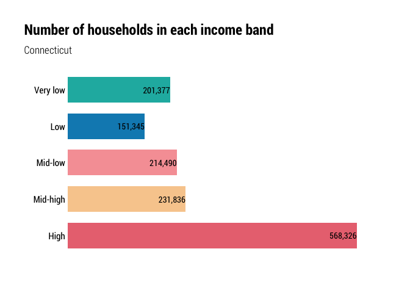
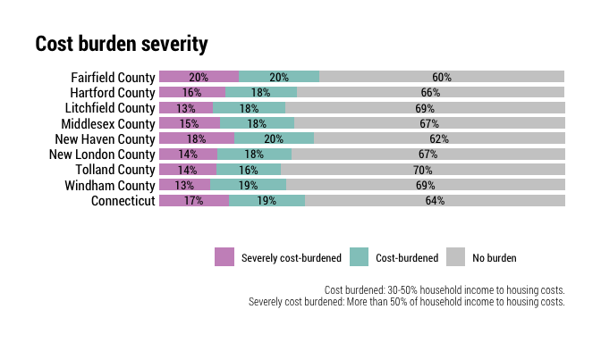

Households desiring housing
================

``` r
library(ipumsr)
library(tidyverse)
library(srvyr)
library(tidycensus)
library(hrbrthemes)
library(camiller)
library(scales)
library(kableExtra)
```

``` r
theme_set(theme_ipsum_rc())

#this theme is better when reverse is standard so poor != red, but also this theme is also terrible by default because it's based on mineral water, but i am a monster.
pal <- pal <- rev(LaCroixColoR::lacroix_palette(name = "Pamplemousse", n = 5, type = "discrete"))

scale_fill_custom <- function(palette = pal, rev = F) {
  if (rev) {
    scale_fill_manual(values = rev(pal))
  } else {
    scale_fill_manual(values = pal)
  }
}

scale_color_custom <- function(palette = pal, rev = F) {
  if (rev) {
    scale_color_manual(values = rev(pal))
  } else {
    scale_color_manual(values = pal)
  }
}
```

This notebook needs a better name. “Households desiring housing” to me
suggests a household wants to move, not that they’re unable to afford
housing. Maybe just “gaps in housing units available to households by
income band” or something? Kind of a mouthful…

There’s a lot going on in this notebook:

  - Count and share of households by income band by area
      - **Divisions of county median income make the most sense because
        HUD regions (HMFAs) cross PUMA and county lines. Brought up with
        Urban on 7/8 and they will make a call soon, so I’ll move
        forward with what I have for now.**
      - Rounded to pretty numbers for legibility?
  - The kinds of occupations/jobs those residents work in
      - Not exactly germane to the conversation unless we’re talking
        about wage reform, but brings the context back down to earth…
  - Count and share of households in each band that are cost-burdened
    (T2 in DC report)
  - Average (median?) housing-cost-to-income ratio for each income band
  - The approximate monthly housing cost for an affordable unit for each
    income band.
      - Rounded to pretty numbers for legibility?
      - DC report used lower cost burden ratios for higher income bands.
        Should we?
  - Count and share of units by those cost bands in the area (T3 in DC
    report).
  - Number of housing units needed for each cost band so each household
    would have an affordable housing cost, vs. the actual count of units
    in those cost bands (F19 in DC report) \* Again, DC used much lower
    cost ratios for higher income bands. I think we should expect they
    can pay more.
  - For each income band, the number of households that can/cannot
    afford to pay more
  - Count of vacant units in each cost band (F20 in DC report).

## Establish groups

Starting by using county median incomes (CMI), then income bands like we
did in the Community Index reports…

  - poor: \< 0.5 CMI
  - low-income: \[0.5–0.75) CMI
  - middle-income: \[0.75–1.25) CMI
  - high-income: \[1.25–1.50) CMI
  - affluent: \>= 1.5 CMI

Cost-burden in predictable breaks:

  - No burden: Less than 30% income to housing
  - Cost-burdened: 30%-50% income to housing
  - Severely cost-burdened: More than 50% income to housing

And race/ethnicity into a few major categories so we can look at it by
county:

  - White (NH)
  - Black (NH)
  - Latino (any race)
  - All others (grouped)

<!-- end list -->

``` r
minc <- get_acs(
    geography = "county",
      table = "B19013",
    state = 09,
      cache_table = T) %>% 
    arrange(GEOID) %>% 
    mutate(countyfip = seq(from = 1, to = 15, by = 2),
                 name = str_remove(NAME, ", Connecticut")) %>% 
    select(countyfip, name, minc = estimate)

ddi <- read_ipums_ddi("../input_data/usa_00038.xml")

pums <- read_ipums_micro(ddi, verbose = F)  %>% 
    mutate_at(vars(YEAR, PUMA, OWNERSHP, OWNERSHPD, RACE, RACED, HISPAN, HISPAND), as_factor) %>% 
    mutate_at(vars(PERWT, HHWT), as.numeric) %>% 
    mutate_at(vars(HHINCOME, OWNCOST, RENTGRS, OCC), as.integer) %>% 
    janitor::clean_names() %>% 
    left_join(minc, by = "countyfip") %>% 
    mutate(ratio = hhincome / minc) %>% 
    mutate(
        inc_band = cut(
            ratio,
            breaks = c(-Inf, 0.5, 0.75, 1.25, 1.5, Inf),
            labels = c("Poor", "Low", "Middle", "High", "Affluent"),
            include.lowest = T, right = F)) %>% 
    mutate(
        inc_band = as.factor(inc_band) %>%
            fct_relevel(., "Poor", "Low", "Middle", "High", "Affluent")) %>% 
    mutate(cb = if_else(ownershp == "Rented", (rentgrs * 12) / hhincome, 99999)) %>% 
    mutate(cb = if_else(ownershp == "Owned or being bought (loan)", (owncost * 12) / hhincome, cb)) %>%
    # if housing cost is 0 and income is 0, no burden
    mutate(cb = if_else((rentgrs == 0 & hhincome == 0), 0, cb)) %>%
    mutate(cb = if_else((owncost == 0 & hhincome == 0), 0, cb)) %>%
    #if income is <=0 and housing cost is >0, burden
    mutate(cb = if_else((rentgrs > 0 & hhincome <= 0), 1, cb)) %>%
    mutate(cb = if_else((owncost > 0 & hhincome <= 0), 1, cb)) %>%
    # some people pay more than 100% income to housing, but I will code these as 1
    mutate(cb = if_else(cb > 1, 1, cb)) %>%
    mutate(
        cost_burden = cut(
            cb,
            breaks = c(-Inf, .3, .5, Inf),
            labels = c("No burden", "Cost-burdened", "Severely cost-burdened"),
            include.lowest = T, right = F)) %>% 
        mutate(race2 = if_else(hispan == "Not Hispanic", as.character(race), "Latino")) %>% 
    mutate(race2 = as.factor(race2) %>% 
                    fct_recode(Black = "Black/African American/Negro") %>%
                    fct_other(keep = c("White", "Black", "Latino"), other_level = "Other race") %>%
                    fct_relevel("White", "Black", "Latino", "Other race"))

des <- pums %>%
    filter(pernum == "1", hhincome != 9999999, ownershp != "N/A") %>% 
    as_survey_design(., ids = 1, wt = hhwt)

out <- list()
```

``` r
county_hhlds <- des %>%
    select(hhwt, name, inc_band) %>% 
    group_by(name, inc_band) %>% 
    summarise(value = survey_total(hhwt)) %>% 
    mutate(level = "2_counties")

county_total <- des %>%
    select(hhwt, name) %>% 
    group_by(name) %>% 
    summarise(value = survey_total(hhwt)) %>% 
    mutate(inc_band = "Total") %>% 
    mutate(level = "2_counties")

ct_hhlds <- des %>%
    select(hhwt, statefip, inc_band) %>% 
    group_by(statefip, inc_band) %>% 
    summarise(value = survey_total(hhwt)) %>% 
    mutate(name = "Connecticut", level = "1_state") %>% 
    select(-statefip)

ct_total <- des %>%
    select(hhwt, statefip) %>% 
    group_by(statefip) %>% 
    summarise(value = survey_total(hhwt)) %>% 
    mutate(name = "Connecticut", level = "1_state", inc_band = "Total") %>% 
    select(-statefip)

hh_by_inc_band <- bind_rows(county_hhlds, county_total, ct_hhlds, ct_total) %>%
    ungroup() %>%
    mutate(inc_band = as.factor(inc_band) %>% 
                    fct_relevel(., "Poor", "Low", "Middle", "High", "Affluent", "Total"),
                 level = as.factor(level)) %>% 
    arrange(level, name) %>% 
    group_by(level, name) %>% 
    calc_shares(group = inc_band, denom = "Total", value = value, moe = value_se)

out$hh_by_inc_band <- hh_by_inc_band
```

## Define income bands

Would it be preferable to set these as prettier breaks, or use the CT
numbers for all counties?

**A better chart here would be color coded segments indicating each
group’s range, with each area on a new row. Could use arrow ends or
something to communicate the top and bottom. Come back to this idea.**

``` r
ctminc <- get_acs(geography = "state", state = 09, table = "B19013") %>% 
    select(name = NAME, minc = estimate)

income_table <- minc %>% 
    bind_rows(ctminc) %>% 
    mutate(p = comma(round(minc * .5, 0), accuracy = 1),
                 l = comma(round(minc * .75, 0), accuracy = 1),
                 m = comma(round(minc * 1.25, 0), accuracy = 1), 
                 h = comma(round(minc * 1.5, 0), accuracy = 1),
                 Poor = paste("Less than $", p, sep = ""),
                 Low = paste("Between $", p, " and $", l, sep = ""),
                 Middle = paste("Between $", l, " and $", m, sep = ""),
                 High = paste("Between $", m, " and $", h, sep = ""),
                 Affluent = paste("More than $", h, sep = "")) %>% 
    select(Name = name, Poor:Affluent)

kable(income_table, caption = "Income ranges by income band and area")
```

<table>

<caption>

Income ranges by income band and area

</caption>

<thead>

<tr>

<th style="text-align:left;">

Name

</th>

<th style="text-align:left;">

Poor

</th>

<th style="text-align:left;">

Low

</th>

<th style="text-align:left;">

Middle

</th>

<th style="text-align:left;">

High

</th>

<th style="text-align:left;">

Affluent

</th>

</tr>

</thead>

<tbody>

<tr>

<td style="text-align:left;">

Fairfield County

</td>

<td style="text-align:left;">

Less than $46,484

</td>

<td style="text-align:left;">

Between $46,484 and $69,727

</td>

<td style="text-align:left;">

Between $69,727 and $116,211

</td>

<td style="text-align:left;">

Between $116,211 and $139,454

</td>

<td style="text-align:left;">

More than $139,454

</td>

</tr>

<tr>

<td style="text-align:left;">

Hartford County

</td>

<td style="text-align:left;">

Less than $36,160

</td>

<td style="text-align:left;">

Between $36,160 and $54,241

</td>

<td style="text-align:left;">

Between $54,241 and $90,401

</td>

<td style="text-align:left;">

Between $90,401 and $108,482

</td>

<td style="text-align:left;">

More than $108,482

</td>

</tr>

<tr>

<td style="text-align:left;">

Litchfield County

</td>

<td style="text-align:left;">

Less than $39,157

</td>

<td style="text-align:left;">

Between $39,157 and $58,736

</td>

<td style="text-align:left;">

Between $58,736 and $97,892

</td>

<td style="text-align:left;">

Between $97,892 and $117,471

</td>

<td style="text-align:left;">

More than $117,471

</td>

</tr>

<tr>

<td style="text-align:left;">

Middlesex County

</td>

<td style="text-align:left;">

Less than $42,380

</td>

<td style="text-align:left;">

Between $42,380 and $63,571

</td>

<td style="text-align:left;">

Between $63,571 and $105,951

</td>

<td style="text-align:left;">

Between $105,951 and $127,142

</td>

<td style="text-align:left;">

More than $127,142

</td>

</tr>

<tr>

<td style="text-align:left;">

New Haven County

</td>

<td style="text-align:left;">

Less than $33,564

</td>

<td style="text-align:left;">

Between $33,564 and $50,346

</td>

<td style="text-align:left;">

Between $50,346 and $83,910

</td>

<td style="text-align:left;">

Between $83,910 and $100,692

</td>

<td style="text-align:left;">

More than $100,692

</td>

</tr>

<tr>

<td style="text-align:left;">

New London County

</td>

<td style="text-align:left;">

Less than $35,684

</td>

<td style="text-align:left;">

Between $35,684 and $53,526

</td>

<td style="text-align:left;">

Between $53,526 and $89,210

</td>

<td style="text-align:left;">

Between $89,210 and $107,052

</td>

<td style="text-align:left;">

More than $107,052

</td>

</tr>

<tr>

<td style="text-align:left;">

Tolland County

</td>

<td style="text-align:left;">

Less than $42,458

</td>

<td style="text-align:left;">

Between $42,458 and $63,687

</td>

<td style="text-align:left;">

Between $63,687 and $106,145

</td>

<td style="text-align:left;">

Between $106,145 and $127,374

</td>

<td style="text-align:left;">

More than $127,374

</td>

</tr>

<tr>

<td style="text-align:left;">

Windham County

</td>

<td style="text-align:left;">

Less than $32,387

</td>

<td style="text-align:left;">

Between $32,387 and $48,580

</td>

<td style="text-align:left;">

Between $48,580 and $80,968

</td>

<td style="text-align:left;">

Between $80,968 and $97,161

</td>

<td style="text-align:left;">

More than $97,161

</td>

</tr>

<tr>

<td style="text-align:left;">

Connecticut

</td>

<td style="text-align:left;">

Less than $38,053

</td>

<td style="text-align:left;">

Between $38,053 and $57,080

</td>

<td style="text-align:left;">

Between $57,080 and $95,132

</td>

<td style="text-align:left;">

Between $95,132 and $114,159

</td>

<td style="text-align:left;">

More than $114,159

</td>

</tr>

</tbody>

</table>

## Count/share of households by income band

More than half a million households in CT (40% of all households) are
poor or low-income, earning less than three-quarters of their county’s
median income. A similar share are affluent or high income, earning 125%
or more of their county’s median income. Just one in five households
statewide are considered middle income by this definition.

``` r
hh_by_inc_band %>% 
    filter(inc_band != "Total", name == "Connecticut") %>% 
    mutate(inc_band = fct_rev(inc_band)) %>% 
    ggplot(aes(value, inc_band)) +
    geom_col(aes(fill = inc_band), width = .7, position = position_dodge(.8)) +
    scale_x_continuous(
        expand = expansion(mult = c(0, 0.1)),
        labels = scales::comma) +
    geom_text(aes(
        label = comma(value, accuracy = 1)),
        position = position_dodge(.8), hjust = 1, family = "Roboto Condensed", size = 3.75) +
    guides(fill = guide_legend(title = "")) +
    labs(
        x = "",
        y = "",
        title = "Number of households in each income band",
        subtitle = "Connecticut") +
    scale_fill_custom(rev = T) +
    theme(
        panel.grid.minor = element_blank(),
        panel.grid.major = element_blank(),
        legend.position = "none",
        plot.title.position = "plot",
        axis.text.x = element_blank(),
        axis.text.y = element_text(colour = "black"),
        strip.text.y = element_blank())
```

<!-- -->

``` r
kable(hh_by_inc_band %>% 
    mutate(level = fct_rev(level)) %>% 
    arrange(level) %>% 
    select(Name = name, inc_band, value) %>% 
    mutate(value = comma(value, accuracy = 1)) %>% 
    pivot_wider(id_cols = Name, names_from = "inc_band") %>% 
    select(Name, Poor:Affluent, Total))
```

<table>

<thead>

<tr>

<th style="text-align:left;">

Name

</th>

<th style="text-align:left;">

Poor

</th>

<th style="text-align:left;">

Low

</th>

<th style="text-align:left;">

Middle

</th>

<th style="text-align:left;">

High

</th>

<th style="text-align:left;">

Affluent

</th>

<th style="text-align:left;">

Total

</th>

</tr>

</thead>

<tbody>

<tr>

<td style="text-align:left;">

Fairfield County

</td>

<td style="text-align:left;">

93,471

</td>

<td style="text-align:left;">

43,416

</td>

<td style="text-align:left;">

66,244

</td>

<td style="text-align:left;">

24,325

</td>

<td style="text-align:left;">

113,036

</td>

<td style="text-align:left;">

340,492

</td>

</tr>

<tr>

<td style="text-align:left;">

Hartford County

</td>

<td style="text-align:left;">

90,275

</td>

<td style="text-align:left;">

47,543

</td>

<td style="text-align:left;">

73,551

</td>

<td style="text-align:left;">

29,171

</td>

<td style="text-align:left;">

108,523

</td>

<td style="text-align:left;">

349,063

</td>

</tr>

<tr>

<td style="text-align:left;">

Litchfield County

</td>

<td style="text-align:left;">

17,353

</td>

<td style="text-align:left;">

10,125

</td>

<td style="text-align:left;">

18,243

</td>

<td style="text-align:left;">

6,411

</td>

<td style="text-align:left;">

21,855

</td>

<td style="text-align:left;">

73,987

</td>

</tr>

<tr>

<td style="text-align:left;">

Middlesex County

</td>

<td style="text-align:left;">

17,033

</td>

<td style="text-align:left;">

9,033

</td>

<td style="text-align:left;">

15,449

</td>

<td style="text-align:left;">

5,858

</td>

<td style="text-align:left;">

19,520

</td>

<td style="text-align:left;">

66,893

</td>

</tr>

<tr>

<td style="text-align:left;">

New Haven County

</td>

<td style="text-align:left;">

84,672

</td>

<td style="text-align:left;">

42,987

</td>

<td style="text-align:left;">

69,453

</td>

<td style="text-align:left;">

26,036

</td>

<td style="text-align:left;">

106,708

</td>

<td style="text-align:left;">

329,856

</td>

</tr>

<tr>

<td style="text-align:left;">

New London County

</td>

<td style="text-align:left;">

25,089

</td>

<td style="text-align:left;">

14,553

</td>

<td style="text-align:left;">

26,028

</td>

<td style="text-align:left;">

9,263

</td>

<td style="text-align:left;">

32,469

</td>

<td style="text-align:left;">

107,402

</td>

</tr>

<tr>

<td style="text-align:left;">

Tolland County

</td>

<td style="text-align:left;">

14,403

</td>

<td style="text-align:left;">

7,080

</td>

<td style="text-align:left;">

13,145

</td>

<td style="text-align:left;">

4,792

</td>

<td style="text-align:left;">

15,798

</td>

<td style="text-align:left;">

55,218

</td>

</tr>

<tr>

<td style="text-align:left;">

Windham County

</td>

<td style="text-align:left;">

10,426

</td>

<td style="text-align:left;">

5,650

</td>

<td style="text-align:left;">

11,377

</td>

<td style="text-align:left;">

4,065

</td>

<td style="text-align:left;">

12,945

</td>

<td style="text-align:left;">

44,463

</td>

</tr>

<tr>

<td style="text-align:left;">

Connecticut

</td>

<td style="text-align:left;">

352,722

</td>

<td style="text-align:left;">

180,387

</td>

<td style="text-align:left;">

293,490

</td>

<td style="text-align:left;">

109,921

</td>

<td style="text-align:left;">

430,854

</td>

<td style="text-align:left;">

1,367,374

</td>

</tr>

</tbody>

</table>

The income distributions are fairly consistent, even in the more rural
counties. This trend mirrors national trends with middle income
households being squeezed out by high and low income households.

``` r
hh_by_inc_band %>% 
    filter(inc_band != "Total") %>% 
    group_by(level) %>% 
    mutate(name = as.factor(name) %>% 
                    fct_rev()) %>% 
    ggplot(aes(name, share, group = name)) +
    geom_col(aes(fill = inc_band), width = .7, position = position_stack(1)) +
    coord_flip() +
    geom_text(aes(label = percent(share, accuracy = 1)),
                        position = position_stack(.5), family = "Roboto Condensed") +
    scale_y_continuous(expand = expansion(mult = c(0, 0))) +
    scale_fill_custom() +
    guides(fill = guide_legend(title = "")) +
    labs(x = "", y = "",
             title = "Share of households in each income band by state and county") +
    theme(panel.grid.major  = element_blank(),
                panel.grid.minor = element_blank(),
                axis.text.y = element_text(colour = "black"),
                axis.text.x = element_blank(),
                legend.position = "bottom",
                plot.title.position = "plot")
```

<!-- -->

## Household characteristics by income bands

### Race breakdowns

``` r
county_hhlds_by_race <- des %>%
    select(hhwt, name, inc_band, race2) %>% 
    group_by(name, inc_band, race2) %>% 
    summarise(value = survey_total(hhwt)) %>% 
    mutate(level = "2_counties")

county_race_total <- des %>%
    select(hhwt, name, race2) %>% 
    group_by(name, race2) %>% 
    summarise(value = survey_total(hhwt)) %>% 
    mutate(inc_band = "Total") %>% 
    mutate(level = "2_counties")

ct_hhlds_by_race <- des %>%
    select(hhwt, statefip, inc_band, race2) %>% 
    group_by(statefip, inc_band, race2) %>% 
    summarise(value = survey_total(hhwt)) %>% 
    mutate(name = "Connecticut", level = "1_state") %>% 
    select(-statefip)

ct_race_total <- des %>%
    select(hhwt, statefip, race2) %>% 
    group_by(statefip, race2) %>% 
    summarise(value = survey_total(hhwt)) %>% 
    mutate(name = "Connecticut", level = "1_state", inc_band = "Total") %>% 
    select(-statefip)

hh_by_race_inc_band <- bind_rows(county_hhlds_by_race, county_race_total, ct_hhlds_by_race, ct_race_total) %>%
    ungroup() %>%
    mutate(inc_band = as.factor(inc_band) %>% 
                    fct_relevel(., "Poor", "Low", "Middle", "High", "Affluent", "Total"),
                 level = as.factor(level)) %>% 
    arrange(level, name, race2) %>% 
    group_by(level, name, race2) %>% 
    calc_shares(group = inc_band, denom = "Total", value = value, moe = value_se)

out$hh_by_inc_band <- hh_by_race_inc_band
```

Considering race/ethnicity of head of household. Statewide, more than
half of all households headed by a Black or Latino person are poor or
low income, compared to about a third of households headed by a white
person. Some variation exists by county.

``` r
hh_by_race_inc_band %>% 
    filter(inc_band != "Total") %>% 
    mutate(race2 = fct_rev(race2)) %>% 
    ggplot(aes(share, race2, group = race2)) +
    geom_col(aes(fill = inc_band), width = .8, position = position_stack(1)) +
    guides(fill = guide_legend(title = "", reverse = T)) +
    geom_text(aes(label = percent(share, accuracy = 1)),
                        position = position_stack(.5), family = "Roboto Condensed") +
    scale_x_continuous(expand = expansion(mult = c(0, 0))) +
    facet_wrap(facets = "name") +
    guides(fill = guide_legend(title = "")) +
    scale_fill_custom() +
    labs(x = "", y = "",
             title = "Share of households in each income band by race of HOH") +
    theme(panel.grid.major  = element_blank(),
                panel.grid.minor = element_blank(),
                axis.text.y = element_text(colour = "black"),
                axis.text.x = element_blank(),
                legend.position = "bottom",
                plot.title.position = "plot")
```

<!-- -->

### Jobs held by household occupants

Retrieved a list of 2018 occ codes from the Census Bureau at
<https://www.census.gov/topics/employment/industry-occupation/guidance/code-lists.html>.

This table lists the top five occupations, in order from the most
numerous, for household inhabitants—so not just heads of household, but
all household members, including inhabitants with no work experience in
the past 5 years or who have never worked—by household income band by
county.

To be honest, this is a little surprising in places. I expected more
food service workers in general, and I’m surprised at how many
elementary and middle school teachers are workers in higher income
households. Either I have the exact wrong impression of how much
teachers are paid or it’s a common occupation for people whose
partners/spouses pull in big money. And yet, \#thestruggle: adjuncts and
GAs in Tolland County (UConn) getting those minimum wage grad school
stipends while profs in New Haven and Middlesex Counties make six
figures teaching half the load.

``` r
des2 <- pums %>%
    filter(hhincome != 9999999, ownershp != "N/A") %>% 
    as_survey_design(., ids = 1, wt = perwt)

occ_lut <- read_csv("../input_data/occ_codes.csv") %>% 
    mutate(occ_code = as.integer(occ_code)) #leading 0s

common_jobs_by_inc_band <- pums %>%
    select(perwt, name, inc_band, occ) %>% 
    group_by(name, inc_band, occ) %>% 
    summarise(workers = sum(perwt)) %>% 
    mutate(level = "2_counties") %>% 
    filter(occ != "0") %>% #0 is "n/a" occ
    group_by(name, inc_band) %>% 
    slice_max(workers, n = 5) %>%
    left_join(occ_lut, by = c("occ" = "occ_code")) %>% 
    select(level, name, inc_band, workers, occ, occ_label)

out$common_jobs_by_inc_band <- common_jobs_by_inc_band

common_jobs_by_inc_band %>% 
    group_by(level, name, inc_band) %>% 
    mutate(rank = order(workers, decreasing = T)) %>% 
    select(name, inc_band, rank, occ_label) %>% 
    pivot_wider(id_cols = c("name", "inc_band"), names_from = "rank", values_from = "occ_label") %>% 
    mutate(`Common occupations` = paste(`1`, `2`, `3`, `4`, `5`, sep = "; ")) %>% 
    select(Name = name, `Income band` = inc_band, `Common occupations`) %>% 
    pivot_wider(id_cols = Name, names_from = "Income band", values_from = "Common occupations") %>% 
    kable(caption = "Common occupations for workers by household income band")
```

<table>

<caption>

Common occupations for workers by household income band

</caption>

<thead>

<tr>

<th style="text-align:left;">

Name

</th>

<th style="text-align:left;">

Poor

</th>

<th style="text-align:left;">

Low

</th>

<th style="text-align:left;">

Middle

</th>

<th style="text-align:left;">

High

</th>

<th style="text-align:left;">

Affluent

</th>

</tr>

</thead>

<tbody>

<tr>

<td style="text-align:left;">

Fairfield County

</td>

<td style="text-align:left;">

Maids and housekeeping cleaners; Cashiers; Unemployed, with no work
experience in the last 5 years or earlier or never worked; Janitors and
building cleaners; Landscaping and groundskeeping workers

</td>

<td style="text-align:left;">

Cashiers; Maids and housekeeping cleaners; Janitors and building
cleaners; Retail salespersons; Secretaries and administrative
assistants, except legal, medical, and executive

</td>

<td style="text-align:left;">

Elementary and middle school teachers; Cashiers; Retail salespersons;
Secretaries and administrative assistants, except legal, medical, and
executive; Managers, all other

</td>

<td style="text-align:left;">

Elementary and middle school teachers; Managers, all other; Registered
nurses; Secretaries and administrative assistants, except legal,
medical, and executive; Customer service representatives

</td>

<td style="text-align:left;">

Managers, all other; Elementary and middle school teachers; Financial
managers; Chief executives; Accountants and auditors

</td>

</tr>

<tr>

<td style="text-align:left;">

Hartford County

</td>

<td style="text-align:left;">

Cashiers; Unemployed, with no work experience in the last 5 years or
earlier or never worked; Janitors and building cleaners; Nursing
assistants; Personal care aides

</td>

<td style="text-align:left;">

Cashiers; Nursing assistants; Retail salespersons; Janitors and building
cleaners; Unemployed, with no work experience in the last 5 years or
earlier or never worked

</td>

<td style="text-align:left;">

Cashiers; Janitors and building cleaners; First-Line supervisors of
retail sales workers; Secretaries and administrative assistants, except
legal, medical, and executive; Driver/sales workers and truck drivers

</td>

<td style="text-align:left;">

Elementary and middle school teachers; Managers, all other; Registered
nurses; Secretaries and administrative assistants, except legal,
medical, and executive; Customer service representatives

</td>

<td style="text-align:left;">

Managers, all other; Elementary and middle school teachers; Registered
nurses; Accountants and auditors; Retail salespersons

</td>

</tr>

<tr>

<td style="text-align:left;">

Litchfield County

</td>

<td style="text-align:left;">

Janitors and building cleaners; Personal care aides; First-Line
supervisors of retail sales workers; Retail salespersons; Cashiers

</td>

<td style="text-align:left;">

Janitors and building cleaners; Secretaries and administrative
assistants, except legal, medical, and executive; Cashiers; Bookkeeping,
accounting, and auditing clerks; Driver/sales workers and truck drivers

</td>

<td style="text-align:left;">

First-Line supervisors of retail sales workers; Elementary and middle
school teachers; Landscaping and groundskeeping workers; Retail
salespersons; Managers, all other

</td>

<td style="text-align:left;">

Elementary and middle school teachers; Cashiers; First-Line supervisors
of retail sales workers; Managers, all other; Janitors and building
cleaners

</td>

<td style="text-align:left;">

Elementary and middle school teachers; Managers, all other; Registered
nurses; Chief executives; Customer service representatives

</td>

</tr>

<tr>

<td style="text-align:left;">

Middlesex County

</td>

<td style="text-align:left;">

Cashiers; Customer service representatives; Waiters and waitresses;
Maids and housekeeping cleaners; Driver/sales workers and truck drivers

</td>

<td style="text-align:left;">

Customer service representatives; First-Line supervisors of retail sales
workers; Cashiers; Secretaries and administrative assistants, except
legal, medical, and executive; Nursing assistants

</td>

<td style="text-align:left;">

Secretaries and administrative assistants, except legal, medical, and
executive; Elementary and middle school teachers; Registered nurses;
Managers, all other; Cashiers

</td>

<td style="text-align:left;">

Managers, all other; Elementary and middle school teachers; First-Line
supervisors of retail sales workers; Secretaries and administrative
assistants, except legal, medical, and executive; Bookkeeping,
accounting, and auditing clerks

</td>

<td style="text-align:left;">

Elementary and middle school teachers; Managers, all other; Registered
nurses; Chief executives; Postsecondary teachers

</td>

</tr>

<tr>

<td style="text-align:left;">

New Haven County

</td>

<td style="text-align:left;">

Unemployed, with no work experience in the last 5 years or earlier or
never worked; Cashiers; Personal care aides; Nursing assistants; Retail
salespersons

</td>

<td style="text-align:left;">

Cashiers; Nursing assistants; Retail salespersons; First-Line
supervisors of retail sales workers; Unemployed, with no work experience
in the last 5 years or earlier or never worked

</td>

<td style="text-align:left;">

Cashiers; Janitors and building cleaners; Retail salespersons;
First-Line supervisors of retail sales workers; Secretaries and
administrative assistants, except legal, medical, and executive

</td>

<td style="text-align:left;">

Elementary and middle school teachers; Retail salespersons; Driver/sales
workers and truck drivers; Nursing assistants; Secretaries and
administrative assistants, except legal, medical, and executive

</td>

<td style="text-align:left;">

Elementary and middle school teachers; Managers, all other; Registered
nurses; Secretaries and administrative assistants, except legal,
medical, and executive; Postsecondary teachers

</td>

</tr>

<tr>

<td style="text-align:left;">

New London County

</td>

<td style="text-align:left;">

Cashiers; Janitors and building cleaners; Retail salespersons; Maids and
housekeeping cleaners; Waiters and waitresses

</td>

<td style="text-align:left;">

Janitors and building cleaners; Cashiers; Landscaping and groundskeeping
workers; Gambling services workers; Nursing assistants

</td>

<td style="text-align:left;">

Secretaries and administrative assistants, except legal, medical, and
executive; Driver/sales workers and truck drivers; Gambling services
workers; Cashiers; Elementary and middle school teachers

</td>

<td style="text-align:left;">

Managers, all other; Elementary and middle school teachers; First-Line
supervisors of retail sales workers; Waiters and waitresses; Cashiers

</td>

<td style="text-align:left;">

Managers, all other; Military enlisted tactical operations and
air/weapons specialists and crew members; Registered nurses; Elementary
and middle school teachers; Cashiers

</td>

</tr>

<tr>

<td style="text-align:left;">

Tolland County

</td>

<td style="text-align:left;">

Waiters and waitresses; Customer service representatives; Nursing
assistants; Postsecondary teachers; Cashiers

</td>

<td style="text-align:left;">

Retail salespersons; Driver/sales workers and truck drivers; Teaching
assistants; Nursing assistants; Laborers and freight, stock, and
material movers, hand

</td>

<td style="text-align:left;">

Elementary and middle school teachers; Accountants and auditors;
Cashiers; First-Line supervisors of retail sales workers; Registered
nurses

</td>

<td style="text-align:left;">

Managers, all other; Secretaries and administrative assistants, except
legal, medical, and executive; Registered nurses; Elementary and middle
school teachers; Driver/sales workers and truck drivers

</td>

<td style="text-align:left;">

Managers, all other; Elementary and middle school teachers; Secretaries
and administrative assistants, except legal, medical, and executive;
Cashiers; Registered nurses

</td>

</tr>

<tr>

<td style="text-align:left;">

Windham County

</td>

<td style="text-align:left;">

Unemployed, with no work experience in the last 5 years or earlier or
never worked; Retail salespersons; Laborers and freight, stock, and
material movers, hand; Maids and housekeeping cleaners; Personal care
aides

</td>

<td style="text-align:left;">

Janitors and building cleaners; Food preparation workers; Cooks;
First-Line supervisors of retail sales workers; Retail salespersons

</td>

<td style="text-align:left;">

Driver/sales workers and truck drivers; Cashiers; Nursing assistants;
Customer service representatives; First-Line supervisors of retail sales
workers

</td>

<td style="text-align:left;">

Elementary and middle school teachers; Cashiers; Driver/sales workers
and truck drivers; Registered nurses; Licensed practical and licensed
vocational nurses

</td>

<td style="text-align:left;">

Registered nurses; Elementary and middle school teachers; Cashiers;
Secretaries and administrative assistants, except legal, medical, and
executive; Driver/sales workers and truck drivers

</td>

</tr>

</tbody>

</table>

## Cost burden by income band

**In addition to just whether or not the household is cost burdened, add
summary of actual cost ratios here. This will be useful in determining
who can pay more.**

``` r
county_cb <- des %>%
    select(hhwt, name, inc_band, cost_burden) %>% 
    group_by(name, inc_band, cost_burden) %>% 
    summarise(value = survey_total(hhwt)) %>% 
    mutate(level = "2_counties")

ct_cb <- des %>%
    select(hhwt, statefip, inc_band, cost_burden) %>%
    group_by(statefip, inc_band, cost_burden) %>%
    summarise(value = survey_total(hhwt)) %>%
    mutate(name = "Connecticut", level = "1_state") %>%
    select(-statefip)

cb_by_inc_band <- bind_rows(county_cb, county_hhlds, ct_cb, ct_hhlds) %>%
    mutate(cost_burden = if_else(is.na(cost_burden), "Total", as.character(cost_burden)),
                 cost_burden = as.factor(cost_burden) %>% 
                    fct_relevel(., "No burden", "Cost-burdened", "Severely cost-burdened", "Total")) %>% 
    ungroup() %>%
    mutate(inc_band = as.factor(inc_band) %>%
                    fct_relevel(., "Poor", "Low", "Middle", "High", "Affluent"),
                 level = as.factor(level)) %>%
    arrange(level, name, inc_band) %>%
    group_by(level, name, inc_band) %>%
    calc_shares(group = cost_burden, denom = "Total", value = value, moe = value_se)

out$cb_by_inc_band <- cb_by_inc_band
```

No surprise that cost burden rates among poor households are around 80%,
at the statewide level that’s 20x the rate of affluent households. Too
bad I can’t do this by town…

What does stand out a bit are the gaps between each group. Moving up the
income scale (from lower to higher income) shows a 20-30 percentage
point decrease in cost burden rates. Those gains are much smaller from
medium to high and from high to affluent income groups. Not like anyone
was doubting this before, but this chart essentially says there’s not
enough housing affordable to low-income households, but there’s plenty
of housing affordable to mid-to-high income households. More on this
below…

``` r
cb_by_inc_band %>% 
    mutate(cost_burden = fct_collapse(cost_burden, Burden = c("Cost-burdened", "Severely cost-burdened"))) %>% 
    ungroup() %>% 
    select(-share, -sharemoe, -value_se) %>% 
    group_by(level, name, inc_band, cost_burden) %>% 
    summarise(value = sum(value)) %>% 
    ungroup() %>% 
    group_by(level, name, inc_band) %>% 
    calc_shares(group = cost_burden, denom = "Total", value = value) %>% 
    filter(cost_burden == "Burden") %>% 
    group_by(level) %>% 
    mutate(name = as.factor(name) %>% 
                    fct_rev()) %>% 
    ggplot(aes(share, name, group = inc_band)) +
    geom_point(aes(color = inc_band), size = 7.5, alpha = .8) +
    geom_text(aes(
        label = percent(share, accuracy = 1)),
        family = "Roboto Condensed", size = 3.55) +
    scale_x_continuous(expand = expansion(mult = c(.025, .1))) +
    guides(color = guide_legend(title = "")) +
    labs(
        x = "",
        y = "",
        title = "Cost-burden rates for households in each income band") +
    scale_color_custom() +
    theme(
        panel.grid.minor = element_blank(),
        panel.grid.major.x = element_blank(),
        legend.position = "bottom",
        plot.title.position = "plot",
        axis.text.x = element_blank(),
        axis.text.y = element_text(colour = "black"))
```

<!-- -->

``` r
cb_by_inc_band %>% 
    ungroup() %>% 
    filter(!cost_burden %in% c("Total", "No burden")) %>% 
    group_by(level) %>% 
    mutate(name = as.factor(name) %>% 
                    fct_rev()) %>% 
    ggplot(aes(share, name, group = inc_band)) +
    geom_point(aes(color = inc_band), size = 6.5, alpha = 0.8) +
    geom_text(aes(
        label = percent(share, accuracy = 1)),
        family = "Roboto Condensed", size = 2.75, alpha = 0.8) +
    scale_x_continuous(expand = expansion(mult = c(.025, .1))) +
    facet_grid(rows = "cost_burden", scales = "free", space = "fixed") +
    guides(color = guide_legend(title = "")) +
    labs(
        x = "",
        y = "",
        title = "Rates of burden by burden type for households in each income band",
        caption = "Cost-burdened: spending 30%-50% of household income on housing;\nSeverely cost-burdened: spending more than 50% of household income on housing.") +
    scale_color_custom() +
    theme(
        panel.grid.minor = element_blank(),
        panel.grid.major.x = element_blank(),
        legend.position = "bottom",
        plot.title.position = "plot",
        axis.text.x = element_blank(),
        axis.text.y = element_text(colour = "black"))
```

<!-- -->

\============================================

Quick diversion: is the SCB rate among poor households partially
explained by some of these households having housing costs and
no/negative negative income?

By definition, the household is in the “poor” income band if household
income is $0 or less because that’s less than 50% CMI. There are about
15K poor households with no or negative income and some nonzero housing
cost, making them “severely cost burdened” by definition. These \~15K
units make up about 4% of all poor households, which is not
insignificant, but it’s not the sole motivator for high SCB rates in
this income band.

``` r
des %>%
    mutate(income = if_else(hhincome == 0, "no_income", "positive_income")) %>% 
    mutate(income = if_else(hhincome < 0, "negative_income", income)) %>% 
    select(hhwt, income, cost_burden) %>% 
    group_by(income, cost_burden) %>% 
    filter(income != "positive_income", cost_burden == "Severely cost-burdened") %>% 
    summarise(households = survey_total(hhwt))
```

    ## # A tibble: 2 x 4
    ##   income          cost_burden            households households_se
    ##   <chr>           <fct>                       <dbl>         <dbl>
    ## 1 negative_income Severely cost-burdened        366          79.2
    ## 2 no_income       Severely cost-burdened      14470         681.

## Average housing-cost-to-income ratio for each band

``` r
avg_cost_ratio_county <- pums %>%
    filter(pernum == "1", hhincome != 9999999, ownershp != "N/A") %>%
    select(hhwt, name, inc_band, cb) %>%
    mutate(mult = cb * hhwt) %>% 
    group_by(name, inc_band) %>% 
    summarise(wm_cb = sum(mult)/sum(hhwt)) %>% 
    mutate(level = "2_counties")

avg_cost_ratio_ct <- pums %>%
    filter(pernum == "1", hhincome != 9999999, ownershp != "N/A") %>%
    select(hhwt, inc_band, cb) %>%
    mutate(mult = cb * hhwt) %>% 
    group_by(inc_band) %>% 
    summarise(wm_cb = sum(mult)/sum(hhwt)) %>% 
    mutate(name = "Connecticut", level = "1_state")

avg_cost_ratio_inc_band <- bind_rows(avg_cost_ratio_county, avg_cost_ratio_ct)

out$avg_cost_ratio_inc_band <- avg_cost_ratio_inc_band
```

Urban’s DC study found that higher income households paid about 12%
income to housing. In CT it’s about 14%. For a household with $200K in
income, that’s about $2500/month in housing costs, which I just don’t
think is that high. For a household at the lower end of CT’s affluent
band, earning about $114K, housing costs are about $1400, which is about
the going rate for a one bedroom in New Haven, but I know affluent
households aren’t all living in 600 square foot fourth-floor walk ups.
This is just one of those situations where affluent people have access
to more competitive housing rates such that their mortgates are insanely
low or they really do just squeeze all lower-income households into
fewer units because they don’t want to pay their fair share.

The question I have, then, is how to handle this. Do I assume 12% cost
burden is “affordable” for high income households, or bump them up to
30% like the rest of us? I do still want to look at how many people from
each INCOME band are living in each COST band, basically to make the
point that competition is high for housing units that cost about
$1200–$1500/month.

This also underscores the point, I guess, that we need a lot more
“market rate” housing.

``` r
avg_cost_ratio_inc_band %>% 
    group_by(level) %>% 
    mutate(name = as.factor(name) %>% 
                    fct_rev()) %>% 
    mutate(wm_cb = round(wm_cb, 3)) %>% 
    ggplot(aes(wm_cb, name, group = inc_band)) +
    geom_point(aes(color = inc_band), size = 6.5, alpha = 0.8) +
    geom_vline(xintercept = .3, color = "gray60", size = 0.5, linetype = "23") +
    geom_vline(xintercept = .5, color = "gray60", size = 0.5, linetype = "23") +
    geom_text(aes(
        label = percent(wm_cb, accuracy = 1)),
        family = "Roboto Condensed", size = 2.75, alpha = 0.8) +
    scale_x_continuous(breaks = c(.3, .5),
                                         labels = c("Cost burden", "Severe cost burden"),
                                         expand = expansion(mult = c(.025, .1))) +
    guides(color = guide_legend(title = "")) +
    labs(
        x = "",
        y = "",
        title = str_wrap("Average housing-cost-to-income-ratio by income band", 60),
        caption = "Weighted mean of cost ratio to IPUMS household weight") +
    scale_color_custom() +
    theme(
        panel.grid.minor = element_blank(),
        panel.grid.major.x = element_blank(),
        legend.position = "bottom",
        plot.title.position = "plot",
        axis.text.x = element_text(colour = "black"),
        axis.text.y = element_text(colour = "black"))
```

<!-- -->
One last thing real quick… what’s the average *actual* housing cost for
each band?

``` r
avg_cost_county_owners <- pums %>%
    filter(pernum == "1", hhincome != 9999999, ownershp == "Owned or being bought (loan)") %>%
    select(hhwt, name, inc_band, owncost) %>%
    mutate(mult = owncost * hhwt) %>% 
    group_by(name, inc_band) %>% 
    summarise(wm_cost = sum(mult)/sum(hhwt)) %>% 
    mutate(tenure = "owner", level = "2_counties")

avg_cost_county_renters <- pums %>%
    filter(pernum == "1", hhincome != 9999999, ownershp == "Rented") %>%
    select(hhwt, name, inc_band, rentgrs) %>%
    mutate(mult = rentgrs * hhwt) %>% 
    group_by(name, inc_band) %>% 
    summarise(wm_cost = sum(mult)/sum(hhwt)) %>% 
    mutate(tenure = "renter", level = "2_counties")

avg_cost_ct_owners <- pums %>%
  filter(pernum == "1", hhincome != 9999999, ownershp == "Owned or being bought (loan)") %>%
    select(hhwt, inc_band, owncost) %>%
    mutate(mult = owncost * hhwt) %>% 
    group_by(inc_band) %>% 
    summarise(wm_cost = sum(mult)/sum(hhwt)) %>% 
    mutate(tenure = "owner", name = "Connecticut", level = "1_state")

avg_cost_ct_renters <- pums %>%
    filter(pernum == "1", hhincome != 9999999, ownershp == "Rented") %>%
    select(hhwt, inc_band, rentgrs) %>%
    mutate(mult = rentgrs * hhwt) %>% 
    group_by(inc_band) %>% 
    summarise(wm_cost = sum(mult)/sum(hhwt)) %>% 
    mutate(tenure = "renter", name = "Connecticut", level = "1_state")

avg_cost_inc_band <- bind_rows(avg_cost_county_renters, avg_cost_county_owners, avg_cost_ct_renters, avg_cost_ct_owners)

out$avg_cost_inc_band <- avg_cost_inc_band
```

Lots of competition for renters in the window between $1000 and $1500.
The couple of tight clusters, like in Litchfield and Windham Counties,
are interesting. Affluent households in those counties are only paying a
couple hundred bucks more per month for rentals. For home owners, cost
ranges are a little wider.

``` r
avg_cost_inc_band %>% 
    group_by(level) %>% 
    mutate(name = as.factor(name) %>% 
                    fct_rev(),
                 tenure = as.factor(tenure)) %>% 
    mutate(wm_cost = round(wm_cost/1000, 1)) %>% 
    ggplot(aes(wm_cost, name, group = inc_band)) +
    geom_point(aes(color = inc_band), size = 6.5, alpha = 0.8) +
    #geom_vline(xintercept = .3, color = "gray60", size = 0.5, linetype = "23") +
    #geom_vline(xintercept = .5, color = "gray60", size = 0.5, linetype = "23") +
    geom_text(aes(
        label = dollar(wm_cost, accuracy = .1)),
        family = "Roboto Condensed", size = 3, alpha = 0.8) +
    scale_x_continuous(expand = expansion(mult = c(.025, .025))) +
    facet_grid(rows = vars(tenure), scales = "fixed", space = "fixed") +
    guides(color = guide_legend(title = "")) +
    labs(
        x = "Monthly housing cost (thousands)",
        y = "",
        title = str_wrap("Average housing costs by tenure and income band", 60),
        caption = "Weighted mean of cost to IPUMS household weight, includes $0 housing costs") +
    scale_color_custom() +
    theme(
        panel.grid.minor = element_blank(),
        panel.grid.major.x = element_blank(),
        legend.position = "bottom",
        plot.title.position = "plot",
        axis.text.x = element_blank(),
        axis.text.y = element_text(colour = "black"))
```

<!-- -->

## Housing costs affordable to household within each band

Using the income bands above, these are the 30% rent cutoff points, so
the monthly affordable cost by income band. We’ll call these cost bands.

``` r
affordable_cost_table <- minc %>% 
    bind_rows(ctminc) %>% 
    select(-countyfip) %>% 
    mutate(p = minc * .5,
                 l = minc * .75,
                 m = minc * 1.25, 
                 h = minc * 1.5) %>% 
    select(-minc) %>% 
    pivot_longer(cols = p:h, names_to = "inc_band", values_to = "income") %>% 
    mutate(income = round(income, 0),
                 affordable_hcost = round(income / 12 * .3, 0)) %>% 
    select(name, inc_band, affordable_hcost) %>% 
    mutate(affordable_hcost = comma(affordable_hcost, accuracy = 1)) %>% 
    pivot_wider(id_cols = name, names_from = inc_band, values_from = affordable_hcost) %>% 
    mutate(Poor = paste("Less than $", p, sep = ""),
                 Low = paste("Between $", p, " and $", l, sep = ""),
                 Middle = paste("Between $", l, " and $", m, sep = ""),
                 High = paste("Between $", m, " and $", h, sep = ""),
                 Affluent = paste("More than $", h, sep = ""))

kable(affordable_cost_table %>% 
                select(Name = name, Poor:Affluent),
            caption = "Affordable monthly housing cost ranges by income band and area")
```

<table>

<caption>

Affordable monthly housing cost ranges by income band and area

</caption>

<thead>

<tr>

<th style="text-align:left;">

Name

</th>

<th style="text-align:left;">

Poor

</th>

<th style="text-align:left;">

Low

</th>

<th style="text-align:left;">

Middle

</th>

<th style="text-align:left;">

High

</th>

<th style="text-align:left;">

Affluent

</th>

</tr>

</thead>

<tbody>

<tr>

<td style="text-align:left;">

Fairfield County

</td>

<td style="text-align:left;">

Less than $1,162

</td>

<td style="text-align:left;">

Between $1,162 and $1,743

</td>

<td style="text-align:left;">

Between $1,743 and $2,905

</td>

<td style="text-align:left;">

Between $2,905 and $3,486

</td>

<td style="text-align:left;">

More than $3,486

</td>

</tr>

<tr>

<td style="text-align:left;">

Hartford County

</td>

<td style="text-align:left;">

Less than $904

</td>

<td style="text-align:left;">

Between $904 and $1,356

</td>

<td style="text-align:left;">

Between $1,356 and $2,260

</td>

<td style="text-align:left;">

Between $2,260 and $2,712

</td>

<td style="text-align:left;">

More than $2,712

</td>

</tr>

<tr>

<td style="text-align:left;">

Litchfield County

</td>

<td style="text-align:left;">

Less than $979

</td>

<td style="text-align:left;">

Between $979 and $1,468

</td>

<td style="text-align:left;">

Between $1,468 and $2,447

</td>

<td style="text-align:left;">

Between $2,447 and $2,937

</td>

<td style="text-align:left;">

More than $2,937

</td>

</tr>

<tr>

<td style="text-align:left;">

Middlesex County

</td>

<td style="text-align:left;">

Less than $1,060

</td>

<td style="text-align:left;">

Between $1,060 and $1,589

</td>

<td style="text-align:left;">

Between $1,589 and $2,649

</td>

<td style="text-align:left;">

Between $2,649 and $3,179

</td>

<td style="text-align:left;">

More than $3,179

</td>

</tr>

<tr>

<td style="text-align:left;">

New Haven County

</td>

<td style="text-align:left;">

Less than $839

</td>

<td style="text-align:left;">

Between $839 and $1,259

</td>

<td style="text-align:left;">

Between $1,259 and $2,098

</td>

<td style="text-align:left;">

Between $2,098 and $2,517

</td>

<td style="text-align:left;">

More than $2,517

</td>

</tr>

<tr>

<td style="text-align:left;">

New London County

</td>

<td style="text-align:left;">

Less than $892

</td>

<td style="text-align:left;">

Between $892 and $1,338

</td>

<td style="text-align:left;">

Between $1,338 and $2,230

</td>

<td style="text-align:left;">

Between $2,230 and $2,676

</td>

<td style="text-align:left;">

More than $2,676

</td>

</tr>

<tr>

<td style="text-align:left;">

Tolland County

</td>

<td style="text-align:left;">

Less than $1,061

</td>

<td style="text-align:left;">

Between $1,061 and $1,592

</td>

<td style="text-align:left;">

Between $1,592 and $2,654

</td>

<td style="text-align:left;">

Between $2,654 and $3,184

</td>

<td style="text-align:left;">

More than $3,184

</td>

</tr>

<tr>

<td style="text-align:left;">

Windham County

</td>

<td style="text-align:left;">

Less than $810

</td>

<td style="text-align:left;">

Between $810 and $1,214

</td>

<td style="text-align:left;">

Between $1,214 and $2,024

</td>

<td style="text-align:left;">

Between $2,024 and $2,429

</td>

<td style="text-align:left;">

More than $2,429

</td>

</tr>

<tr>

<td style="text-align:left;">

Connecticut

</td>

<td style="text-align:left;">

Less than $951

</td>

<td style="text-align:left;">

Between $951 and $1,427

</td>

<td style="text-align:left;">

Between $1,427 and $2,378

</td>

<td style="text-align:left;">

Between $2,378 and $2,854

</td>

<td style="text-align:left;">

More than $2,854

</td>

</tr>

</tbody>

</table>

## Housing units in those cost bands

Occupied units (renter/owner) and vacant units available in each cost
band. Occupied units will go by gross cost, vacant by contract rent, so
the need a new PUMS file in hierarchical format, widdled down to
household level. Need to work on this a bit more…

``` r
hddi <- read_ipums_ddi("../input_data/usa_00040.xml")

cost_bands <- minc %>% 
    bind_rows(ctminc) %>% 
    select(-countyfip) %>% 
    mutate(p = round((minc * .5 / 12 * .3), 0),
                 l = round((minc * .75 / 12 * .3), 0),
                 m = round((minc * 1.25 / 12 * .3), 0), 
                 h = round((minc * 1.5 / 12 * .3), 0)) %>% 
    select(-minc)

hpums <- read_ipums_micro(hddi, verbose = F) %>% 
    filter(RECTYPE == "H") %>% 
    mutate_at(vars(OWNERSHP, OWNERSHPD, VACANCY), as_factor) %>% 
    mutate_at(vars(OWNCOST, RENT, RENTGRS), as.numeric) %>% 
    janitor::clean_names() %>% 
    left_join(minc, by = "countyfip") %>% 
    left_join(cost_bands, by = "name")
    
occ_des <- hpums %>%
    filter(vacancy == "N/A", ownershp != "N/A") %>% 
    as_survey_design(., ids = 1, wt = hhwt)

own_occ_cost_bands <- occ_des %>%
    filter(owncost != 99999) %>% 
    select(hhwt, name, owncost, p, l, m, h) %>% 
    group_by(name) %>% 
    mutate(tenure = "owner_occupied",
                 poor = between(owncost, 0, (p - 1)),
                 low = between(owncost, p, (l - 1)),
                 middle = between(owncost, l, (m - 1)),
                 high = between(owncost, m, (h - 1)),
                 affluent = between(owncost, h, Inf)) %>% 
    ungroup() %>% 
    group_by(name, tenure, poor, low, middle, high, affluent) %>% 
    summarise(units = survey_total(hhwt)) %>% 
    pivot_longer(cols = poor:affluent, names_to = "cost_band") %>% 
    filter(value == T) %>% 
    select(name, tenure, cost_band, units, units_se)

rent_occ_cost_bands <- occ_des %>%
    filter(owncost == 99999) %>% 
    select(hhwt, name, rentgrs, p, l, m, h) %>% 
    group_by(name) %>% 
    mutate(tenure = "renter_occupied",
                 poor = between(rentgrs, 0, (p - 1)),
                 low = between(rentgrs, p, (l - 1)),
                 middle = between(rentgrs, l, (m - 1)),
                 high = between(rentgrs, m, (h - 1)),
                 affluent = between(rentgrs, h, Inf)) %>% 
    ungroup() %>% 
    group_by(name, tenure, poor, low, middle, high, affluent) %>% 
    summarise(units = survey_total(hhwt)) %>% 
    pivot_longer(cols = poor:affluent, names_to = "cost_band") %>% 
    filter(value == T) %>% 
    select(name, tenure, cost_band, units, units_se)

occ_cost_bands <- bind_rows(own_occ_cost_bands, rent_occ_cost_bands)
```

Here’s a quick crappy table of the occupied units by cost band and
county. I’ll need to add vacant units and do some adjustment to the home
values of for-sale homes to determine a mortgage payment amount, then
summarize to get totals and shares.

``` r
kable(occ_cost_bands)
```

<table>

<thead>

<tr>

<th style="text-align:left;">

name

</th>

<th style="text-align:left;">

tenure

</th>

<th style="text-align:left;">

cost\_band

</th>

<th style="text-align:right;">

units

</th>

<th style="text-align:right;">

units\_se

</th>

</tr>

</thead>

<tbody>

<tr>

<td style="text-align:left;">

Fairfield County

</td>

<td style="text-align:left;">

owner\_occupied

</td>

<td style="text-align:left;">

affluent

</td>

<td style="text-align:right;">

51978

</td>

<td style="text-align:right;">

1035.37045

</td>

</tr>

<tr>

<td style="text-align:left;">

Fairfield County

</td>

<td style="text-align:left;">

owner\_occupied

</td>

<td style="text-align:left;">

high

</td>

<td style="text-align:right;">

23619

</td>

<td style="text-align:right;">

745.62256

</td>

</tr>

<tr>

<td style="text-align:left;">

Fairfield County

</td>

<td style="text-align:left;">

owner\_occupied

</td>

<td style="text-align:left;">

middle

</td>

<td style="text-align:right;">

71938

</td>

<td style="text-align:right;">

1310.87665

</td>

</tr>

<tr>

<td style="text-align:left;">

Fairfield County

</td>

<td style="text-align:left;">

owner\_occupied

</td>

<td style="text-align:left;">

low

</td>

<td style="text-align:right;">

36036

</td>

<td style="text-align:right;">

925.45482

</td>

</tr>

<tr>

<td style="text-align:left;">

Fairfield County

</td>

<td style="text-align:left;">

owner\_occupied

</td>

<td style="text-align:left;">

poor

</td>

<td style="text-align:right;">

42545

</td>

<td style="text-align:right;">

944.35213

</td>

</tr>

<tr>

<td style="text-align:left;">

Hartford County

</td>

<td style="text-align:left;">

owner\_occupied

</td>

<td style="text-align:left;">

affluent

</td>

<td style="text-align:right;">

30125

</td>

<td style="text-align:right;">

833.25231

</td>

</tr>

<tr>

<td style="text-align:left;">

Hartford County

</td>

<td style="text-align:left;">

owner\_occupied

</td>

<td style="text-align:left;">

high

</td>

<td style="text-align:right;">

22135

</td>

<td style="text-align:right;">

742.31965

</td>

</tr>

<tr>

<td style="text-align:left;">

Hartford County

</td>

<td style="text-align:left;">

owner\_occupied

</td>

<td style="text-align:left;">

middle

</td>

<td style="text-align:right;">

83604

</td>

<td style="text-align:right;">

1439.58068

</td>

</tr>

<tr>

<td style="text-align:left;">

Hartford County

</td>

<td style="text-align:left;">

owner\_occupied

</td>

<td style="text-align:left;">

low

</td>

<td style="text-align:right;">

43029

</td>

<td style="text-align:right;">

978.14178

</td>

</tr>

<tr>

<td style="text-align:left;">

Hartford County

</td>

<td style="text-align:left;">

owner\_occupied

</td>

<td style="text-align:left;">

poor

</td>

<td style="text-align:right;">

44469

</td>

<td style="text-align:right;">

969.14026

</td>

</tr>

<tr>

<td style="text-align:left;">

Litchfield County

</td>

<td style="text-align:left;">

owner\_occupied

</td>

<td style="text-align:left;">

affluent

</td>

<td style="text-align:right;">

5291

</td>

<td style="text-align:right;">

335.89606

</td>

</tr>

<tr>

<td style="text-align:left;">

Litchfield County

</td>

<td style="text-align:left;">

owner\_occupied

</td>

<td style="text-align:left;">

high

</td>

<td style="text-align:right;">

4662

</td>

<td style="text-align:right;">

340.06449

</td>

</tr>

<tr>

<td style="text-align:left;">

Litchfield County

</td>

<td style="text-align:left;">

owner\_occupied

</td>

<td style="text-align:left;">

middle

</td>

<td style="text-align:right;">

20274

</td>

<td style="text-align:right;">

684.60494

</td>

</tr>

<tr>

<td style="text-align:left;">

Litchfield County

</td>

<td style="text-align:left;">

owner\_occupied

</td>

<td style="text-align:left;">

low

</td>

<td style="text-align:right;">

11223

</td>

<td style="text-align:right;">

509.67539

</td>

</tr>

<tr>

<td style="text-align:left;">

Litchfield County

</td>

<td style="text-align:left;">

owner\_occupied

</td>

<td style="text-align:left;">

poor

</td>

<td style="text-align:right;">

15506

</td>

<td style="text-align:right;">

574.45090

</td>

</tr>

<tr>

<td style="text-align:left;">

Middlesex County

</td>

<td style="text-align:left;">

owner\_occupied

</td>

<td style="text-align:left;">

affluent

</td>

<td style="text-align:right;">

4567

</td>

<td style="text-align:right;">

361.06160

</td>

</tr>

<tr>

<td style="text-align:left;">

Middlesex County

</td>

<td style="text-align:left;">

owner\_occupied

</td>

<td style="text-align:left;">

high

</td>

<td style="text-align:right;">

4942

</td>

<td style="text-align:right;">

382.30382

</td>

</tr>

<tr>

<td style="text-align:left;">

Middlesex County

</td>

<td style="text-align:left;">

owner\_occupied

</td>

<td style="text-align:left;">

middle

</td>

<td style="text-align:right;">

17991

</td>

<td style="text-align:right;">

684.22512

</td>

</tr>

<tr>

<td style="text-align:left;">

Middlesex County

</td>

<td style="text-align:left;">

owner\_occupied

</td>

<td style="text-align:left;">

low

</td>

<td style="text-align:right;">

9087

</td>

<td style="text-align:right;">

486.66931

</td>

</tr>

<tr>

<td style="text-align:left;">

Middlesex County

</td>

<td style="text-align:left;">

owner\_occupied

</td>

<td style="text-align:left;">

poor

</td>

<td style="text-align:right;">

12489

</td>

<td style="text-align:right;">

543.22960

</td>

</tr>

<tr>

<td style="text-align:left;">

New Haven County

</td>

<td style="text-align:left;">

owner\_occupied

</td>

<td style="text-align:left;">

affluent

</td>

<td style="text-align:right;">

39677

</td>

<td style="text-align:right;">

1038.85176

</td>

</tr>

<tr>

<td style="text-align:left;">

New Haven County

</td>

<td style="text-align:left;">

owner\_occupied

</td>

<td style="text-align:left;">

high

</td>

<td style="text-align:right;">

24512

</td>

<td style="text-align:right;">

801.66113

</td>

</tr>

<tr>

<td style="text-align:left;">

New Haven County

</td>

<td style="text-align:left;">

owner\_occupied

</td>

<td style="text-align:left;">

middle

</td>

<td style="text-align:right;">

68158

</td>

<td style="text-align:right;">

1391.50345

</td>

</tr>

<tr>

<td style="text-align:left;">

New Haven County

</td>

<td style="text-align:left;">

owner\_occupied

</td>

<td style="text-align:left;">

low

</td>

<td style="text-align:right;">

40002

</td>

<td style="text-align:right;">

1013.93616

</td>

</tr>

<tr>

<td style="text-align:left;">

New Haven County

</td>

<td style="text-align:left;">

owner\_occupied

</td>

<td style="text-align:left;">

poor

</td>

<td style="text-align:right;">

30279

</td>

<td style="text-align:right;">

825.21845

</td>

</tr>

<tr>

<td style="text-align:left;">

New London County

</td>

<td style="text-align:left;">

owner\_occupied

</td>

<td style="text-align:left;">

affluent

</td>

<td style="text-align:right;">

8271

</td>

<td style="text-align:right;">

410.57111

</td>

</tr>

<tr>

<td style="text-align:left;">

New London County

</td>

<td style="text-align:left;">

owner\_occupied

</td>

<td style="text-align:left;">

high

</td>

<td style="text-align:right;">

7035

</td>

<td style="text-align:right;">

411.58541

</td>

</tr>

<tr>

<td style="text-align:left;">

New London County

</td>

<td style="text-align:left;">

owner\_occupied

</td>

<td style="text-align:left;">

middle

</td>

<td style="text-align:right;">

24645

</td>

<td style="text-align:right;">

784.88127

</td>

</tr>

<tr>

<td style="text-align:left;">

New London County

</td>

<td style="text-align:left;">

owner\_occupied

</td>

<td style="text-align:left;">

low

</td>

<td style="text-align:right;">

12881

</td>

<td style="text-align:right;">

549.00606

</td>

</tr>

<tr>

<td style="text-align:left;">

New London County

</td>

<td style="text-align:left;">

owner\_occupied

</td>

<td style="text-align:left;">

poor

</td>

<td style="text-align:right;">

18498

</td>

<td style="text-align:right;">

642.66030

</td>

</tr>

<tr>

<td style="text-align:left;">

Tolland County

</td>

<td style="text-align:left;">

owner\_occupied

</td>

<td style="text-align:left;">

affluent

</td>

<td style="text-align:right;">

2310

</td>

<td style="text-align:right;">

246.10017

</td>

</tr>

<tr>

<td style="text-align:left;">

Tolland County

</td>

<td style="text-align:left;">

owner\_occupied

</td>

<td style="text-align:left;">

high

</td>

<td style="text-align:right;">

2456

</td>

<td style="text-align:right;">

243.48187

</td>

</tr>

<tr>

<td style="text-align:left;">

Tolland County

</td>

<td style="text-align:left;">

owner\_occupied

</td>

<td style="text-align:left;">

middle

</td>

<td style="text-align:right;">

15261

</td>

<td style="text-align:right;">

666.15703

</td>

</tr>

<tr>

<td style="text-align:left;">

Tolland County

</td>

<td style="text-align:left;">

owner\_occupied

</td>

<td style="text-align:left;">

low

</td>

<td style="text-align:right;">

7785

</td>

<td style="text-align:right;">

438.73167

</td>

</tr>

<tr>

<td style="text-align:left;">

Tolland County

</td>

<td style="text-align:left;">

owner\_occupied

</td>

<td style="text-align:left;">

poor

</td>

<td style="text-align:right;">

11903

</td>

<td style="text-align:right;">

532.07203

</td>

</tr>

<tr>

<td style="text-align:left;">

Windham County

</td>

<td style="text-align:left;">

owner\_occupied

</td>

<td style="text-align:left;">

affluent

</td>

<td style="text-align:right;">

2404

</td>

<td style="text-align:right;">

237.69931

</td>

</tr>

<tr>

<td style="text-align:left;">

Windham County

</td>

<td style="text-align:left;">

owner\_occupied

</td>

<td style="text-align:left;">

high

</td>

<td style="text-align:right;">

2978

</td>

<td style="text-align:right;">

279.04393

</td>

</tr>

<tr>

<td style="text-align:left;">

Windham County

</td>

<td style="text-align:left;">

owner\_occupied

</td>

<td style="text-align:left;">

middle

</td>

<td style="text-align:right;">

12380

</td>

<td style="text-align:right;">

587.63637

</td>

</tr>

<tr>

<td style="text-align:left;">

Windham County

</td>

<td style="text-align:left;">

owner\_occupied

</td>

<td style="text-align:left;">

low

</td>

<td style="text-align:right;">

5280

</td>

<td style="text-align:right;">

373.83578

</td>

</tr>

<tr>

<td style="text-align:left;">

Windham County

</td>

<td style="text-align:left;">

owner\_occupied

</td>

<td style="text-align:left;">

poor

</td>

<td style="text-align:right;">

8010

</td>

<td style="text-align:right;">

414.90464

</td>

</tr>

<tr>

<td style="text-align:left;">

Fairfield County

</td>

<td style="text-align:left;">

renter\_occupied

</td>

<td style="text-align:left;">

affluent

</td>

<td style="text-align:right;">

4967

</td>

<td style="text-align:right;">

391.15955

</td>

</tr>

<tr>

<td style="text-align:left;">

Fairfield County

</td>

<td style="text-align:left;">

renter\_occupied

</td>

<td style="text-align:left;">

high

</td>

<td style="text-align:right;">

3200

</td>

<td style="text-align:right;">

324.35857

</td>

</tr>

<tr>

<td style="text-align:left;">

Fairfield County

</td>

<td style="text-align:left;">

renter\_occupied

</td>

<td style="text-align:left;">

middle

</td>

<td style="text-align:right;">

29972

</td>

<td style="text-align:right;">

1031.27584

</td>

</tr>

<tr>

<td style="text-align:left;">

Fairfield County

</td>

<td style="text-align:left;">

renter\_occupied

</td>

<td style="text-align:left;">

low

</td>

<td style="text-align:right;">

37825

</td>

<td style="text-align:right;">

1149.97087

</td>

</tr>

<tr>

<td style="text-align:left;">

Fairfield County

</td>

<td style="text-align:left;">

renter\_occupied

</td>

<td style="text-align:left;">

poor

</td>

<td style="text-align:right;">

38412

</td>

<td style="text-align:right;">

1125.15132

</td>

</tr>

<tr>

<td style="text-align:left;">

Hartford County

</td>

<td style="text-align:left;">

renter\_occupied

</td>

<td style="text-align:left;">

affluent

</td>

<td style="text-align:right;">

1140

</td>

<td style="text-align:right;">

167.40966

</td>

</tr>

<tr>

<td style="text-align:left;">

Hartford County

</td>

<td style="text-align:left;">

renter\_occupied

</td>

<td style="text-align:left;">

high

</td>

<td style="text-align:right;">

1364

</td>

<td style="text-align:right;">

202.07482

</td>

</tr>

<tr>

<td style="text-align:left;">

Hartford County

</td>

<td style="text-align:left;">

renter\_occupied

</td>

<td style="text-align:left;">

middle

</td>

<td style="text-align:right;">

27242

</td>

<td style="text-align:right;">

969.57619

</td>

</tr>

<tr>

<td style="text-align:left;">

Hartford County

</td>

<td style="text-align:left;">

renter\_occupied

</td>

<td style="text-align:left;">

low

</td>

<td style="text-align:right;">

51587

</td>

<td style="text-align:right;">

1316.80514

</td>

</tr>

<tr>

<td style="text-align:left;">

Hartford County

</td>

<td style="text-align:left;">

renter\_occupied

</td>

<td style="text-align:left;">

poor

</td>

<td style="text-align:right;">

44368

</td>

<td style="text-align:right;">

1160.70008

</td>

</tr>

<tr>

<td style="text-align:left;">

Litchfield County

</td>

<td style="text-align:left;">

renter\_occupied

</td>

<td style="text-align:left;">

affluent

</td>

<td style="text-align:right;">

121

</td>

<td style="text-align:right;">

44.23596

</td>

</tr>

<tr>

<td style="text-align:left;">

Litchfield County

</td>

<td style="text-align:left;">

renter\_occupied

</td>

<td style="text-align:left;">

high

</td>

<td style="text-align:right;">

85

</td>

<td style="text-align:right;">

41.02343

</td>

</tr>

<tr>

<td style="text-align:left;">

Litchfield County

</td>

<td style="text-align:left;">

renter\_occupied

</td>

<td style="text-align:left;">

middle

</td>

<td style="text-align:right;">

2505

</td>

<td style="text-align:right;">

279.39442

</td>

</tr>

<tr>

<td style="text-align:left;">

Litchfield County

</td>

<td style="text-align:left;">

renter\_occupied

</td>

<td style="text-align:left;">

low

</td>

<td style="text-align:right;">

6789

</td>

<td style="text-align:right;">

490.41994

</td>

</tr>

<tr>

<td style="text-align:left;">

Litchfield County

</td>

<td style="text-align:left;">

renter\_occupied

</td>

<td style="text-align:left;">

poor

</td>

<td style="text-align:right;">

7531

</td>

<td style="text-align:right;">

453.57773

</td>

</tr>

<tr>

<td style="text-align:left;">

Middlesex County

</td>

<td style="text-align:left;">

renter\_occupied

</td>

<td style="text-align:left;">

affluent

</td>

<td style="text-align:right;">

199

</td>

<td style="text-align:right;">

80.15317

</td>

</tr>

<tr>

<td style="text-align:left;">

Middlesex County

</td>

<td style="text-align:left;">

renter\_occupied

</td>

<td style="text-align:left;">

high

</td>

<td style="text-align:right;">

30

</td>

<td style="text-align:right;">

22.84720

</td>

</tr>

<tr>

<td style="text-align:left;">

Middlesex County

</td>

<td style="text-align:left;">

renter\_occupied

</td>

<td style="text-align:left;">

middle

</td>

<td style="text-align:right;">

2998

</td>

<td style="text-align:right;">

323.84905

</td>

</tr>

<tr>

<td style="text-align:left;">

Middlesex County

</td>

<td style="text-align:left;">

renter\_occupied

</td>

<td style="text-align:left;">

low

</td>

<td style="text-align:right;">

7396

</td>

<td style="text-align:right;">

545.28120

</td>

</tr>

<tr>

<td style="text-align:left;">

Middlesex County

</td>

<td style="text-align:left;">

renter\_occupied

</td>

<td style="text-align:left;">

poor

</td>

<td style="text-align:right;">

7194

</td>

<td style="text-align:right;">

467.30098

</td>

</tr>

<tr>

<td style="text-align:left;">

New Haven County

</td>

<td style="text-align:left;">

renter\_occupied

</td>

<td style="text-align:left;">

affluent

</td>

<td style="text-align:right;">

2155

</td>

<td style="text-align:right;">

270.15971

</td>

</tr>

<tr>

<td style="text-align:left;">

New Haven County

</td>

<td style="text-align:left;">

renter\_occupied

</td>

<td style="text-align:left;">

high

</td>

<td style="text-align:right;">

4040

</td>

<td style="text-align:right;">

372.19730

</td>

</tr>

<tr>

<td style="text-align:left;">

New Haven County

</td>

<td style="text-align:left;">

renter\_occupied

</td>

<td style="text-align:left;">

middle

</td>

<td style="text-align:right;">

40504

</td>

<td style="text-align:right;">

1226.71064

</td>

</tr>

<tr>

<td style="text-align:left;">

New Haven County

</td>

<td style="text-align:left;">

renter\_occupied

</td>

<td style="text-align:left;">

low

</td>

<td style="text-align:right;">

46775

</td>

<td style="text-align:right;">

1305.79098

</td>

</tr>

<tr>

<td style="text-align:left;">

New Haven County

</td>

<td style="text-align:left;">

renter\_occupied

</td>

<td style="text-align:left;">

poor

</td>

<td style="text-align:right;">

33754

</td>

<td style="text-align:right;">

1076.68947

</td>

</tr>

<tr>

<td style="text-align:left;">

New London County

</td>

<td style="text-align:left;">

renter\_occupied

</td>

<td style="text-align:left;">

affluent

</td>

<td style="text-align:right;">

318

</td>

<td style="text-align:right;">

81.53933

</td>

</tr>

<tr>

<td style="text-align:left;">

New London County

</td>

<td style="text-align:left;">

renter\_occupied

</td>

<td style="text-align:left;">

high

</td>

<td style="text-align:right;">

458

</td>

<td style="text-align:right;">

106.82318

</td>

</tr>

<tr>

<td style="text-align:left;">

New London County

</td>

<td style="text-align:left;">

renter\_occupied

</td>

<td style="text-align:left;">

middle

</td>

<td style="text-align:right;">

9034

</td>

<td style="text-align:right;">

564.58372

</td>

</tr>

<tr>

<td style="text-align:left;">

New London County

</td>

<td style="text-align:left;">

renter\_occupied

</td>

<td style="text-align:left;">

low

</td>

<td style="text-align:right;">

14804

</td>

<td style="text-align:right;">

771.89307

</td>

</tr>

<tr>

<td style="text-align:left;">

New London County

</td>

<td style="text-align:left;">

renter\_occupied

</td>

<td style="text-align:left;">

poor

</td>

<td style="text-align:right;">

11458

</td>

<td style="text-align:right;">

637.23983

</td>

</tr>

<tr>

<td style="text-align:left;">

Tolland County

</td>

<td style="text-align:left;">

renter\_occupied

</td>

<td style="text-align:left;">

affluent

</td>

<td style="text-align:right;">

55

</td>

<td style="text-align:right;">

28.30139

</td>

</tr>

<tr>

<td style="text-align:left;">

Tolland County

</td>

<td style="text-align:left;">

renter\_occupied

</td>

<td style="text-align:left;">

high

</td>

<td style="text-align:right;">

126

</td>

<td style="text-align:right;">

85.52122

</td>

</tr>

<tr>

<td style="text-align:left;">

Tolland County

</td>

<td style="text-align:left;">

renter\_occupied

</td>

<td style="text-align:left;">

middle

</td>

<td style="text-align:right;">

2856

</td>

<td style="text-align:right;">

364.23944

</td>

</tr>

<tr>

<td style="text-align:left;">

Tolland County

</td>

<td style="text-align:left;">

renter\_occupied

</td>

<td style="text-align:left;">

low

</td>

<td style="text-align:right;">

5298

</td>

<td style="text-align:right;">

525.26414

</td>

</tr>

<tr>

<td style="text-align:left;">

Tolland County

</td>

<td style="text-align:left;">

renter\_occupied

</td>

<td style="text-align:left;">

poor

</td>

<td style="text-align:right;">

7168

</td>

<td style="text-align:right;">

537.74389

</td>

</tr>

<tr>

<td style="text-align:left;">

Windham County

</td>

<td style="text-align:left;">

renter\_occupied

</td>

<td style="text-align:left;">

affluent

</td>

<td style="text-align:right;">

88

</td>

<td style="text-align:right;">

50.85201

</td>

</tr>

<tr>

<td style="text-align:left;">

Windham County

</td>

<td style="text-align:left;">

renter\_occupied

</td>

<td style="text-align:left;">

high

</td>

<td style="text-align:right;">

66

</td>

<td style="text-align:right;">

47.01031

</td>

</tr>

<tr>

<td style="text-align:left;">

Windham County

</td>

<td style="text-align:left;">

renter\_occupied

</td>

<td style="text-align:left;">

middle

</td>

<td style="text-align:right;">

2084

</td>

<td style="text-align:right;">

297.08542

</td>

</tr>

<tr>

<td style="text-align:left;">

Windham County

</td>

<td style="text-align:left;">

renter\_occupied

</td>

<td style="text-align:left;">

low

</td>

<td style="text-align:right;">

5646

</td>

<td style="text-align:right;">

455.53652

</td>

</tr>

<tr>

<td style="text-align:left;">

Windham County

</td>

<td style="text-align:left;">

renter\_occupied

</td>

<td style="text-align:left;">

poor

</td>

<td style="text-align:right;">

5527

</td>

<td style="text-align:right;">

435.45275

</td>

</tr>

</tbody>

</table>

``` r
vac_des <- hpums %>%
    filter(vacancy == "For rent or sale") %>% 
    as_survey_design(., ids = 1, wt = hhwt)
#for vacant units, use 'for rent or sale', and use rent for cost
# will need to use the base rate for home loans to determine what the mortgage cost would be for a for-sale home
```

## Households who need housing in each cost band

Not sure, but I think this will by default include the number of
households in each income band (if I’m low income I should pay low
income prices, right?), then further split out into those who are paying
in the appropriate cost band, and the gap or surplus. So the household’s
income band, then the cost band they’re paying in.

## Add homeless?

Not sure where to get good data… PIT counts by county?
