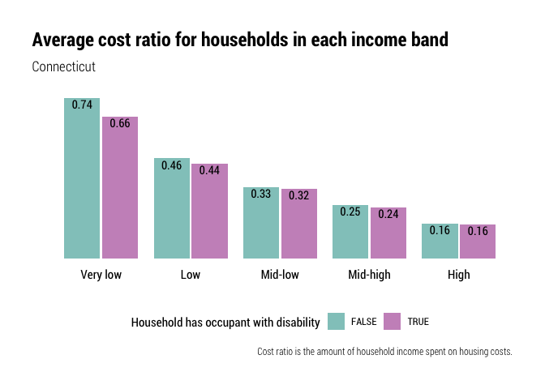

Households desiring housing
================

``` r
library(ipumsr)
library(tidyverse)
library(srvyr)
library(tidycensus)
library(hrbrthemes)
library(camiller)
library(waffle)
```

This notebook needs a better name. “Households desiring housing” to me
reads as wanting to move, not being unable to afford housing. Maybe just
“gaps in housing units available to households by income band” or
something? Kind of a mouthful…

There are a couple measurements in this notebook that build off of each
other:

  - Count and share of households by income band, the kinds of
    occupations/jobs those housing occupants might work in (so salary by
    occ?), and the share of those households that are cost-burdened (T2
    in DC report). **Need to determine what income level to use.
    Divisions of county median income make the most sense because HUD
    regions (HMFAs) cross PUMA and county lines.**
  - The approximate monthly housing cost for an affordable unit for each
    income band, rounded to pretty numbers for legibility. Then, the
    count/share of units by those cost bands in the area (T3 in DC
    report). **Need to determine what an area is. Counties make sense if
    using county median income.**
  - The count of housing units needed for each cost band, and the count
    of units in those cost bands, i.e., affordable to each income band
    (F19 in DC report–they found that gaps/need existed in low income
    bands and surpluses/lack of need in higher income bands)
  - For each income band, the number of households that can/cannot
    afford to pay more, and those that are vacant in that cost band (F20
    in DC report).

## Clean and set survey design

Starting by using county median incomes (CMI) and income bands like we
did in the Community Index reports…

  - poor: \< 0.5 CMI
  - low-income: 0.5–0.74 CMI
  - middle-income: 0.75–1.24 CMI
  - high-income: 1.25–1.49 CMI
  - affluent: \> 1.5 CMI

<!-- end list -->

``` r
minc <- get_acs(
    geography = "county",
      table = "B19013",
    state = 09,
      cache_table = T) %>% 
    arrange(GEOID) %>% 
    mutate(countyfip = seq(from = 1, to = 15, by = 2),
                 name = str_remove(NAME, ", Connecticut")) %>% 
    select(countyfip, name, minc = estimate)

ddi <- read_ipums_ddi("../input_data/usa_00037.xml")

pums <- read_ipums_micro(ddi, verbose = F)  %>% 
    mutate_at(vars(YEAR, PUMA, OWNERSHP, OWNERSHPD, RACE, RACED, HISPAN, HISPAND), as_factor) %>% 
    mutate_at(vars(PERWT, HHWT), as.numeric) %>% 
    mutate_at(vars(HHINCOME, OWNCOST, RENTGRS), as.integer) %>% 
    janitor::clean_names() %>% 
    left_join(minc, by = "countyfip") %>% 
    mutate(ratio = hhincome / minc) %>% 
    mutate(
        inc_band = cut(
            ratio,
            breaks = c(-Inf, 0.5, 0.75, 1.25, 1.5, Inf),
            labels = c("poor", "low", "middle", "high", "affluent"),
            include.lowest = T, right = F)) %>% 
    mutate(
        inc_band = as.factor(inc_band) %>%
            fct_relevel(., "poor", "low", "middle", "high", "affluent")) %>% 
    mutate(cb = if_else(ownershp == "Rented", (rentgrs * 12) / hhincome, 99999)) %>% 
    mutate(cb = if_else(ownershp == "Owned or being bought (loan)", (owncost * 12) / hhincome, cb)) %>% 
    mutate(
        cost_burden = cut(
            cb,
            breaks = c(-Inf, .3, .5, Inf),
            labels = c("No burden", "cost-burdened", "severely cost-burdened"),
            include.lowest = T, right = F))

hhdes <- pums %>%
    filter(pernum == "1", hhincome != 9999999, ownershp != "N/A") %>% 
    as_survey_design(., ids = 1, wt = hhwt)

out <- list()
```

## Household counts/shares by income bands

``` r
county_hhlds <- hhdes %>%
    select(hhwt, name, inc_band) %>% 
    group_by(name, inc_band) %>% 
    summarise(value = survey_total(hhwt)) %>% 
    mutate(level = "2_counties")

county_total <- hhdes %>%
    select(hhwt, name) %>% 
    group_by(name) %>% 
    summarise(value = survey_total(hhwt)) %>% 
    mutate(inc_band = "total_hhlds") %>% 
    mutate(level = "2_counties")

ct_hhlds <- hhdes %>%
    select(hhwt, statefip, inc_band) %>% 
    group_by(statefip, inc_band) %>% 
    summarise(value = survey_total(hhwt)) %>% 
    mutate(name = "Connecticut", level = "1_state") %>% 
    select(-statefip)

ct_total <- hhdes %>%
    select(hhwt, statefip) %>% 
    group_by(statefip) %>% 
    summarise(value = survey_total(hhwt)) %>% 
    mutate(name = "Connecticut", level = "1_state", inc_band = "total_hhlds") %>% 
    select(-statefip)

hh_by_inc_band <- bind_rows(county_hhlds, county_total, ct_hhlds, ct_total) %>%
    ungroup() %>%
    mutate(inc_band = as.factor(inc_band) %>% 
                    fct_relevel(., "poor", "low", "middle", "high", "affluent", "total_hhlds"),
                 level = as.factor(level)) %>% 
    arrange(level, name) %>% 
    group_by(level, name) %>% 
    calc_shares(group = inc_band, denom = "total_hhlds", value = value, moe = value_se)

out$hh_by_inc_band <- hh_by_inc_band
```

``` r
hh_by_inc_band %>% 
    group_by(level) %>% 
    mutate(name = as.factor(name) %>% 
                    fct_rev()) %>% 
    filter(inc_band != "total_hhlds") %>% 
    ggplot(aes(value, name, group = inc_band)) +
    geom_col(aes(fill = inc_band), width = .7, position = position_dodge(.8)) +
    scale_x_continuous(
        expand = expansion(mult = c(0, 0.1)),
        labels = scales::comma) +
    geom_text(aes(
        label = scales::comma(value, accuracy = 1)),
        position = position_dodge(.8), hjust = -0.1, family = "Roboto Condensed", size = 3.25) +
    facet_grid(rows = "level", scales = "free_y", space = "free") +
    guides(fill = guide_legend(title = "")) +
    labs(
        x = "",
        y = "",
        title = "Households in each income band") +
    theme_ipsum_rc() +
    theme(
        panel.grid.minor = element_blank(),
        panel.grid.major = element_blank(),
        legend.position = "top",
        plot.title.position = "plot",
        axis.text.x = element_blank(),
        axis.text.y = element_text(colour = "black"),
        strip.text.y = element_blank())
```

<!-- -->
More than half a million households in CT (40% of all households) are
poor or low-income, earning less than three-quarters of their county’s
median income. A similar share are affluent or high income, earning 125%
or more of their county’s median income. Just one in five households
statewide are considered middle income by this definition.

``` r
hh_by_inc_band %>% 
    filter(inc_band != "total_hhlds") %>% 
    ggplot(aes(fill = inc_band, values = share)) +
    geom_waffle(n_rows = 10, size = 0.33, colour = "white", flip = F, make_proportional = T) +
    facet_wrap(facets = "name") +
    coord_equal() +
    theme_ipsum_rc(grid = "") +
    theme_enhance_waffle() +
    theme(legend.position = "top",
                plot.title.position = "plot") +
    guides(fill = guide_legend(title = "")) +
    labs(x = "", y = "",
             title = "Share of households in each income band by state and county")
```

<!-- -->

These waffles are not usually a way we look at this data, but I’m
surprised at the consistency in the income distributions, even in the
more rural counties. This trend mirrors national trends with middle
income households being squeezed out by high and low income households.

*Out of curiosity, I also want to see the share of a county’s units in
each income band (so like what share of all affluent households are in
FC). But I’ll come back to it later.*

## Cost burden within each income band

``` r
#redo design
#statewide and county, cb by each
```
