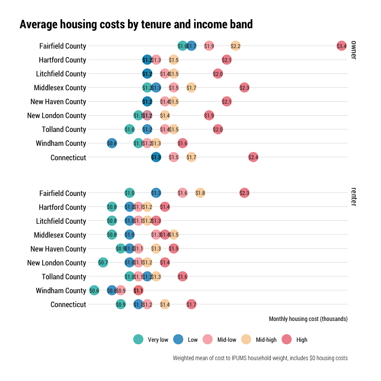

Households desiring housing
================

This notebook needs a better name. “Households desiring housing” to me
suggests a household wants to move, not that they’re unable to afford
housing. Maybe just “gaps in housing units available to households by
income band” or something? Kind of a mouthful…

There’s a lot going on in this notebook:

  - Count and share of households by income band by area
      - Rounded to pretty numbers for legibility?
  - The kinds of occupations/jobs those residents work in
      - Not exactly germane to the conversation unless we’re talking
        about wage reform, but brings the context back down to earth…
  - Count and share of households in each band that are cost-burdened
    (T2 in DC report)
  - Average (median?) housing-cost-to-income ratio for each income band
  - The approximate monthly housing cost for an affordable unit (30%)
    for each income band.
      - Rounded to pretty numbers for legibility?
  - Count and share of units by those cost bands in the area (T3 in DC
    report).
  - Number of housing units needed for each cost band so each household
    would have an affordable housing cost, vs. the actual count of units
    in those cost bands (F19 in DC report)
  - For each income band, the number of households that can/cannot
    afford to pay more
  - Count of vacant units in each cost band (F20 in DC report).

## Establish groups

After discussion with team on 7/15 we are settled with using median hh
income by county and the groupings below:

  - very low income: \<= 0.3 CMI
  - low income: (0.3–0.5\] CMI
  - mid-low income: (0.5–.8\] CMI
  - mid-high income: (.8–1.2\] CMI
  - high income: \> 1.2 CMI

Cost-burden in predictable breaks:

  - No burden: Less than 30% income to housing
  - Cost-burdened: 30%-50% income to housing
  - Severely cost-burdened: More than 50% income to housing

And race/ethnicity into a few major categories so we can look at it by
county:

  - White (NH)
  - Black (NH)
  - Latino (any race)
  - All others (grouped)

And for everyone we’re considering affordable 30%, not the sliding scale
they used in the DC report.

## Define income bands

Would it be preferable to set these as prettier breaks, or use the CT
numbers for all counties?

**A better chart here would be color coded segments indicating each
group’s range, with each area on a new row. Could use arrow ends or
something to communicate the top and bottom. Come back to this idea.**

<table>

<caption>

Income ranges by income band and area

</caption>

<thead>

<tr>

<th style="text-align:left;">

Name

</th>

<th style="text-align:left;">

Very low

</th>

<th style="text-align:left;">

Low

</th>

<th style="text-align:left;">

Mid-low

</th>

<th style="text-align:left;">

Mid-high

</th>

<th style="text-align:left;">

High

</th>

</tr>

</thead>

<tbody>

<tr>

<td style="text-align:left;">

Fairfield County

</td>

<td style="text-align:left;">

Less than $46,484

</td>

<td style="text-align:left;">

Between $46,484 and $69,727

</td>

<td style="text-align:left;">

Between $69,727 and $116,211

</td>

<td style="text-align:left;">

Between $116,211 and $139,454

</td>

<td style="text-align:left;">

More than $139,454

</td>

</tr>

<tr>

<td style="text-align:left;">

Hartford County

</td>

<td style="text-align:left;">

Less than $36,160

</td>

<td style="text-align:left;">

Between $36,160 and $54,241

</td>

<td style="text-align:left;">

Between $54,241 and $90,401

</td>

<td style="text-align:left;">

Between $90,401 and $108,482

</td>

<td style="text-align:left;">

More than $108,482

</td>

</tr>

<tr>

<td style="text-align:left;">

Litchfield County

</td>

<td style="text-align:left;">

Less than $39,157

</td>

<td style="text-align:left;">

Between $39,157 and $58,736

</td>

<td style="text-align:left;">

Between $58,736 and $97,892

</td>

<td style="text-align:left;">

Between $97,892 and $117,471

</td>

<td style="text-align:left;">

More than $117,471

</td>

</tr>

<tr>

<td style="text-align:left;">

Middlesex County

</td>

<td style="text-align:left;">

Less than $42,380

</td>

<td style="text-align:left;">

Between $42,380 and $63,571

</td>

<td style="text-align:left;">

Between $63,571 and $105,951

</td>

<td style="text-align:left;">

Between $105,951 and $127,142

</td>

<td style="text-align:left;">

More than $127,142

</td>

</tr>

<tr>

<td style="text-align:left;">

New Haven County

</td>

<td style="text-align:left;">

Less than $33,564

</td>

<td style="text-align:left;">

Between $33,564 and $50,346

</td>

<td style="text-align:left;">

Between $50,346 and $83,910

</td>

<td style="text-align:left;">

Between $83,910 and $100,692

</td>

<td style="text-align:left;">

More than $100,692

</td>

</tr>

<tr>

<td style="text-align:left;">

New London County

</td>

<td style="text-align:left;">

Less than $35,684

</td>

<td style="text-align:left;">

Between $35,684 and $53,526

</td>

<td style="text-align:left;">

Between $53,526 and $89,210

</td>

<td style="text-align:left;">

Between $89,210 and $107,052

</td>

<td style="text-align:left;">

More than $107,052

</td>

</tr>

<tr>

<td style="text-align:left;">

Tolland County

</td>

<td style="text-align:left;">

Less than $42,458

</td>

<td style="text-align:left;">

Between $42,458 and $63,687

</td>

<td style="text-align:left;">

Between $63,687 and $106,145

</td>

<td style="text-align:left;">

Between $106,145 and $127,374

</td>

<td style="text-align:left;">

More than $127,374

</td>

</tr>

<tr>

<td style="text-align:left;">

Windham County

</td>

<td style="text-align:left;">

Less than $32,387

</td>

<td style="text-align:left;">

Between $32,387 and $48,580

</td>

<td style="text-align:left;">

Between $48,580 and $80,968

</td>

<td style="text-align:left;">

Between $80,968 and $97,161

</td>

<td style="text-align:left;">

More than $97,161

</td>

</tr>

<tr>

<td style="text-align:left;">

Connecticut

</td>

<td style="text-align:left;">

Less than $38,053

</td>

<td style="text-align:left;">

Between $38,053 and $57,080

</td>

<td style="text-align:left;">

Between $57,080 and $95,132

</td>

<td style="text-align:left;">

Between $95,132 and $114,159

</td>

<td style="text-align:left;">

More than $114,159

</td>

</tr>

</tbody>

</table>

## Count/share of households by income band

Using the new breakdowns, high income households *vastly* outnumber
lower income households.

<!-- -->

<table>

<caption>

Number of households by income band

</caption>

<thead>

<tr>

<th style="text-align:left;">

Name

</th>

<th style="text-align:left;">

Very low

</th>

<th style="text-align:left;">

Low

</th>

<th style="text-align:left;">

Mid-low

</th>

<th style="text-align:left;">

Mid-high

</th>

<th style="text-align:left;">

High

</th>

<th style="text-align:left;">

Total

</th>

</tr>

</thead>

<tbody>

<tr>

<td style="text-align:left;">

Fairfield County

</td>

<td style="text-align:left;">

55,251

</td>

<td style="text-align:left;">

38,220

</td>

<td style="text-align:left;">

51,287

</td>

<td style="text-align:left;">

53,533

</td>

<td style="text-align:left;">

142,201

</td>

<td style="text-align:left;">

340,492

</td>

</tr>

<tr>

<td style="text-align:left;">

Hartford County

</td>

<td style="text-align:left;">

52,900

</td>

<td style="text-align:left;">

37,375

</td>

<td style="text-align:left;">

55,552

</td>

<td style="text-align:left;">

57,614

</td>

<td style="text-align:left;">

145,622

</td>

<td style="text-align:left;">

349,063

</td>

</tr>

<tr>

<td style="text-align:left;">

Litchfield County

</td>

<td style="text-align:left;">

8,698

</td>

<td style="text-align:left;">

8,655

</td>

<td style="text-align:left;">

11,899

</td>

<td style="text-align:left;">

14,645

</td>

<td style="text-align:left;">

30,090

</td>

<td style="text-align:left;">

73,987

</td>

</tr>

<tr>

<td style="text-align:left;">

Middlesex County

</td>

<td style="text-align:left;">

9,466

</td>

<td style="text-align:left;">

7,567

</td>

<td style="text-align:left;">

10,680

</td>

<td style="text-align:left;">

12,075

</td>

<td style="text-align:left;">

27,105

</td>

<td style="text-align:left;">

66,893

</td>

</tr>

<tr>

<td style="text-align:left;">

New Haven County

</td>

<td style="text-align:left;">

47,160

</td>

<td style="text-align:left;">

37,512

</td>

<td style="text-align:left;">

52,407

</td>

<td style="text-align:left;">

53,410

</td>

<td style="text-align:left;">

139,367

</td>

<td style="text-align:left;">

329,856

</td>

</tr>

<tr>

<td style="text-align:left;">

New London County

</td>

<td style="text-align:left;">

14,344

</td>

<td style="text-align:left;">

10,745

</td>

<td style="text-align:left;">

17,668

</td>

<td style="text-align:left;">

20,979

</td>

<td style="text-align:left;">

43,666

</td>

<td style="text-align:left;">

107,402

</td>

</tr>

<tr>

<td style="text-align:left;">

Tolland County

</td>

<td style="text-align:left;">

7,722

</td>

<td style="text-align:left;">

6,681

</td>

<td style="text-align:left;">

8,039

</td>

<td style="text-align:left;">

10,580

</td>

<td style="text-align:left;">

22,196

</td>

<td style="text-align:left;">

55,218

</td>

</tr>

<tr>

<td style="text-align:left;">

Windham County

</td>

<td style="text-align:left;">

5,836

</td>

<td style="text-align:left;">

4,590

</td>

<td style="text-align:left;">

6,958

</td>

<td style="text-align:left;">

9,000

</td>

<td style="text-align:left;">

18,079

</td>

<td style="text-align:left;">

44,463

</td>

</tr>

<tr>

<td style="text-align:left;">

Connecticut

</td>

<td style="text-align:left;">

201,377

</td>

<td style="text-align:left;">

151,345

</td>

<td style="text-align:left;">

214,490

</td>

<td style="text-align:left;">

231,836

</td>

<td style="text-align:left;">

568,326

</td>

<td style="text-align:left;">

1,367,374

</td>

</tr>

</tbody>

</table>

The income distributions are fairly consistent.

<!-- -->

## Household characteristics by income bands

### Race breakdowns

Considering race/ethnicity of head of household. Statewide, a quarter of
all households headed by a Black or Latino person are very low income,
earning less than 30% of the county household median income, compared to
just over a tenth of households headed by a white person. Some variation
exists by county. In the three largest counties, half of white
households are high income.

<!-- -->

### Jobs held by household occupants

Retrieved a list of 2018 occ codes from the Census Bureau at
<https://www.census.gov/topics/employment/industry-occupation/guidance/code-lists.html>.

This table lists the top five occupations, in order from the most
numerous, for household inhabitants—so not just heads of household, but
all household members, including inhabitants with no work experience in
the past 5 years or who have never worked—by household income band by
county.

To be honest, this is a little surprising in places. I expected more
food service workers in general, and I’m surprised at how many
elementary and middle school teachers are workers in higher income
households. Either I have the exact wrong impression of how much
teachers are paid or it’s a common occupation for people whose
partners/spouses pull in big money. And yet, \#thestruggle: adjuncts and
GAs in Tolland County (UConn) getting those minimum wage grad school
stipends while profs in New Haven and Middlesex Counties make six
figures teaching half the load.

<table>

<caption>

Common occupations for workers by household income band

</caption>

<thead>

<tr>

<th style="text-align:left;">

Name

</th>

<th style="text-align:left;">

Very low

</th>

<th style="text-align:left;">

Low

</th>

<th style="text-align:left;">

Mid-low

</th>

<th style="text-align:left;">

Mid-high

</th>

<th style="text-align:left;">

High

</th>

</tr>

</thead>

<tbody>

<tr>

<td style="text-align:left;">

Fairfield County

</td>

<td style="text-align:left;">

Cashiers; Unemployed, with no work experience in the last 5 years or
earlier or never worked; Maids and housekeeping cleaners; Childcare
workers; Landscaping and groundskeeping workers

</td>

<td style="text-align:left;">

Maids and housekeeping cleaners; Janitors and building cleaners;
Landscaping and groundskeeping workers; Cashiers; Childcare workers

</td>

<td style="text-align:left;">

Cashiers; Maids and housekeeping cleaners; Janitors and building
cleaners; Secretaries and administrative assistants, except legal,
medical, and executive; Retail salespersons

</td>

<td style="text-align:left;">

Elementary and middle school teachers; Cashiers; Retail salespersons;
Secretaries and administrative assistants, except legal, medical, and
executive; Driver/sales workers and truck drivers

</td>

<td style="text-align:left;">

Managers, all other; Elementary and middle school teachers; Accountants
and auditors; Financial managers; Chief executives

</td>

</tr>

<tr>

<td style="text-align:left;">

Hartford County

</td>

<td style="text-align:left;">

Cashiers; Unemployed, with no work experience in the last 5 years or
earlier or never worked; Personal care aides; Janitors and building
cleaners; Nursing assistants

</td>

<td style="text-align:left;">

Cashiers; Janitors and building cleaners; Unemployed, with no work
experience in the last 5 years or earlier or never worked; Retail
salespersons; Nursing assistants

</td>

<td style="text-align:left;">

Cashiers; Retail salespersons; Nursing assistants; Unemployed, with no
work experience in the last 5 years or earlier or never worked;
Secretaries and administrative assistants, except legal, medical, and
executive

</td>

<td style="text-align:left;">

Cashiers; Secretaries and administrative assistants, except legal,
medical, and executive; Janitors and building cleaners; Driver/sales
workers and truck drivers; Customer service representatives

</td>

<td style="text-align:left;">

Managers, all other; Elementary and middle school teachers; Registered
nurses; Accountants and auditors; Retail salespersons

</td>

</tr>

<tr>

<td style="text-align:left;">

Litchfield County

</td>

<td style="text-align:left;">

Retail salespersons; Laborers and freight, stock, and material movers,
hand; Personal care aides; Cashiers; Janitors and building cleaners

</td>

<td style="text-align:left;">

Janitors and building cleaners; First-Line supervisors of retail sales
workers; Waiters and waitresses; Personal care aides; Customer service
representatives

</td>

<td style="text-align:left;">

Janitors and building cleaners; Cashiers; Secretaries and administrative
assistants, except legal, medical, and executive; Driver/sales workers
and truck drivers; Bookkeeping, accounting, and auditing clerks

</td>

<td style="text-align:left;">

First-Line supervisors of retail sales workers; Elementary and middle
school teachers; Landscaping and groundskeeping workers; Retail
salespersons; Secretaries and administrative assistants, except legal,
medical, and executive

</td>

<td style="text-align:left;">

Elementary and middle school teachers; Managers, all other; Registered
nurses; Chief executives; Customer service representatives

</td>

</tr>

<tr>

<td style="text-align:left;">

Middlesex County

</td>

<td style="text-align:left;">

Customer service representatives; Cashiers; Driver/sales workers and
truck drivers; First-Line supervisors of retail sales workers; Nursing
assistants

</td>

<td style="text-align:left;">

Cashiers; Waiters and waitresses; Office clerks, general; Maids and
housekeeping cleaners; Inspectors, testers, sorters, samplers, and
weighers

</td>

<td style="text-align:left;">

Cashiers; Secretaries and administrative assistants, except legal,
medical, and executive; First-Line supervisors of retail sales workers;
Customer service representatives; Nursing assistants

</td>

<td style="text-align:left;">

Managers, all other; Elementary and middle school teachers; Registered
nurses; Secretaries and administrative assistants, except legal,
medical, and executive; Janitors and building cleaners

</td>

<td style="text-align:left;">

Elementary and middle school teachers; Managers, all other; Registered
nurses; Chief executives; Postsecondary teachers

</td>

</tr>

<tr>

<td style="text-align:left;">

New Haven County

</td>

<td style="text-align:left;">

Unemployed, with no work experience in the last 5 years or earlier or
never worked; Cashiers; Customer service representatives; Personal care
aides; Janitors and building cleaners

</td>

<td style="text-align:left;">

Cashiers; Unemployed, with no work experience in the last 5 years or
earlier or never worked; Personal care aides; Nursing assistants; Retail
salespersons

</td>

<td style="text-align:left;">

Cashiers; Nursing assistants; Retail salespersons; First-Line
supervisors of retail sales workers; Janitors and building cleaners

</td>

<td style="text-align:left;">

Janitors and building cleaners; First-Line supervisors of retail sales
workers; Retail salespersons; Cashiers; Secretaries and administrative
assistants, except legal, medical, and executive

</td>

<td style="text-align:left;">

Elementary and middle school teachers; Managers, all other; Registered
nurses; Secretaries and administrative assistants, except legal,
medical, and executive; First-Line supervisors of retail sales workers

</td>

</tr>

<tr>

<td style="text-align:left;">

New London County

</td>

<td style="text-align:left;">

Maids and housekeeping cleaners; Janitors and building cleaners; Waiters
and waitresses; Unemployed, with no work experience in the last 5 years
or earlier or never worked; Cashiers

</td>

<td style="text-align:left;">

Cashiers; Janitors and building cleaners; Retail salespersons; Cooks;
Laborers and freight, stock, and material movers, hand

</td>

<td style="text-align:left;">

Janitors and building cleaners; Cashiers; Gambling services workers;
Landscaping and groundskeeping workers; Nursing assistants

</td>

<td style="text-align:left;">

Secretaries and administrative assistants, except legal, medical, and
executive; Driver/sales workers and truck drivers; Cashiers; First-Line
supervisors of retail sales workers; Elementary and middle school
teachers

</td>

<td style="text-align:left;">

Managers, all other; Elementary and middle school teachers; Military
enlisted tactical operations and air/weapons specialists and crew
members; Registered nurses; Cashiers

</td>

</tr>

<tr>

<td style="text-align:left;">

Tolland County

</td>

<td style="text-align:left;">

Waiters and waitresses; Postsecondary teachers; Customer service
representatives; Nursing assistants; Cashiers

</td>

<td style="text-align:left;">

Waiters and waitresses; Driver/sales workers and truck drivers; Chefs
and head cooks; Receptionists and information clerks; Customer service
representatives

</td>

<td style="text-align:left;">

Retail salespersons; Driver/sales workers and truck drivers; Teaching
assistants; Childcare workers; First-Line supervisors of retail sales
workers

</td>

<td style="text-align:left;">

Accountants and auditors; Elementary and middle school teachers;
Cashiers; Secretaries and administrative assistants, except legal,
medical, and executive; Registered nurses

</td>

<td style="text-align:left;">

Managers, all other; Elementary and middle school teachers; Secretaries
and administrative assistants, except legal, medical, and executive;
Registered nurses; Cashiers

</td>

</tr>

<tr>

<td style="text-align:left;">

Windham County

</td>

<td style="text-align:left;">

Unemployed, with no work experience in the last 5 years or earlier or
never worked; Janitors and building cleaners; Maids and housekeeping
cleaners; Waiters and waitresses; Retail salespersons

</td>

<td style="text-align:left;">

Laborers and freight, stock, and material movers, hand; Retail
salespersons; Personal care aides; Nursing assistants; Driver/sales
workers and truck drivers

</td>

<td style="text-align:left;">

Janitors and building cleaners; Driver/sales workers and truck drivers;
Landscaping and groundskeeping workers; Food preparation workers; Cooks

</td>

<td style="text-align:left;">

Nursing assistants; First-Line supervisors of retail sales workers;
Driver/sales workers and truck drivers; Secretaries and administrative
assistants, except legal, medical, and executive; Customer service
representatives

</td>

<td style="text-align:left;">

Registered nurses; Cashiers; Elementary and middle school teachers;
Driver/sales workers and truck drivers; Secretaries and administrative
assistants, except legal, medical, and executive

</td>

</tr>

</tbody>

</table>

## Cost burden by income band

No surprise that cost burden rates among very low income households are
more than 80%. At the statewide level that’s more than 14x the rate of
high income households.

It’s a little surprising that fully half of mid-low income households
(households whose income ranges from $57K-$95K in CT) are cost burdened.

<!-- -->

Breaking this down by regular and severe cost burden, in Fairfield and
New Haven Counties, about the same share of low income households are
cost burdened or severely cost burdened. Two-thirds or more very low
income households are severely cost burdened.

**Note, these would add up to 100% if households with no burden were
included, so the chart is read as “16% of very low income households in
Connecticut are cost burdened and another 70% are severely cost
burdened.”**

<!-- -->

Quick diversion: is the SCB rate among very low income households
partially explained by some of these households having housing costs and
no/negative negative income?

By definition, the household is in the “very low income” income band if
household income is $0 or less because that’s less than 30% CMI. There
are about 15K poor households with no or negative income and some
nonzero housing cost, making them “severely cost burdened” by
definition. These \~15K units make up about 7% of all very low income
households, which is not insignificant, but it’s not the sole motivator
for high SCB rates in this income band.

    ## # A tibble: 2 x 4
    ##   income          cost_burden            households households_se
    ##   <chr>           <fct>                       <dbl>         <dbl>
    ## 1 negative_income Severely cost-burdened        366          79.2
    ## 2 no_income       Severely cost-burdened      14470         681.

## Average housing-cost-to-income ratio for each band

Urban’s DC study found that higher income households paid about 12%
income to housing. In CT it’s about 16%. For a household with $200K in
income, that’s about $2667/month in housing costs, which I just don’t
think is that high considering there are some kinda crappy 2BRs in East
Rock that go for that much.

For a household at the lower end of CT’s affluent band, earning about
$114K, 16% of income to housing cost would be about $1520, which as a
renter strikes me as unbelievably low for someone of those means. It’s
the same as 30% for someone earning $60K. Why is that OK?

**7/15:** Talked with the team and I think we’re going to use 30% for
all income bands rather than the sliding scale.

<!-- -->

One last thing real quick… what’s the average *actual* housing cost for
each band?

Lots of competition for renters in the range between $1000 and $1500,
and for homeowners in the $1200-$1500 range. The tightness of the
clusters by county are also interesting.

<!-- -->

So I do want to look at how many people from each INCOME band are living
in each COST band.

## Affordable housing costs to households in each band

Some future iteration of this notebook should find a way to combine this
table with the chart above, but a couple interesting things stand out.
Very low income renters are often spending their “affordable” amount,
but very low income homeowners spend more. Depending on how much more,
I’m on the fence about considering this a bad thing necessarily, since
the benefits of home ownership may outweigh an extra $100-$200 per month
above the affordable threshold, but $300 or more becomes much more
challenging to maintain. A few hundred bucks a month over 30% of income,
which is already a huge chunk, is the difference between scraping
together the mortgage payment and an unexpected expense like a medical
bill or car repair.

Almost all middle-to-high income renters are paying below their
affordable threshold. As was shown above, higher income people like to
rent in lower cost bands. The chart above and table below just show how
much lower they rent. But low-bar slow clap for high income FC
homeowners paying their 30%.

<table>

<caption>

Affordable monthly housing cost ranges by income band and area

</caption>

<thead>

<tr>

<th style="text-align:left;">

Name

</th>

<th style="text-align:left;">

Very low

</th>

<th style="text-align:left;">

Low

</th>

<th style="text-align:left;">

Mid-low

</th>

<th style="text-align:left;">

Mid-high

</th>

<th style="text-align:left;">

High

</th>

</tr>

</thead>

<tbody>

<tr>

<td style="text-align:left;">

Fairfield County

</td>

<td style="text-align:left;">

Less than $1,162

</td>

<td style="text-align:left;">

Between $1,162 and $1,743

</td>

<td style="text-align:left;">

Between $1,743 and $2,905

</td>

<td style="text-align:left;">

Between $2,905 and $3,486

</td>

<td style="text-align:left;">

More than $3,486

</td>

</tr>

<tr>

<td style="text-align:left;">

Hartford County

</td>

<td style="text-align:left;">

Less than $904

</td>

<td style="text-align:left;">

Between $904 and $1,356

</td>

<td style="text-align:left;">

Between $1,356 and $2,260

</td>

<td style="text-align:left;">

Between $2,260 and $2,712

</td>

<td style="text-align:left;">

More than $2,712

</td>

</tr>

<tr>

<td style="text-align:left;">

Litchfield County

</td>

<td style="text-align:left;">

Less than $979

</td>

<td style="text-align:left;">

Between $979 and $1,468

</td>

<td style="text-align:left;">

Between $1,468 and $2,447

</td>

<td style="text-align:left;">

Between $2,447 and $2,937

</td>

<td style="text-align:left;">

More than $2,937

</td>

</tr>

<tr>

<td style="text-align:left;">

Middlesex County

</td>

<td style="text-align:left;">

Less than $1,060

</td>

<td style="text-align:left;">

Between $1,060 and $1,589

</td>

<td style="text-align:left;">

Between $1,589 and $2,649

</td>

<td style="text-align:left;">

Between $2,649 and $3,179

</td>

<td style="text-align:left;">

More than $3,179

</td>

</tr>

<tr>

<td style="text-align:left;">

New Haven County

</td>

<td style="text-align:left;">

Less than $839

</td>

<td style="text-align:left;">

Between $839 and $1,259

</td>

<td style="text-align:left;">

Between $1,259 and $2,098

</td>

<td style="text-align:left;">

Between $2,098 and $2,517

</td>

<td style="text-align:left;">

More than $2,517

</td>

</tr>

<tr>

<td style="text-align:left;">

New London County

</td>

<td style="text-align:left;">

Less than $892

</td>

<td style="text-align:left;">

Between $892 and $1,338

</td>

<td style="text-align:left;">

Between $1,338 and $2,230

</td>

<td style="text-align:left;">

Between $2,230 and $2,676

</td>

<td style="text-align:left;">

More than $2,676

</td>

</tr>

<tr>

<td style="text-align:left;">

Tolland County

</td>

<td style="text-align:left;">

Less than $1,061

</td>

<td style="text-align:left;">

Between $1,061 and $1,592

</td>

<td style="text-align:left;">

Between $1,592 and $2,654

</td>

<td style="text-align:left;">

Between $2,654 and $3,184

</td>

<td style="text-align:left;">

More than $3,184

</td>

</tr>

<tr>

<td style="text-align:left;">

Windham County

</td>

<td style="text-align:left;">

Less than $810

</td>

<td style="text-align:left;">

Between $810 and $1,214

</td>

<td style="text-align:left;">

Between $1,214 and $2,024

</td>

<td style="text-align:left;">

Between $2,024 and $2,429

</td>

<td style="text-align:left;">

More than $2,429

</td>

</tr>

<tr>

<td style="text-align:left;">

Connecticut

</td>

<td style="text-align:left;">

Less than $951

</td>

<td style="text-align:left;">

Between $951 and $1,427

</td>

<td style="text-align:left;">

Between $1,427 and $2,378

</td>

<td style="text-align:left;">

Between $2,378 and $2,854

</td>

<td style="text-align:left;">

More than $2,854

</td>

</tr>

</tbody>

</table>

## Housing units in those cost bands

*Notes for myself: Total up occupied units (renter + owner, any reason
to separate?) and vacant units available in each cost band. Occupied
units will go by the cost paid (rentgrs and owncost), vacant by contract
rent and mortgage payment estimate generated using some average mortgage
rate for CT. Need a new PUMS file in hierarchical format, widdled down
to household level.*

As far as average mortgage rates, the team had no good source for this,
just said to Google it. I think I should take an average of a few years
since rates are super low today. Try HMDA?

Here’s a quick crappy table of the occupied units by cost band and
county. Still working on this.

<table>

<thead>

<tr>

<th style="text-align:left;">

name

</th>

<th style="text-align:left;">

tenure

</th>

<th style="text-align:left;">

cost\_band

</th>

<th style="text-align:right;">

units

</th>

<th style="text-align:right;">

units\_se

</th>

</tr>

</thead>

<tbody>

<tr>

<td style="text-align:left;">

Fairfield County

</td>

<td style="text-align:left;">

owner\_occupied

</td>

<td style="text-align:left;">

high

</td>

<td style="text-align:right;">

51978

</td>

<td style="text-align:right;">

1035.37045

</td>

</tr>

<tr>

<td style="text-align:left;">

Fairfield County

</td>

<td style="text-align:left;">

owner\_occupied

</td>

<td style="text-align:left;">

mid\_high

</td>

<td style="text-align:right;">

23619

</td>

<td style="text-align:right;">

745.62256

</td>

</tr>

<tr>

<td style="text-align:left;">

Fairfield County

</td>

<td style="text-align:left;">

owner\_occupied

</td>

<td style="text-align:left;">

mid\_low

</td>

<td style="text-align:right;">

71938

</td>

<td style="text-align:right;">

1310.87665

</td>

</tr>

<tr>

<td style="text-align:left;">

Fairfield County

</td>

<td style="text-align:left;">

owner\_occupied

</td>

<td style="text-align:left;">

low

</td>

<td style="text-align:right;">

36036

</td>

<td style="text-align:right;">

925.45482

</td>

</tr>

<tr>

<td style="text-align:left;">

Fairfield County

</td>

<td style="text-align:left;">

owner\_occupied

</td>

<td style="text-align:left;">

very\_low

</td>

<td style="text-align:right;">

42545

</td>

<td style="text-align:right;">

944.35213

</td>

</tr>

<tr>

<td style="text-align:left;">

Hartford County

</td>

<td style="text-align:left;">

owner\_occupied

</td>

<td style="text-align:left;">

high

</td>

<td style="text-align:right;">

30125

</td>

<td style="text-align:right;">

833.25231

</td>

</tr>

<tr>

<td style="text-align:left;">

Hartford County

</td>

<td style="text-align:left;">

owner\_occupied

</td>

<td style="text-align:left;">

mid\_high

</td>

<td style="text-align:right;">

22135

</td>

<td style="text-align:right;">

742.31965

</td>

</tr>

<tr>

<td style="text-align:left;">

Hartford County

</td>

<td style="text-align:left;">

owner\_occupied

</td>

<td style="text-align:left;">

mid\_low

</td>

<td style="text-align:right;">

83604

</td>

<td style="text-align:right;">

1439.58068

</td>

</tr>

<tr>

<td style="text-align:left;">

Hartford County

</td>

<td style="text-align:left;">

owner\_occupied

</td>

<td style="text-align:left;">

low

</td>

<td style="text-align:right;">

43029

</td>

<td style="text-align:right;">

978.14178

</td>

</tr>

<tr>

<td style="text-align:left;">

Hartford County

</td>

<td style="text-align:left;">

owner\_occupied

</td>

<td style="text-align:left;">

very\_low

</td>

<td style="text-align:right;">

44469

</td>

<td style="text-align:right;">

969.14026

</td>

</tr>

<tr>

<td style="text-align:left;">

Litchfield County

</td>

<td style="text-align:left;">

owner\_occupied

</td>

<td style="text-align:left;">

high

</td>

<td style="text-align:right;">

5291

</td>

<td style="text-align:right;">

335.89606

</td>

</tr>

<tr>

<td style="text-align:left;">

Litchfield County

</td>

<td style="text-align:left;">

owner\_occupied

</td>

<td style="text-align:left;">

mid\_high

</td>

<td style="text-align:right;">

4662

</td>

<td style="text-align:right;">

340.06449

</td>

</tr>

<tr>

<td style="text-align:left;">

Litchfield County

</td>

<td style="text-align:left;">

owner\_occupied

</td>

<td style="text-align:left;">

mid\_low

</td>

<td style="text-align:right;">

20274

</td>

<td style="text-align:right;">

684.60494

</td>

</tr>

<tr>

<td style="text-align:left;">

Litchfield County

</td>

<td style="text-align:left;">

owner\_occupied

</td>

<td style="text-align:left;">

low

</td>

<td style="text-align:right;">

11223

</td>

<td style="text-align:right;">

509.67539

</td>

</tr>

<tr>

<td style="text-align:left;">

Litchfield County

</td>

<td style="text-align:left;">

owner\_occupied

</td>

<td style="text-align:left;">

very\_low

</td>

<td style="text-align:right;">

15506

</td>

<td style="text-align:right;">

574.45090

</td>

</tr>

<tr>

<td style="text-align:left;">

Middlesex County

</td>

<td style="text-align:left;">

owner\_occupied

</td>

<td style="text-align:left;">

high

</td>

<td style="text-align:right;">

4567

</td>

<td style="text-align:right;">

361.06160

</td>

</tr>

<tr>

<td style="text-align:left;">

Middlesex County

</td>

<td style="text-align:left;">

owner\_occupied

</td>

<td style="text-align:left;">

mid\_high

</td>

<td style="text-align:right;">

4942

</td>

<td style="text-align:right;">

382.30382

</td>

</tr>

<tr>

<td style="text-align:left;">

Middlesex County

</td>

<td style="text-align:left;">

owner\_occupied

</td>

<td style="text-align:left;">

mid\_low

</td>

<td style="text-align:right;">

17991

</td>

<td style="text-align:right;">

684.22512

</td>

</tr>

<tr>

<td style="text-align:left;">

Middlesex County

</td>

<td style="text-align:left;">

owner\_occupied

</td>

<td style="text-align:left;">

low

</td>

<td style="text-align:right;">

9087

</td>

<td style="text-align:right;">

486.66931

</td>

</tr>

<tr>

<td style="text-align:left;">

Middlesex County

</td>

<td style="text-align:left;">

owner\_occupied

</td>

<td style="text-align:left;">

very\_low

</td>

<td style="text-align:right;">

12489

</td>

<td style="text-align:right;">

543.22960

</td>

</tr>

<tr>

<td style="text-align:left;">

New Haven County

</td>

<td style="text-align:left;">

owner\_occupied

</td>

<td style="text-align:left;">

high

</td>

<td style="text-align:right;">

39677

</td>

<td style="text-align:right;">

1038.85176

</td>

</tr>

<tr>

<td style="text-align:left;">

New Haven County

</td>

<td style="text-align:left;">

owner\_occupied

</td>

<td style="text-align:left;">

mid\_high

</td>

<td style="text-align:right;">

24512

</td>

<td style="text-align:right;">

801.66113

</td>

</tr>

<tr>

<td style="text-align:left;">

New Haven County

</td>

<td style="text-align:left;">

owner\_occupied

</td>

<td style="text-align:left;">

mid\_low

</td>

<td style="text-align:right;">

68158

</td>

<td style="text-align:right;">

1391.50345

</td>

</tr>

<tr>

<td style="text-align:left;">

New Haven County

</td>

<td style="text-align:left;">

owner\_occupied

</td>

<td style="text-align:left;">

low

</td>

<td style="text-align:right;">

40002

</td>

<td style="text-align:right;">

1013.93616

</td>

</tr>

<tr>

<td style="text-align:left;">

New Haven County

</td>

<td style="text-align:left;">

owner\_occupied

</td>

<td style="text-align:left;">

very\_low

</td>

<td style="text-align:right;">

30279

</td>

<td style="text-align:right;">

825.21845

</td>

</tr>

<tr>

<td style="text-align:left;">

New London County

</td>

<td style="text-align:left;">

owner\_occupied

</td>

<td style="text-align:left;">

high

</td>

<td style="text-align:right;">

8271

</td>

<td style="text-align:right;">

410.57111

</td>

</tr>

<tr>

<td style="text-align:left;">

New London County

</td>

<td style="text-align:left;">

owner\_occupied

</td>

<td style="text-align:left;">

mid\_high

</td>

<td style="text-align:right;">

7035

</td>

<td style="text-align:right;">

411.58541

</td>

</tr>

<tr>

<td style="text-align:left;">

New London County

</td>

<td style="text-align:left;">

owner\_occupied

</td>

<td style="text-align:left;">

mid\_low

</td>

<td style="text-align:right;">

24645

</td>

<td style="text-align:right;">

784.88127

</td>

</tr>

<tr>

<td style="text-align:left;">

New London County

</td>

<td style="text-align:left;">

owner\_occupied

</td>

<td style="text-align:left;">

low

</td>

<td style="text-align:right;">

12881

</td>

<td style="text-align:right;">

549.00606

</td>

</tr>

<tr>

<td style="text-align:left;">

New London County

</td>

<td style="text-align:left;">

owner\_occupied

</td>

<td style="text-align:left;">

very\_low

</td>

<td style="text-align:right;">

18498

</td>

<td style="text-align:right;">

642.66030

</td>

</tr>

<tr>

<td style="text-align:left;">

Tolland County

</td>

<td style="text-align:left;">

owner\_occupied

</td>

<td style="text-align:left;">

high

</td>

<td style="text-align:right;">

2310

</td>

<td style="text-align:right;">

246.10017

</td>

</tr>

<tr>

<td style="text-align:left;">

Tolland County

</td>

<td style="text-align:left;">

owner\_occupied

</td>

<td style="text-align:left;">

mid\_high

</td>

<td style="text-align:right;">

2456

</td>

<td style="text-align:right;">

243.48187

</td>

</tr>

<tr>

<td style="text-align:left;">

Tolland County

</td>

<td style="text-align:left;">

owner\_occupied

</td>

<td style="text-align:left;">

mid\_low

</td>

<td style="text-align:right;">

15261

</td>

<td style="text-align:right;">

666.15703

</td>

</tr>

<tr>

<td style="text-align:left;">

Tolland County

</td>

<td style="text-align:left;">

owner\_occupied

</td>

<td style="text-align:left;">

low

</td>

<td style="text-align:right;">

7785

</td>

<td style="text-align:right;">

438.73167

</td>

</tr>

<tr>

<td style="text-align:left;">

Tolland County

</td>

<td style="text-align:left;">

owner\_occupied

</td>

<td style="text-align:left;">

very\_low

</td>

<td style="text-align:right;">

11903

</td>

<td style="text-align:right;">

532.07203

</td>

</tr>

<tr>

<td style="text-align:left;">

Windham County

</td>

<td style="text-align:left;">

owner\_occupied

</td>

<td style="text-align:left;">

high

</td>

<td style="text-align:right;">

2404

</td>

<td style="text-align:right;">

237.69931

</td>

</tr>

<tr>

<td style="text-align:left;">

Windham County

</td>

<td style="text-align:left;">

owner\_occupied

</td>

<td style="text-align:left;">

mid\_high

</td>

<td style="text-align:right;">

2978

</td>

<td style="text-align:right;">

279.04393

</td>

</tr>

<tr>

<td style="text-align:left;">

Windham County

</td>

<td style="text-align:left;">

owner\_occupied

</td>

<td style="text-align:left;">

mid\_low

</td>

<td style="text-align:right;">

12380

</td>

<td style="text-align:right;">

587.63637

</td>

</tr>

<tr>

<td style="text-align:left;">

Windham County

</td>

<td style="text-align:left;">

owner\_occupied

</td>

<td style="text-align:left;">

low

</td>

<td style="text-align:right;">

5280

</td>

<td style="text-align:right;">

373.83578

</td>

</tr>

<tr>

<td style="text-align:left;">

Windham County

</td>

<td style="text-align:left;">

owner\_occupied

</td>

<td style="text-align:left;">

very\_low

</td>

<td style="text-align:right;">

8010

</td>

<td style="text-align:right;">

414.90464

</td>

</tr>

<tr>

<td style="text-align:left;">

Fairfield County

</td>

<td style="text-align:left;">

renter\_occupied

</td>

<td style="text-align:left;">

high

</td>

<td style="text-align:right;">

4967

</td>

<td style="text-align:right;">

391.15955

</td>

</tr>

<tr>

<td style="text-align:left;">

Fairfield County

</td>

<td style="text-align:left;">

renter\_occupied

</td>

<td style="text-align:left;">

mid\_high

</td>

<td style="text-align:right;">

3200

</td>

<td style="text-align:right;">

324.35857

</td>

</tr>

<tr>

<td style="text-align:left;">

Fairfield County

</td>

<td style="text-align:left;">

renter\_occupied

</td>

<td style="text-align:left;">

mid\_low

</td>

<td style="text-align:right;">

29972

</td>

<td style="text-align:right;">

1031.27584

</td>

</tr>

<tr>

<td style="text-align:left;">

Fairfield County

</td>

<td style="text-align:left;">

renter\_occupied

</td>

<td style="text-align:left;">

low

</td>

<td style="text-align:right;">

37825

</td>

<td style="text-align:right;">

1149.97087

</td>

</tr>

<tr>

<td style="text-align:left;">

Fairfield County

</td>

<td style="text-align:left;">

renter\_occupied

</td>

<td style="text-align:left;">

very\_low

</td>

<td style="text-align:right;">

38412

</td>

<td style="text-align:right;">

1125.15132

</td>

</tr>

<tr>

<td style="text-align:left;">

Hartford County

</td>

<td style="text-align:left;">

renter\_occupied

</td>

<td style="text-align:left;">

high

</td>

<td style="text-align:right;">

1140

</td>

<td style="text-align:right;">

167.40966

</td>

</tr>

<tr>

<td style="text-align:left;">

Hartford County

</td>

<td style="text-align:left;">

renter\_occupied

</td>

<td style="text-align:left;">

mid\_high

</td>

<td style="text-align:right;">

1364

</td>

<td style="text-align:right;">

202.07482

</td>

</tr>

<tr>

<td style="text-align:left;">

Hartford County

</td>

<td style="text-align:left;">

renter\_occupied

</td>

<td style="text-align:left;">

mid\_low

</td>

<td style="text-align:right;">

27242

</td>

<td style="text-align:right;">

969.57619

</td>

</tr>

<tr>

<td style="text-align:left;">

Hartford County

</td>

<td style="text-align:left;">

renter\_occupied

</td>

<td style="text-align:left;">

low

</td>

<td style="text-align:right;">

51587

</td>

<td style="text-align:right;">

1316.80514

</td>

</tr>

<tr>

<td style="text-align:left;">

Hartford County

</td>

<td style="text-align:left;">

renter\_occupied

</td>

<td style="text-align:left;">

very\_low

</td>

<td style="text-align:right;">

44368

</td>

<td style="text-align:right;">

1160.70008

</td>

</tr>

<tr>

<td style="text-align:left;">

Litchfield County

</td>

<td style="text-align:left;">

renter\_occupied

</td>

<td style="text-align:left;">

high

</td>

<td style="text-align:right;">

121

</td>

<td style="text-align:right;">

44.23596

</td>

</tr>

<tr>

<td style="text-align:left;">

Litchfield County

</td>

<td style="text-align:left;">

renter\_occupied

</td>

<td style="text-align:left;">

mid\_high

</td>

<td style="text-align:right;">

85

</td>

<td style="text-align:right;">

41.02343

</td>

</tr>

<tr>

<td style="text-align:left;">

Litchfield County

</td>

<td style="text-align:left;">

renter\_occupied

</td>

<td style="text-align:left;">

mid\_low

</td>

<td style="text-align:right;">

2505

</td>

<td style="text-align:right;">

279.39442

</td>

</tr>

<tr>

<td style="text-align:left;">

Litchfield County

</td>

<td style="text-align:left;">

renter\_occupied

</td>

<td style="text-align:left;">

low

</td>

<td style="text-align:right;">

6789

</td>

<td style="text-align:right;">

490.41994

</td>

</tr>

<tr>

<td style="text-align:left;">

Litchfield County

</td>

<td style="text-align:left;">

renter\_occupied

</td>

<td style="text-align:left;">

very\_low

</td>

<td style="text-align:right;">

7531

</td>

<td style="text-align:right;">

453.57773

</td>

</tr>

<tr>

<td style="text-align:left;">

Middlesex County

</td>

<td style="text-align:left;">

renter\_occupied

</td>

<td style="text-align:left;">

high

</td>

<td style="text-align:right;">

199

</td>

<td style="text-align:right;">

80.15317

</td>

</tr>

<tr>

<td style="text-align:left;">

Middlesex County

</td>

<td style="text-align:left;">

renter\_occupied

</td>

<td style="text-align:left;">

mid\_high

</td>

<td style="text-align:right;">

30

</td>

<td style="text-align:right;">

22.84720

</td>

</tr>

<tr>

<td style="text-align:left;">

Middlesex County

</td>

<td style="text-align:left;">

renter\_occupied

</td>

<td style="text-align:left;">

mid\_low

</td>

<td style="text-align:right;">

2998

</td>

<td style="text-align:right;">

323.84905

</td>

</tr>

<tr>

<td style="text-align:left;">

Middlesex County

</td>

<td style="text-align:left;">

renter\_occupied

</td>

<td style="text-align:left;">

low

</td>

<td style="text-align:right;">

7396

</td>

<td style="text-align:right;">

545.28120

</td>

</tr>

<tr>

<td style="text-align:left;">

Middlesex County

</td>

<td style="text-align:left;">

renter\_occupied

</td>

<td style="text-align:left;">

very\_low

</td>

<td style="text-align:right;">

7194

</td>

<td style="text-align:right;">

467.30098

</td>

</tr>

<tr>

<td style="text-align:left;">

New Haven County

</td>

<td style="text-align:left;">

renter\_occupied

</td>

<td style="text-align:left;">

high

</td>

<td style="text-align:right;">

2155

</td>

<td style="text-align:right;">

270.15971

</td>

</tr>

<tr>

<td style="text-align:left;">

New Haven County

</td>

<td style="text-align:left;">

renter\_occupied

</td>

<td style="text-align:left;">

mid\_high

</td>

<td style="text-align:right;">

4040

</td>

<td style="text-align:right;">

372.19730

</td>

</tr>

<tr>

<td style="text-align:left;">

New Haven County

</td>

<td style="text-align:left;">

renter\_occupied

</td>

<td style="text-align:left;">

mid\_low

</td>

<td style="text-align:right;">

40504

</td>

<td style="text-align:right;">

1226.71064

</td>

</tr>

<tr>

<td style="text-align:left;">

New Haven County

</td>

<td style="text-align:left;">

renter\_occupied

</td>

<td style="text-align:left;">

low

</td>

<td style="text-align:right;">

46775

</td>

<td style="text-align:right;">

1305.79098

</td>

</tr>

<tr>

<td style="text-align:left;">

New Haven County

</td>

<td style="text-align:left;">

renter\_occupied

</td>

<td style="text-align:left;">

very\_low

</td>

<td style="text-align:right;">

33754

</td>

<td style="text-align:right;">

1076.68947

</td>

</tr>

<tr>

<td style="text-align:left;">

New London County

</td>

<td style="text-align:left;">

renter\_occupied

</td>

<td style="text-align:left;">

high

</td>

<td style="text-align:right;">

318

</td>

<td style="text-align:right;">

81.53933

</td>

</tr>

<tr>

<td style="text-align:left;">

New London County

</td>

<td style="text-align:left;">

renter\_occupied

</td>

<td style="text-align:left;">

mid\_high

</td>

<td style="text-align:right;">

458

</td>

<td style="text-align:right;">

106.82318

</td>

</tr>

<tr>

<td style="text-align:left;">

New London County

</td>

<td style="text-align:left;">

renter\_occupied

</td>

<td style="text-align:left;">

mid\_low

</td>

<td style="text-align:right;">

9034

</td>

<td style="text-align:right;">

564.58372

</td>

</tr>

<tr>

<td style="text-align:left;">

New London County

</td>

<td style="text-align:left;">

renter\_occupied

</td>

<td style="text-align:left;">

low

</td>

<td style="text-align:right;">

14804

</td>

<td style="text-align:right;">

771.89307

</td>

</tr>

<tr>

<td style="text-align:left;">

New London County

</td>

<td style="text-align:left;">

renter\_occupied

</td>

<td style="text-align:left;">

very\_low

</td>

<td style="text-align:right;">

11458

</td>

<td style="text-align:right;">

637.23983

</td>

</tr>

<tr>

<td style="text-align:left;">

Tolland County

</td>

<td style="text-align:left;">

renter\_occupied

</td>

<td style="text-align:left;">

high

</td>

<td style="text-align:right;">

55

</td>

<td style="text-align:right;">

28.30139

</td>

</tr>

<tr>

<td style="text-align:left;">

Tolland County

</td>

<td style="text-align:left;">

renter\_occupied

</td>

<td style="text-align:left;">

mid\_high

</td>

<td style="text-align:right;">

126

</td>

<td style="text-align:right;">

85.52122

</td>

</tr>

<tr>

<td style="text-align:left;">

Tolland County

</td>

<td style="text-align:left;">

renter\_occupied

</td>

<td style="text-align:left;">

mid\_low

</td>

<td style="text-align:right;">

2856

</td>

<td style="text-align:right;">

364.23944

</td>

</tr>

<tr>

<td style="text-align:left;">

Tolland County

</td>

<td style="text-align:left;">

renter\_occupied

</td>

<td style="text-align:left;">

low

</td>

<td style="text-align:right;">

5298

</td>

<td style="text-align:right;">

525.26414

</td>

</tr>

<tr>

<td style="text-align:left;">

Tolland County

</td>

<td style="text-align:left;">

renter\_occupied

</td>

<td style="text-align:left;">

very\_low

</td>

<td style="text-align:right;">

7168

</td>

<td style="text-align:right;">

537.74389

</td>

</tr>

<tr>

<td style="text-align:left;">

Windham County

</td>

<td style="text-align:left;">

renter\_occupied

</td>

<td style="text-align:left;">

high

</td>

<td style="text-align:right;">

88

</td>

<td style="text-align:right;">

50.85201

</td>

</tr>

<tr>

<td style="text-align:left;">

Windham County

</td>

<td style="text-align:left;">

renter\_occupied

</td>

<td style="text-align:left;">

mid\_high

</td>

<td style="text-align:right;">

66

</td>

<td style="text-align:right;">

47.01031

</td>

</tr>

<tr>

<td style="text-align:left;">

Windham County

</td>

<td style="text-align:left;">

renter\_occupied

</td>

<td style="text-align:left;">

mid\_low

</td>

<td style="text-align:right;">

2084

</td>

<td style="text-align:right;">

297.08542

</td>

</tr>

<tr>

<td style="text-align:left;">

Windham County

</td>

<td style="text-align:left;">

renter\_occupied

</td>

<td style="text-align:left;">

low

</td>

<td style="text-align:right;">

5646

</td>

<td style="text-align:right;">

455.53652

</td>

</tr>

<tr>

<td style="text-align:left;">

Windham County

</td>

<td style="text-align:left;">

renter\_occupied

</td>

<td style="text-align:left;">

very\_low

</td>

<td style="text-align:right;">

5527

</td>

<td style="text-align:right;">

435.45275

</td>

</tr>

</tbody>

</table>

## Households who need housing in each cost band

To get a table of gaps and surpluses, I think I need to determine how
many units are needed in each cost band (so, by default this will be the
number of households in each income band if low income households should
pay low income prices, right?), then count up the number of households
whose costs are in each cost band and add the vacants by contract and
mortgage costs. So how many households in each income band, vs. how many
units in each cost band. Seems legit?

## Add homeless?

Not sure where to get good data… PIT counts by county? Mark suggests
<https://cceh.org/data/interactive/>
