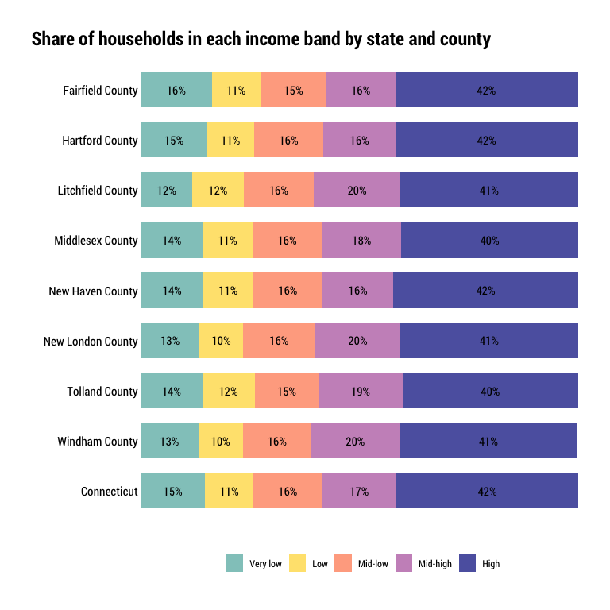

Households desiring housing
================

``` r
library(ipumsr)
library(tidyverse)
library(srvyr)
library(tidycensus)
library(hrbrthemes)
```

This notebook needs a better name. “Households desiring housing” to me
reads as wanting to move, not being unable to afford housing. Maybe just
“gaps in housing units available to households by income band” or
something? Kind of a mouthful…

There are a couple measurements in this notebook that build off of each
other:

  - Count and share of households by income band, the kinds of
    occupations/jobs those housing occupants might work in (so salary by
    occ?), and the share of those households that are cost-burdened (T2
    in DC report). **Need to determine what income level to use.
    Divisions of county median income make the most sense because HUD
    regions (HMFAs) cross PUMA and county lines.**
  - The approximate monthly housing cost for an affordable unit for each
    income band, rounded to pretty numbers for legibility. Then, the
    count/share of units by those cost bands in the area (T3 in DC
    report). **Need to determine what an area is. Counties make sense if
    using county median income.**
  - The count of housing units needed for each cost band, and the count
    of units in those cost bands, i.e., affordable to each income band
    (F19 in DC report–they found that gaps/need existed in low income
    bands and surpluses/lack of need in higher income bands)
  - For each income band, the number of households that can/cannot
    afford to pay more, and those that are vacant in that cost band (F20
    in DC report).

## Clean and set survey design

Starting by using county median incomes (CMI) and income bands like we
did in the Community Index reports…

  - poor: \< 0.5 CMI
  - low-income: 0.5–0.74 CMI
  - middle-income: 0.75–1.24 CMI
  - high-income: 1.25–1.49 CMI
  - affluent: \> 1.5 CMI

<!-- end list -->

``` r
minc <- get_acs(
    geography = "county",
      table = "B19013",
    state = 09,
      cache_table = T) %>% 
    arrange(GEOID) %>% 
    mutate(countyfip = seq(from = 1, to = 15, by = 2),
                 name = str_remove(NAME, ", Connecticut")) %>% 
    select(countyfip, name, minc = estimate)

ddi <- read_ipums_ddi("../input_data/usa_00037.xml")

pums <- read_ipums_micro(ddi, verbose = F)  %>% 
    mutate_at(vars(YEAR, PUMA, OWNERSHP, OWNERSHPD, RACE, RACED, HISPAN, HISPAND), as_factor) %>% 
    mutate_at(vars(PERWT, HHWT), as.numeric) %>% 
    mutate_at(vars(HHINCOME, OWNCOST, RENTGRS), as.integer) %>% 
    janitor::clean_names() %>% 
    left_join(minc, by = "countyfip") %>% 
    mutate(ratio = hhincome / minc) %>% 
    mutate(
        inc_band = cut(
            ratio,
            breaks = c(-Inf, 0.5, 0.75, 1.25, 1.5, Inf),
            labels = c("poor", "low", "middle", "high", "affluent"),
            include.lowest = T, right = F)) %>% 
    mutate(
        inc_band = as.factor(inc_band) %>%
            fct_relevel(., "poor", "low", "middle", "high", "affluent"))

hhdes <- pums %>%
    filter(pernum == "1", hhincome != 9999999, ownershp != "N/A") %>% 
    as_survey_design(., ids = 1, wt = hhwt)

out <- list()
```

## Household counts/shares by income bands

``` r
count_hhlds <- hhdes %>%
    select(hhwt, name, inc_band) %>% 
    group_by(name, inc_band) %>% 
    summarise(total_hhlds = survey_total(hhwt))

out$hh_by_inc_band_by_county <- count_hhlds

count_hhlds %>% 
    ggplot(aes(total_hhlds, name, group = inc_band)) +
    geom_col(aes(fill = inc_band), width = .7, position = position_dodge(.8)) +
    scale_x_continuous(
        limits = c(0, 115000),
        expand = expansion(mult = c(0, 0.1)),
        labels = scales::comma) +
    labs(
        x = "",
        y = "",
        title = "Households in each income band") +
    theme_ipsum_rc() +
    theme(
        panel.grid.minor = element_blank(),
        legend.position = "bottom",
        plot.title.position = "plot",
        axis.text.x = element_text(colour = "black"),
        axis.text.y = element_text(colour = "black"))
```

<!-- -->

``` r
count_hhlds %>% 
    select(-name) %>% 
    mutate(name = "Connecticut") %>% 
    group_by(name, inc_band) %>% 
    summarise(total_hhlds = sum(total_hhlds)) %>% 
    ggplot(aes(total_hhlds, inc_band)) +
    geom_col(aes(fill = inc_band), width = .6, position = position_dodge(.7)) +
    geom_text(aes(label = scales::comma(total_hhlds)), position = position_dodge(.7), hjust = 1.1, family = "Roboto Condensed") +
    scale_x_continuous(expand = expansion(mult = c(0, 0))) +
    labs(
        x = "",
        y = "",
        title = "Connecticut households in each income band",
        subtitle = "(Relative to the household's county median income, not state median income.)") +
    theme_ipsum_rc() +
    theme(
        panel.grid.major = element_blank(),
        panel.grid.minor = element_blank(),
        legend.position = "none",
        axis.text.x = element_blank(),
        axis.text.y = element_text(colour = "black"),
        plot.title.position = "plot")
```

<!-- -->

``` r
out$hh_by_inc_band_state <- count_hhlds %>% 
    select(-name) %>% 
    mutate(name = "Connecticut") %>% 
    group_by(name, inc_band) %>% 
    summarise(total_hhlds = sum(total_hhlds))
```

This is not a way we typically look at this data, but this trend mirrors
national trends with middle income households being squeezed out by high
and low income households. More than half a million households in CT
(40% of all households) are poor or low-income, earning less than
three-quarters of their county’s median income. A similar share are
affluent or high income, earning 125% or more of their county’s median
income. One in five households statewide are considered middle income by
this definition.

Out of curiosity, I also want to see the share of units in each income
band by county.

``` r
count_hhlds %>% 
    select(-name) %>% 
    group_by(inc_band) %>% 
    summarise(total_hhlds = sum(total_hhlds))
```

    ## # A tibble: 5 x 2
    ##   inc_band total_hhlds
    ##   <fct>          <dbl>
    ## 1 poor          352722
    ## 2 low           180387
    ## 3 middle        293490
    ## 4 high          109921
    ## 5 affluent      430854
