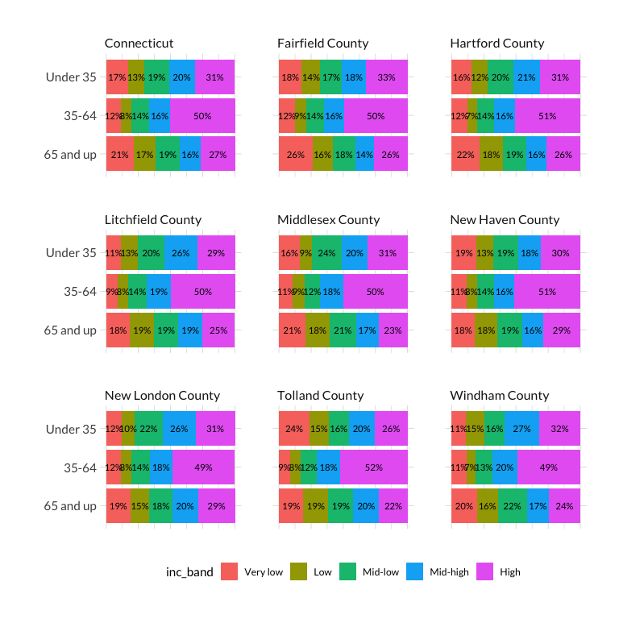

Inc Bands/HOH age
================

Quick tabulation of households by income bands and age of head of
household.

Main ask was for VLI households with HOH age 65+, so I’ll do income
bands and age groupings: Under 35, 35-64, 65+

``` r
library(ipumsr)
library(tidyverse)
library(srvyr)
library(tidycensus)
library(hrbrthemes)
library(camiller)
library(scales)
library(kableExtra)

source("../_utils/town2county.R")

theme_set(theme_ipsum_rc(base_family = "Lato Regular"))

pal <- c("#92c9c5", "#ffe37e", "#ffac8f", "#cb94c4", "#5e63af")

scale_fill_custom <- function(palette = pal, rev = F) {
  if (rev) {
    scale_fill_manual(values = rev(pal))
  } else {
    scale_fill_manual(values = pal)
  }
}

scale_color_custom <- function(palette = pal, rev = F) {
  if (rev) {
    scale_color_manual(values = rev(pal))
  } else {
    scale_color_manual(values = pal)
  }
}
```

### PUMS file

``` r
minc <- get_acs(
    geography = "county",
      table = "B19013",
    state = 09,
      cache_table = T) %>% 
    arrange(GEOID) %>% 
    mutate(countyfip = seq(from = 1, to = 15, by = 2),
                 name = str_remove(NAME, ", Connecticut")) %>% 
    select(countyfip, name, minc = estimate)

ddi <- read_ipums_ddi("../input_data/usa_00051.xml")

pums <- read_ipums_micro(ddi, verbose = F)  %>% 
    mutate_at(vars(YEAR, PUMA, OWNERSHP, OWNERSHPD, RACE, RACED, HISPAN, HISPAND, DIFFREM, DIFFPHYS, DIFFMOB, DIFFCARE, DIFFEYE, DIFFHEAR), as_factor) %>% 
    mutate_at(vars(PERWT, HHWT, AGE), as.numeric) %>% 
    mutate_at(vars(HHINCOME, OWNCOST, RENTGRS, OCC), as.integer) %>% 
    janitor::clean_names() %>% 
    left_join(minc, by = "countyfip") %>% 
    mutate(ratio = hhincome / minc) %>% 
    mutate(
        inc_band = cut(
            ratio,
            breaks = c(-Inf, 0.3, 0.5, .8, 1.2, Inf),
            labels = c("Very low", "Low", "Mid-low", "Mid-high", "High"),
            include.lowest = T, right = T)) %>% 
    mutate(
        inc_band = as.factor(inc_band) %>%
            fct_relevel(., "Very low", "Low", "Mid-low", "Mid-high", "High")) %>%
    mutate(
        age_band = cut(
            age,
            breaks = c(-Inf, 34, 65, Inf),
            labels = c("Under 35", "35-64", "65 and up"),
            include.lowest = T, right = T)) %>% 
    mutate(
        age_band = as.factor(age_band) %>%
            fct_relevel(., "Under 35", "35-64", "65 and up")) %>%
    mutate(cb = if_else(ownershp == "Rented", (rentgrs * 12) / hhincome, 99999)) %>% 
    mutate(cb = if_else(ownershp == "Owned or being bought (loan)", (owncost * 12) / hhincome, cb)) %>%
    # if housing cost is 0 and income is 0, no burden
    mutate(cb = if_else((rentgrs == 0 & hhincome == 0), 0, cb)) %>%
    mutate(cb = if_else((owncost == 0 & hhincome == 0), 0, cb)) %>%
    #if income is <=0 and housing cost is >0, burden
    mutate(cb = if_else((rentgrs > 0 & hhincome <= 0), 1, cb)) %>%
    mutate(cb = if_else((owncost > 0 & hhincome <= 0), 1, cb)) %>%
    # some people pay more than 100% income to housing, but I will code these as 1
    mutate(cb = if_else(cb > 1, 1, cb)) %>%
    mutate(
        cost_burden = cut(
            cb,
            breaks = c(-Inf, .3, .5, Inf),
            labels = c("No burden", "Cost-burdened", "Severely cost-burdened"),
            include.lowest = T, right = F)) %>% 
        mutate(race2 = if_else(hispan == "Not Hispanic", as.character(race), "Latino")) %>% 
    mutate(race2 = as.factor(race2) %>% 
                    fct_recode(Black = "Black/African American/Negro") %>%
                    fct_other(keep = c("White", "Black", "Latino"), other_level = "Other race") %>%
                    fct_relevel("White", "Black", "Latino", "Other race"))

#logical flag for any disability
pums$has_disability <- apply(pums, 1, function(x) any(grep("Has|Yes", x)))

des <- pums %>%
    filter(pernum == "1", hhincome != 9999999, ownershp != "N/A") %>% 
    as_survey_design(., ids = 1, wt = hhwt)
```

## By age of HOH

``` r
county_hhlds_by_age <- des %>%
    select(hhwt, name, inc_band, age_band) %>% 
    group_by(name, inc_band, age_band) %>% 
    summarise(value = survey_total(hhwt))

county_age_total <- des %>%
    select(hhwt, name, age_band) %>% 
    group_by(name, age_band) %>% 
    summarise(value = survey_total(hhwt)) %>% 
    mutate(inc_band = "Total")

ct_hhlds_by_age <- des %>%
    select(hhwt, inc_band, age_band) %>% 
    mutate(name = "Connecticut") %>% 
    group_by(name, inc_band, age_band) %>% 
    summarise(value = survey_total(hhwt))

ct_age_total <- des %>%
    select(hhwt, age_band) %>% 
    mutate(name = "Connecticut") %>% 
    group_by(name, age_band) %>% 
    summarise(value = survey_total(hhwt)) %>% 
    mutate(inc_band = "Total")

hh_by_age_inc_band <- bind_rows(county_hhlds_by_age, county_age_total, ct_hhlds_by_age, ct_age_total) %>%
    ungroup() %>%
    mutate(inc_band = as.factor(inc_band) %>% 
                    fct_relevel(., "Very low", "Low", "Mid-low", "Mid-high", "High", "Total")) %>% 
    arrange(name, age_band) %>% 
    group_by(name, age_band) %>% 
    calc_shares(group = inc_band, denom = "Total", value = value, moe = value_se)

write_csv(hh_by_age_inc_band, file = "../output_data/hh_by_age_inc_band.csv")
```

``` r
hh_by_age_inc_band %>% 
    filter (!is.na(share)) %>% 
    mutate(age_band = fct_rev(age_band)) %>% 
    ggplot(aes(share, age_band, group = age_band)) +
    geom_col(aes(fill = inc_band), position = position_stack()) +
    geom_text(aes(label = percent(share, accuracy = 1)), position = position_stack(.5), family = "Lato Regular", size = 3) +
    facet_wrap(facets = "name") + 
    theme(axis.text.x = element_blank(),
                legend.position = "bottom") +
    labs(x = "", y = "")
```

<!-- -->
