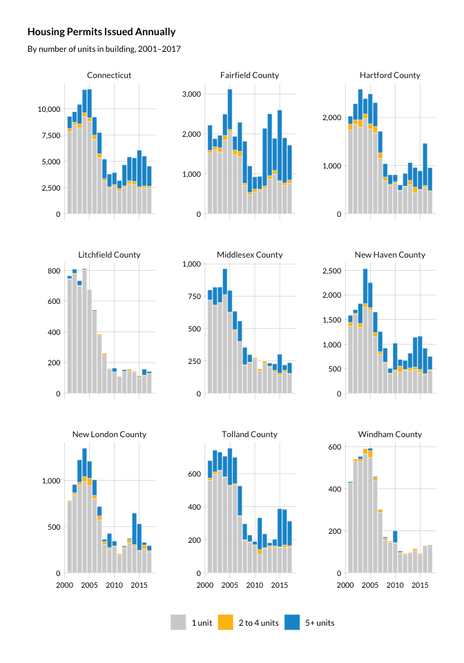

Housing permits
================

``` r
library(tidyverse)
library(rvest)
library(readxl)
library(janitor)
library(cwi)
library(camiller)
```

``` r
theme_set(hrbrthemes::theme_ipsum_rc(base_family = "Lato Regular"))

#urban colors
pal <- c("#1696d2", "#fdbf11", "#d2d2d2", "#ec008b", "#55b748")
```

Permits, 2001-2019… town-level at
<https://portal.ct.gov/DECD/Content/About_DECD/Research-and-Publications/01_Access-Research/Exports-and-Housing-and-Income-Data>

# Fetch

Jacking Camille’s scrape code

``` r
housing_read <- list.files(file.path("..", "input_data", "housing_permit_downloads"), full.names = T) %>%
  set_names() %>%
  set_names(str_extract, "\\d+") %>%
  map(read_excel, skip = 2)


permit_url <- "https://portal.ct.gov/DECD/Content/About_DECD/Research-and-Publications/01_Access-Research/Exports-and-Housing-and-Income-Data"
decd_base <- "https://portal.ct.gov"

read_html(permit_url) %>%
  html_node("body") %>%
  html_nodes("p:contains('Construction') + ul") %>%
  html_node("li") %>%
  html_nodes("a") %>%
  html_attr("href") %>%
  `[`(1:17) %>%
  walk(function(rel_url) {
    url <- paste0(decd_base, rel_url)
    year <- str_extract(url, "\\d{4}")
    ext <- str_extract(url, "xlsx?")
    download.file(url, destfile = str_glue("../input_data/housing_permit_downloads/housing_permits_{year}.{ext}"))
  })

housing_read <- list.files(file.path("..", "input_data", "housing_permit_downloads"), full.names = T) %>%
  set_names() %>%
  set_names(str_extract, "\\d+") %>%
  map(read_excel, skip = 2)
```

# Clean

Lydia’s table asks for groups as: SF, MF 2-4, and MF 5+

I wish we could do 1, 2-9, 10+, but the data don’t come like that.

``` r
source("../_utils/town2county.R")

permits <- housing_read %>% 
  map(select, c(1, 3:8)) %>%
  map(~setNames(., c("name", "total", "1 unit", "2 units", "3 to 4 units", "5+ units", "demos"))) %>%
  map_dfr(~filter(., str_detect(total, "\\d")), .id = "year") %>%
  mutate_at(-2, as.numeric) %>% 
  select(-total, -demos) %>%
  gather(key = units, value = value, -year, -name) %>%
  mutate(units = as_factor(units) %>% 
                fct_collapse(units,
                                         `1 unit` = "1 unit",
                                         `2 to 4 units` = c("2 units", "3 to 4 units"),
                                         `5+ units` = "5+ units")) %>% 
    group_by(year, name, units) %>% 
    summarise(value = sum(value)) %>% 
    ungroup() %>% 
    left_join(town2county, by = c("name" = "town")) %>% 
    select(year, name, county, units, value) %>%
    mutate(level = if_else(name == "Connecticut", "1_state", "3_towns")) %>% 
    select(level, everything())

county_permits <- permits %>% 
    filter(!is.na(county)) %>% 
    select(-name, -level) %>% 
    group_by(year, county, units) %>% 
    summarise(value = sum(value)) %>% 
    rename(name = county) %>% 
    mutate(county = NA, level = "2_counties")

permits <- bind_rows(permits, county_permits) %>% 
    arrange(level)

write_csv(permits, "../output_data/housing_permits_2001_2019.csv")
```

I think we should just combine all the MF permits since 2-4 gets totally
washed out. Those make up a pretty small share of permits everywhere, in
every year. Both options below.

``` r
permits <- read_csv("../output_data/housing_permits_2001_2019.csv")

permits %>% 
    filter(level != "3_towns") %>%
    mutate(units = fct_rev(units)) %>% 
    ggplot(aes(year, value, group = units)) +
    geom_col(aes(fill = units), color = "white", size = .15) +
    facet_wrap(facets = "name", scales = "free_y") +
    guides(fill = guide_legend(reverse = T)) +
    scale_y_continuous(labels = scales::comma_format()) +
  scale_fill_manual(values = c(pal[1], pal[2], pal[3])) +
    guides(fill = guide_legend(title = "", reverse = T)) +
    labs(title = "Housing permits Issued Annually", subtitle = "By number of units in building, 2001–2017",
             x = "", y = "") +
    theme(panel.grid.minor = element_blank(),
                plot.title.position = "plot",
                legend.position = "bottom",
                plot.title = element_text(family = "Lato Bold"),
                plot.subtitle = element_text(family = "Lato Regular"),
                strip.text.x = element_text(hjust = .5, size = 9, family = "Lato Regular"),
                legend.text = element_text(family = "Lato Regular", size = 9),
                axis.text.x = element_text(colour = "black", family = "Lato Regular", size = 8),
                axis.text.y = element_text(colour = "black", family = "Lato Regular", size = 8))
```

<!-- -->

``` r
ggsave(filename = "../output_data/corrected_charts/housing_permits.png", dpi = 300, width = 6.5)
ggsave(filename = "../output_data/corrected_charts/housing_permits.svg", dpi = 300, width = 6.5)
```

``` r
permits %>% 
    filter(level != "3_towns") %>%
    mutate(units = fct_collapse(units, `Single family` = "1 unit", `Multifamily` = c("2 to 4 units", "5+ units"))) %>% 
    ungroup() %>% 
    group_by(level, year, name, units) %>% 
    summarise(value = sum(value)) %>% 
    ungroup() %>% 
    mutate(units = fct_rev(units)) %>% 
    ggplot(aes(year, value, group = units)) +
    geom_col(aes(fill = units), color = "white", size = .15) +
    facet_wrap(facets = "name", scales = "free_y") +
    guides(fill = guide_legend(reverse = T)) +
    hrbrthemes::theme_ipsum_rc() +
  scale_fill_manual(values = c(pal[4:5])) +
    scale_y_continuous(labels = scales::comma_format()) +
    guides(fill = guide_legend(title = "", reverse = T)) +
    labs(title = "Housing permits issued annually by number of units in building, 2001–2017",
             x = "", y = "") +
    theme(panel.grid.minor = element_blank(),
                plot.title.position = "plot",
                legend.position = "bottom",
                strip.text.x = element_text(hjust = .5),
                axis.text.x = element_text(colour = "black"),
                axis.text.y = element_text(colour = "black"))
```
