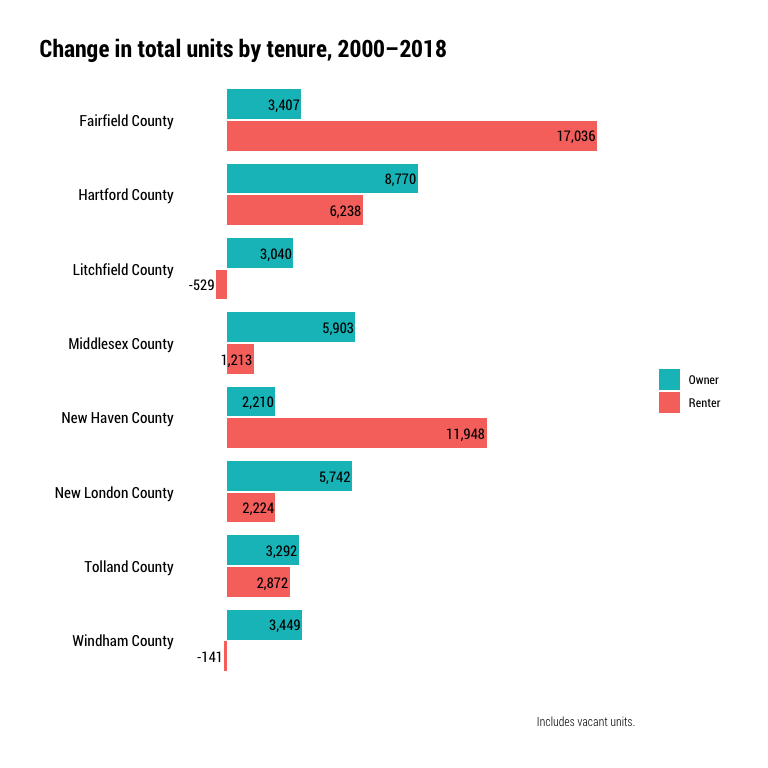

Housing units
================

``` r
library(tidyverse)
library(tidycensus)
library(janitor)
library(cwi)
library(camiller)
library(ipumsr)
library(srvyr)
```

Change in total units by tenure (occ + vacant?), units in structure (SF,
2-4 units, 5+ units), number bedrooms. Presumably PUMS because ACS is
households not units. DECD data has vacancy among total units for 2010.
Do we want 2000, 2018?

``` r
names <- tibble(countyfip = seq(from = 1, to = 15, by = 2),
                                name = c("Fairfield County", "Hartford County", "Litchfield County", "Middlesex County", "New Haven County", "New London County", "Tolland County", "Windham County"))

ddi <- read_ipums_ddi("../input_data/usa_00046.xml")

pums <- read_ipums_micro(ddi, verbose = F) %>% 
    filter(RECTYPE == "H") %>% 
    mutate_at(vars(YEAR, OWNERSHP, VACANCY, UNITSSTR, BEDROOMS), as_factor) %>% 
    mutate_at(vars(HHWT, COUNTYFIP), as.numeric) %>% 
    clean_names() %>% 
    left_join(names, by = "countyfip") %>% 
    select(year, name, ownershp, vacancy, unitsstr, bedrooms, hhwt) %>% 
    mutate(ownershp2 = fct_recode(ownershp,
                                                                `Owner` = "Owned or being bought (loan)",
                                                                `Renter` = "Rented"),
                 ownershp2 = as.character(ownershp2),
                 ownershp2 = if_else(vacancy == "For rent or sale", "Renter", ownershp2),
                 ownershp2 = if_else(vacancy == "For sale only", "Owner", ownershp2),
                 ownershp2 = as.factor(ownershp2))
```

# By tenure

``` r
tenure <- pums %>% 
    filter(ownershp2 != "N/A") %>% 
    select(year, name, ownershp2, hhwt) %>% 
    group_by(year, name, ownershp2) %>% 
    summarise(units = sum(hhwt)) %>% 
    ungroup()
```

``` r
tenure %>% 
    filter(year != 2010) %>% 
    pivot_wider(id_cols = c(name, ownershp2), names_from = year, names_prefix = "x", values_from = units) %>% 
    mutate(diff = x2018 - x2000) %>% 
    mutate(name = as.factor(name) %>% fct_rev(),
                 ownershp2 = fct_rev(ownershp2)) %>% 
    ggplot(aes(diff, name, group = ownershp2)) +
    geom_col(aes(fill = ownershp2), width = .8, position = position_dodge(.85)) +
    geom_text(aes(label = scales::comma(diff, accuracy = 1)), hjust = 1.04,
                        position = position_dodge(.85), family = "Roboto Condensed") +
    scale_x_continuous(labels = scales::comma_format(),
                                         expand = expansion(mult = c(.1, .1))) +
    guides(fill = guide_legend(title = "", reverse = T)) +
    hrbrthemes::theme_ipsum_rc() +
    labs(title = "Change in total units by tenure, 2000–2018",
             x = "", y = "",
             caption = "Includes vacant units.") +
    theme(plot.title.position = "plot",
                legend.position = "right", 
                panel.grid.major = element_blank(),
                panel.grid.minor = element_blank(),
                axis.text.x = element_blank(),
                axis.text.y = element_text(colour = "black"))
```

<!-- -->
