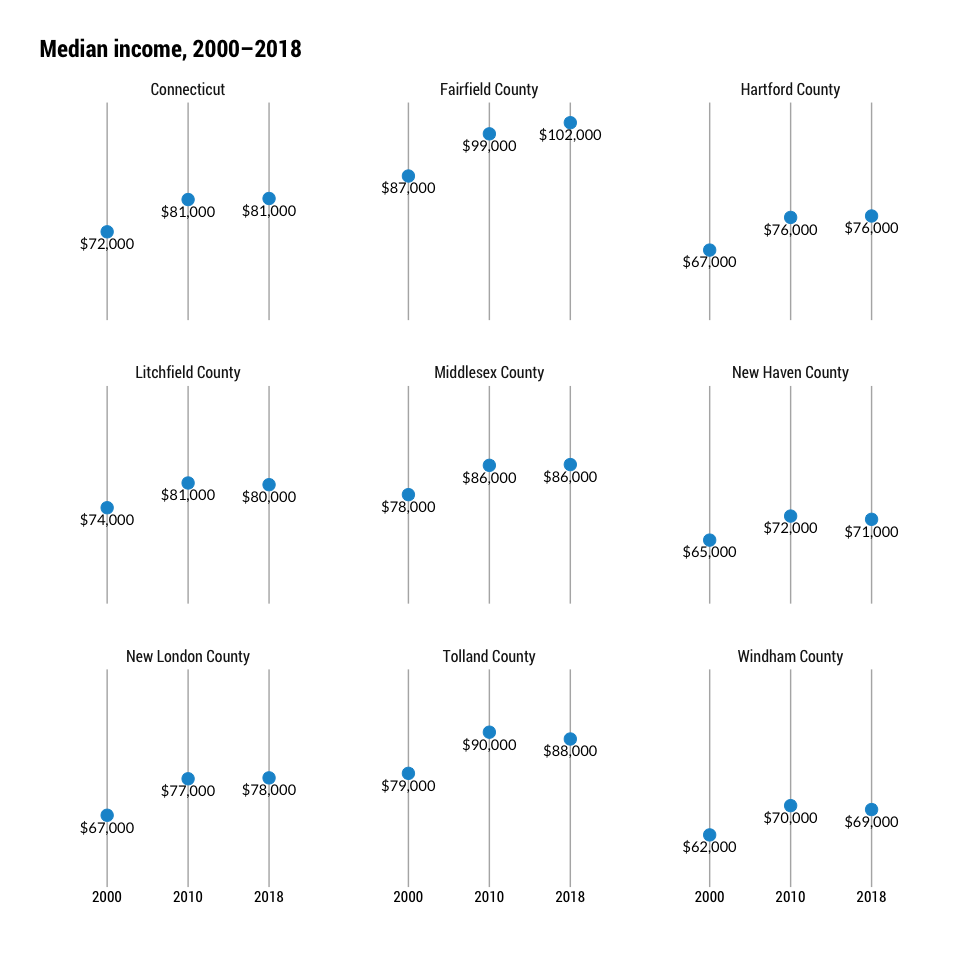
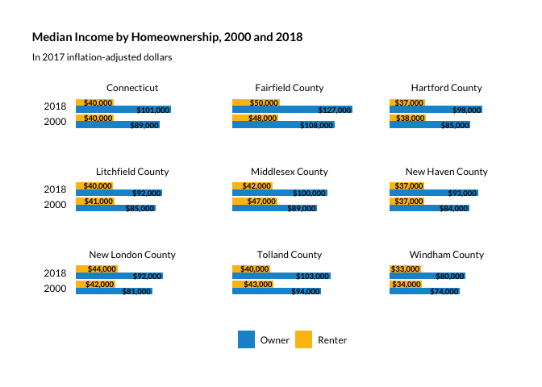

Median income by county and tenure
================

``` r
library(tidyverse)
library(ipumsr)
library(srvyr)
```

Two ways:

Median income by county. Simple enough.

Median income by tenure. I thought about also doing this by race, but
tenure makes more sense given the rest of the analysis in the housing
report. We can draw on other DataHaven analyses on median income by race
if we want to mention it (white median income is nearly 50% higher than
Black and Latino median income—pull data from HER notebooks).

## Setup PUMS file

``` r
names <- tibble(countyfip = seq(from = 1, to = 15, by = 2),
                                name = c("Fairfield County", "Hartford County", "Litchfield County", "Middlesex County", "New Haven County", "New London County", "Tolland County", "Windham County"))

infl_values <- blscrapeR::inflation_adjust(base_year = 2018) %>% 
    filter(year %in% c(2000, 2010, 2018)) %>% 
    arrange(desc(year)) %>% 
    mutate(factor = 1 + (abs(pct_increase) / 100)) %>% 
    select(year, factor)

ddi <- read_ipums_ddi("../input_data/usa_00049.xml")

pums <- read_ipums_micro(ddi, verbose = F) %>% 
    mutate_at(vars(YEAR, OWNERSHP, OWNERSHPD), as_factor) %>% 
    mutate_at(vars(HHINCOME, TRANTIME), as.numeric) %>% 
    janitor::clean_names() %>% 
    left_join(names, by = "countyfip") %>% 
    left_join(infl_values, by = "year") %>% 
    mutate(adj_income = hhincome * factor) %>% 
    mutate(ownershp2 = if_else(ownershp == "Rented", "Renter", "Owner")) %>% 
    select(year, pernum, hhwt, name, ownershp, ownershp2, hhincome, adj_income)
```

## By county and state, no disaggregation.

The Bureau is migrating its API endpoints so all censusapi and
tidycensus are both struggling with the decennial call. I’ll use PUMS
data for this and round it to the nearest thousand to accommodate any
difference in median calculation between deci/ACS and microdata.

``` r
des <- pums %>%
    filter(pernum == "1", hhincome != 9999999, ownershp != "N/A") %>% 
    as_survey_design(., ids = 1, wt = hhwt)

county_minc <- des %>%
    select(name, year, adj_income) %>% 
    group_by(name, year) %>% 
    summarise(minc = survey_median(adj_income)) %>% 
    mutate(minc = round(minc, 0))

state_minc <- des %>% 
    mutate(name = "Connecticut") %>% 
    select(name, year, adj_income) %>% 
    group_by(name, year) %>% 
    summarise(minc = survey_median(adj_income)) %>% 
    mutate(minc = round(minc, 0))

minc <- bind_rows(state_minc, county_minc)

write_csv(minc, "../output_data/minc_by_county_2000_2018.csv")
```

``` r
minc %>% 
    ggplot(aes(year, minc, group = name)) +
    geom_vline(aes(xintercept = year), size = .5, color = "grey70") +
    geom_point(aes(color = name), size = 4) +
    geom_line(aes(color = name), size = 1) +
    geom_text(aes(label = scales::dollar(minc, accuracy = 1e3), vjust = 1.6, family = "Roboto Condensed", nudge_y = -500)) +
    #scale_y_continuous(expand = expansion(mult = c(.15, .15))) +
    scale_y_continuous(limits = c(50000, 105000)) +
    facet_wrap(facets = "name", scales = "free_y") +
    hrbrthemes::theme_ipsum_rc() +
    labs(title = "Median income, 2000–2018",
             x = "", y = "") +
    theme(plot.title.position = "plot",
                axis.text.y = element_blank(),
                panel.grid.major = element_blank(),
                panel.grid.minor = element_blank(),
                axis.text.x = element_text(colour = "black"),
                strip.text.x = element_text(hjust = .5),
                legend.position = "none")
```

<!-- -->

``` r
minc %>% 
    select(name, year, `median income` = minc) %>% 
    kableExtra::kable()
```

<table>

<thead>

<tr>

<th style="text-align:left;">

name

</th>

<th style="text-align:left;">

year

</th>

<th style="text-align:right;">

median income

</th>

</tr>

</thead>

<tbody>

<tr>

<td style="text-align:left;">

Connecticut

</td>

<td style="text-align:left;">

2000

</td>

<td style="text-align:right;">

71824

</td>

</tr>

<tr>

<td style="text-align:left;">

Connecticut

</td>

<td style="text-align:left;">

2010

</td>

<td style="text-align:right;">

80776

</td>

</tr>

<tr>

<td style="text-align:left;">

Connecticut

</td>

<td style="text-align:left;">

2018

</td>

<td style="text-align:right;">

81066

</td>

</tr>

<tr>

<td style="text-align:left;">

Fairfield County

</td>

<td style="text-align:left;">

2000

</td>

<td style="text-align:right;">

87306

</td>

</tr>

<tr>

<td style="text-align:left;">

Fairfield County

</td>

<td style="text-align:left;">

2010

</td>

<td style="text-align:right;">

99007

</td>

</tr>

<tr>

<td style="text-align:left;">

Fairfield County

</td>

<td style="text-align:left;">

2018

</td>

<td style="text-align:right;">

102095

</td>

</tr>

<tr>

<td style="text-align:left;">

Hartford County

</td>

<td style="text-align:left;">

2000

</td>

<td style="text-align:right;">

66751

</td>

</tr>

<tr>

<td style="text-align:left;">

Hartford County

</td>

<td style="text-align:left;">

2010

</td>

<td style="text-align:right;">

75812

</td>

</tr>

<tr>

<td style="text-align:left;">

Hartford County

</td>

<td style="text-align:left;">

2018

</td>

<td style="text-align:right;">

76213

</td>

</tr>

<tr>

<td style="text-align:left;">

Litchfield County

</td>

<td style="text-align:left;">

2000

</td>

<td style="text-align:right;">

73910

</td>

</tr>

<tr>

<td style="text-align:left;">

Litchfield County

</td>

<td style="text-align:left;">

2010

</td>

<td style="text-align:right;">

80776

</td>

</tr>

<tr>

<td style="text-align:left;">

Litchfield County

</td>

<td style="text-align:left;">

2018

</td>

<td style="text-align:right;">

80301

</td>

</tr>

<tr>

<td style="text-align:left;">

Middlesex County

</td>

<td style="text-align:left;">

2000

</td>

<td style="text-align:right;">

77541

</td>

</tr>

<tr>

<td style="text-align:left;">

Middlesex County

</td>

<td style="text-align:left;">

2010

</td>

<td style="text-align:right;">

85672

</td>

</tr>

<tr>

<td style="text-align:left;">

Middlesex County

</td>

<td style="text-align:left;">

2018

</td>

<td style="text-align:right;">

85884

</td>

</tr>

<tr>

<td style="text-align:left;">

New Haven County

</td>

<td style="text-align:left;">

2000

</td>

<td style="text-align:right;">

64924

</td>

</tr>

<tr>

<td style="text-align:left;">

New Haven County

</td>

<td style="text-align:left;">

2010

</td>

<td style="text-align:right;">

71597

</td>

</tr>

<tr>

<td style="text-align:left;">

New Haven County

</td>

<td style="text-align:left;">

2018

</td>

<td style="text-align:right;">

70690

</td>

</tr>

<tr>

<td style="text-align:left;">

New London County

</td>

<td style="text-align:left;">

2000

</td>

<td style="text-align:right;">

67224

</td>

</tr>

<tr>

<td style="text-align:left;">

New London County

</td>

<td style="text-align:left;">

2010

</td>

<td style="text-align:right;">

77350

</td>

</tr>

<tr>

<td style="text-align:left;">

New London County

</td>

<td style="text-align:left;">

2018

</td>

<td style="text-align:right;">

77600

</td>

</tr>

<tr>

<td style="text-align:left;">

Tolland County

</td>

<td style="text-align:left;">

2000

</td>

<td style="text-align:right;">

78855

</td>

</tr>

<tr>

<td style="text-align:left;">

Tolland County

</td>

<td style="text-align:left;">

2010

</td>

<td style="text-align:right;">

90276

</td>

</tr>

<tr>

<td style="text-align:left;">

Tolland County

</td>

<td style="text-align:left;">

2018

</td>

<td style="text-align:right;">

88386

</td>

</tr>

<tr>

<td style="text-align:left;">

Windham County

</td>

<td style="text-align:left;">

2000

</td>

<td style="text-align:right;">

61770

</td>

</tr>

<tr>

<td style="text-align:left;">

Windham County

</td>

<td style="text-align:left;">

2010

</td>

<td style="text-align:right;">

69895

</td>

</tr>

<tr>

<td style="text-align:left;">

Windham County

</td>

<td style="text-align:left;">

2018

</td>

<td style="text-align:right;">

68812

</td>

</tr>

</tbody>

</table>

## By tenure

``` r
des2 <- pums %>%
    filter(pernum == "1", hhincome != 9999999, ownershp != "N/A") %>% 
    as_survey_design(., ids = 1, wt = hhwt)

county_minc2 <- des2 %>%
    select(name, year, ownershp2, adj_income) %>% 
    group_by(name, year, ownershp2) %>% 
    summarise(minc = survey_median(adj_income)) %>% 
    mutate(minc = round(minc, 0))

state_minc2 <- des2 %>% 
    mutate(name = "Connecticut") %>% 
    select(name, year, ownershp2, adj_income) %>% 
    group_by(name, year, ownershp2) %>% 
    summarise(minc = survey_median(adj_income)) %>% 
    mutate(minc = round(minc, 0))

minc_tenure <- bind_rows(state_minc2, county_minc2)

write_csv(minc_tenure, "../output_data/minc_by_tenure_2000_2018.csv")
```

``` r
minc_tenure %>% 
    ggplot(aes(year, minc, group = ownershp2)) +
    geom_vline(aes(xintercept = year), size = .5, color = "grey70") +
    geom_point(aes(color = ownershp2), size = 4) +
    geom_line(aes(color = ownershp2), size = 1) +
    geom_text(aes(label = scales::dollar(minc, accuracy = 1e3), vjust = 1.6, family = "Roboto Condensed")) +
    scale_y_continuous(expand = expansion(mult = c(.35, .25))) +
    #scale_y_continuous(limits = c(0, 130000)) +
    facet_wrap(facets = "name", scales = "free_y") +
    hrbrthemes::theme_ipsum_rc() +
    guides(color = guide_legend(title = "Tenure", override.aes = list(linetype = 0))) +
    labs(title = "Median income by tenure and area, 2000–2018",
             x = "", y = "") +
    theme(plot.title.position = "plot",
                axis.text.y = element_blank(),
                panel.grid.major = element_blank(),
                panel.grid.minor = element_blank(),
                axis.text.x = element_text(colour = "black"),
                strip.text.x = element_text(hjust = .5),
                legend.position = "bottom")
```

<!-- -->

``` r
minc_tenure %>% 
    select(name, year, `median income` = minc) %>% 
    kableExtra::kable()
```

<table>

<thead>

<tr>

<th style="text-align:left;">

name

</th>

<th style="text-align:left;">

year

</th>

<th style="text-align:right;">

median income

</th>

</tr>

</thead>

<tbody>

<tr>

<td style="text-align:left;">

Connecticut

</td>

<td style="text-align:left;">

2000

</td>

<td style="text-align:right;">

89238

</td>

</tr>

<tr>

<td style="text-align:left;">

Connecticut

</td>

<td style="text-align:left;">

2000

</td>

<td style="text-align:right;">

40479

</td>

</tr>

<tr>

<td style="text-align:left;">

Connecticut

</td>

<td style="text-align:left;">

2010

</td>

<td style="text-align:right;">

97911

</td>

</tr>

<tr>

<td style="text-align:left;">

Connecticut

</td>

<td style="text-align:left;">

2010

</td>

<td style="text-align:right;">

39151

</td>

</tr>

<tr>

<td style="text-align:left;">

Connecticut

</td>

<td style="text-align:left;">

2018

</td>

<td style="text-align:right;">

101000

</td>

</tr>

<tr>

<td style="text-align:left;">

Connecticut

</td>

<td style="text-align:left;">

2018

</td>

<td style="text-align:right;">

40223

</td>

</tr>

<tr>

<td style="text-align:left;">

Fairfield County

</td>

<td style="text-align:left;">

2000

</td>

<td style="text-align:right;">

107769

</td>

</tr>

<tr>

<td style="text-align:left;">

Fairfield County

</td>

<td style="text-align:left;">

2000

</td>

<td style="text-align:right;">

48233

</td>

</tr>

<tr>

<td style="text-align:left;">

Fairfield County

</td>

<td style="text-align:left;">

2010

</td>

<td style="text-align:right;">

118999

</td>

</tr>

<tr>

<td style="text-align:left;">

Fairfield County

</td>

<td style="text-align:left;">

2010

</td>

<td style="text-align:right;">

46392

</td>

</tr>

<tr>

<td style="text-align:left;">

Fairfield County

</td>

<td style="text-align:left;">

2018

</td>

<td style="text-align:right;">

126957

</td>

</tr>

<tr>

<td style="text-align:left;">

Fairfield County

</td>

<td style="text-align:left;">

2018

</td>

<td style="text-align:right;">

49670

</td>

</tr>

<tr>

<td style="text-align:left;">

Hartford County

</td>

<td style="text-align:left;">

2000

</td>

<td style="text-align:right;">

85427

</td>

</tr>

<tr>

<td style="text-align:left;">

Hartford County

</td>

<td style="text-align:left;">

2000

</td>

<td style="text-align:right;">

38245

</td>

</tr>

<tr>

<td style="text-align:left;">

Hartford County

</td>

<td style="text-align:left;">

2010

</td>

<td style="text-align:right;">

95117

</td>

</tr>

<tr>

<td style="text-align:left;">

Hartford County

</td>

<td style="text-align:left;">

2010

</td>

<td style="text-align:right;">

35860

</td>

</tr>

<tr>

<td style="text-align:left;">

Hartford County

</td>

<td style="text-align:left;">

2018

</td>

<td style="text-align:right;">

97920

</td>

</tr>

<tr>

<td style="text-align:left;">

Hartford County

</td>

<td style="text-align:left;">

2018

</td>

<td style="text-align:right;">

37029

</td>

</tr>

<tr>

<td style="text-align:left;">

Litchfield County

</td>

<td style="text-align:left;">

2000

</td>

<td style="text-align:right;">

84585

</td>

</tr>

<tr>

<td style="text-align:left;">

Litchfield County

</td>

<td style="text-align:left;">

2000

</td>

<td style="text-align:right;">

40873

</td>

</tr>

<tr>

<td style="text-align:left;">

Litchfield County

</td>

<td style="text-align:left;">

2010

</td>

<td style="text-align:right;">

91558

</td>

</tr>

<tr>

<td style="text-align:left;">

Litchfield County

</td>

<td style="text-align:left;">

2010

</td>

<td style="text-align:right;">

39164

</td>

</tr>

<tr>

<td style="text-align:left;">

Litchfield County

</td>

<td style="text-align:left;">

2018

</td>

<td style="text-align:right;">

91580

</td>

</tr>

<tr>

<td style="text-align:left;">

Litchfield County

</td>

<td style="text-align:left;">

2018

</td>

<td style="text-align:right;">

40000

</td>

</tr>

<tr>

<td style="text-align:left;">

Middlesex County

</td>

<td style="text-align:left;">

2000

</td>

<td style="text-align:right;">

89369

</td>

</tr>

<tr>

<td style="text-align:left;">

Middlesex County

</td>

<td style="text-align:left;">

2000

</td>

<td style="text-align:right;">

47182

</td>

</tr>

<tr>

<td style="text-align:left;">

Middlesex County

</td>

<td style="text-align:left;">

2010

</td>

<td style="text-align:right;">

97615

</td>

</tr>

<tr>

<td style="text-align:left;">

Middlesex County

</td>

<td style="text-align:left;">

2010

</td>

<td style="text-align:right;">

42874

</td>

</tr>

<tr>

<td style="text-align:left;">

Middlesex County

</td>

<td style="text-align:left;">

2018

</td>

<td style="text-align:right;">

100000

</td>

</tr>

<tr>

<td style="text-align:left;">

Middlesex County

</td>

<td style="text-align:left;">

2018

</td>

<td style="text-align:right;">

41895

</td>

</tr>

<tr>

<td style="text-align:left;">

New Haven County

</td>

<td style="text-align:left;">

2000

</td>

<td style="text-align:right;">

84112

</td>

</tr>

<tr>

<td style="text-align:left;">

New Haven County

</td>

<td style="text-align:left;">

2000

</td>

<td style="text-align:right;">

36799

</td>

</tr>

<tr>

<td style="text-align:left;">

New Haven County

</td>

<td style="text-align:left;">

2010

</td>

<td style="text-align:right;">

91791

</td>

</tr>

<tr>

<td style="text-align:left;">

New Haven County

</td>

<td style="text-align:left;">

2010

</td>

<td style="text-align:right;">

34627

</td>

</tr>

<tr>

<td style="text-align:left;">

New Haven County

</td>

<td style="text-align:left;">

2018

</td>

<td style="text-align:right;">

93242

</td>

</tr>

<tr>

<td style="text-align:left;">

New Haven County

</td>

<td style="text-align:left;">

2018

</td>

<td style="text-align:right;">

36887

</td>

</tr>

<tr>

<td style="text-align:left;">

New London County

</td>

<td style="text-align:left;">

2000

</td>

<td style="text-align:right;">

80958

</td>

</tr>

<tr>

<td style="text-align:left;">

New London County

</td>

<td style="text-align:left;">

2000

</td>

<td style="text-align:right;">

42082

</td>

</tr>

<tr>

<td style="text-align:left;">

New London County

</td>

<td style="text-align:left;">

2010

</td>

<td style="text-align:right;">

91111

</td>

</tr>

<tr>

<td style="text-align:left;">

New London County

</td>

<td style="text-align:left;">

2010

</td>

<td style="text-align:right;">

45544

</td>

</tr>

<tr>

<td style="text-align:left;">

New London County

</td>

<td style="text-align:left;">

2018

</td>

<td style="text-align:right;">

92320

</td>

</tr>

<tr>

<td style="text-align:left;">

New London County

</td>

<td style="text-align:left;">

2018

</td>

<td style="text-align:right;">

44446

</td>

</tr>

<tr>

<td style="text-align:left;">

Tolland County

</td>

<td style="text-align:left;">

2000

</td>

<td style="text-align:right;">

93575

</td>

</tr>

<tr>

<td style="text-align:left;">

Tolland County

</td>

<td style="text-align:left;">

2000

</td>

<td style="text-align:right;">

43370

</td>

</tr>

<tr>

<td style="text-align:left;">

Tolland County

</td>

<td style="text-align:left;">

2010

</td>

<td style="text-align:right;">

101981

</td>

</tr>

<tr>

<td style="text-align:left;">

Tolland County

</td>

<td style="text-align:left;">

2010

</td>

<td style="text-align:right;">

44694

</td>

</tr>

<tr>

<td style="text-align:left;">

Tolland County

</td>

<td style="text-align:left;">

2018

</td>

<td style="text-align:right;">

103488

</td>

</tr>

<tr>

<td style="text-align:left;">

Tolland County

</td>

<td style="text-align:left;">

2018

</td>

<td style="text-align:right;">

39800

</td>

</tr>

<tr>

<td style="text-align:left;">

Windham County

</td>

<td style="text-align:left;">

2000

</td>

<td style="text-align:right;">

74124

</td>

</tr>

<tr>

<td style="text-align:left;">

Windham County

</td>

<td style="text-align:left;">

2000

</td>

<td style="text-align:right;">

34171

</td>

</tr>

<tr>

<td style="text-align:left;">

Windham County

</td>

<td style="text-align:left;">

2010

</td>

<td style="text-align:right;">

81388

</td>

</tr>

<tr>

<td style="text-align:left;">

Windham County

</td>

<td style="text-align:left;">

2010

</td>

<td style="text-align:right;">

33657

</td>

</tr>

<tr>

<td style="text-align:left;">

Windham County

</td>

<td style="text-align:left;">

2018

</td>

<td style="text-align:right;">

80164

</td>

</tr>

<tr>

<td style="text-align:left;">

Windham County

</td>

<td style="text-align:left;">

2018

</td>

<td style="text-align:right;">

32890

</td>

</tr>

</tbody>

</table>
