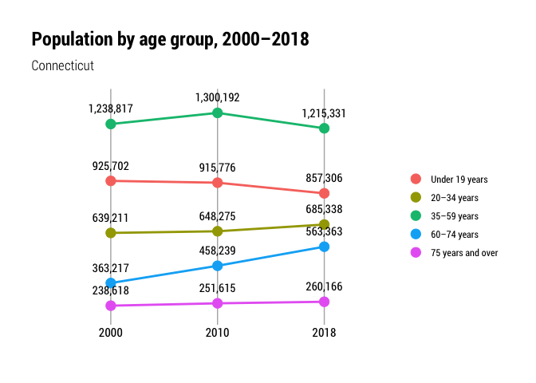
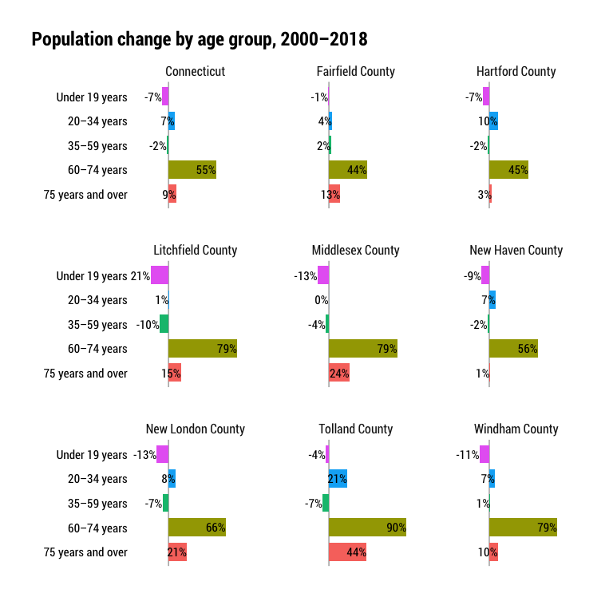

Pop by age
================

``` r
library(tidyverse)
library(tidycensus)
library(janitor)
library(cwi)
library(camiller)
```

Collecting and lightly cleaning basic population data for multiple
geographies and each year available starting in 2000 through latest
available.

Using 5-year bands - state, county intercensal and ACS 2000-2018; town
ACS 2011-2018 and deci 2010

2000-2010 intercensal data comes in spreadsheets from
<https://www.census.gov/data/datasets/time-series/demo/popest/intercensal-2000-2010-counties.html>

See data dictionary in companion pdf in input\_data.

## Fetch

``` r
intercensal <- read_csv("../input_data/co-est00int-alldata-09.csv") %>%
    clean_names()

acs_years <- list("2011" = 2011, "2012" = 2012, "2013" = 2013, "2014" = 2014, "2015" = 2015, "2016" = 2016, "2017" = 2017, "2018" = 2018)

#b01001 - sex by age
sex_by_age <- acs_years %>% map(~multi_geo_acs(table = "B01001", year = ., new_england = F))
sex_by_age_bind <- Reduce(rbind, sex_by_age) %>% label_acs()

deci_years <- list("2000" = 2000, "2010" = 2010)

deci_pops <- deci_years %>% map(~multi_geo_decennial(table = "P012", year = .))

deci_pops_bind <- Reduce(rbind, deci_pops) %>% label_decennial() 
```

I want to add 1990 to this to match up with the total pop charts
elsewhere, but it’s a different table in the 1990 Census so needs its
own call.

``` r
pop90_fetch <- multi_geo_decennial(table = "P011", year = 1990) %>% 
    label_decennial(year = 1990) %>% 
    rename(age = label) %>% 
    mutate(age = str_to_lower(age),
                 age = str_remove(age, "persons age ")) %>% 
    mutate(age = as.factor(age) %>% 
                    fct_collapse(.,
                                             under_5_years = c("< 1 yr", "1-2 yrs", "3-4 yrs"),
                                             `5_to_9_years` = c("5 yrs", "6 yrs", "7-9 yrs"),
                                             `10_to_14_years` = c("10-11 yrs", "12-13 yrs", "14 yrs"),
                                             `15_to_19_years` = c("15 yrs", "16 yrs", "17 yrs", "18 yrs", "19 yrs"),
                                             `20_to_24_years` = c("19 yrs", "20 yrs", "21 yrs", "22-24 yrs"),
                                             `60_to_64_years` = c("60-61 yrs", "62-64 yrs"),
                                             `85_years_and_over` = c("85+ yrs")),
                 age = str_replace(age, "-", "_to_"),
                 age = str_replace(age, " yrs", "_years"),
                 age = fct_relevel(age, "under_5_years", "5_to_9_years")) %>% 
    clean_names() %>% 
    select(-variable) %>% 
    group_by(year, level, geoid, name, state, county, age) %>% 
    summarise(value = sum(value))

total90 <- pop90_fetch %>% 
    ungroup() %>% 
    select(-age) %>% 
    group_by(year, level, geoid, name, state, county) %>% 
    summarise(value = sum(value)) %>% 
    mutate(age = "total_pop")

pop90 <- pop90_fetch %>% 
    bind_rows(total90) %>% 
    ungroup() %>% 
    select(-state) %>%
    mutate(moe = 0) %>% 
    rename(var = age, estimate = value)
```

## Clean

``` r
deci_pop <- deci_pops_bind %>% 
    separate(label, into = c("total", "gender", "age"), sep = "!!", fill = "right") %>% 
    clean_names() %>% 
    filter(!variable %in% c("P012002", "P012026")) %>% #remove total male, total female
    mutate(age = if_else(variable == "P012001", "total_pop", age),
                 moe = 0) %>% 
    select(-gender, -total, -variable, -state) %>% 
    rename(estimate = value)

acs_pop <- sex_by_age_bind %>%
    separate(label, into = c("total", "gender", "age"), sep = "!!", fill = "right") %>% 
    clean_names() %>%
    filter(!grepl("_002|_026", variable)) %>% #remove total, total male, total female
  mutate(age = if_else(variable == "B01001_001", "total_pop", age)) %>% 
    select(-gender, -total, -variable, -state) %>% 
    bind_rows(deci_pop) %>% 
    mutate(age = str_replace_all(age, " ", "_") %>% 
                    str_to_lower()) %>% 
    mutate(age = as.factor(age) %>% 
                    fct_relevel(., "under_5_years", "5_to_9_years") %>% 
                    fct_collapse(.,
                                             `15_to_19_years` = c("15_to_17_years", "18_and_19_years"),
                                             `20_to_24_years` = c("20_years", "21_years", "22_to_24_years"),
                                             `60_to_64_years` = c("60_and_61_years", "62_to_64_years"),
                                             `65_to_69_years` = c("65_and_66_years", "67_to_69_years"))) %>% 
    group_by(year, level, geoid, name, county, var = age) %>% 
    summarise(estimate = sum(estimate),
                        moe = moe_sum(moe = moe, estimate = estimate)) %>% 
    ungroup() %>% 
    group_by(year, level, geoid, name, county) %>% 
    mutate(moe = replace_na(moe, 0),
                 moe = round(moe, 0)) %>% 
    bind_rows(pop90) %>% 
    calc_shares(group = var, denom = "total_pop", value = estimate, moe = moe)

age_lut <- tibble(agegrp = c(99, seq(1:18)),
                                    age = unique(acs_pop$var)) %>% 
    add_row(agegrp = 0, age = "under_5_years")

period_lut <- tibble(
    estimate_date = c(
        "remove_april_2000",
        "remove_july_2000",
        seq(2001, 2009),
        "remove_april_2010",
        "remove_july_2010"),
    year = seq(1:13))

int_pop <- intercensal %>% 
    mutate(geoid = paste(state, county, sep = "")) %>% 
  select(geoid, name = ctyname, year, agegrp, estimate = tot_pop) %>% 
    left_join(age_lut, by = "agegrp") %>% 
    left_join(period_lut, by = "year") %>% 
    filter(!grepl("remove", estimate_date)) %>% 
    select(-year, -agegrp) %>% 
    rename(var = age, year = estimate_date) %>% 
    mutate(year = as.numeric(year),
                 level = "2_counties", county = NA, moe = 0,
                 level = as.factor(level),
                 var = as.factor(var) %>% 
                    fct_relevel(., "under_5_years", "5_to_9_years")) %>% 
    group_by(year, level, geoid, name, county, var) %>% 
    summarise(estimate = sum(estimate), moe = sum(moe)) %>% 
    ungroup() %>% 
    group_by(year, level, geoid, name, county) %>% 
    calc_shares(group = var, denom = "total_pop", value = estimate, moe = moe)

int_ct <- int_pop %>% 
    ungroup() %>% 
    select(-geoid, -level, -name, -share, -sharemoe) %>% 
    group_by(year, county, var) %>% 
    summarise(estimate = sum(estimate), moe = sum(moe)) %>% 
    mutate(name = "Connecticut", level = "1_state", geoid = "09",
                 level = as.factor(level)) %>% 
    ungroup() %>% 
    group_by(year, level, geoid, name, county) %>% 
    calc_shares(group = var, denom = "total_pop", value = estimate, moe = moe)

pop_by_age_out <- bind_rows(int_pop, int_ct, acs_pop) %>% 
    mutate(level = fct_relevel(level, "1_state", "2_counties", "3_towns")) %>% 
    arrange(level, geoid, year)

pop_by_age_out %>% 
    write_csv(., "../output_data/pop_by_age_1990_2018.csv")
```

## Calculate change

``` r
age_change <- pop_by_age_out %>%
    select(-share, -moe, -sharemoe) %>%
    rename(age = var) %>% 
    group_by(level, geoid, county, age) %>%
    arrange(name, year, age) %>%
    mutate(diff = estimate - lag(estimate, default = first(estimate))) %>%
    arrange(level, geoid, year, age) %>%
    mutate(measure = "pop_change_from_prev_data_year") %>%
    select(-estimate) %>%
    rename(estimate = diff) %>% 
    select(year, level, geoid, name, county, age, measure, estimate)
    
age_change %>% 
    write_csv("../output_data/pop_by_age_change_1990_2018.csv")
```

``` r
pop_by_age_out %>% 
    ungroup() %>% 
    filter(level != "3_towns", year %in% c( 2000, 2010, 2018)) %>% 
    select(year, name, var, estimate) %>% 
    mutate(year = as.factor(year),
                 var = fct_collapse(var,
                                                        `Under 19 years` = c("under_5_years", "5_to_9_years", "10_to_14_years", "15_to_19_years"),
                                                        `20–34 years` = c("20_to_24_years", "25_to_29_years", "30_to_34_years"),
                                                        `35–59 years` = c("35_to_39_years", "40_to_44_years", "45_to_49_years", "50_to_54_years", "55_to_59_years"),
                                                        `60–74 years` = c("60_to_64_years", "65_to_69_years", "70_to_74_years"),
                                                        `75 years and over` = c("75_to_79_years", "80_to_84_years", "85_years_and_over"))) %>% 
    group_by(year, name, var) %>% 
    summarise(estimate = sum(estimate)) %>% 
    ungroup() %>% 
    group_by(year, name) %>% 
    calc_shares(group = var, denom = "total_pop") %>% 
    filter(var != "total_pop", name == "Connecticut") %>% 
    ggplot(aes(year, estimate, group = var)) +
    geom_vline(aes(xintercept = year), size = .5, color = "grey70") +
    geom_point(aes(color = var), size = 4) +
    geom_line(aes(color = var), size = 1) +
  geom_text(aes(label = scales::comma(estimate, accuracy = 1), vjust = -1.4, family = "Roboto Condensed")) +
    scale_y_continuous(expand = expansion(mult = c(.1, .125))) +
    hrbrthemes::theme_ipsum_rc() +
    guides(color = guide_legend(title = "", override.aes = list(linetype = 0))) +
    labs(title = "Population by age group, 2000–2018",
             subtitle = "Connecticut",
             x = "", y = "") +
    theme(plot.title.position = "plot",
                axis.text.y = element_blank(),
                panel.grid.major = element_blank(),
                panel.grid.minor = element_blank(),
                axis.text.x = element_text(colour = "black"))
```

<!-- -->

``` r
pop_by_age_out %>% 
    ungroup() %>% 
    filter(level != "3_towns", year %in% c( 2000,  2018)) %>% 
    select(year, name, var, estimate) %>% 
    mutate(year = as.factor(year),
                 var = fct_collapse(var,
                                                     `Total population` = "total_pop",
                                                     `Under 19 years` = c("under_5_years", "5_to_9_years", "10_to_14_years", "15_to_19_years"),
                                                     `20–34 years` = c("20_to_24_years", "25_to_29_years", "30_to_34_years"),
                                                     `35–59 years` = c("35_to_39_years", "40_to_44_years", "45_to_49_years", "50_to_54_years", "55_to_59_years"),
                                                     `60–74 years` = c("60_to_64_years", "65_to_69_years", "70_to_74_years"),
                                                     `75 years and over` = c("75_to_79_years", "80_to_84_years", "85_years_and_over"))) %>% 
    group_by(year, name, var) %>% 
    summarise(estimate = sum(estimate)) %>% 
    ungroup() %>% 
    pivot_wider(id_cols = c("name", "var"), names_from = year, values_from = estimate) %>% 
    mutate(pct_chg = (`2018` - `2000`) / `2000`,
                 lbl_chg = scales::percent(pct_chg, accuracy = 1),
                 `2000` = scales::comma(`2000`, accuracy = 1),
                 `2018` = scales::comma(`2018`, accuracy = 1)) %>% 
    select(Name = name, `Age group` = var, `Estimate, 2000` = `2000`, `Estimate, 2018` = `2018`, `Pct. chg. 2000–2018` = lbl_chg) %>% 
    kableExtra::kable()
```

<table>

<thead>

<tr>

<th style="text-align:left;">

Name

</th>

<th style="text-align:left;">

Age group

</th>

<th style="text-align:left;">

Estimate, 2000

</th>

<th style="text-align:left;">

Estimate, 2018

</th>

<th style="text-align:left;">

Pct. chg. 2000–2018

</th>

</tr>

</thead>

<tbody>

<tr>

<td style="text-align:left;">

Connecticut

</td>

<td style="text-align:left;">

Total population

</td>

<td style="text-align:left;">

3,405,565

</td>

<td style="text-align:left;">

3,581,504

</td>

<td style="text-align:left;">

5%

</td>

</tr>

<tr>

<td style="text-align:left;">

Connecticut

</td>

<td style="text-align:left;">

Under 19 years

</td>

<td style="text-align:left;">

925,702

</td>

<td style="text-align:left;">

857,306

</td>

<td style="text-align:left;">

\-7%

</td>

</tr>

<tr>

<td style="text-align:left;">

Connecticut

</td>

<td style="text-align:left;">

20–34 years

</td>

<td style="text-align:left;">

639,211

</td>

<td style="text-align:left;">

685,338

</td>

<td style="text-align:left;">

7%

</td>

</tr>

<tr>

<td style="text-align:left;">

Connecticut

</td>

<td style="text-align:left;">

35–59 years

</td>

<td style="text-align:left;">

1,238,817

</td>

<td style="text-align:left;">

1,215,331

</td>

<td style="text-align:left;">

\-2%

</td>

</tr>

<tr>

<td style="text-align:left;">

Connecticut

</td>

<td style="text-align:left;">

60–74 years

</td>

<td style="text-align:left;">

363,217

</td>

<td style="text-align:left;">

563,363

</td>

<td style="text-align:left;">

55%

</td>

</tr>

<tr>

<td style="text-align:left;">

Connecticut

</td>

<td style="text-align:left;">

75 years and over

</td>

<td style="text-align:left;">

238,618

</td>

<td style="text-align:left;">

260,166

</td>

<td style="text-align:left;">

9%

</td>

</tr>

<tr>

<td style="text-align:left;">

Fairfield County

</td>

<td style="text-align:left;">

Total population

</td>

<td style="text-align:left;">

882,567

</td>

<td style="text-align:left;">

944,348

</td>

<td style="text-align:left;">

7%

</td>

</tr>

<tr>

<td style="text-align:left;">

Fairfield County

</td>

<td style="text-align:left;">

Under 19 years

</td>

<td style="text-align:left;">

244,573

</td>

<td style="text-align:left;">

243,235

</td>

<td style="text-align:left;">

\-1%

</td>

</tr>

<tr>

<td style="text-align:left;">

Fairfield County

</td>

<td style="text-align:left;">

20–34 years

</td>

<td style="text-align:left;">

161,058

</td>

<td style="text-align:left;">

167,110

</td>

<td style="text-align:left;">

4%

</td>

</tr>

<tr>

<td style="text-align:left;">

Fairfield County

</td>

<td style="text-align:left;">

35–59 years

</td>

<td style="text-align:left;">

324,769

</td>

<td style="text-align:left;">

332,293

</td>

<td style="text-align:left;">

2%

</td>

</tr>

<tr>

<td style="text-align:left;">

Fairfield County

</td>

<td style="text-align:left;">

60–74 years

</td>

<td style="text-align:left;">

94,713

</td>

<td style="text-align:left;">

136,590

</td>

<td style="text-align:left;">

44%

</td>

</tr>

<tr>

<td style="text-align:left;">

Fairfield County

</td>

<td style="text-align:left;">

75 years and over

</td>

<td style="text-align:left;">

57,454

</td>

<td style="text-align:left;">

65,120

</td>

<td style="text-align:left;">

13%

</td>

</tr>

<tr>

<td style="text-align:left;">

Hartford County

</td>

<td style="text-align:left;">

Total population

</td>

<td style="text-align:left;">

857,183

</td>

<td style="text-align:left;">

894,730

</td>

<td style="text-align:left;">

4%

</td>

</tr>

<tr>

<td style="text-align:left;">

Hartford County

</td>

<td style="text-align:left;">

Under 19 years

</td>

<td style="text-align:left;">

231,365

</td>

<td style="text-align:left;">

214,120

</td>

<td style="text-align:left;">

\-7%

</td>

</tr>

<tr>

<td style="text-align:left;">

Hartford County

</td>

<td style="text-align:left;">

20–34 years

</td>

<td style="text-align:left;">

159,020

</td>

<td style="text-align:left;">

175,120

</td>

<td style="text-align:left;">

10%

</td>

</tr>

<tr>

<td style="text-align:left;">

Hartford County

</td>

<td style="text-align:left;">

35–59 years

</td>

<td style="text-align:left;">

307,468

</td>

<td style="text-align:left;">

301,231

</td>

<td style="text-align:left;">

\-2%

</td>

</tr>

<tr>

<td style="text-align:left;">

Hartford County

</td>

<td style="text-align:left;">

60–74 years

</td>

<td style="text-align:left;">

94,678

</td>

<td style="text-align:left;">

137,615

</td>

<td style="text-align:left;">

45%

</td>

</tr>

<tr>

<td style="text-align:left;">

Hartford County

</td>

<td style="text-align:left;">

75 years and over

</td>

<td style="text-align:left;">

64,652

</td>

<td style="text-align:left;">

66,644

</td>

<td style="text-align:left;">

3%

</td>

</tr>

<tr>

<td style="text-align:left;">

Litchfield County

</td>

<td style="text-align:left;">

Total population

</td>

<td style="text-align:left;">

182,193

</td>

<td style="text-align:left;">

183,031

</td>

<td style="text-align:left;">

0%

</td>

</tr>

<tr>

<td style="text-align:left;">

Litchfield County

</td>

<td style="text-align:left;">

Under 19 years

</td>

<td style="text-align:left;">

48,231

</td>

<td style="text-align:left;">

38,209

</td>

<td style="text-align:left;">

\-21%

</td>

</tr>

<tr>

<td style="text-align:left;">

Litchfield County

</td>

<td style="text-align:left;">

20–34 years

</td>

<td style="text-align:left;">

28,104

</td>

<td style="text-align:left;">

28,304

</td>

<td style="text-align:left;">

1%

</td>

</tr>

<tr>

<td style="text-align:left;">

Litchfield County

</td>

<td style="text-align:left;">

35–59 years

</td>

<td style="text-align:left;">

72,386

</td>

<td style="text-align:left;">

65,052

</td>

<td style="text-align:left;">

\-10%

</td>

</tr>

<tr>

<td style="text-align:left;">

Litchfield County

</td>

<td style="text-align:left;">

60–74 years

</td>

<td style="text-align:left;">

20,208

</td>

<td style="text-align:left;">

36,254

</td>

<td style="text-align:left;">

79%

</td>

</tr>

<tr>

<td style="text-align:left;">

Litchfield County

</td>

<td style="text-align:left;">

75 years and over

</td>

<td style="text-align:left;">

13,264

</td>

<td style="text-align:left;">

15,212

</td>

<td style="text-align:left;">

15%

</td>

</tr>

<tr>

<td style="text-align:left;">

Middlesex County

</td>

<td style="text-align:left;">

Total population

</td>

<td style="text-align:left;">

155,071

</td>

<td style="text-align:left;">

163,368

</td>

<td style="text-align:left;">

5%

</td>

</tr>

<tr>

<td style="text-align:left;">

Middlesex County

</td>

<td style="text-align:left;">

Under 19 years

</td>

<td style="text-align:left;">

39,486

</td>

<td style="text-align:left;">

34,315

</td>

<td style="text-align:left;">

\-13%

</td>

</tr>

<tr>

<td style="text-align:left;">

Middlesex County

</td>

<td style="text-align:left;">

20–34 years

</td>

<td style="text-align:left;">

28,224

</td>

<td style="text-align:left;">

28,203

</td>

<td style="text-align:left;">

0%

</td>

</tr>

<tr>

<td style="text-align:left;">

Middlesex County

</td>

<td style="text-align:left;">

35–59 years

</td>

<td style="text-align:left;">

60,103

</td>

<td style="text-align:left;">

57,955

</td>

<td style="text-align:left;">

\-4%

</td>

</tr>

<tr>

<td style="text-align:left;">

Middlesex County

</td>

<td style="text-align:left;">

60–74 years

</td>

<td style="text-align:left;">

16,545

</td>

<td style="text-align:left;">

29,623

</td>

<td style="text-align:left;">

79%

</td>

</tr>

<tr>

<td style="text-align:left;">

Middlesex County

</td>

<td style="text-align:left;">

75 years and over

</td>

<td style="text-align:left;">

10,713

</td>

<td style="text-align:left;">

13,272

</td>

<td style="text-align:left;">

24%

</td>

</tr>

<tr>

<td style="text-align:left;">

New Haven County

</td>

<td style="text-align:left;">

Total population

</td>

<td style="text-align:left;">

824,008

</td>

<td style="text-align:left;">

859,339

</td>

<td style="text-align:left;">

4%

</td>

</tr>

<tr>

<td style="text-align:left;">

New Haven County

</td>

<td style="text-align:left;">

Under 19 years

</td>

<td style="text-align:left;">

223,601

</td>

<td style="text-align:left;">

203,209

</td>

<td style="text-align:left;">

\-9%

</td>

</tr>

<tr>

<td style="text-align:left;">

New Haven County

</td>

<td style="text-align:left;">

20–34 years

</td>

<td style="text-align:left;">

161,899

</td>

<td style="text-align:left;">

173,968

</td>

<td style="text-align:left;">

7%

</td>

</tr>

<tr>

<td style="text-align:left;">

New Haven County

</td>

<td style="text-align:left;">

35–59 years

</td>

<td style="text-align:left;">

288,512

</td>

<td style="text-align:left;">

282,936

</td>

<td style="text-align:left;">

\-2%

</td>

</tr>

<tr>

<td style="text-align:left;">

New Haven County

</td>

<td style="text-align:left;">

60–74 years

</td>

<td style="text-align:left;">

87,019

</td>

<td style="text-align:left;">

135,852

</td>

<td style="text-align:left;">

56%

</td>

</tr>

<tr>

<td style="text-align:left;">

New Haven County

</td>

<td style="text-align:left;">

75 years and over

</td>

<td style="text-align:left;">

62,977

</td>

<td style="text-align:left;">

63,374

</td>

<td style="text-align:left;">

1%

</td>

</tr>

<tr>

<td style="text-align:left;">

New London County

</td>

<td style="text-align:left;">

Total population

</td>

<td style="text-align:left;">

259,088

</td>

<td style="text-align:left;">

268,881

</td>

<td style="text-align:left;">

4%

</td>

</tr>

<tr>

<td style="text-align:left;">

New London County

</td>

<td style="text-align:left;">

Under 19 years

</td>

<td style="text-align:left;">

69,827

</td>

<td style="text-align:left;">

60,414

</td>

<td style="text-align:left;">

\-13%

</td>

</tr>

<tr>

<td style="text-align:left;">

New London County

</td>

<td style="text-align:left;">

20–34 years

</td>

<td style="text-align:left;">

50,765

</td>

<td style="text-align:left;">

54,889

</td>

<td style="text-align:left;">

8%

</td>

</tr>

<tr>

<td style="text-align:left;">

New London County

</td>

<td style="text-align:left;">

35–59 years

</td>

<td style="text-align:left;">

94,915

</td>

<td style="text-align:left;">

88,402

</td>

<td style="text-align:left;">

\-7%

</td>

</tr>

<tr>

<td style="text-align:left;">

New London County

</td>

<td style="text-align:left;">

60–74 years

</td>

<td style="text-align:left;">

27,284

</td>

<td style="text-align:left;">

45,391

</td>

<td style="text-align:left;">

66%

</td>

</tr>

<tr>

<td style="text-align:left;">

New London County

</td>

<td style="text-align:left;">

75 years and over

</td>

<td style="text-align:left;">

16,297

</td>

<td style="text-align:left;">

19,785

</td>

<td style="text-align:left;">

21%

</td>

</tr>

<tr>

<td style="text-align:left;">

Tolland County

</td>

<td style="text-align:left;">

Total population

</td>

<td style="text-align:left;">

136,364

</td>

<td style="text-align:left;">

151,269

</td>

<td style="text-align:left;">

11%

</td>

</tr>

<tr>

<td style="text-align:left;">

Tolland County

</td>

<td style="text-align:left;">

Under 19 years

</td>

<td style="text-align:left;">

37,739

</td>

<td style="text-align:left;">

36,406

</td>

<td style="text-align:left;">

\-4%

</td>

</tr>

<tr>

<td style="text-align:left;">

Tolland County

</td>

<td style="text-align:left;">

20–34 years

</td>

<td style="text-align:left;">

28,899

</td>

<td style="text-align:left;">

35,089

</td>

<td style="text-align:left;">

21%

</td>

</tr>

<tr>

<td style="text-align:left;">

Tolland County

</td>

<td style="text-align:left;">

35–59 years

</td>

<td style="text-align:left;">

51,103

</td>

<td style="text-align:left;">

47,397

</td>

<td style="text-align:left;">

\-7%

</td>

</tr>

<tr>

<td style="text-align:left;">

Tolland County

</td>

<td style="text-align:left;">

60–74 years

</td>

<td style="text-align:left;">

12,174

</td>

<td style="text-align:left;">

23,105

</td>

<td style="text-align:left;">

90%

</td>

</tr>

<tr>

<td style="text-align:left;">

Tolland County

</td>

<td style="text-align:left;">

75 years and over

</td>

<td style="text-align:left;">

6,449

</td>

<td style="text-align:left;">

9,272

</td>

<td style="text-align:left;">

44%

</td>

</tr>

<tr>

<td style="text-align:left;">

Windham County

</td>

<td style="text-align:left;">

Total population

</td>

<td style="text-align:left;">

109,091

</td>

<td style="text-align:left;">

116,538

</td>

<td style="text-align:left;">

7%

</td>

</tr>

<tr>

<td style="text-align:left;">

Windham County

</td>

<td style="text-align:left;">

Under 19 years

</td>

<td style="text-align:left;">

30,880

</td>

<td style="text-align:left;">

27,398

</td>

<td style="text-align:left;">

\-11%

</td>

</tr>

<tr>

<td style="text-align:left;">

Windham County

</td>

<td style="text-align:left;">

20–34 years

</td>

<td style="text-align:left;">

21,242

</td>

<td style="text-align:left;">

22,655

</td>

<td style="text-align:left;">

7%

</td>

</tr>

<tr>

<td style="text-align:left;">

Windham County

</td>

<td style="text-align:left;">

35–59 years

</td>

<td style="text-align:left;">

39,561

</td>

<td style="text-align:left;">

40,065

</td>

<td style="text-align:left;">

1%

</td>

</tr>

<tr>

<td style="text-align:left;">

Windham County

</td>

<td style="text-align:left;">

60–74 years

</td>

<td style="text-align:left;">

10,596

</td>

<td style="text-align:left;">

18,933

</td>

<td style="text-align:left;">

79%

</td>

</tr>

<tr>

<td style="text-align:left;">

Windham County

</td>

<td style="text-align:left;">

75 years and over

</td>

<td style="text-align:left;">

6,812

</td>

<td style="text-align:left;">

7,487

</td>

<td style="text-align:left;">

10%

</td>

</tr>

</tbody>

</table>

``` r
pop_by_age_out %>% 
    ungroup() %>% 
    filter(level != "3_towns", year %in% c( 2000,  2018)) %>% 
    select(year, name, var, estimate) %>% 
    mutate(year = as.factor(year),
                 var = fct_collapse(var,
                                                     `Total population` = "total_pop",
                                                     `Under 19 years` = c("under_5_years", "5_to_9_years", "10_to_14_years", "15_to_19_years"),
                                                     `20–34 years` = c("20_to_24_years", "25_to_29_years", "30_to_34_years"),
                                                     `35–59 years` = c("35_to_39_years", "40_to_44_years", "45_to_49_years", "50_to_54_years", "55_to_59_years"),
                                                     `60–74 years` = c("60_to_64_years", "65_to_69_years", "70_to_74_years"),
                                                     `75 years and over` = c("75_to_79_years", "80_to_84_years", "85_years_and_over"))) %>% 
    group_by(year, name, var) %>% 
    summarise(estimate = sum(estimate)) %>% 
    ungroup() %>% 
    pivot_wider(id_cols = c("name", "var"), names_from = year, values_from = estimate) %>% 
    mutate(pct_chg = (`2018` - `2000`) / `2000`,
                 var = fct_rev(var)) %>% 
    filter(var != "Total population") %>% 
    ggplot(aes(pct_chg, var)) +
    geom_vline(xintercept = 0, size = .25, alpha = .8) +
    geom_col(aes(fill = var), width = .75, position = position_dodge(.85)) +
    geom_text(aes(label = scales::percent(pct_chg, accuracy = 1)), position = position_dodge(.85), hjust = 1, family = "Roboto Condensed", size = 4) +
    scale_x_continuous(limits = c(-.25, 1),
                                         expand = expansion(mult = c(.15,.05))) +
    facet_wrap(facets = "name") +
    hrbrthemes::theme_ipsum_rc() +
    guides(fill = guide_legend(title = "")) +
    labs(title = "Population change by age group, 2000–2018",
             x = "", y = "") +
    theme(plot.title.position = "plot",
                axis.text.y = element_text(colour = "black"),
                strip.text.x = element_text(hjust = .5),
                panel.grid.minor = element_blank(),
                panel.grid.major = element_blank(),
                axis.text.x = element_blank(),
                legend.position = "none")
```

<!-- -->
