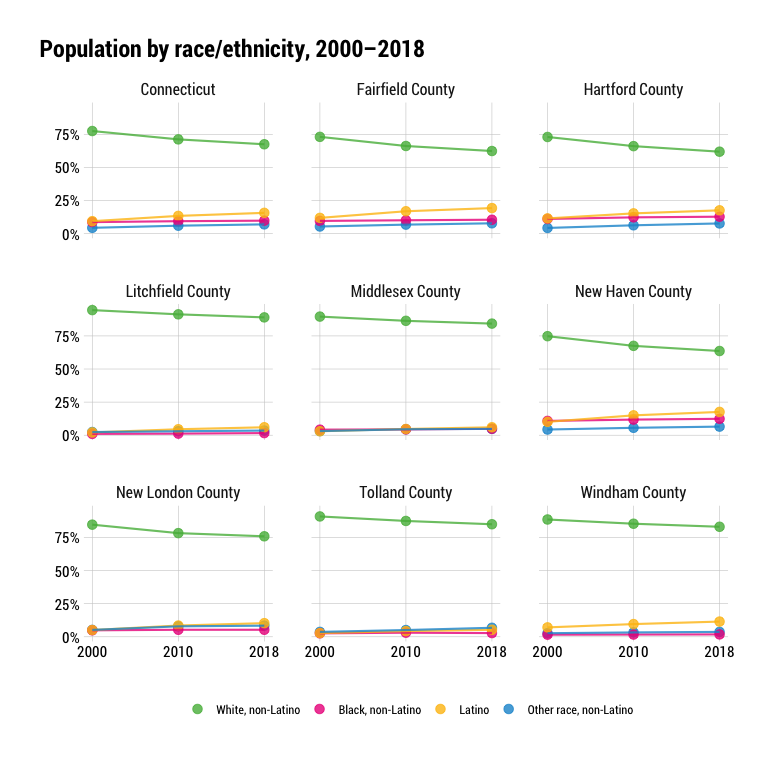
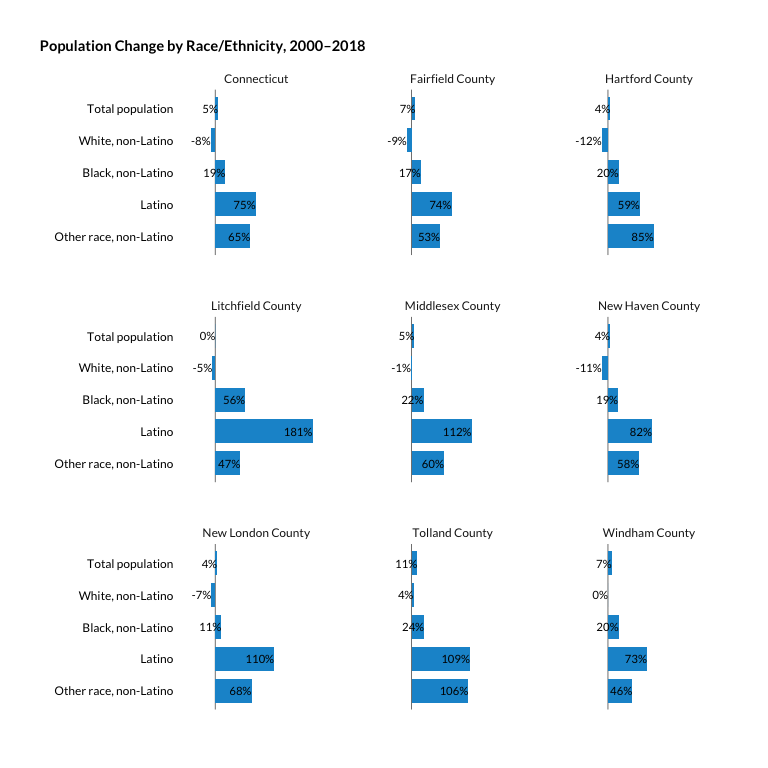

Pop by race
================

``` r
library(tidyverse)
library(tidycensus)
library(janitor)
library(cwi)
library(camiller)
```

Collecting and lightly cleaning basic population data for multiple
geographies and each year available starting in 2000 through latest
available.

Using four major race/ethnicity groups and all others grouped together,
for five groups total - state and county intercensal (2001-2009),
decennial (2000 and 2010), and ACS 2011-2018; town ACS 2011-2018 and
decinnial 2000 and 2010

2000-2010 intercensal data comes in spreadsheets from
<https://www.census.gov/data/datasets/time-series/demo/popest/intercensal-2000-2010-counties.html>

See data dictionary in companion pdf in input\_data.

## Fetch

``` r
intercensal <- read_csv("../input_data/co-est00int-alldata-09.csv") %>%
    clean_names()

acs_years <- list("2011" = 2011, "2012" = 2012, "2013" = 2013, "2014" = 2014, "2015" = 2015, "2016" = 2016, "2017" = 2017, "2018" = 2018)

race <- acs_years %>% map(~multi_geo_acs(table = "B03002", year = ., new_england = F, verbose = F))
race_bind <- Reduce(rbind, race) %>% label_acs()

# Decennial race/ethnicity tables are different, need to do two calls :weary:
race_fetch00 <- multi_geo_decennial(table = "P004", year = 2000, verbose = F) %>% 
    label_decennial(year = 2000)

race_fetch10 <- multi_geo_decennial(table = "P005", year = 2010, verbose = F) %>% 
    label_decennial()
```

## Clean

Intercensals have estimates that are a little off. Other race is too
small while Asian and Latino are a bit too high compared with decennial
census figures. Use at your own peril.

``` r
deci_race10 <- race_fetch10 %>% 
    clean_names() %>% 
    group_by(level, geoid, name, year) %>%
  add_grps(list(total_pop = 1, latino = 10, white = 3, black = 4, asian = 6, other_race = c(5, 7:9)), group = label, value = value) %>%
  calc_shares(group = label, value = value) %>%
    mutate(moe = 0, sharemoe = NA) %>% 
  rename(var = label, estimate = value)

deci_race00 <- race_fetch00 %>% 
    clean_names() %>% 
    group_by(level, geoid, name, year) %>%
  add_grps(list(total_pop = 1, latino = 2, white = 5, black = 6, asian = 8, other_race = c(7, 9:11)), group = label, value = value) %>%
  calc_shares(group = label, value = value) %>%
    mutate(moe = 0, sharemoe = NA) %>% 
  rename(var = label, estimate = value)

deci_race <- bind_rows(deci_race00, deci_race10)

acs_race <- race_bind %>%
    clean_names() %>% 
    group_by(level, geoid, name, year, county) %>% 
  add_grps(list(total_pop = 1, latino = 12, white = 3, black = 4, asian = 6, other_race = c(5, 7:9)), group = label, moe = moe) %>%
  calc_shares(group = label, moe = moe) %>%
  rename(var = label)

period_lut <- tibble(
    estimate_date = c(
        "remove_april_2000",
        "remove_july_2000",
        seq(2001, 2009),
        "remove_april_2010",
        "remove_july_2010"),
    year = seq(1:13))

int_race_county <- intercensal %>% 
    filter(agegrp == 99) %>% 
    mutate(geoid = paste(state, county, sep = ""),
                 latino = h_male + h_female,
                 white = nhwa_male + nhwa_female,
                 black = nhba_male + nhba_female,
                 asian = nhaa_male + nhaa_female,
                 other_race = (nh_male + nh_female) - (white + black + asian)) %>% 
    select(geoid, ctyname, year, tot_pop, white, black, latino, asian, other_race) %>% 
    left_join(., period_lut, by = "year") %>% 
    filter(!grepl("remove", estimate_date)) %>% 
    select(-year) %>% 
    rename(total_pop = tot_pop, year = estimate_date, name = ctyname) %>% 
    mutate(year = as.numeric(year),
                 level = "2_counties",
                 level = as.factor(level)) %>% 
    select(year, geoid, name, level, everything()) %>% 
    pivot_longer(cols = 5:10, names_to = "var", values_to = "estimate") %>% 
    group_by(year, geoid, name, level) %>% 
    calc_shares(group = var, value = estimate, denom = "total_pop")

int_race_ct <- int_race_county %>%
    select(-name, -level, -geoid, -share) %>% 
    mutate(name = "Connecticut", level = "1_state", geoid = "09",
                 level = as.factor(level)) %>% 
    group_by(geoid, name, level, year, var) %>% 
    summarise(estimate = sum(estimate)) %>% 
    ungroup() %>% 
    group_by(geoid, name, level, year) %>% 
    calc_shares(group = var, value = estimate) %>% 
    ungroup()

pop_by_race_out <- bind_rows(deci_race, acs_race, int_race_county, int_race_ct) %>% 
    select(level, geoid, name, year, county, var, estimate, moe, share, sharemoe) %>% 
    arrange(level, geoid, year)

write_csv(pop_by_race_out, "../output_data/pop_by_race_2000_2018.csv")
```

## Calculate change

``` r
race_change <- pop_by_race_out %>%
    select(-share, -moe, -sharemoe) %>%
    rename(race = var) %>% 
    group_by(level, geoid, county, race) %>%
    arrange(name, year, race) %>%
    mutate(diff = estimate - lag(estimate, default = first(estimate))) %>%
    arrange(level, geoid, year, race) %>%
    mutate(measure = "pop_change_from_prev_data_year") %>%
    select(-estimate) %>%
    rename(estimate = diff) %>% 
    select(year, level, geoid, name, county, race, measure, estimate)
    
race_change %>% 
    write_csv("../output_data/pop_by_race_change_2000_2018.csv")
```

``` r
labels <- tibble(var = c("black", "white", "latino", "other_race", "total_pop"),
                                 label = c("Black, non-Latino", "White, non-Latino", "Latino", "Other race, non-Latino", "Total population"))

pop_by_race_out %>% 
    ungroup() %>% 
    filter(level != "3_towns", year %in% c(2000, 2010, 2018)) %>% 
    mutate(var = fct_collapse(var, `other_race` = c("asian", "other_race"))) %>% 
    select(year, name, var, estimate) %>% 
    group_by(year, name, var) %>% 
    summarise(estimate = sum(estimate)) %>% 
    ungroup() %>% 
    group_by(year, name) %>% 
    calc_shares(group = var, denom = "total_pop", value = estimate) %>% 
    ungroup() %>% 
    mutate(year = as.factor(year)) %>% 
    filter(var != "total_pop") %>% 
    left_join(labels, by = "var") %>% 
    mutate(label = as.factor(label) %>% 
                    fct_relevel(., "White, non-Latino", "Black, non-Latino", "Latino", "Other race, non-Latino")) %>% 
    ggplot(aes(year, share, group = label)) +
    geom_point(aes(color = label), size = 3, alpha = .8) +
    geom_line(aes(color = label), size = .75, alpha = .8) +
    scale_y_continuous(labels = scales::percent_format()) +
    scale_x_discrete(expand = expansion(mult = c(0.05,0.05))) +
    facet_wrap(facets = "name") +
    hrbrthemes::theme_ipsum_rc() +
    guides(color = guide_legend(title = "", override.aes = list(linetype = 0))) +
    labs(title = "Population by race/ethnicity, 2000–2018",
             x = "", y = "") +
    theme(plot.title.position = "plot",
                axis.text.y = element_text(colour = "black"),
                strip.text.x = element_text(hjust = .5),
                panel.grid.minor = element_blank(),
                axis.text.x = element_text(colour = "black"),
                legend.position = "bottom")
```

<!-- -->

``` r
pop_by_race_out %>% 
    ungroup() %>% 
    filter(level != "3_towns", year %in% c(2000, 2010, 2018)) %>% 
    mutate(var = fct_collapse(var, `other_race` = c("asian", "other_race"))) %>% 
    select(year, name, var, estimate) %>% 
    group_by(year, name, var) %>% 
    summarise(estimate = sum(estimate)) %>% 
    ungroup() %>% 
    left_join(labels, by = "var") %>% 
    select(-var) %>% 
    pivot_wider(id_cols = c("name", "label"), names_from = year, values_from = estimate) %>% 
    mutate(pct_chg = (`2018` - `2000`) / `2000`,
                 lbl_chg = scales::percent(pct_chg, accuracy = 1),
                 `2000` = scales::comma(`2000`, accuracy = 1),
                 `2018` = scales::comma(`2018`, accuracy = 1)) %>% 
    select(Name = name, `Race/ethnic group` = label, `Estimate, 2000` = `2000`, `Estimate, 2018` = `2018`, `Pct. chg. 2000–2018` = lbl_chg) %>% 
    kableExtra::kable()
```

<table>

<thead>

<tr>

<th style="text-align:left;">

Name

</th>

<th style="text-align:left;">

Race/ethnic group

</th>

<th style="text-align:left;">

Estimate, 2000

</th>

<th style="text-align:left;">

Estimate, 2018

</th>

<th style="text-align:left;">

Pct. chg. 2000–2018

</th>

</tr>

</thead>

<tbody>

<tr>

<td style="text-align:left;">

Connecticut

</td>

<td style="text-align:left;">

Total population

</td>

<td style="text-align:left;">

3,405,565

</td>

<td style="text-align:left;">

3,581,504

</td>

<td style="text-align:left;">

5%

</td>

</tr>

<tr>

<td style="text-align:left;">

Connecticut

</td>

<td style="text-align:left;">

Latino

</td>

<td style="text-align:left;">

320,323

</td>

<td style="text-align:left;">

561,791

</td>

<td style="text-align:left;">

75%

</td>

</tr>

<tr>

<td style="text-align:left;">

Connecticut

</td>

<td style="text-align:left;">

White, non-Latino

</td>

<td style="text-align:left;">

2,638,845

</td>

<td style="text-align:left;">

2,418,696

</td>

<td style="text-align:left;">

\-8%

</td>

</tr>

<tr>

<td style="text-align:left;">

Connecticut

</td>

<td style="text-align:left;">

Black, non-Latino

</td>

<td style="text-align:left;">

295,571

</td>

<td style="text-align:left;">

351,817

</td>

<td style="text-align:left;">

19%

</td>

</tr>

<tr>

<td style="text-align:left;">

Connecticut

</td>

<td style="text-align:left;">

Other race, non-Latino

</td>

<td style="text-align:left;">

150,826

</td>

<td style="text-align:left;">

249,200

</td>

<td style="text-align:left;">

65%

</td>

</tr>

<tr>

<td style="text-align:left;">

Fairfield County

</td>

<td style="text-align:left;">

Total population

</td>

<td style="text-align:left;">

882,567

</td>

<td style="text-align:left;">

944,348

</td>

<td style="text-align:left;">

7%

</td>

</tr>

<tr>

<td style="text-align:left;">

Fairfield County

</td>

<td style="text-align:left;">

Latino

</td>

<td style="text-align:left;">

104,835

</td>

<td style="text-align:left;">

182,653

</td>

<td style="text-align:left;">

74%

</td>

</tr>

<tr>

<td style="text-align:left;">

Fairfield County

</td>

<td style="text-align:left;">

White, non-Latino

</td>

<td style="text-align:left;">

645,152

</td>

<td style="text-align:left;">

588,974

</td>

<td style="text-align:left;">

\-9%

</td>

</tr>

<tr>

<td style="text-align:left;">

Fairfield County

</td>

<td style="text-align:left;">

Black, non-Latino

</td>

<td style="text-align:left;">

84,724

</td>

<td style="text-align:left;">

99,412

</td>

<td style="text-align:left;">

17%

</td>

</tr>

<tr>

<td style="text-align:left;">

Fairfield County

</td>

<td style="text-align:left;">

Other race, non-Latino

</td>

<td style="text-align:left;">

47,856

</td>

<td style="text-align:left;">

73,309

</td>

<td style="text-align:left;">

53%

</td>

</tr>

<tr>

<td style="text-align:left;">

Hartford County

</td>

<td style="text-align:left;">

Total population

</td>

<td style="text-align:left;">

857,183

</td>

<td style="text-align:left;">

894,730

</td>

<td style="text-align:left;">

4%

</td>

</tr>

<tr>

<td style="text-align:left;">

Hartford County

</td>

<td style="text-align:left;">

Latino

</td>

<td style="text-align:left;">

98,968

</td>

<td style="text-align:left;">

157,785

</td>

<td style="text-align:left;">

59%

</td>

</tr>

<tr>

<td style="text-align:left;">

Hartford County

</td>

<td style="text-align:left;">

White, non-Latino

</td>

<td style="text-align:left;">

625,797

</td>

<td style="text-align:left;">

553,425

</td>

<td style="text-align:left;">

\-12%

</td>

</tr>

<tr>

<td style="text-align:left;">

Hartford County

</td>

<td style="text-align:left;">

Black, non-Latino

</td>

<td style="text-align:left;">

95,157

</td>

<td style="text-align:left;">

114,565

</td>

<td style="text-align:left;">

20%

</td>

</tr>

<tr>

<td style="text-align:left;">

Hartford County

</td>

<td style="text-align:left;">

Other race, non-Latino

</td>

<td style="text-align:left;">

37,261

</td>

<td style="text-align:left;">

68,955

</td>

<td style="text-align:left;">

85%

</td>

</tr>

<tr>

<td style="text-align:left;">

Litchfield County

</td>

<td style="text-align:left;">

Total population

</td>

<td style="text-align:left;">

182,193

</td>

<td style="text-align:left;">

183,031

</td>

<td style="text-align:left;">

0%

</td>

</tr>

<tr>

<td style="text-align:left;">

Litchfield County

</td>

<td style="text-align:left;">

Latino

</td>

<td style="text-align:left;">

3,894

</td>

<td style="text-align:left;">

10,941

</td>

<td style="text-align:left;">

181%

</td>

</tr>

<tr>

<td style="text-align:left;">

Litchfield County

</td>

<td style="text-align:left;">

White, non-Latino

</td>

<td style="text-align:left;">

172,154

</td>

<td style="text-align:left;">

162,898

</td>

<td style="text-align:left;">

\-5%

</td>

</tr>

<tr>

<td style="text-align:left;">

Litchfield County

</td>

<td style="text-align:left;">

Black, non-Latino

</td>

<td style="text-align:left;">

1,837

</td>

<td style="text-align:left;">

2,863

</td>

<td style="text-align:left;">

56%

</td>

</tr>

<tr>

<td style="text-align:left;">

Litchfield County

</td>

<td style="text-align:left;">

Other race, non-Latino

</td>

<td style="text-align:left;">

4,308

</td>

<td style="text-align:left;">

6,329

</td>

<td style="text-align:left;">

47%

</td>

</tr>

<tr>

<td style="text-align:left;">

Middlesex County

</td>

<td style="text-align:left;">

Total population

</td>

<td style="text-align:left;">

155,071

</td>

<td style="text-align:left;">

163,368

</td>

<td style="text-align:left;">

5%

</td>

</tr>

<tr>

<td style="text-align:left;">

Middlesex County

</td>

<td style="text-align:left;">

Latino

</td>

<td style="text-align:left;">

4,649

</td>

<td style="text-align:left;">

9,835

</td>

<td style="text-align:left;">

112%

</td>

</tr>

<tr>

<td style="text-align:left;">

Middlesex County

</td>

<td style="text-align:left;">

White, non-Latino

</td>

<td style="text-align:left;">

138,979

</td>

<td style="text-align:left;">

137,696

</td>

<td style="text-align:left;">

\-1%

</td>

</tr>

<tr>

<td style="text-align:left;">

Middlesex County

</td>

<td style="text-align:left;">

Black, non-Latino

</td>

<td style="text-align:left;">

6,588

</td>

<td style="text-align:left;">

8,050

</td>

<td style="text-align:left;">

22%

</td>

</tr>

<tr>

<td style="text-align:left;">

Middlesex County

</td>

<td style="text-align:left;">

Other race, non-Latino

</td>

<td style="text-align:left;">

4,855

</td>

<td style="text-align:left;">

7,787

</td>

<td style="text-align:left;">

60%

</td>

</tr>

<tr>

<td style="text-align:left;">

New Haven County

</td>

<td style="text-align:left;">

Total population

</td>

<td style="text-align:left;">

824,008

</td>

<td style="text-align:left;">

859,339

</td>

<td style="text-align:left;">

4%

</td>

</tr>

<tr>

<td style="text-align:left;">

New Haven County

</td>

<td style="text-align:left;">

Latino

</td>

<td style="text-align:left;">

83,131

</td>

<td style="text-align:left;">

151,361

</td>

<td style="text-align:left;">

82%

</td>

</tr>

<tr>

<td style="text-align:left;">

New Haven County

</td>

<td style="text-align:left;">

White, non-Latino

</td>

<td style="text-align:left;">

616,541

</td>

<td style="text-align:left;">

546,120

</td>

<td style="text-align:left;">

\-11%

</td>

</tr>

<tr>

<td style="text-align:left;">

New Haven County

</td>

<td style="text-align:left;">

Black, non-Latino

</td>

<td style="text-align:left;">

89,286

</td>

<td style="text-align:left;">

106,325

</td>

<td style="text-align:left;">

19%

</td>

</tr>

<tr>

<td style="text-align:left;">

New Haven County

</td>

<td style="text-align:left;">

Other race, non-Latino

</td>

<td style="text-align:left;">

35,050

</td>

<td style="text-align:left;">

55,533

</td>

<td style="text-align:left;">

58%

</td>

</tr>

<tr>

<td style="text-align:left;">

New London County

</td>

<td style="text-align:left;">

Total population

</td>

<td style="text-align:left;">

259,088

</td>

<td style="text-align:left;">

268,881

</td>

<td style="text-align:left;">

4%

</td>

</tr>

<tr>

<td style="text-align:left;">

New London County

</td>

<td style="text-align:left;">

Latino

</td>

<td style="text-align:left;">

13,236

</td>

<td style="text-align:left;">

27,762

</td>

<td style="text-align:left;">

110%

</td>

</tr>

<tr>

<td style="text-align:left;">

New London County

</td>

<td style="text-align:left;">

White, non-Latino

</td>

<td style="text-align:left;">

219,542

</td>

<td style="text-align:left;">

204,185

</td>

<td style="text-align:left;">

\-7%

</td>

</tr>

<tr>

<td style="text-align:left;">

New London County

</td>

<td style="text-align:left;">

Black, non-Latino

</td>

<td style="text-align:left;">

12,760

</td>

<td style="text-align:left;">

14,219

</td>

<td style="text-align:left;">

11%

</td>

</tr>

<tr>

<td style="text-align:left;">

New London County

</td>

<td style="text-align:left;">

Other race, non-Latino

</td>

<td style="text-align:left;">

13,550

</td>

<td style="text-align:left;">

22,715

</td>

<td style="text-align:left;">

68%

</td>

</tr>

<tr>

<td style="text-align:left;">

Tolland County

</td>

<td style="text-align:left;">

Total population

</td>

<td style="text-align:left;">

136,364

</td>

<td style="text-align:left;">

151,269

</td>

<td style="text-align:left;">

11%

</td>

</tr>

<tr>

<td style="text-align:left;">

Tolland County

</td>

<td style="text-align:left;">

Latino

</td>

<td style="text-align:left;">

3,873

</td>

<td style="text-align:left;">

8,086

</td>

<td style="text-align:left;">

109%

</td>

</tr>

<tr>

<td style="text-align:left;">

Tolland County

</td>

<td style="text-align:left;">

White, non-Latino

</td>

<td style="text-align:left;">

124,014

</td>

<td style="text-align:left;">

128,603

</td>

<td style="text-align:left;">

4%

</td>

</tr>

<tr>

<td style="text-align:left;">

Tolland County

</td>

<td style="text-align:left;">

Black, non-Latino

</td>

<td style="text-align:left;">

3,480

</td>

<td style="text-align:left;">

4,299

</td>

<td style="text-align:left;">

24%

</td>

</tr>

<tr>

<td style="text-align:left;">

Tolland County

</td>

<td style="text-align:left;">

Other race, non-Latino

</td>

<td style="text-align:left;">

4,997

</td>

<td style="text-align:left;">

10,281

</td>

<td style="text-align:left;">

106%

</td>

</tr>

<tr>

<td style="text-align:left;">

Windham County

</td>

<td style="text-align:left;">

Total population

</td>

<td style="text-align:left;">

109,091

</td>

<td style="text-align:left;">

116,538

</td>

<td style="text-align:left;">

7%

</td>

</tr>

<tr>

<td style="text-align:left;">

Windham County

</td>

<td style="text-align:left;">

Latino

</td>

<td style="text-align:left;">

7,737

</td>

<td style="text-align:left;">

13,368

</td>

<td style="text-align:left;">

73%

</td>

</tr>

<tr>

<td style="text-align:left;">

Windham County

</td>

<td style="text-align:left;">

White, non-Latino

</td>

<td style="text-align:left;">

96,666

</td>

<td style="text-align:left;">

96,795

</td>

<td style="text-align:left;">

0%

</td>

</tr>

<tr>

<td style="text-align:left;">

Windham County

</td>

<td style="text-align:left;">

Black, non-Latino

</td>

<td style="text-align:left;">

1,739

</td>

<td style="text-align:left;">

2,084

</td>

<td style="text-align:left;">

20%

</td>

</tr>

<tr>

<td style="text-align:left;">

Windham County

</td>

<td style="text-align:left;">

Other race, non-Latino

</td>

<td style="text-align:left;">

2,949

</td>

<td style="text-align:left;">

4,291

</td>

<td style="text-align:left;">

46%

</td>

</tr>

</tbody>

</table>

``` r
pop_by_race_out %>% 
    ungroup() %>% 
    filter(level != "3_towns", year %in% c(2000, 2010, 2018)) %>% 
    mutate(var = fct_collapse(var, `other_race` = c("asian", "other_race"))) %>% 
    select(year, name, var, estimate) %>% 
    group_by(year, name, var) %>% 
    summarise(estimate = sum(estimate)) %>% 
    ungroup() %>% 
    left_join(labels, by = "var") %>% 
    select(-var) %>% 
    mutate(label = as.factor(label) %>% 
                    fct_relevel(., "Total population", "White, non-Latino", "Black, non-Latino", "Latino", "Other race, non-Latino") %>% 
                    fct_rev()) %>% 
    pivot_wider(id_cols = c("name", "label"), names_from = year, values_from = estimate) %>% 
    mutate(pct_chg = (`2018` - `2000`) / `2000`) %>% 
    ggplot(aes(pct_chg, label)) +
    geom_vline(xintercept = 0, size = .25, alpha = .8) +
    geom_col(aes(fill = label), width = .75, position = position_dodge(.85)) +
    geom_text(aes(label = scales::percent(pct_chg, accuracy = 1)), position = position_dodge(.85), hjust = 1, family = "Roboto Condensed", size = 4) +
    scale_x_continuous(limits = c(-.25, 2),
                                         labels = scales::percent_format(),
                                         expand = expansion(mult = c(.15, .1))) +
    facet_wrap(facets = "name") +
    hrbrthemes::theme_ipsum_rc() +
    guides(fill = guide_legend(title = "")) +
    labs(title = "Population change by race/ethnicity, 2000–2018",
             x = "", y = "") +
    theme(plot.title.position = "plot",
                axis.text.y = element_text(colour = "black"),
                strip.text.x = element_text(hjust = .5),
                panel.grid.minor = element_blank(),
                panel.grid.major = element_blank(),
                axis.text.x = element_blank(),
                legend.position = "none")
```

<!-- -->
