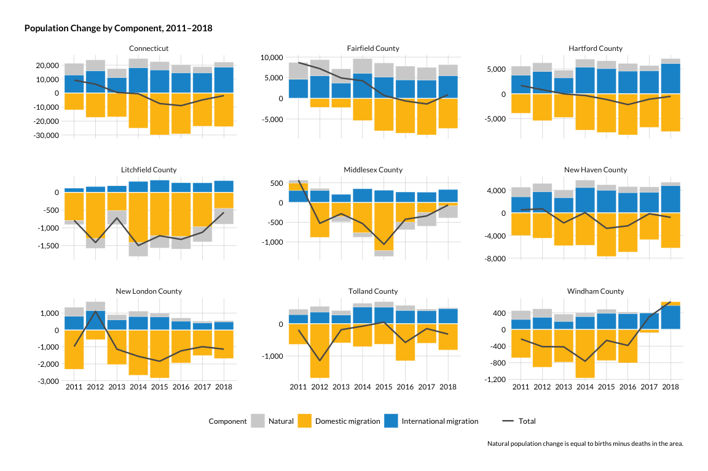

Pop change components
================

``` r
library(tidyverse)
library(tidycensus)
library(janitor)
library(cwi)
library(camiller)
library(censusapi)
```

Collecting and lightly cleaning basic population data for multiple
geographies and each year available starting in 2000 through latest
available.

Change by component - *(natural, international, domestic)* - state and
county only; town not available.

Periods are annual estimates from July 1–June 30 where period 2 is 2011,
period 3 is 2012, etc. **EXCEPTION:** Period 1 is April 1–June 30, 2010
because of decennial census.

Vars and codes are found here:
<https://www.census.gov/data/developers/data-sets/popest-popproj/popest/popest-vars/2017.html>

For dates, I’m going to take the year the estimate ends (so the June 30
date in the code list at the link above).

``` r
period_lut <- tibble(
    year = seq(2010, 2018),
    period = seq(1:9))

ct_components <- get_estimates(
    geography = "state", 
    state = "09", 
    product = "components", 
    time_series = T)

county_components <- get_estimates(
    geography = "county", 
    state = "09", 
    product = "components", 
    time_series = T)
```

Taking Kyle Walker at his word that these components don’t exist at
sub-county level. They are available by MSA/CSA but that’s not helpful
for our purposes.

``` r
components <- bind_rows(ct_components, county_components) %>%
    clean_names() %>% 
    mutate(variable = str_to_lower(variable),
                 name = str_remove(name, ", Connecticut"),
                 level = as.factor(if_else(name == "Connecticut", "1_state", "2_counties")),
                 county = as.character(NA)) %>% 
    filter(variable %in% c(
        "births", "deaths", "naturalinc", "domesticmig", "internationalmig")) %>% 
    left_join(period_lut, by = "period") %>% 
    select(year, level, geoid, name, county, var = variable, estimate = value)

write_csv(components, "../output_data/pop_change_components_2010_2018")

total <- components %>% 
    ungroup() %>% 
    filter(!var %in% c("births", "deaths")) %>% 
    select(name, year, estimate) %>% 
    group_by(name, year) %>% 
    summarise(estimate = sum(estimate)) %>% 
    ungroup() %>% 
    filter(year != 2010) %>% 
    mutate(var = "total")
```

2010 data is weird a short period (see note above) so I’m going to
remove it from charts.

The county charts tell a more detailed story than just the state chart.
If we choose to only show state in the report, the text should describe
how the counties differ, and a table or this faceted chart should be in
the appendix.

``` r
components_plot <- components %>% 
    ungroup() %>% 
    select(name, year, var, estimate) %>% 
    filter(!var %in% c("births", "deaths"), year != 2010) %>% 
    bind_rows(total) %>% 
    mutate(var = str_replace(var, "mig", " Migration"),
                 var = str_remove(var, "inc"),
                 var = str_to_sentence(var)) %>% 
    mutate(year = as.factor(year),
                 var = as.factor(var) %>% 
                    fct_relevel(., "Natural", "Domestic migration", "International migration"))
```

``` r
ggplot(components_plot, aes(x = year, y = estimate, group = var)) +
    geom_col(data = components_plot %>% filter(var != "Total"), aes(fill = var), position = position_stack(), color = "grey90", size = 0.1) +
    geom_hline(yintercept = 0, color = .65, alpha = .9) +
    geom_line(data = components_plot %>% filter(var == "Total"), aes(color = var), size = .85) +
    scale_color_manual(values = "grey35") +
    scale_y_continuous(labels = scales::comma_format()) +
    facet_wrap(facets = "name", scales = "free_y") +
    hrbrthemes::theme_ipsum_rc() +
    guides(color = guide_legend(title = ""),
                 fill = guide_legend(title = "Component")) +
    labs(title = "Population change by component, 2011–2018",
             x = "", y = "", caption = "Natural population change is equal to births minus deaths in the area.") +
    theme(strip.text.x = element_text(hjust = .5, size = 11),
                panel.grid.minor = element_blank(),
                legend.position = "bottom",
                plot.title.position = "plot", 
                axis.text.x = element_text(colour = "black", size = 10),
                axis.text.y = element_text(colour = "black", size = 10))
```

<!-- -->
