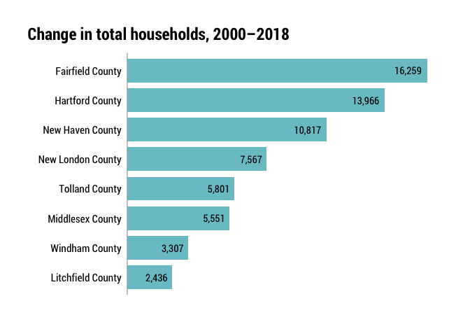

Total occupied households
================

``` r
library(tidyverse)
```

This was done in another notebook (households by type) so I’m just
pulling out total households since it was requested separately.

``` r
hhlds <- read_csv("../output_data/household_type_2000_2018.csv")

hhlds %>% filter(group == "total_households", year != 2010, level != "3_towns") %>% 
    select(year, level, name, value) %>% 
    group_by(level, name) %>% 
    mutate(dif = value - lag(value)) %>% 
    select(level, name, dif) %>% 
    filter(!is.na(dif), name != "Connecticut") %>% 
    ggplot(aes(dif, reorder(name, dif))) +
    geom_col(aes(fill = level), width = .8) +
    geom_vline(xintercept = 0, color = "grey65", alpha = .8) +
    geom_text(aes(label = scales::comma(dif, accuracy = 1)), hjust = 1.2, family = "Roboto Condensed") +
    scale_x_continuous(expand = expansion(mult = c(.01, .05)))+
    scale_fill_manual(values = c("cadetblue3")) +
    hrbrthemes::theme_ipsum_rc() +
    labs(title = "Change in total households, 2000–2018",
             x = "", y = "") +
    theme(panel.grid.major = element_blank(),
                panel.grid.minor = element_blank(),
                plot.title.position = "plot",
                legend.position = "none",
                axis.text.x = element_blank(),
                axis.text.y = element_text(colour = "black"))
```

<!-- -->
