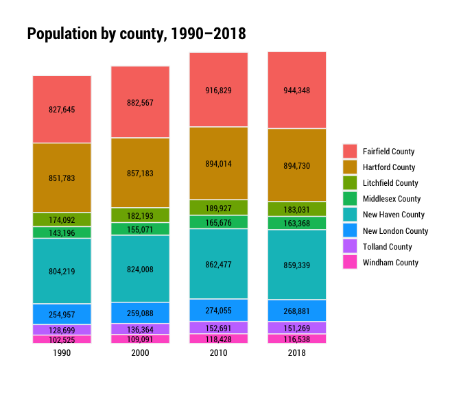

Total population trends
================

``` r
library(tidyverse)
library(tidycensus)
library(janitor)
library(cwi)
library(camiller)
```

Collecting and lightly cleaning basic population data for multiple
geographies and each year available starting in 2000 through latest
available.

# Total pop

## Fetch

State and county: Pre-2010 state and county data from Census intercensal
counts. 2010-2018 data from deci/ACS.

Town: only 2011-2018 ACS, 2000 and 2010 deci.

``` r
# 2000-2010 intercensal data comes in spreadsheets from
# https://www.census.gov/data/datasets/time-series/demo/popest/intercensal-2000-2010-counties.html
# see data dictionary in companion pdf
intercensal <- read_csv("../input_data/co-est00int-alldata-09.csv") %>%
    clean_names()

acs_years <- list("2011" = 2011, "2012" = 2012, "2013" = 2013, "2014" = 2014, "2015" = 2015, "2016" = 2016, "2017" = 2017, "2018" = 2018)

#b01001 - sex by age
sex_by_age <- acs_years %>% map(~multi_geo_acs(table = "B01001", year = ., new_england = F))
sex_by_age_bind <- Reduce(rbind, sex_by_age) %>% label_acs()


deci_years <- list("1990" = 1990, "2000" = 2000, "2010" = 2010)

deci_pops <- deci_years %>% map(~multi_geo_decennial(table = "P001", year = .))
deci_pops_bind <- Reduce(rbind, deci_pops) %>% label_decennial() 
```

## Clean

``` r
deci_pop <- deci_pops_bind %>%
    mutate(var = "total_pop",  moe = 0) %>% 
    select(year, level, geoid = GEOID, name = NAME, county, var, estimate = value, moe)

acs_pop <- sex_by_age_bind %>%
    separate(label, into = c("total", "gender", "age"), sep = "!!", fill = "right") %>% 
    clean_names() %>% 
    filter(grepl("_001", variable)) %>% 
    mutate(var = "total_pop",
                 var = as.factor(var)) %>% 
    mutate(moe = replace_na(moe, 0)) %>% 
    select(year, level, geoid, name, county, var, estimate, moe)

period_lut <- tibble(
    estimate_date = c(
        "remove_april_2000",
        "remove_july_2000",
        seq(2001, 2009),
        "remove_april_2010",
        "remove_july_2010"),
    year = seq(1:13))

int_county <- intercensal %>% 
    mutate(geoid = paste(state, county, sep = "")) %>% 
  select(geoid, name = ctyname, year, agegrp, estimate = tot_pop) %>% 
    left_join(period_lut, by = "year") %>% 
    filter(agegrp == "99", !grepl("remove", estimate_date)) %>% 
    mutate(year2 = as.numeric(estimate_date),
                 moe = 0) %>% 
    mutate(var = "total_pop", level = "2_counties", county = NA, moe = 0,
                 var = as.factor(var)) %>% 
    select(year = year2, level, geoid, name, county, var, estimate, moe)

int_ct <- int_county %>% 
    select(-level, -geoid, -name) %>% 
    group_by(year, county, var) %>% 
    summarise(estimate = sum(estimate), moe = sum(moe)) %>% 
    ungroup() %>% 
    mutate(level = "1_state", geoid = "09", name = "Connecticut") %>% 
    select(year, level, geoid, name, county, var, estimate, moe)

int_pop <- bind_rows(int_ct, int_county) %>% 
    mutate(level = as.factor(level))

### write out total pop
pop_out <- bind_rows(deci_pop, int_pop, acs_pop) %>% 
    arrange(level, geoid, year) %>% 
    write_csv(., "../output_data/total_pop_1990_2018.csv")
```

## Calculate pop change

``` r
pop_change_all_years <- pop_out %>% 
    group_by(level, geoid, county, var) %>% 
    arrange(name, year) %>% 
    mutate(diff = estimate - lag(estimate, default = first(estimate))) %>% 
    arrange(level, geoid, year) %>% 
    mutate(var = "pop_change") %>% 
    select(-estimate, -moe) %>% 
    rename(estimate = diff) %>% 
    select(year, level, geoid, name, county, var, estimate) %>% 
    write_csv("../output_data/pop_change_1990_2018.csv")
```

``` r
pop_out %>% 
    filter(level == "2_counties", year %in% c(1990, 2000, 2010, 2018)) %>% 
    mutate(year = as.factor(year)) %>% 
    ggplot(aes(year, estimate, group = name)) +
    geom_col(aes(fill = name), width = .75, color = "grey95", position = position_stack()) +
    geom_text(aes(label = scales::comma(estimate, accuracy = 1)), position = position_stack(.5), size = 3.25, family = "Roboto Condensed") +
    scale_y_continuous(labels = scales::comma_format(),
                                         expand = expansion(mult = c(.01,0))) +
    scale_x_discrete(expand = expansion(mult = c(0,0))) +
    hrbrthemes::theme_ipsum_rc() +
    guides(fill = guide_legend(title = "")) +
    labs(title = "Population by county, 1990–2018",
             x = "", y = "") +
    theme(panel.grid.minor = element_blank(),
                panel.grid.major = element_blank(),
                axis.title.y = element_text(angle = 0, hjust = 0, vjust = .5),
                axis.title.x = element_text(hjust = .5),
                plot.title.position = "plot",
                axis.text.y = element_blank(),
                axis.text.x = element_text(color = "black", size = 10))
```

<!-- -->

``` r
pop_change_90_18 <- pop_out %>% 
    filter(year %in% c(1990, 2000, 2010, 2018)) %>% 
    group_by(level, geoid, county, var) %>% 
    arrange(name, year) %>% 
    mutate(diff = estimate - lag(estimate, default = first(estimate))) %>% 
    arrange(level, geoid, year) %>% 
    mutate(var = "pop_change") %>% 
    select(-estimate, -moe) %>% 
    rename(estimate = diff) %>% 
    select(year, level, geoid, name, county, var, estimate)

pop_change_90_18 %>% 
    ungroup() %>% 
    filter(year %in% c(2000, 2010, 2018), level != "3_towns") %>% 
    mutate(est = scales::comma(estimate, accuracy = 1)) %>% 
    select(Name = name, year, est) %>% 
    pivot_wider(id_cols = Name, names_from = year, values_from = est) %>% 
    rename(`1990 to 2000` = `2000`, `2000 to 2010` = `2010`, `2010 to 2018` = `2018`) %>% 
    kableExtra::kable(caption = "Population change")
```

<table>

<caption>

Population change

</caption>

<thead>

<tr>

<th style="text-align:left;">

Name

</th>

<th style="text-align:left;">

1990 to 2000

</th>

<th style="text-align:left;">

2000 to 2010

</th>

<th style="text-align:left;">

2010 to 2018

</th>

</tr>

</thead>

<tbody>

<tr>

<td style="text-align:left;">

Connecticut

</td>

<td style="text-align:left;">

118,449

</td>

<td style="text-align:left;">

168,532

</td>

<td style="text-align:left;">

7,407

</td>

</tr>

<tr>

<td style="text-align:left;">

Fairfield County

</td>

<td style="text-align:left;">

54,922

</td>

<td style="text-align:left;">

34,262

</td>

<td style="text-align:left;">

27,519

</td>

</tr>

<tr>

<td style="text-align:left;">

Hartford County

</td>

<td style="text-align:left;">

5,400

</td>

<td style="text-align:left;">

36,831

</td>

<td style="text-align:left;">

716

</td>

</tr>

<tr>

<td style="text-align:left;">

Litchfield County

</td>

<td style="text-align:left;">

8,101

</td>

<td style="text-align:left;">

7,734

</td>

<td style="text-align:left;">

\-6,896

</td>

</tr>

<tr>

<td style="text-align:left;">

Middlesex County

</td>

<td style="text-align:left;">

11,875

</td>

<td style="text-align:left;">

10,605

</td>

<td style="text-align:left;">

\-2,308

</td>

</tr>

<tr>

<td style="text-align:left;">

New Haven County

</td>

<td style="text-align:left;">

19,789

</td>

<td style="text-align:left;">

38,469

</td>

<td style="text-align:left;">

\-3,138

</td>

</tr>

<tr>

<td style="text-align:left;">

New London County

</td>

<td style="text-align:left;">

4,131

</td>

<td style="text-align:left;">

14,967

</td>

<td style="text-align:left;">

\-5,174

</td>

</tr>

<tr>

<td style="text-align:left;">

Tolland County

</td>

<td style="text-align:left;">

7,665

</td>

<td style="text-align:left;">

16,327

</td>

<td style="text-align:left;">

\-1,422

</td>

</tr>

<tr>

<td style="text-align:left;">

Windham County

</td>

<td style="text-align:left;">

6,566

</td>

<td style="text-align:left;">

9,337

</td>

<td style="text-align:left;">

\-1,890

</td>

</tr>

</tbody>

</table>
