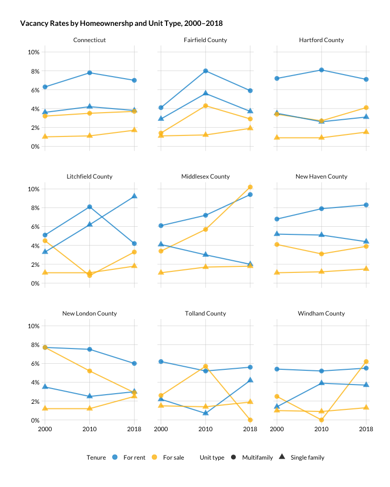

Vacancy
================

``` r
library(ipumsr)
library(tidyverse)
library(srvyr)
library(tidycensus)
library(hrbrthemes)
library(camiller)
library(scales)
library(kableExtra)
```

``` r
theme_set(hrbrthemes::theme_ipsum_rc(base_family = "Lato Regular"))

#urban colors
pal <- c("#1696d2", "#fdbf11", "#d2d2d2", "#ec008b", "#55b748")
```

I’m using a slightly modified version of the Census definitions here
<https://www.census.gov/housing/hvs/definitions.pdf> (modified because
we would ideally add the “Rented or sold but not (yet) occupied” units,
but we can’t split those out by tenure). Further splitting SF and MF (2+
units in structure) units separately:

  - SF for-sale vacancy rate
  - MF for-sale vacancy rate
  - SF for-rent vacancy rate
  - MF for-rent vacancy rate

For 2000, 2010, and 2018.

# Read

``` r
ddi <- read_ipums_ddi("../input_data/usa_00047.xml")

ctyfip <- tibble(countyfip = seq(from = 1, to = 15, by = 2),
                                 name = c("Fairfield County", "Hartford County", "Litchfield County", "Middlesex County", "New Haven County", "New London County", "Windham County", "Tolland County"))

on_mkt <- c("For rent or sale", "For sale only")
occupied <- c("Rented", "Owned or being bought (loan)")
sf <- c("1-family house, detached", "1-family house, attached", "Mobile home or trailer", "Boat, tent, van, other")
# ideally we would want to add not yet occupieds

pums <- read_ipums_micro(ddi, verbose = F) %>% 
    filter(RECTYPE == "H") %>% 
    mutate_at(vars(YEAR, OWNERSHP, OWNERSHPD, VACANCY, UNITSSTR), as_factor) %>%
    mutate_at(vars(HHWT), as.numeric) %>% 
    mutate_at(vars(STATEFIP, COUNTYFIP, HHINCOME, VALUEH, OWNCOST, RENTGRS, BEDROOMS), as.integer) %>% 
    janitor::clean_names() %>% 
    left_join(ctyfip, by = "countyfip") %>% 
    mutate(type = if_else(unitsstr %in% sf, "Single family", "Multifamily")) %>% 
    mutate(type = if_else(unitsstr == "N/A", "n/a", type)) %>% 
    mutate(mkt = if_else(vacancy %in% on_mkt, "Vacant", "n/a")) %>% 
    mutate(mkt = if_else(ownershp %in% occupied, "Occupied", mkt)) %>%
    mutate(tenure = if_else((ownershp == "Rented" | vacancy == "For rent or sale"), "For rent", "n/a")) %>% 
    mutate(tenure = if_else((ownershp == "Owned or being bought (loan)" | vacancy == "For sale only"), "For sale", tenure))
```

# Clean

``` r
occ_des <- pums %>%
    filter(mkt != "n/a", tenure != "n/a") %>% 
    as_survey_design(., ids = 1, wt = hhwt)

vacancy <- occ_des %>%
    select(year, hhwt, name, type, mkt, tenure) %>% 
    group_by(year, name, tenure, mkt, type) %>% 
    summarise(units = survey_total(hhwt)) %>% 
    ungroup() %>% 
    select(-units_se) %>% 
    pivot_wider(id_cols = year:type, names_from = mkt, values_from = units) %>% 
    mutate(Vacant = if_else(is.na(Vacant), 0, Vacant)) %>% 
    mutate(Total = Occupied + Vacant) %>% 
    pivot_longer(cols = Occupied:Total, names_to = "mkt", values_to = "units") %>% 
    group_by(year, name, tenure, type) %>% 
    calc_shares(group = mkt, denom = "Total", value = units) %>% 
    ungroup()

vac_ct <- vacancy %>% 
    select(-name, -share) %>% 
    mutate(name = "Connecticut") %>% 
    group_by(year, name, tenure, type, mkt) %>% 
    summarise(units = sum(units)) %>% 
    ungroup() %>% 
    group_by(year, name, tenure, type) %>% 
    calc_shares(group = mkt, denom = "Total", value = units)

vacancy <- bind_rows(vac_ct, vacancy)

write_csv(vacancy, "../output_data/vacancy_2000_2018.csv")
```

``` r
vacancy %>% 
    filter(mkt == "Vacant") %>% 
    ggplot(aes(year, share, group = interaction(tenure, type))) +
    geom_line(aes(color = tenure), size = .75, alpha = .8) +
    geom_point(aes(shape = type, color = tenure), size = 3, alpha = .8) +
    scale_y_continuous(labels = scales::percent_format(accuracy = 1),
                                         breaks = c(0, .02, .04, .06, .08, .1),
                                         expand = expansion(mult = c(.05, .05))) +
    scale_x_discrete(expand = expansion(mult = c(.04, .04))) +
    facet_wrap(facets = "name") +
    guides(color = guide_legend(title = "Tenure", override.aes = list(linetype = 0)),
                 shape = guide_legend(title = "Unit type")) +
  scale_color_manual(values = c(pal[1:2])) +
    labs(title = str_wrap("Vacancy Rates by Homeownershp and Unit Type, 2000–2018", 100),
             x = "", y = "") +
    theme(plot.title.position = "plot",
                plot.title = element_text(family = "Lato Bold", size = 11),
                strip.text.x = element_text(hjust = .5, family = "Lato Regular", size = 9),
                panel.grid.minor.y = element_blank(), 
                axis.text.x = element_text(colour = "black", family = "Lato Regular", size = 9),
                axis.text.y = element_text(colour = "black", family = "Lato Regular", size = 9),
                legend.position = "bottom",
                legend.text = element_text(size = 9),
                legend.title = element_text(size = 9))
```

<!-- -->

``` r
ggsave(filename = "../output_data/corrected_charts/vacancy_tenure.png", dpi = 300, width = 6.5)
ggsave(filename = "../output_data/corrected_charts/vacancy_tenure.svg", dpi = 300, width = 6.5)
```
